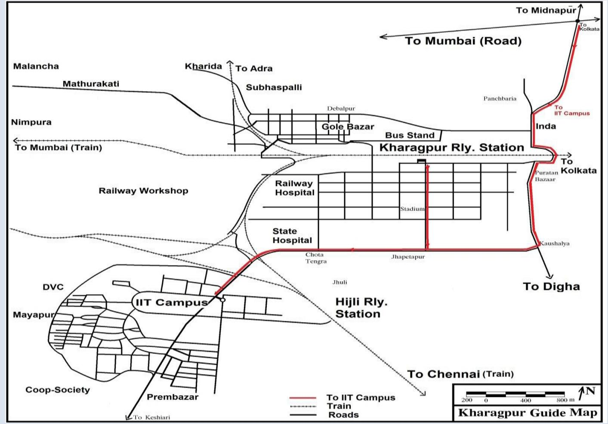
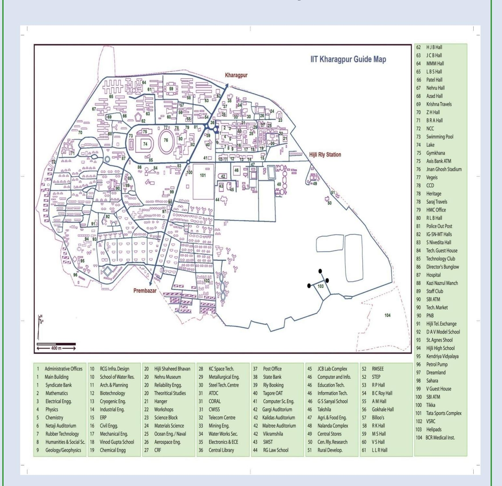
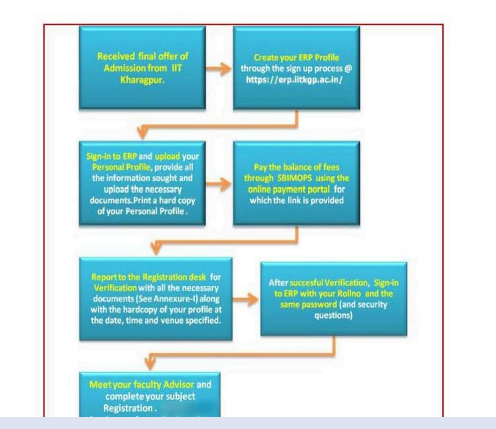
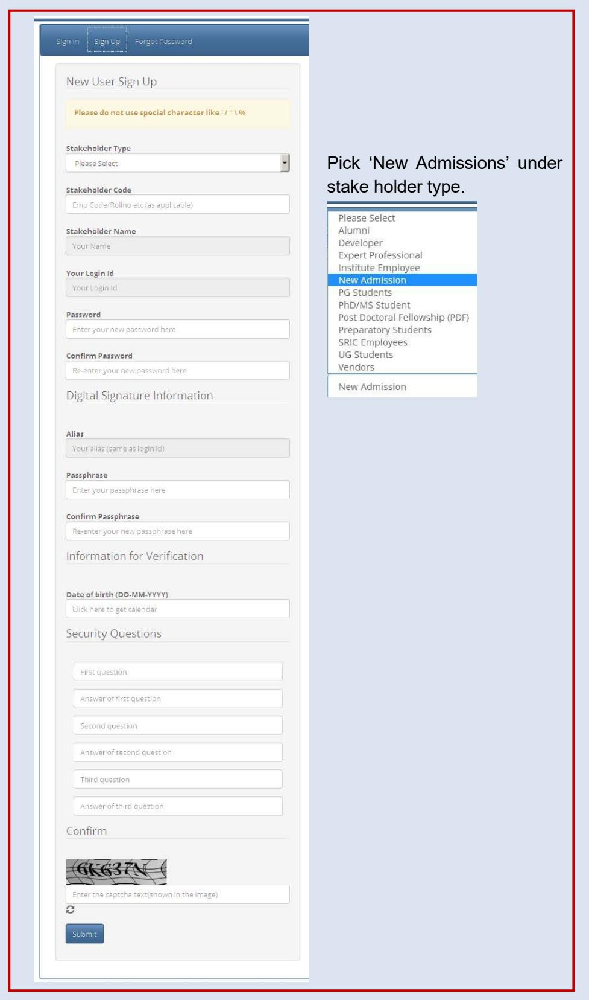
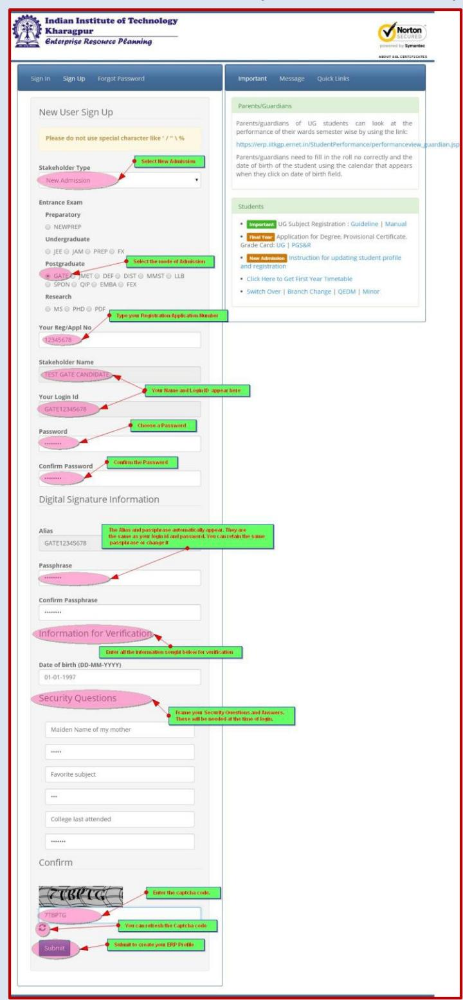
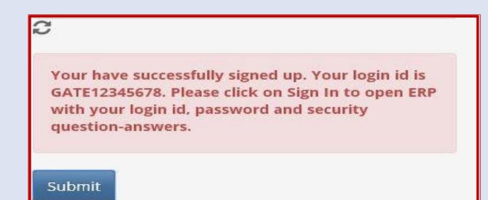
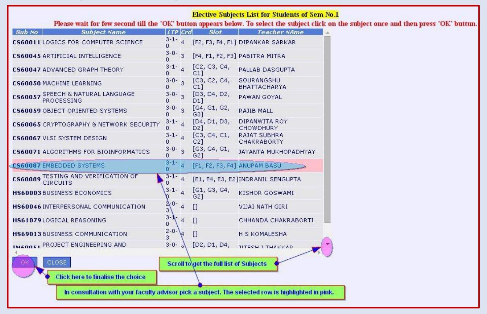

# **Guidelines and Instructions for newly admitted students through JAM 2023**

#### *Dedicated to the service of the Nation*

The Indian Institute of Technology Kharagpur (IIT Kharagpur) is a public engineering institution established by the [government](https://en.wikipedia.org/wiki/Government_of_India) of India in 1951. It is the first of the [IITs](https://en.wikipedia.org/wiki/Indian_Institutes_of_Technology) to be established, and is recognized as an Institute of National Importance by the Government of India.

### **Motto**

The motto of IIT Kharagpur is "Yoga Karmashu Kaushalam". This literally translates to "Excellence in action is Yoga", essentially implying that doing your work well is (true) yoga. This can be traced to Sri Krishna's discourse with Arjuna in the Bhagavad Gita. The quote, in the larger context of the Gita, urges man to acquire equanimity because a mind of equanimity allows a man to shed distracting thoughts of the effects of his deeds and concentrate on the task before him. Equanimity is the source of perfection in Karmic endeavours that leads to Salvation.

### **Mission**

The Institute aligns all its activities to serve national interest and seeks

- To provide broad-based education, helping students hone their professional skills and acquire the best-in-class capabilities in their respective disciplines
- To draw the best expertise in science, technology, management and law so as to equip students with the skills to visualize, synthesize and execute projects in these fields
- To imbibe a spirit of entrepreneurship and innovation in its students
- To undertake sponsored research and provide consultancy services in industrial education and socially relevant areas

### **Vision**

Our Vision is

- To be a centre of excellence in education and research, producing global leaders in science, technology and management
- To be a hub of knowledge creation that prioritises the frontier areas of national and global importance
- To improve the life of every citizen of the country

### **Undergraduate and Postgraduate & doctoral education**

IIT Kharagpur offers both undergraduate and postgraduate programmes. They include Bachelor of [Technology](https://en.wikipedia.org/wiki/Bachelor_of_Technology) (BTech. Hons), Bachelor of [Architecture](https://en.wikipedia.org/wiki/Bachelor_of_Architecture) (BArch), Dual Degree, 5 year integrated Master of [Science,](https://en.wikipedia.org/wiki/Master_of_Science) 2-year Master of Science, Master of Technology (M.Tech), Master of City [Planning](https://en.wikipedia.org/wiki/Urban_planning) (MCP), Master of Business [Administration](https://en.wikipedia.org/wiki/Master_of_Business_Administration) (MBA), [Master](https://en.wikipedia.org/w/index.php?title=MHRM%2C_IIT_Kharagpur&action=edit&redlink=1) of Human Resource [Management](https://en.wikipedia.org/wiki/Human_Resource_Management) [\(MHRM\)](https://en.wikipedia.org/w/index.php?title=MHRM%2C_IIT_Kharagpur&action=edit&redlink=1), Master in Medical Science and Technology [\(MMST\)](https://en.wikipedia.org/wiki/MMST_(IIT_Kharagpur)), LLB in [Intellectual](https://en.wikipedia.org/wiki/Intellectual_property) Property Law, LLM, Executive MBA and Postgraduate Diploma in Business Analytics. The institute also offers the MS and Doctor of Philosophy degree (PhD) as part of its doctoral education [programme.](https://en.wikipedia.org/wiki/Doctorate)

#### **How to reach IIT KGP**

Kharagpur is known world over for two landmarks. One, the longest railway platform, and the other, the Indian Institute of Technology, more commonly known as IIT. Situated about 120 km west of Kolkata, Kharagpur is well connected to Kolkata by Road and Rail transport. Kharagpur can be reached in about 2 hours by train or 3 hours by car from Howrah railway station of Kolkata. Kharagpur is also connected by direct train services to most major cities of the country. The Institute is about 10 minutes drive (5 km) from the Kharagpur railway station. Private taxi, auto-rickshaw or cycle-rickshaw can be hired to reach the Institute.

#### **Health & Wellness**

IIT Kharagpur keeps the health & wellness need of the campus community as its top priority, and constantly strives to improve and upgrade the existing facilities and the services. Extra Academic Activity (EAA) is an important component of UG curriculum at IIT Kharagpur with NSS, NCC, NSO under its fold.

#### *Counseling Centre*

The holistic well being of our student community, encompassing both physical and mental health, is of the highest priority to the Institute. In pursuance of our commitment towards ensuring that, we have set up the Students' Counseling Centre, to provide any

required assistance to students who may be experiencing emotional or psychological conditions that pose a hindrance to their regular activities on campus.

The Counseling Centre offers a broad range of services including psychological assessment, individual therapy, group therapy, and medication and management to promote mental health, life skills, emotional resilience and overall well being of the student community.

Full-time clinical psychologists and a visiting psychiatrist are available for consultation at the Centre. The Centre has also initiated an outreach programme to create a team of sensitized wing representatives from each Hall of Residence who can reach out to students in need.

The Centre addresses problems associated with stress, time management, motivational issues, relationship difficulties, impulse control issues, and learning difficulties. It also helps students experiencing significant depression, anxiety, mood swings, or other thought disorders.

Apart from individual sessions, the Centre plans to conduct group sessions to address life skills such as assertiveness, problem solving, anger management, self awareness, and interpersonal relationships.

The Counseling Centre also functions as a coordinating point for crisis intervention.

#### *Hospital*

Indian Institute of Technology, Kharagpur is committed to provide quality healthcare services to its faculty, employees, and students using modern and cost effective techniques and technologies, and through a dedicated and humane approach. In accordance with the above policy, B C Roy Technology Hospital, owned and managed by Indian Institute of Technology, Kharagpur, provides Primary Health Care comprising of curative, preventive and health promotion services.

At present, B C Roy Technology Hospital is located centrally within the IIT Kharagpur campus. The facility has 32 beds, including a 2 Bedded ICU, Cabins and Isolation Ward. Through its Out Patient Department (OPD), Indoor Wards and Emergency Unit, B C Roy Technology Hospital provides 24x7 uninterrupted health care services to the campus community. On an average approximately 7000 patients attend the OPD at B C Roy Technology Hospital every month. The hospital has a round the clock pharmacy inside it. It is also equipped with a Video-conferencing facility for telemedicine.

Biomedical waste from B C Roy Technology Hospital is regularly and properly disposed of by an arrangement with the services of West Bengal State Government Environment Department

#### **Inside Campus**

Find the below Campus map. All the important locations like Students Hostels, Departments/Schools/Centres, Guest Houses, Student Activity Centers, Banks & ATMs, Restaurants & Food Centres etc. are indexed in the map.

### **Instruction to newly admitted students through JAM 2023**

#### **Contents**

| No. | Content                                                                                                                                         | Page No. |  |
|-----|-------------------------------------------------------------------------------------------------------------------------------------------------|-------------|--|
|     | Sequence of Events                                                                                                                        | 7           |  |
|     | On the Day of Reporting and Registration                                                                                      | 8-9         |  |
|     | Academic or Subject Registration                                                                                                       | 9           |  |
|     | Annexure-I (List of Documents to be produced and submitted at the time of Reporting to IIT Kharagpur) | 10          |  |
|     | Annexure-II (Balance of Fee to be Paid & Timelines for Registration)                                                          | 11-12       |  |
|     | Annexure-III (Walk through of the online process from signup to final subject Registration)                       | 13-24       |  |

### **Instruction to newly admitted students through JAM 2023**

Registration process for all 1st year students admitted through JAM 2023 for Autumn 2023- 24 session will be conducted as detailed below:

1. **Sequence of Events:** The following flow diagram outlines the various stages of the Registration Process :

Figure-1 Sequence of events for student Registration.

#### 2. **On the day of Registration (28.07.2023):**

i. All students who are to be admitted to Indian Institute of Technology, Kharagpur must bring the documents mentioned in **Annexure – I (also mentioned in the offer letter) below** and produce them at the respective desk during registration and academic verification.

ii. **The balance of admission fee (as given in Annexure – II) shall be payable before or on the day of Registration through on line payment only**

- **Students/parents should carefully read the fee payment instruction** on the hyper linked page at erp.iitkgp.ac.in **before proceeding to pay the balance of admission fee.**
- They should log in to the ERP system to pay on line. (**See Annexure-III for details**)
- iii. It is desirable that the following process is completed by the student if possible, prior to reporting to the Institute on date of registration:

Updating Student Profile and uploading the necessary documents on ERP and taking a print out of the student profile. (See **Annexure -III** for details)

#### **iv. The date of Registration is 28th, July 2023**. **Venue and time of the Registration process will be notified/informed later.**

**The students should retain the original of all the documents with them, in their possession, even after verification is complete should the academic section need to examine them again at a later date.**

v. After verification by the Academic Section is complete, the **student's login to ERP will be with the assigned roll number as his/her login id** with the same password. (See **Annexure-III** for details)

- vi. Upon successful verification, the student should login to ERP with his/her assigned roll number to complete the process of subject **Registration.** The student must choose the electives, if any, in consultation with the faculty advisor.
- vii. **The student must abide by the timelines mentioned in Table – 2 in Annexure – II below**

#### **3. Academic or Subject Registration (See Annexure-III for details)**

- i. Upon successful verification of all documents, the student's login on ERP is enabled through his/her Roll No.
- ii. The student must meet his/her faculty advisor to complete the process of subject Registration.
- iii. The Class Time Table for the student will also be available on ERP.

For any other clarification call the Academic Section (UGS):

Deputy Registrar (Academic), Ph: 03222-282054 Email: [arug@adm.iitkgp.ac.in](mailto:arug@adm.iitkgp.ac.in)

For any online application software related problem please call 03222 281017/18/19

#### **Annexure - I**

Registration process for all 1st year students admitted through JAM 2023 for Autumn 2023-24 will be held on 28th July, 2023.

**The students must bring the following documents, with photo copies, as mentioned below and produce them at the respective desk during registration and academic verification :**

- i. Signed copy of student's ERP profile
- ii. Fee Acknowledgement slip
- iii. JAM 2023 Score Card
- iv. Duly completed undertaking from the student and guardian (Annexure-C)
- v. Physical Fitness certificate from registered medical Practitioner (Annexure-B)
- vi. Undertaking Form (Annexure-A)
- vii. Copy of all the following certificates:
  - Print out of the final course allotment letter from JAM 2023/Offer Letter
  - Class X (High School) Board Certificate/any other certificate as proof of date of birth
  - Mark sheest and certificates of passing the qualifying examination
  - Copy of Caste/Category Certificate (OBC-NCL/SC/ST/EWS), if applicable (as per format given in JAM 2023 Brochure)
  - Copy of Person with Disabilities (PwD) Certificate, if applicable (as per format given in JAM 2023 Brochure)
  - Copy of Passport (for Foreign National) or OCI certificate or PIO card holder, if applicable

**PLEASE RETAIN IN YOUR POSESSION ALL ORIGINAL CERTIFICATES FOR SUBSEQUENT VERIFICATION BY THE ACADEMIC SECTION AT A LATER DATE (IN THE MONTH OF AUGUST/SEPTEMBER) WHICH WILL BE NOTIFIED AT APPROPRIATE TIME.**

| #                           |                                                                              | <b>Heads Description</b>                           | <b>GE/EWS/OBC</b> | <b>SCISTIPH</b> |
|-----------------------------|------------------------------------------------------------------------------|----------------------------------------------------|-------------------|-----------------|
| 1                           | <b>Tuition Fee:</b>                                                          |                                                    | 3000              | 0               |
| $\overline{\mathbf{z}}$     | One time payment at the time of admission :(only for First Year Students) |                                                    |                   |                 |
| (a) <b>Statutory Fee</b> |                                                                              | 1500                                               | 1500              |                 |
|                             | (b)                                                                          | Medical Exam                                       | 200               | 200             |
|                             | (c)                                                                          | <b>Students Welfare</b>                            | 300               | 300             |
|                             | (d)                                                                          | <b>Modernization Fee</b>                           | 700               | 700             |
|                             | (e)                                                                          | <b>Hostel Admission Fee</b>                        | 1000              | 1000            |
|                             | (f)                                                                          | Alumni Subscription                                | 2000              | 2000            |
|                             | (g)                                                                          | Institute Caution Money Deposit (Refundable)       | 1000              | 1000            |
|                             | (h)                                                                          | Library Caution Money Deposit (Refundable)         | 1000              | 1000            |
|                             | (i)                                                                          | Hostel Caution Deposit (Refundable)                | 4000              | 4000            |
| 4                           | Semester Fee: (Each Semester)                                                |                                                    |                   |                 |
|                             | (a)                                                                          | Exam                                               | 500               | 500             |
|                             | (b)                                                                          | Registration                                       | 400               | 400             |
|                             | (c)                                                                          | Gymkhana                                           | 600               | 600             |
|                             | (d)                                                                          | <b>Medical Registration</b>                        | 200               | 200             |
|                             | (e)                                                                          | <b>Hostel Seat rent</b>                            | 750               | 750             |
|                             | (f)                                                                          | Elect. & Water charges                             | 1000              | 1000            |
|                             | (g)                                                                          | <b>Student Amenities</b>                           | 800               | 800             |
|                             | (h)                                                                          | Lab Contingency Fee                                | 800               | 800             |
|                             | (i)                                                                          | Internet connectivity                              | 600               | 600             |
|                             | (i)                                                                          | Technology Film Society                            | 100               | 100             |
|                             | (k)                                                                          | <b>Student Insurance Policy</b> (Approximately) | 2500              | 2500            |
|                             | (1)                                                                          | Student Brotherhood Fund                           | 200               | 200             |
| 5                           | <b>Hostel Overhead Charges</b>                                               |                                                    | 880               | 880             |
| 6                           | <b>Hall Establishment Charges</b>                                            |                                                    | 18300             | 18300           |
| 7                           | <b>Mess Charges</b>                                                          |                                                    | 14500             | 14500           |
| 8                           | <b>Hall Budget</b>                                                           |                                                    | 1000              | 1000            |
|                             | Total Fee for Autumn Semester 2023-2024                                      |                                                    | 57830             | 54830           |

The seat booking fee paid (**Rs. 10000/-** (Rupees Ten thousand only for GEN/EWS/OBC-NCL) and **Rs. 5000/-** (Rupees Five Thousand only for SC/ST/PwD)) by you will be adjusted against the total fees. Please note that you are required to deposit the following fee for the first semester by the last date for fee payment.

| Particulars                                 | GEN/EWS/OBC-NCL      | SC/ST/PwD |
|---------------------------------------------|----------------------|-----------|
| Total Fees (In Rs.)                      | 57830 (Tentative) | 54830     |
| Advance Fee paid (in Rs.)             | 10,000/-             | 5,000/-   |
| Balance Fee to be paid (in Rs.) | 47830                | 49830     |

**The fee structure mentioned above are tentative and is subject to changes.**

#### **Annexure -III**

#### **Walk through of the online process from signup to final subject registration.**

#### A. **Creating your ERP login Profile:**

| <b>Indian Institute of Technology</b> Kharagpur ABOUT SSL CERTIFICATES <b>Enterprise Resource Planning</b> |                                                                                                                                                                                                                                                                                                                                                                                                          |  |
|---------------------------------------------------------------------------------------------------------------------|----------------------------------------------------------------------------------------------------------------------------------------------------------------------------------------------------------------------------------------------------------------------------------------------------------------------------------------------------------------------------------------------------------|--|
| Forgot Password                                                                                                     | Important                                                                                                                                                                                                                                                                                                                                                                                                |  |
| Sign In                                                                                                             | <b>Quick Links</b>                                                                                                                                                                                                                                                                                                                                                                                       |  |
| Sign Up                                                                                                             | Message                                                                                                                                                                                                                                                                                                                                                                                                  |  |
| Please enter following credentials for signing in. If you dont have                                                 | Parents/Guardians                                                                                                                                                                                                                                                                                                                                                                                        |  |
| any account click on Sign Up. Forgot your password/answer of                                                        | Parents/guardians of UG students can look at the                                                                                                                                                                                                                                                                                                                                                         |  |
| security question? Click on Forgot Password.                                                                        | performance of their wards semester wise by using the link:                                                                                                                                                                                                                                                                                                                                              |  |
| Stakeholder code/login id                                                                                           | https://erp.iitkgp.ernet.in/StudentPerformance/performanceview_guardian.jsp                                                                                                                                                                                                                                                                                                                              |  |
| Click here to Sign up                                                                                               | Parents/guardians need to fill in the roll no correctly and the                                                                                                                                                                                                                                                                                                                                          |  |
| Password                                                                                                            | date of birth of the student using the calendar that appears                                                                                                                                                                                                                                                                                                                                             |  |
| Sign In                                                                                                             | when they click on date of birth field.                                                                                                                                                                                                                                                                                                                                                                  |  |
|                                                                                                                     | <b>Students</b> Important UG Subject Registration : Guideline   Manual • Final Year Application for Degree, Provisional Certificate, Grade Card: UG   PGS&R . New Admission Instruction for updating student profile and registration <b>Payment</b> Instruction for semester fees payment • Click Here to Get First Year Timetable • Switch Over   Branch Change   QEDM   Minor |  |

#### B. **The Sign up Screen appears:**

C. **Fill the simple form and Submit to create your IIT KGP ERP login id. Please remember the answers to the security Questions as they are needed for sign-in on ERP**

D. **On successful submission a message containing your login id is displayed.:**

E. **You are ready to sign-in into the system with the system generated login-id**

| <b>Indian Institute of Technology</b> Kharagpur Enterprise Resource Planning                                                                                                                                                                                                                                                  |  |  |  |  |
|-------------------------------------------------------------------------------------------------------------------------------------------------------------------------------------------------------------------------------------------------------------------------------------------------------------------------------------|--|--|--|--|
| Sign In Sign Up 10 Forgot Password                                                                                                                                                                                                                                                                                            |  |  |  |  |
| Please enter following credentials for signing in. If you dont have any account click on Sign Up. Forgot your password/answer of security question? Click on Forgot Password. Type your ERP login id Enter your password <b>Fav Hobby</b> Answer the security question Sign In Click here to Sign-in to ERP |  |  |  |  |
|                                                                                                                                                                                                                                                                                                                                     |  |  |  |  |

F. **The ERP screen opens up, displaying the Academic Module. Clicking on Academic Module opens the Admission Menu:**

| Academic                           | Welcome: TEST GATE CANDIDATE [GATE12345678]   [A] Home   Forgot Passphrase   Gadget   <b>C</b> Complaint Box |                                                                                                                                                                                                      | <b>CD</b> Logout Norton ABOUT SSL CERTIFICATES |
|------------------------------------|--------------------------------------------------------------------------------------------------------------|------------------------------------------------------------------------------------------------------------------------------------------------------------------------------------------------------|------------------------------------------------------|
|                                    | You are in: Academic                                                                                         |                                                                                                                                                                                                      |                                                      |
|                                    | Delegate Work Responsibility lies with Assignee]                                                             | Delegate Work with Role [Responsibility lies with Assignor]                                                                                                                                          | Search Menu                                          |
|                                    |                                                                                                              | *Note: [D] - Delegatable; [ND] - Non Delegatable; [DWR] - Delegatable With Role; X - In Active(Date Over); Y - Active; *Menu groups will retain the previous state(open or closed) as you desire. |                                                      |
| $\ddot{}$ <b>Admission</b> ۰ | List of Menus Delegated to You by Assignors on Behalf of His/Her (i.e. Assignor) Role.                       |                                                                                                                                                                                                      |                                                      |
| Detailst                           | (V [ND]Update and Print Student Profile (New Admission):                                                     | Click here to update your profile and Pay the requisite fee                                                                                                                                       |                                                      |

#### G. **Click on Update and Print Student Profile. The following form appears. It contains your Roll No. and Hall of Residence. Fill in all the details correctly and click update**

|                                              |                            |                                                                                          | <b>Profile Update Section</b>                                                                       |                                                                                                                                                   |                           | Print Section (Scroll down for print button) |                                 |                               |                                    |
|----------------------------------------------|----------------------------|------------------------------------------------------------------------------------------|-----------------------------------------------------------------------------------------------------|---------------------------------------------------------------------------------------------------------------------------------------------------|---------------------------|----------------------------------------------|---------------------------------|-------------------------------|------------------------------------|
| Tentative Roll No:                           | 15CS60028                  |                                                                                          | Name                                                                                                | TEST GATE CANDIDATE                                                                                                                               |                           | INDIAN INSTITUTE OF TECHNOLOGY KHARAGPUR     |                                 |                               |                                    |
| Department                                   | <b>CS</b>                  |                                                                                          | <b>NOA</b>                                                                                          | <b>GATE</b>                                                                                                                                       | <b>Basic Information:</b> |                                              |                                 |                               |                                    |
| Hall                                         | LAL BAHADUR SHASTRI HALL   |                                                                                          | Section                                                                                             | Not Applicable                                                                                                                                    |                           |                                              | Application                     |                               |                                    |
| Mobile No                                    | 9123456789                 | Fill in all the pertinent                                                                | *Email ID                                                                                           | testgate@testgate.c                                                                                                                               | IN O           | Registration GATE12345678                    | No.                             | 12345678                      |                                    |
| Blood Group(Eg: AB+ O-) AB+                  |                            | details of the form                                                                      | DOB                                                                                                 | 01-01-1997                                                                                                                                        |                           |                                              | Name(as                         |                               |                                    |
| Old Rollno/Emp                               |                            | correctly. Upload the Medical Document.                                               |                                                                                                     | gatetopper                                                                                                                                        | Rollno                    | 15CS60028                                    | per last qualifying          | <b>TEST GATE</b> CANDIDATE |                                    |
| Code/Project Staff Code of IITKGP(if any) |                            | photo and signature if it is not available.                                           | *Choice for Institute EMail ID                                                                      | @iitkgp.ac.in $\circledast$ <b>Available</b>                                                                                                |                           |                                              | degree) DOB(DD-              | $01 - 01 -$                   | <b>THE ABOVE</b>                   |
| 10+2 Marks in %                              | 98                         | before you finally                                                                       | *Guardian's Name                                                                                    | <b>XYZABC</b>                                                                                                                                     | Dept                      | CS.                                          | MM-YYYY)                        | 1997                          | $\mathcal{L}(\mathbf{x})$          |
| Parent's Annual Income                       | 100000                     | submit your profile.                                                                     | Guardian's Profession                                                                               | PROFESSOR                                                                                                                                         | Blood Group            |                                              | Gender                          | IM.                           |                                    |
|                                              |                            |                                                                                          |                                                                                                     |                                                                                                                                                   | Are you a                 |                                              |                                 |                               |                                    |
| Parent's Mobile No.                          | 9987654321                 |                                                                                          | Your Name in Hindi*                                                                                 |                                                                                                                                                   | person with N             |                                              |                                 |                               |                                    |
|                                              |                            |                                                                                          | (Please use                                                                                         |                                                                                                                                                   | Idisability Type of    |                                              | Percentage                      |                               |                                    |
| Guardian's Email Id                          | xyz@abc.com                |                                                                                          | http://www.google.com/transliterate/ <mark>ਟੈਦਟ ਸੇਟ ਲਾਕ</mark>                                      |                                                                                                                                                   | disability                |                                              | of disability                   |                               |                                    |
| Fields marked ' are mandatory                |                            |                                                                                          | for writing name in hindi transcript)                                                               |                                                                                                                                                   | Category                  | GE.                                          | Nationality INDIAN              |                               |                                    |
| Upload soft copy of Medical Form             |                            |                                                                                          |                                                                                                     | Profile on right is updated only after                                                                                                            | Email                     | testgate@testgate.com Mobile No              |                                 |                               |                                    |
|                                              |                            | *** Note: Please create one soft copy (PDF Document) for uploading all the medical forms |                                                                                                     | the form is submitted.                                                                                                                            | Guardian Name          |                                              | Hall                            | LBS:                          |                                    |
| Medical Form                                 | Choose File MEDICAL JPG    |                                                                                          | The hard copy also to be submitted at time of registration.                                         |                                                                                                                                                   |                           |                                              | old                             |                               |                                    |
|                                              |                            |                                                                                          |                                                                                                     |                                                                                                                                                   | <b>ISection</b>           | Not Applicable                               | Rollno/Emp                      |                               |                                    |
| Upload Image of Photo and Scanned Signature  |                            |                                                                                          |                                                                                                     |                                                                                                                                                   | Medical                   |                                              | No.                             |                               |                                    |
|                                              |                            |                                                                                          |                                                                                                     |                                                                                                                                                   |                           | No.                                          |                                 |                               |                                    |
|                                              |                            |                                                                                          |                                                                                                     |                                                                                                                                                   | Form                      |                                              |                                 |                               |                                    |
|                                              |                            |                                                                                          | *** Photo dimension: width x height in pixel (min allowed-130px x 150px, max allowed 175px x 200px) | *** Signature dimension: width x height in pixel (min allowed-100px X 50px, max allowed 300px X 150px), 95 % of the image area should contain the | 10+2 Marks                |                                              | Guardian's                      |                               |                                    |
| scanned signature                            |                            |                                                                                          |                                                                                                     |                                                                                                                                                   | Parent's                  |                                              | Name                            |                               |                                    |
| Photo                                        |                            |                                                                                          | *** Please note that if photo and signature is already available then you can not update these      |                                                                                                                                                   | Annual                    |                                              | Guardian's <b>Profession</b> |                               |                                    |
|                                              | Choose File No file chosen |                                                                                          | Image of Signature                                                                                  | Choose File No file chosen                                                                                                                        | Income                    |                                              |                                 |                               |                                    |
| Emergency Contact Information                |                            |                                                                                          |                                                                                                     |                                                                                                                                                   | llGuardian's Email Id  |                                              | Hindi Name                      |                               |                                    |
| Emer. Cont. No(Guardians)                    |                            | 9987654321                                                                               | Emer, Cont. Person Name                                                                             | <b>XYZABC</b>                                                                                                                                     |                           | <b>Emergency Contact Information:</b>        |                                 |                               |                                    |
|                                              |                            | <b>A PERMIT AND A</b>                                                                    |                                                                                                     |                                                                                                                                                   | Cont. No                  |                                              | Name                            | Relationship                  |                                    |
| Emer. Cont. Address                          |                            | NAGAR CHENNAI 600020                                                                  | Relationship with The Person                                                                        | <b>MOTHER</b>                                                                                                                                     | Emer. Cont. Address       |                                              |                                 |                               |                                    |
|                                              |                            |                                                                                          |                                                                                                     |                                                                                                                                                   |                           | <b>Communication Address</b>                 |                                 | <b>Permanent Address</b>      |                                    |
|                                              |                            | 'Address (Permanent Address Can not be updated twice/if available)                       |                                                                                                     |                                                                                                                                                   | Addr                      |                                              | Addr                            |                               |                                    |
| <b>Communication Address</b>                 |                            |                                                                                          | Permanent Address (Same As Communication Address                                                    |                                                                                                                                                   | Vill/City                 |                                              | Vill/City                       |                               |                                    |
| Addr                                         | FLAT NO 101                | Addr                                                                                     | FLAT NO 101                                                                                         | <b>Profile Print and Fee Pay Option</b>                                                                                                           | Police Station            |                                              |                                 | Police Station                |                                    |
| Vill/City                                    | <b>VIDYA APTS</b>          | Vill/City                                                                                | <b>VIDYA APTS</b>                                                                                   | available on the                                                                                                                                  | <b>District</b>           |                                              | District                        |                               |                                    |
| Police Station                               | T NAGAR                    | Police Station                                                                           | T NAGAR                                                                                             | extreme right on the bottom of the page. Use scroll bar to                                                                                     | State Pin No.          |                                              | State IPin No.               |                               |                                    |
| District                                     | WEST MAMBALAM              | District                                                                                 | <b>WEST MAMBALAM</b>                                                                                | navaigate to bottom.                                                                                                                              |                           |                                              |                                 |                               |                                    |
| State                                        | <b>TAMIL NADU</b>          | State                                                                                    | <b>TAMIL NADU</b>                                                                                   |                                                                                                                                                   |                           |                                              |                                 |                               | Signature:                         |
| Pin No.                                      | 600020                     | Pin No.                                                                                  | 600020                                                                                              |                                                                                                                                                   |                           |                                              |                                 |                               | (TEST GATE CANDIDATE)              |
|                                              |                            |                                                                                          | Update                                                                                              |                                                                                                                                                   | <b>PRINT Profile</b>      |                                              |                                 | Pay Fees                      | Date: Tue May 12 10:59:20 IST 2015 |

H. **On successful updation a 'SUCCESSFULLY UPDATED' message appears on the screen and the print section displays the information you entered. Click on Print Profile to print your profile. You can also save it as a PDF file for your reference**

|                                                                   |                            |                               | <b>Profile Update Section</b>                                                                                                                                                                                                                            |                      |                                             |                                                                    | Print Section (Scroll down for print button)                |                                   |                               |                                                             |
|-------------------------------------------------------------------|----------------------------|-------------------------------|----------------------------------------------------------------------------------------------------------------------------------------------------------------------------------------------------------------------------------------------------------|----------------------|---------------------------------------------|--------------------------------------------------------------------|-------------------------------------------------------------|-----------------------------------|-------------------------------|-------------------------------------------------------------|
| Tentative Roll No:                                                | 15CS60028                  |                               | Name                                                                                                                                                                                                                                                     |                      | TEST GATE CANDIDATE                         |                                                                    | INDIAN INSTITUTE OF TECHNOLOGY KHARAGPUR                    |                                   |                               |                                                             |
| Department                                                        | CS                         |                               | <b>NOA</b>                                                                                                                                                                                                                                               |                      | GATE                                        |                                                                    |                                                             |                                   |                               |                                                             |
| Hall                                                              | LAL BAHADUR SHASTRI HALL   |                               | Section                                                                                                                                                                                                                                                  |                      | Not Applicable                              | <b>Basic Information:</b>                                          |                                                             |                                   |                               |                                                             |
| Mobile No                                                         | 9123456789                 |                               | *Email ID                                                                                                                                                                                                                                                |                      | testgate@testgate.cl                        | Registration No.                                                | GATE12345678                                                | Application Vo.                | 12345678                      |                                                             |
| Blood Group(Eq: AB+ O-) AB+                                       |                            |                               | DOB                                                                                                                                                                                                                                                      |                      | 01-01-1997                                  |                                                                    |                                                             | Name(as                           |                               |                                                             |
| Old Rollno/Emp Code/Project Staff Code of IITKGP(if any)    |                            |                               | * Choice for Institute EMail ID                                                                                                                                                                                                                          |                      | gatetopper @iitkap.ac.in                 | Rollno                                                             | 15CS60028                                                   | per last qualifying degree) | <b>TEST GATE</b> CANDIDATE |                                                             |
| *10+2 Marks in %                                                  | 98                         |                               | *Guardian's Name                                                                                                                                                                                                                                         |                      | <b>XYZABC</b>                               | Dept                                                               | ĊŚ                                                          | DOB(DD- MM-YYYY)               | 01-01-1997                    |                                                             |
| Parent's Annual Income                                            | 100000                     |                               | *Guardian's Profession                                                                                                                                                                                                                                   |                      | PROFESSOR                                   | Blood                                                              | AB+                                                         | Gender                            |                               |                                                             |
| Parent's Mobile No                                                | 9987654321                 |                               |                                                                                                                                                                                                                                                          |                      |                                             | Group                                                              |                                                             |                                   |                               |                                                             |
| * Guardian's Email Id                                  | xyz@abc.com                |                               | Your Name in Hindi* (Please use http://www.google.com/transliterate/ टेस्ट गेट खत्र for writing name in hindi transcript)                                                                                                                       |                      |                                             | Are you a lperson with N disability Type of disability |                                                             | Percentagel. of disability     |                               |                                                             |
|                                                                   |                            |                               |                                                                                                                                                                                                                                                          |                      | After submission the Print section displays | Category                                                           | GE                                                          | <b>Vationality INDIAN</b>         |                               |                                                             |
| Upload soft copy of Medical Form                                  |                            |                               |                                                                                                                                                                                                                                                          |                      | all the information you have filled         | Email                                                              | testgate@testgate.com                                       | Mobile No                         | 9123456789                    |                                                             |
|                                                                   |                            |                               | *** Note: Please create one soft copy (PDF Document) for uploading all the medical forms                                                                                                                                                                 |                      |                                             | Guardian                                                           | <b>XYZABC</b>                                               | Hall                              | LBS                |                                                             |
| Medical Form                                                      | Choose File No file chosen |                               | The hard copy also to be submitted at time of registration.                                                                                                                                                                                              |                      |                                             | Name                                                               |                                                             | Old                               |                               |                                                             |
| Upload Image of Photo and Scanned Signature.                      |                            |                               |                                                                                                                                                                                                                                                          |                      |                                             | Section                                                            | Not Applicable                                              | Rollno/Emp                        |                               |                                                             |
|                                                                   |                            |                               | *** Photo dimension: width x height in pixel (min allowed-130px x 150px, max allowed 175px x 200px) *** Signature dimension: width x height in pixel (min allowed-100px X 50px, max allowed 300px X 150px). 95 % of the image area should contain the |                      |                                             | Medical Form                                                    | Yes                                                         | No:                               |                               |                                                             |
| scanned signature                                                 |                            |                               | *** Please note that if photo and signature is already available then you can not update these                                                                                                                                                           |                      |                                             | 10+2 Marks 98                                                      |                                                             | Guardian's Vame                | <b>XYZABC</b>                 |                                                             |
| Photo                                                             | Choose File No file chosen |                               | Image of Signature                                                                                                                                                                                                                                       |                      | Choose File No file chosen                  | Parent's Annual Income                                       | 100000                                                      | Guardian's Profession          | PROFESSOR                     |                                                             |
| <b>*Emergency Contact Information</b>                             |                            |                               |                                                                                                                                                                                                                                                          |                      |                                             | Guardian's                                                         | yz@abc.com                                                  | Hindi Name टेस्ट गेट खात्र        |                               |                                                             |
| Emer. Cont. No(Guardians)                                         |                            | 9987654321                    | Emer, Cont, Person Name                                                                                                                                                                                                                                  |                      | XYZABC                                      | Email Id                                                           |                                                             |                                   |                               |                                                             |
| Emer. Cont. Address                                               |                            | FLT 101, VIDYA <b>APTS</b> | Relationship with The Person                                                                                                                                                                                                                             |                      | <b>MOTHER</b>                               | Cont. No                                                           | <b>Emergency Contact Information:</b> 9987654321         |                                   | Name XYZABC Relationship      | MOTHER                                                      |
|                                                                   |                            | WEST MAMBALAM T               |                                                                                                                                                                                                                                                          |                      |                                             | Emer. Cont. <b>Address</b>                                      | FLT 101, VIDYA APTS WEST MAMBALAM T NAGAR CHENNAL 600020 |                                   |                               |                                                             |
| Address (Permanent Address Can not be updated twice/if available) |                            |                               |                                                                                                                                                                                                                                                          |                      |                                             |                                                                    | <b>Communication Address</b>                                |                                   | <b>Permanent Address</b>      |                                                             |
| <b>Communication Address</b>                                      |                            |                               | Permanent Address (Same As Communication Address $\Box$ )                                                                                                                                                                                                |                      |                                             | Addr                                                               | FLAT NO 101                                                 | Addr                              |                               | FLAT NO 101                                                 |
| Addr                                                              | FLAT NO 101                | Addr                          |                                                                                                                                                                                                                                                          | FLAT NO 101          |                                             | Vill/City                                                          | <b>VIDYA APTS</b>                                           | /ill/City                         | <b>VIDYA APTS</b>             |                                                             |
| Vill/City                                                         | MDYA APTS                  | Vill/City                     |                                                                                                                                                                                                                                                          | <b>VIDYA APTS</b>    |                                             | Police Station                                                     | T NAGAR                                                     | Police Station                    | T NAGAR                       |                                                             |
| Police Station                                                    | T NAGAR                    | Police Station                |                                                                                                                                                                                                                                                          | T NAGAR              |                                             | District                                                           | WEST MAMBALAM                                               | District                          |                               | WEST MAMBALAM                                               |
| District                                                          | WEST MAMBALAM              | District                      |                                                                                                                                                                                                                                                          | <b>WEST MAMBALAM</b> |                                             | <b>State</b> Pin No                                             | <b>TAMIL NADU</b> 600020                                 | <b>State</b> Pin No            | 600020                        | TAMIL NADU                                                  |
| State                                                             | TAMIL NADU                 | State                         |                                                                                                                                                                                                                                                          | TAMIL NADU           |                                             |                                                                    |                                                             |                                   |                               |                                                             |
| Pin No.                                                           | 600020                     | Pin No                        |                                                                                                                                                                                                                                                          | 600020               |                                             |                                                                    |                                                             |                                   |                               | Signature:                                                  |
|                                                                   |                            |                               | SUCCESSFULLY UPDATED Update                                                                                                                                                                                                                           |                      | Message is displayed                        |                                                                    |                                                             |                                   |                               | (TEST GATE CANDIDATE) Date: Tue May 12 12:14:32 IST 2015 |
|                                                                   |                            |                               |                                                                                                                                                                                                                                                          |                      |                                             | PRINT Profile                                                      |                                                             |                                   | Pay Fees                      |                                                             |
|                                                                   |                            |                               |                                                                                                                                                                                                                                                          |                      |                                             |                                                                    | You can now print your Profile                              |                                   |                               |                                                             |
|                                                                   |                            |                               |                                                                                                                                                                                                                                                          |                      |                                             |                                                                    |                                                             |                                   |                               |                                                             |

I. **The Printed Profile appears as shown below. Ensure to sign the hard copy before you submit it to the Registration desk.**

| <b>Basic Information:</b> <b>Registration No</b> GATE12345678 <b>Application No</b> 12345678 Name(as per last <b>TEST GATE</b> Rollno 15CS60028 qualifying degree) <b>CANDIDATE</b> DOB(DD-MM-YYYY) <b>Dept</b> <b>CS</b> 01-01-1997 <b>Blood Group</b> $AB+$ Gender м Are you a person with N disability <b>Type of disability</b> Percentage of disability 0 Category GE <b>Nationality</b> <b>INDIAN</b> Email testgate@testgate.comMobile No 9123456789 <b>Guardian Name</b> <b>XYZABC</b> Hall LBS <b>Section</b> <b>Not Applicable</b> Old Rollno/Emp No <b>Medical Form</b> Yes 10+2 Marks <b>Guardian's Name</b> 98 <b>XYZABC</b> Guardian's Profession PROFESSOR Parent's Annual Income 100000 Guardian's Email Id Hindi Name टेस्ट गेट छात्र xyz@abc.com <b>Emergency Contact Information:</b> Cont. No 9987654321 Name <b>XYZABC</b> Relationship <b>MOTHER</b> <b>Emer. Cont. Address</b> FLT 101, VIDYA APTS WEST MAMBALAM T NAGAR CHENNAI 600020 <b>Communication Address</b> <b>Permanent Address</b> <b>Addr</b> Addr FLAT NO 101 FLAT NO 101 <b>Vill/City</b> <b>Vill/City</b> <b>VIDYA APTS</b> <b>VIDYA APTS</b> <b>Police Station</b> <b>Police Station</b> <b>T NAGAR</b> <b>T NAGAR</b> <b>District</b> <b>WEST MAMBALAM</b> <b>District</b> <b>WEST MAMBALAM</b> State <b>TAMIL NADU</b> State <b>TAMIL NADU</b> Pin No. 600020 Pin No. 600020 Signature: (TEST GATE CANDIDATE) Date: Tue May 12 12:14:32 IST 2015 |  | <b>INDIAN INSTITUTE OF TECHNOLOGY KHARAGPUR</b> |  |
|----------------------------------------------------------------------------------------------------------------------------------------------------------------------------------------------------------------------------------------------------------------------------------------------------------------------------------------------------------------------------------------------------------------------------------------------------------------------------------------------------------------------------------------------------------------------------------------------------------------------------------------------------------------------------------------------------------------------------------------------------------------------------------------------------------------------------------------------------------------------------------------------------------------------------------------------------------------------------------------------------------------------------------------------------------------------------------------------------------------------------------------------------------------------------------------------------------------------------------------------------------------------------------------------------------------------------------------------------------------------------------------------------------------------------------------------------------------------------------------------------------------------------------------------------------------------------------------------------------------------------------------------------------------------------------------------------------------|--|-------------------------------------------------|--|
|                                                                                                                                                                                                                                                                                                                                                                                                                                                                                                                                                                                                                                                                                                                                                                                                                                                                                                                                                                                                                                                                                                                                                                                                                                                                                                                                                                                                                                                                                                                                                                                                                                                                                                                |  |                                                 |  |
|                                                                                                                                                                                                                                                                                                                                                                                                                                                                                                                                                                                                                                                                                                                                                                                                                                                                                                                                                                                                                                                                                                                                                                                                                                                                                                                                                                                                                                                                                                                                                                                                                                                                                                                |  |                                                 |  |
|                                                                                                                                                                                                                                                                                                                                                                                                                                                                                                                                                                                                                                                                                                                                                                                                                                                                                                                                                                                                                                                                                                                                                                                                                                                                                                                                                                                                                                                                                                                                                                                                                                                                                                                |  |                                                 |  |
|                                                                                                                                                                                                                                                                                                                                                                                                                                                                                                                                                                                                                                                                                                                                                                                                                                                                                                                                                                                                                                                                                                                                                                                                                                                                                                                                                                                                                                                                                                                                                                                                                                                                                                                |  |                                                 |  |
|                                                                                                                                                                                                                                                                                                                                                                                                                                                                                                                                                                                                                                                                                                                                                                                                                                                                                                                                                                                                                                                                                                                                                                                                                                                                                                                                                                                                                                                                                                                                                                                                                                                                                                                |  |                                                 |  |
|                                                                                                                                                                                                                                                                                                                                                                                                                                                                                                                                                                                                                                                                                                                                                                                                                                                                                                                                                                                                                                                                                                                                                                                                                                                                                                                                                                                                                                                                                                                                                                                                                                                                                                                |  |                                                 |  |
|                                                                                                                                                                                                                                                                                                                                                                                                                                                                                                                                                                                                                                                                                                                                                                                                                                                                                                                                                                                                                                                                                                                                                                                                                                                                                                                                                                                                                                                                                                                                                                                                                                                                                                                |  |                                                 |  |
|                                                                                                                                                                                                                                                                                                                                                                                                                                                                                                                                                                                                                                                                                                                                                                                                                                                                                                                                                                                                                                                                                                                                                                                                                                                                                                                                                                                                                                                                                                                                                                                                                                                                                                                |  |                                                 |  |
|                                                                                                                                                                                                                                                                                                                                                                                                                                                                                                                                                                                                                                                                                                                                                                                                                                                                                                                                                                                                                                                                                                                                                                                                                                                                                                                                                                                                                                                                                                                                                                                                                                                                                                                |  |                                                 |  |
|                                                                                                                                                                                                                                                                                                                                                                                                                                                                                                                                                                                                                                                                                                                                                                                                                                                                                                                                                                                                                                                                                                                                                                                                                                                                                                                                                                                                                                                                                                                                                                                                                                                                                                                |  |                                                 |  |
|                                                                                                                                                                                                                                                                                                                                                                                                                                                                                                                                                                                                                                                                                                                                                                                                                                                                                                                                                                                                                                                                                                                                                                                                                                                                                                                                                                                                                                                                                                                                                                                                                                                                                                                |  |                                                 |  |
|                                                                                                                                                                                                                                                                                                                                                                                                                                                                                                                                                                                                                                                                                                                                                                                                                                                                                                                                                                                                                                                                                                                                                                                                                                                                                                                                                                                                                                                                                                                                                                                                                                                                                                                |  |                                                 |  |
|                                                                                                                                                                                                                                                                                                                                                                                                                                                                                                                                                                                                                                                                                                                                                                                                                                                                                                                                                                                                                                                                                                                                                                                                                                                                                                                                                                                                                                                                                                                                                                                                                                                                                                                |  |                                                 |  |
|                                                                                                                                                                                                                                                                                                                                                                                                                                                                                                                                                                                                                                                                                                                                                                                                                                                                                                                                                                                                                                                                                                                                                                                                                                                                                                                                                                                                                                                                                                                                                                                                                                                                                                                |  |                                                 |  |
|                                                                                                                                                                                                                                                                                                                                                                                                                                                                                                                                                                                                                                                                                                                                                                                                                                                                                                                                                                                                                                                                                                                                                                                                                                                                                                                                                                                                                                                                                                                                                                                                                                                                                                                |  |                                                 |  |
|                                                                                                                                                                                                                                                                                                                                                                                                                                                                                                                                                                                                                                                                                                                                                                                                                                                                                                                                                                                                                                                                                                                                                                                                                                                                                                                                                                                                                                                                                                                                                                                                                                                                                                                |  |                                                 |  |
|                                                                                                                                                                                                                                                                                                                                                                                                                                                                                                                                                                                                                                                                                                                                                                                                                                                                                                                                                                                                                                                                                                                                                                                                                                                                                                                                                                                                                                                                                                                                                                                                                                                                                                                |  |                                                 |  |
|                                                                                                                                                                                                                                                                                                                                                                                                                                                                                                                                                                                                                                                                                                                                                                                                                                                                                                                                                                                                                                                                                                                                                                                                                                                                                                                                                                                                                                                                                                                                                                                                                                                                                                                |  |                                                 |  |
|                                                                                                                                                                                                                                                                                                                                                                                                                                                                                                                                                                                                                                                                                                                                                                                                                                                                                                                                                                                                                                                                                                                                                                                                                                                                                                                                                                                                                                                                                                                                                                                                                                                                                                                |  |                                                 |  |
|                                                                                                                                                                                                                                                                                                                                                                                                                                                                                                                                                                                                                                                                                                                                                                                                                                                                                                                                                                                                                                                                                                                                                                                                                                                                                                                                                                                                                                                                                                                                                                                                                                                                                                                |  |                                                 |  |
|                                                                                                                                                                                                                                                                                                                                                                                                                                                                                                                                                                                                                                                                                                                                                                                                                                                                                                                                                                                                                                                                                                                                                                                                                                                                                                                                                                                                                                                                                                                                                                                                                                                                                                                |  |                                                 |  |
|                                                                                                                                                                                                                                                                                                                                                                                                                                                                                                                                                                                                                                                                                                                                                                                                                                                                                                                                                                                                                                                                                                                                                                                                                                                                                                                                                                                                                                                                                                                                                                                                                                                                                                                |  |                                                 |  |
|                                                                                                                                                                                                                                                                                                                                                                                                                                                                                                                                                                                                                                                                                                                                                                                                                                                                                                                                                                                                                                                                                                                                                                                                                                                                                                                                                                                                                                                                                                                                                                                                                                                                                                                |  |                                                 |  |
|                                                                                                                                                                                                                                                                                                                                                                                                                                                                                                                                                                                                                                                                                                                                                                                                                                                                                                                                                                                                                                                                                                                                                                                                                                                                                                                                                                                                                                                                                                                                                                                                                                                                                                                |  |                                                 |  |
|                                                                                                                                                                                                                                                                                                                                                                                                                                                                                                                                                                                                                                                                                                                                                                                                                                                                                                                                                                                                                                                                                                                                                                                                                                                                                                                                                                                                                                                                                                                                                                                                                                                                                                                |  |                                                 |  |
|                                                                                                                                                                                                                                                                                                                                                                                                                                                                                                                                                                                                                                                                                                                                                                                                                                                                                                                                                                                                                                                                                                                                                                                                                                                                                                                                                                                                                                                                                                                                                                                                                                                                                                                |  |                                                 |  |
|                                                                                                                                                                                                                                                                                                                                                                                                                                                                                                                                                                                                                                                                                                                                                                                                                                                                                                                                                                                                                                                                                                                                                                                                                                                                                                                                                                                                                                                                                                                                                                                                                                                                                                                |  |                                                 |  |
|                                                                                                                                                                                                                                                                                                                                                                                                                                                                                                                                                                                                                                                                                                                                                                                                                                                                                                                                                                                                                                                                                                                                                                                                                                                                                                                                                                                                                                                                                                                                                                                                                                                                                                                |  |                                                 |  |
|                                                                                                                                                                                                                                                                                                                                                                                                                                                                                                                                                                                                                                                                                                                                                                                                                                                                                                                                                                                                                                                                                                                                                                                                                                                                                                                                                                                                                                                                                                                                                                                                                                                                                                                |  |                                                 |  |

#### **J. Next Proceed to Pay fees . The Pay fee button appears on the right hand corner of the screen:**

| Clicking | on the | Pay fees | button displays | the details | of the amount | to be | paid. |  |
|----------|-----------|-------------|--------------------|----------------|------------------|-------|-------|--|
|          |           |             |                    |                |                  |       |       |  |
|          |           |             |                    |                |                  |       |       |  |
|          |           |             |                    |                |                  |       |       |  |
|          |           |             |                    |                |                  |       |       |  |
|          |           |             |                    |                |                  |       |       |  |
|          |           |             |                    |                |                  |       |       |  |
|          |           |             |                    |                |                  |       |       |  |
|          |           |             |                    |                |                  |       |       |  |
|          |           |             |                    |                |                  |       |       |  |
|          |           |             |                    |                |                  |       |       |  |
|          |           |             |                    |                |                  |       |       |  |
|          |           |             |                    |                |                  |       |       |  |
|          |           |             |                    |                |                  |       |       |  |
|          |           |             |                    |                |                  |       |       |  |
|          |           |             |                    |                |                  |       |       |  |
|          |           |             |                    |                |                  |       |       |  |
|          |           |             |                    |                |                  |       |       |  |
|          |           |             |                    |                |                  |       |       |  |
|          |           |             |                    |                |                  |       |       |  |
|          |           |             |                    |                |                  |       |       |  |
|          |           |             |                    |                |                  |       |       |  |
|          |           |             |                    |                |                  |       |       |  |
|          |           |             |                    |                |                  |       |       |  |

L. **This screen leads you to Payment Gateway through which the amount can be paid through SBIMOPS.**

|                                                                                                                            | भारतीय प्रौद्योगिकी संस्थान खड़गपुर Indian Institute of Technology: <b>Kharagpur</b> | powered by Symantec <b>ABOUT SSL CERTIFICATES</b> |
|----------------------------------------------------------------------------------------------------------------------------|--------------------------------------------------------------------------------------------|------------------------------------------------------|
| <b>IITKGP Payment Gateway</b>                                                                                              |                                                                                            |                                                      |
| <b>Payment Details</b>                                                                                                     |                                                                                            |                                                      |
| <b>IITKGP Reference No</b>                                                                                                 | NEWADM-GATE12345678-2015-101                                                               |                                                      |
| Type                                                                                                                       | Registration Fees Payment(New Admission)                                                   |                                                      |
| <b>Initiated By</b>                                                                                                        | TEST GATE CANDIDATE (GATE12345678)                                                         |                                                      |
| Click here to go SBIMOPS Portal. Amount <b>Please follow the instuctions for</b> payment provided on the ERP link | 37881.0                                                                                    |                                                      |
| to complete Currency the online payment.                                                                             | <b>INR</b>                                                                                 |                                                      |
| <b>Other Details</b>                                                                                                       |                                                                                            |                                                      |
| session                                                                                                                    | 2015-2016                                                                                  |                                                      |
| department                                                                                                                 | COMPUTER SCIENCE & ENGINEERING                                                             |                                                      |
| semester                                                                                                                   | <b>AUTUMN</b>                                                                              |                                                      |
|                                                                                                                            | Proceed Cancel                                                                          |                                                      |

M. **Upon Payment of Fees and Successful Verification of all your documents, you can sign-in to ERP through your rollno with the same password and security questions as earlier. The screen after successful login appears as follows:**

|                                                                                                         | Click here to view the network configuration details to open ERP System successfully in your machine within the Institute. |                                          |
|---------------------------------------------------------------------------------------------------------|----------------------------------------------------------------------------------------------------------------------------|------------------------------------------|
| Mails [From ERP Stakeholders]                                                                           | Pending Work(0) Click to get details                                                                                       | Alerts [Generated from ERP applications] |
| Received Mails (190) Click to get details                                                               | *C - Completed; *P - Pending; *W - Coming Soon as Pending;                                                              |                                          |
|                                                                                                         | <b>Task Details[Node Wise]</b> P C W                                                                                    |                                          |
| <b>Click on Academic</b> <b>Module to complete</b> the Process of <b>Academic Registration</b> | No pending work[Workflow]                                                                                                  |                                          |
| <b>Important Information</b>                                                                            |                                                                                                                            |                                          |

#### O. **Clicking on Registration for Current session presents the Registration Screen comprising of core and elective subjects:**

|                                |                   | Roll No                 | <b>Student Name</b>                                                               | <b>Specialisation</b>                                                  | <b>Semno</b>                           |                                      |
|--------------------------------|-------------------|-------------------------|-----------------------------------------------------------------------------------|------------------------------------------------------------------------|----------------------------------------|--------------------------------------|
|                                |                   | 15CS60028               | <b>TEST GATE</b> CANDIDATE                                                     | COMPUTER SCIENCE AND <b>ENGINEERING</b>                             |                                        |                                      |
| <b>CORE SUBJECTS:</b>          |                   |                         |                                                                                   |                                                                        |                                        |                                      |
|                                | Sub No            | Subject Name            |                                                                                   | Crd Teacher Name LTP                                                | Slot                                   |                                      |
|                                |                   |                         | CS60005 FOUNDATIONS OF COMPUTING SCIENCE CS60007 ALGORITHM DESIGN AND ANALYSIS | 3-1-0 4 ARUN KUMAR MAJUMDAR PARTHA BHOWMICK $4 - 0 - 0$ $4 -$ |                                        | [A2, A1, A4, A3] [B4, B3, B2, B1] |
|                                |                   | CS69011 COMPUTING LAB I |                                                                                   | 0-0-6 4 NILOY GANGULY                                                  | [P, N]                                 |                                      |
| <b>ELECTIVE SUBJECTS:</b>      | CS69101 SEMINAR-I |                         | Click here to to Open the List of Electives.                                | 0-0-3 2 CHITTARANJAN MANDAL                                            | $\begin{bmatrix} 1 \\ 2 \end{bmatrix}$ |                                      |
|                                | Elective1         |                         |                                                                                   | Elective2                                                              |                                        | Elective3                            |
| Subno: <b>Subject Name:</b> |                   |                         | Subno: <b>Subject Name:</b>                                                    | 圖                                                                      | Subno: <b>Subject Name:</b>         |                                      |
|                                |                   |                         |                                                                                   | Save Registration Confirm Registration                                 |                                        |                                      |

P. **The student is automatically registered for core subjects, while the elective subjects must be chosen from List Box as shown below. Please consult your faculty advisor before finalizing the elective subjects.**

Q. **Choose the Elective subjects and confirm your Registration. A typical screen is displayed below:**

|                               | <b>Roll No</b>                                                                                                                                                | <b>Student Name</b>                              | <b>Specialisation</b>                                                                                                                               | <b>Semno</b>                                                        |
|-------------------------------|---------------------------------------------------------------------------------------------------------------------------------------------------------------|--------------------------------------------------|-----------------------------------------------------------------------------------------------------------------------------------------------------|---------------------------------------------------------------------|
|                               | 15CS60028                                                                                                                                                     | <b>TEST GATE</b> CANDIDATE                    | COMPUTER SCIENCE AND <b>ENGINEERING</b>                                                                                                          |                                                                     |
| <b>CORE SUBJECTS:</b>         |                                                                                                                                                               |                                                  |                                                                                                                                                     |                                                                     |
|                               | Subject Name Sub No. CS60005 FOUNDATIONS OF COMPUTING SCIENCE CS60007 ALGORITHM DESIGN AND ANALYSIS. CS69011 COMPUTING LAB I CS69101 SEMINAR-I |                                                  | Crd Teacher Name LTP. 3-1-0 4 ARUN KUMAR MAJUMDAR 4-0-0 4 PARTHA BHOWMICK 0-0-6 4 NILOY GANGULY 2 CHITTARANJAN MANDAL $0 - 0 - 3$ | Slot [A2, A1, A4, A3] [B4, B3, B2, B1] [P, N] [L]       |
| <b>ELECTIVE SUBJECTS:</b>     |                                                                                                                                                               |                                                  |                                                                                                                                                     |                                                                     |
| $Subno: C560087Subject Name:$ | Elective1 矕 <b>EMBEDDED SYSTEMS</b>                                                                                                                     | $Subno: C560067Subject Name: VLSI SYSTEM DESIGN$ | Elective2 矕 Save Registration Confirm Registration                                                                                            | Elective3 图 $Subno:  Subject Name: CRYPTOGRAPHY & NETWORK SE$ |
|                               | Saving enables you to Change the Elective                                                                                                                     |                                                  | Once Confirmed, no changes are possible to the Registration.                                                                                        |                                                                     |
|                               | subjects.                                                                                                                                                     |                                                  |                                                                                                                                                     |                                                                     |

#### R. **On confirmation generate and print the Registration card, sign the same and deposit it with your faculty advisor for digital signature.:**

|                                                               |                           |                                                      |                |             | Registration Card for AUTUMN, 2015-2016 |                       |     |                 |
|---------------------------------------------------------------|---------------------------|------------------------------------------------------|----------------|-------------|-----------------------------------------|-----------------------|-----|-----------------|
| 15CS60028 Roll No.: <b>TEST GATE CANDIDATE</b> Name: |                           |                                                      |                |             |                                         |                       |     |                 |
| <b>COMPUTER SCIENCE &amp; ENGINEERING</b> Department:      |                           |                                                      |                |             |                                         |                       |     |                 |
|                                                               | <b>Course Name:</b>       | <b>COMPUTER SCIENCE AND ENGINEERING</b>              |                |             |                                         |                       |     |                 |
| Hall:                                                         |                           | <b>MMH</b>                                           |                |             | <b>TEST GATE CANDIDATE</b>              |                       |     |                 |
|                                                               | <b>Registration Date:</b> | 20-MAY-2015                                          |                |             |                                         |                       |     |                 |
|                                                               | <b>Subjects Taken:</b>    |                                                      |                |             |                                         |                       |     |                 |
| SI No.                                                     | Subno.                    | <b>Subject Name</b>                                  | <b>CRD</b>     | $L-T-P$     | <b>Subject Type</b>                     | Reg <b>Sem Sem</b> | Sch | <b>Taken As</b> |
| $\mathbf{1}$                                                  | CS60007                   | <b>ALGORITHM DESIGN</b> <b>AND ANALYSIS</b>       | $\overline{4}$ | $4 - 0 - 0$ | CORE                                    |                       |     | Normal          |
| $\overline{2}$                                                | CS60065                   | <b>CRYPTOGRAPHY &amp;</b> <b>NETWORK SECURITY</b> | $\overline{4}$ | $3 - 1 - 0$ | <b>ELECTIVE</b>                         |                       |     | Normal          |
| 3                                                             | CS60005                   | <b>FOUNDATIONS OF</b> <b>COMPUTING SCIENCE</b>    | $\overline{4}$ | $3 - 1 - 0$ | CORE                                    |                       |     | Normal          |
| $\overline{4}$                                                | CS60087                   | <b>EMBEDDED SYSTEMS</b>                              | $\overline{4}$ | $3 - 1 - 0$ | <b>ELECTIVE</b>                         |                       |     | Normal          |
| 5                                                             | CS69101                   | <b>SEMINAR-I</b>                                     | 02             | $0 - 0 - 3$ | <b>CORE</b>                             |                       |     | Normal          |
| 6                                                             | CS60067                   | <b>VLSI SYSTEM DESIGN</b>                            | 4              | $3 - 1 - 0$ | <b>ELECTIVE</b>                         |                       |     | Normal          |
|                                                               | CS69011                   | <b>COMPUTING LAB I</b>                               |                | $0 - 0 - 6$ | <b>CORE</b>                             |                       |     | Normal          |
| $\overline{7}$                                                |                           |                                                      |                |             |                                         |                       |     |                 |

# **JAM 2023 Annexure-A**

Organizing Institute, IIT Guwahati

**IISc Bangalore, IIT Bhubaneswar, IIT Bombay, IIT Delhi, IIT Gandhinagar, IIT Kanpur, IIT Hyderabad, IIT Indore, IIT Kanpur, IIT Kharagpur, IIT Madras, IIT Patna, IIT Roorkee, IIT Ropar**

### **UNDERTAKING FORM**

**(To be given by a candidate who has been offered provisional admission)**

| 1. | Name:                        |    |            |    |  |
|----|------------------------------|----|------------|----|--|
| 2. | Enrolment ID:                |    |            |    |  |
| 3. | Test Paper(s):               | 1. |            | 2. |  |
| 4. | All India Rank(s):           | 1. |            | 2. |  |
| 5. | Category (GEN/OBC-NCL/SC/ST) | :  | __________ |    |  |
| 6. | PwD Status (Yes/No):      |    | __________ |    |  |

I understand that my admission to any of the admitting institutes is provisional since I have not submitted the qualifying degree certificates and/or mark sheet(s) and/or Nationality certificate as per the requirements stated in **the Information Brochure for JAM 2023.**

I also understand that in the event of my failing to fulfil the eligibility criteria and minimum educational qualification **on or before September 30, 2023**, my provisional admission to any of the admitting institutes will **stand cancelled**.

Signature of the Candidate

Countersigned by Parent/Guardian

| Date: ______________ |  |
|----------------------|--|
|                      |  |

Place: \_\_\_\_\_\_\_\_\_\_\_\_\_

|          | (To be issued by a Registered Medical Practitioner)                                        | PERSONAL HISTORY                     |                                                |  |
|----------|--------------------------------------------------------------------------------------------|--------------------------------------|------------------------------------------------|--|
| 1.       | Name ………………………………………………………………………….………                                                      |                                      |                                                |  |
| 2.       | JAM 2021 Registration No. …………………………………………………………                                           |                                      |                                                |  |
| 3.       | Parent/ Guardian's Name………………………………………………………….                                             |                                      |                                                |  |
| 4.       | Age …………………….……Years ……………………………. Months                                                   |                                      |                                                |  |
| 5.       | Sex……………………….                                                                              |                                      |                                                |  |
| 6.       | Identification Mark on the Body, if any ………………………………………                                    |                                      |                                                |  |
|          |                                                                                            |                                      | (This can be a mole, scar or birthmark)        |  |
| 7.       | Major illness/ surgery, if any ……………………………………….……………                                       | (Specify nature of illness/ surgery) |                                                |  |
|          |                                                                                            | CERTIFICATE                          |                                                |  |
|          | (The following are to be filled by the Medical Officer conducting the medical examination) |                                      |                                                |  |
|          |                                                                                            |                                      |                                                |  |
| 1.       | Height ………………cm                                                                            | 2.                                   | Weight …………. kg                                |  |
| 3.       | Past History                                                                               | 4.                                   | Chest                                          |  |
|          | a) Mental Disease …………………                                                                  |                                      | a) Inspiration ………cm                           |  |
|          | b) Epileptic Fit ………                                                                       |                                      | b) Expiration ……….cm                           |  |
| 5. 7. | Blood Group ……………………… Vision with or without glasses                                    | 6.                                   | Hearing……………                                   |  |
|          | a) Right Eye…………………………….                                                                   |                                      | b) Left Eye………………                              |  |
|          | c) Colour Blindness ……………………                                                               |                                      | d) Uniocular Vision …                          |  |
| 8.       | Respiratory system …………………                                                                 | 9.                                   | Nervous system ………                             |  |
| 10.      | Heart                                                                                      | 11.                                  | Abdomen                                        |  |
|          | a) Sounds………………………….                                                                       |                                      | a) Liver………………                                 |  |
|          | b) Murmur ………………                                                                           |                                      | b) Spleen ……………                                |  |
| 12.      | a) Hernia ……………………….                                                                       |                                      |                                                |  |
|          | b) Hydrocele ……………………                                                                      |                                      |                                                |  |
| 13.      | Any other defects…………………………………………………………………                                                 |                                      |                                                |  |
|          | Certified that…………………………………………………………………………………                                              |                                      |                                                |  |
|          | Son/daughter of ……………………………………………………………………………                                              |                                      |                                                |  |
|          |                                                                                            |                                      |                                                |  |
|          | is in sound physical health to pursue his/her higher studies.                              |                                      |                                                |  |
|          | Signature of the Medical Officer                                                           |                                      | Signature of the Candidate                     |  |
|          | Date………………………………….                                                                         |                                      |                                                |  |
|          | Full Name.………………………                                                                        |                                      |                                                |  |
|          |                                                                                            |                                      | Medical/Registration No. and Official Seal ……… |  |

## Indian Institute of Technology Kharagpur **Annexure-C**

#### **Undertaking from the Student**

| I, Mr./Ms                                                                                                                                                                                                                                                                                                                                                                                |  |  |  |  |
|------------------------------------------------------------------------------------------------------------------------------------------------------------------------------------------------------------------------------------------------------------------------------------------------------------------------------------------------------------------------------------------|--|--|--|--|
|  Programmme:                                                                                                                                                                                                                                                                                                                                                                          |  |  |  |  |
| of Indian Institute of Technology Kharagpur do hereby undertake on this day                                                                                                                                                                                                                                                                                                              |  |  |  |  |
|                                                                                                                                                                                                                                                                                                                                                                                          |  |  |  |  |
| I shall abide by the admissible rules and regulations of IIT Kharagpur and follow the code of conduct for students. I 1. acknowledge that the institute has the authority of taking disciplinary action on me for non-compliance of the same.                                                                                                                                      |  |  |  |  |
| That I have read and understood the directives of the Hon'ble Supreme Court of India on anti ragging. 2.                                                                                                                                                                                                                                                                              |  |  |  |  |
| That I understand the meaning of Ragging and know that the ragging in any form is a punishable offence and the same is banned 3. by the Court of Law. I understand that, in case I am involved in ragging, the case will be reported to the police and the Law will take its own course and I will be summarily expelled from the institute.                                    |  |  |  |  |
| That I have not been found or charged for my involvement in any kind of ragging in the past. However, I undertake to face 4. disciplinary action / legal proceeding including expulsion from the institute if the above statement is found to be untrue or the facts are concealed, at any stage in future.                                                                     |  |  |  |  |
| That I shall not resort to ragging in any form at any place and shall abide by the rules/laws prescribed by the Courts, 5. Government of India and the Institute authorities for the purpose from time to time.                                                                                                                                                                    |  |  |  |  |
| I understand that as per rules and resolution of the Institute, I will not be permitted to possess or use any motorised vehicle 6. inside the Institute campus, unless I am permitted to do so by a written authorisation from the Dean (Students' Affairs).                                                                                                                    |  |  |  |  |
| I also declare that I am not suffering from any serious/contagious ailment including psychology related symptoms. 7.                                                                                                                                                                                                                                                                  |  |  |  |  |
| <b>Code of Conduct and Discipline:</b>                                                                                                                                                                                                                                                                                                                                                   |  |  |  |  |
| Students shall conduct themselves within and outside the precincts of the Institute in a manner befitting the students 1. of an institution of national importance.                                                                                                                                                                                                                |  |  |  |  |
| Students shall show due respect to the teachers of the Institute, the Wardens of the Halls of Residence, the Sports Officers 2. of the Gymkhana and the Officers of the National Cadet Corps; proper courtesy and consideration should be extended to the employees of the Institute and of the Halls of Residence. They shall also pay due attention and courtesy to visitors. |  |  |  |  |
| Students are required to develop a friendly relationship with fellow students. In particular, they are expected to show 3. kindness and consideration to the new students admitted to the Institute every year. Law bans ragging in any form to anybody - acts of ragging will be considered as gross indiscipline and will be severely dealt with.                             |  |  |  |  |
| The following acts of omission and/or commission shall constitute gross violation of the code of conduct and are liable 4. to invoke disciplinary measures: Ragging. ≻                                                                                                                                                                                                       |  |  |  |  |
| Furnishing false statement of any kind in the form of application for admission or for award of ➤ scholarship etc.                                                                                                                                                                                                                                                                 |  |  |  |  |
| Displaying lack of courtesy and decorum; resorting to indecent behaviour anywhere within or outside the campus. ≻ Wilfully damaging or stealthily removing any property/belongings of the Institute, Hall or fellow students. ➤ Possession, consumption or distribution of alcoholic drinks or any kind of hallucinogenic drugs. ➤                                        |  |  |  |  |
| Adoption of unfair means in the examinations. ➤                                                                                                                                                                                                                                                                                                                                       |  |  |  |  |
| Organizing or participating in any group activity in company with others in or outside the campus without ↘                                                                                                                                                                                                                                                                           |  |  |  |  |

- prior permission of the Dean of Students' Affairs. Mutilation or unauthorized possession of librarybooks.
- Resorting to noisy and unseemly behaviour, disturbing studies of fellow students.
- Misuse of Internet/e-mail facilities or tempering/hacking with servers anywhere in the Halls of Residence/Departments etc.
- Not intimating his/her absence to the Warden of the Hall before availing any leave.

*Signature of Student*

I hereby fully endorse the undertaking made by my child / ward.