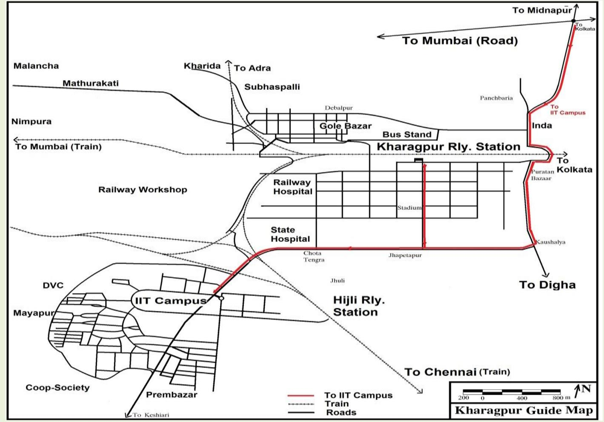
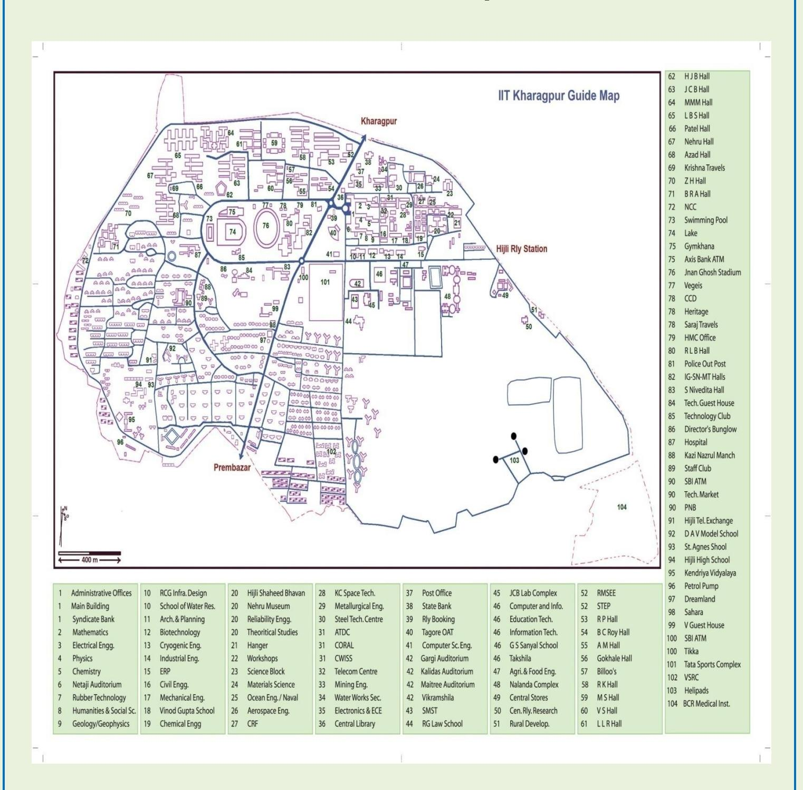
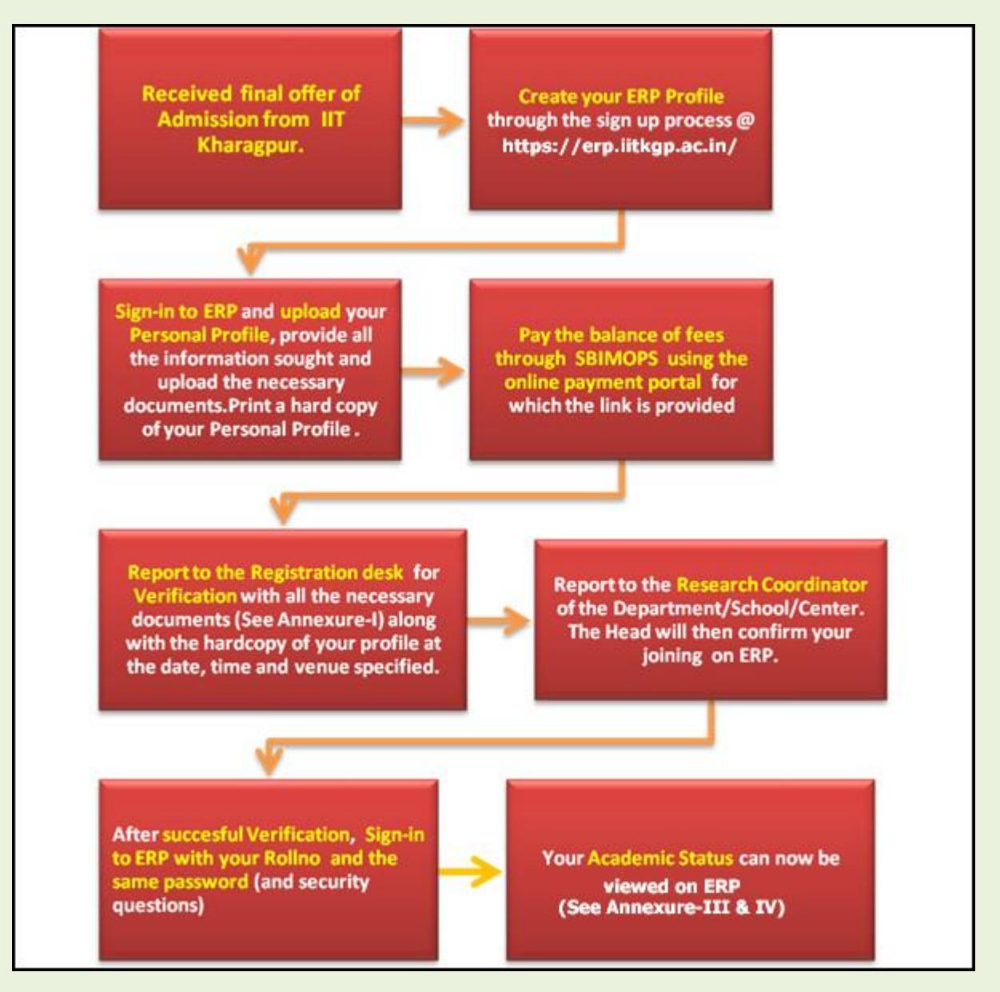
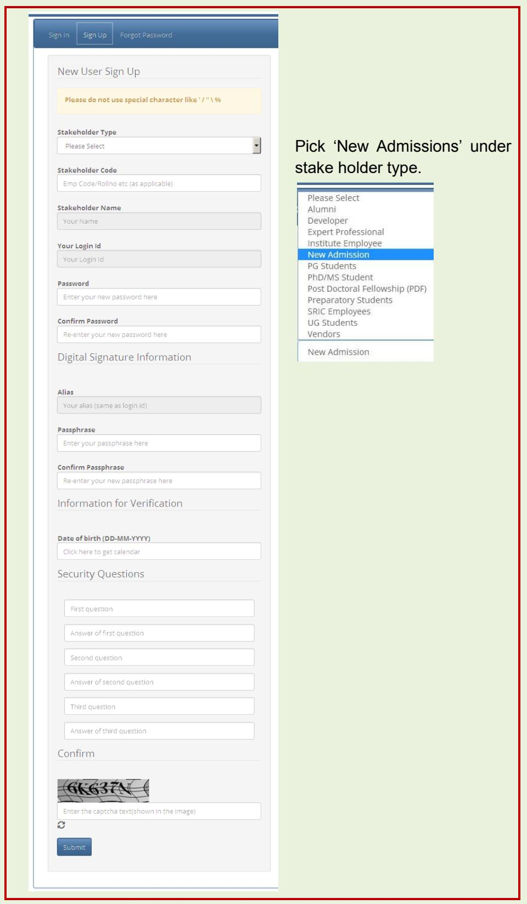
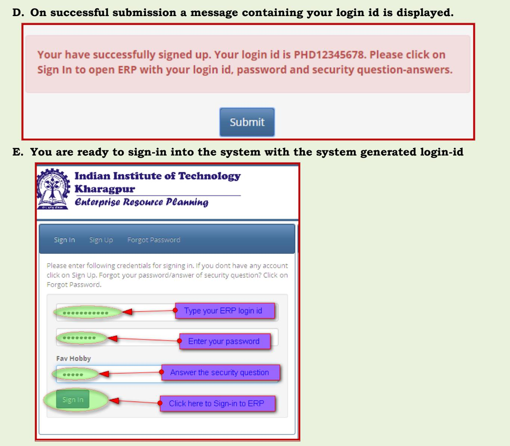

# **Instruction to Fresh (newly Admitted) Research Students**

## *Dedicated to the service of the Nation*

The Indian Institute of Technology Kharagpur (IIT Kharagpur) is a public engineering institution established by the [government of India](https://en.wikipedia.org/wiki/Government_of_India) in 1951. It is the first of the [IITs](https://en.wikipedia.org/wiki/Indian_Institutes_of_Technology) to be established, and is recognized as an Institute of National Importance by the Government of India.

## **Motto**

The motto of IIT Kharagpur is "Yoga Karmashu Kaushalam". This literally translates to "Excellence in action is Yoga", essentially implying that doing your work well is (true) yoga. This can be traced to Sri Krishna's discourse with Arjuna in the Bhagavad Gita. The quote, in the larger context of the Gita, urges man to acquire equanimity because a mind of equanimity allows a man to shed distracting thoughts of the effects of his deeds and concentrate on the task before him. Equanimity is the source of perfection in Karmic endeavours that leads to Salvation.

## **Mission**

The Institute aligns all its activities to serve national interest and seeks

- To provide broad-based education, helping students hone their professional skills and acquire the best-in-class capabilities in their respective disciplines
- To draw the best expertise in science, technology, management and law so as to equip students with the skills to visualize, synthesize and execute projects in these fields
- To imbibe a spirit of entrepreneurship and innovation in its students
- To undertake sponsored research and provide consultancy services in industrial education and socially relevant areas

## **Vision**

Our Vision is

- To be a centre of excellence in education and research, producing global leaders in science, technology and management
- To be a hub of knowledge creation that prioritises the frontier areas of national and global importance
- To improve the life of every citizen of the country

## **Undergraduate and Postgraduate & doctoral education**

IIT Kharagpur offers both undergraduate and postgraduate programmes. They include [Bachelor of Technology](https://en.wikipedia.org/wiki/Bachelor_of_Technology) (BTech. Hons), [Bachelor of Architecture](https://en.wikipedia.org/wiki/Bachelor_of_Architecture) (BArch), Dual Degree, 5 year integrated [Master of Science,](https://en.wikipedia.org/wiki/Master_of_Science) 2-year Master of Science, Master of Technology (MTech), Master of [City Planning](https://en.wikipedia.org/wiki/Urban_planning) (MCP), [Master of Business Administration](https://en.wikipedia.org/wiki/Master_of_Business_Administration) (MBA), [Master](https://en.wikipedia.org/w/index.php?title=MHRM,_IIT_Kharagpur&action=edit&redlink=1) of [Human Resource Management](https://en.wikipedia.org/wiki/Human_Resource_Management) [\(MHRM\)](https://en.wikipedia.org/w/index.php?title=MHRM,_IIT_Kharagpur&action=edit&redlink=1), Master in Medical Science and Technology [\(MMST\)](https://en.wikipedia.org/wiki/MMST_(IIT_Kharagpur)), LL.B in [Intellectual Property Law](https://en.wikipedia.org/wiki/Intellectual_property), LLM, Executive MBA and Postgraduate Diploma in Business Analytics. The institute also offers the MS and Doctor of Philosophy degree (PhD) as part of its [doctoral education programme.](https://en.wikipedia.org/wiki/Doctorate)

#### **How to reach IIT KGP**

Kharagpur is known world over for two landmarks. One, the longest railway platform, and the other, the Indian Institute of Technology, more commonly known as IIT. Situated about 120 km west of Kolkata, Kharagpur is well connected to Kolkata by Road and Rail transport. Kharagpur can be reached in about 2 hours by train or 3 hours by car from Howrah railway station of Kolkata. Kharagpur is also connected by direct train services to most major cities of the country. The Institute is about 10 minutes drive (5 km) from the Kharagpur railway station. Private taxi, auto-rickshaw or cycle-rickshaw can be hired to reach the Institute.

## **Health & Wellness**

IIT Kharagpur keeps the health & wellness need of the campus community as its top priority, and constantly strives to improve and upgrade the existing facilities and the services. Extra Academic Activity (EAA) is an important component of UG curriculum at IIT Kharagpur with NSS, NCC, NSO under its fold.

## *Counselling Centre*

The holistic well being of our student community, encompassing both physical and mental health, is of the highest priority to the Institute. In pursuance of our commitment towards ensuring that, we have set up the Students' Counselling Centre, to provide any

required assistance to students who may be experiencing emotional or psychological conditions that pose a hindrance to their regular activities on campus.

The Counselling Centre offers a broad range of services including psychological assessment, individual therapy, group therapy, and medication and management to promote mental health, life skills, emotional resilience and overall well being of the student community.

Full-time clinical psychologists and a visiting psychiatrist are available for consultation at the Centre. The Centre has also initiated an outreach programme to create a team of sensitized wing representatives from each Hall of Residence who can reach out to students in need.

The Centre addresses problems associated with stress, time management, motivational issues, relationship difficulties, impulse control issues, and learning difficulties. It also helps students experiencing significant depression, anxiety, mood swings, or other thought disorders.

Apart from individual sessions, the Centre plans to conduct group sessions to address life skills such as assertiveness, problem solving, anger management, self awareness, and interpersonal relationships.

The Counselling Centre also functions as a coordinating point for crisis intervention.

## *Hospital*

Indian Institute of Technology, Kharagpur is committed to provide quality healthcare services to its faculty, employees, and students using modern and cost effective techniques and technologies, and through a dedicated and humane approach. In accordance with the above policy, B C Roy Technology Hospital, owned and managed by Indian Institute of Technology, Kharagpur, provides Primary Health Care comprising of curative, preventive and health promotion services.

At present, B C Roy Technology Hospital is located centrally within the IIT Kharagpur campus. The facility has 32 beds, including a 2 Bedded ICU, Cabins and Isolation Ward. Through its Out Patient Department (OPD), Indoor Wards and Emergency Unit, B C Roy Technology Hospital provides 24x7 uninterrupted health care services to the campus community. On an average approximately 7000 patients attend the OPD at B C Roy Technology Hospital every month. The hospital has a round the clock pharmacy inside it. It is also equipped with a Video-conferencing facility for telemedicine.

Biomedical waste from B C Roy Technology Hospital is regularly and properly disposed of by an arrangement with the services of West Bengal State Government Environment Department

#### **Inside Campus**

Find the below Campus map. All the important locations like Students Hostels, Departments/Schools/Centres, Guest Houses, Student Activity Centers, Banks & ATMs, Restaurants & Food Centres etc. are indexed in the map.

## **Instruction to Fresh (newly Admitted) Research Students**

## **Contents**

| No. | Content                                                                                                     | Page No. |  |
|-----|-------------------------------------------------------------------------------------------------------------|----------|--|
| 1.  | Sequence of Events                                                                                          | 7        |  |
| 2.  | On the Day of Reporting and Joining                                                                         | 8        |  |
| 4.  | Annexure-I (List of Documents to be produced and submitted at the time of Reporting to IIT Kharagpur) | 9        |  |
| 5.  | Annexure-II (Balance of Fee to be Paid & Timelines for Registration)                | 10       |  |
| 6.  | Annexure-III (Walk through of the online process from signup to confirmation of joining)  | 11-20    |  |
| 7.  | Annexure-IV (Process flow for Ph. D. Students)                                                           | 21-25    |  |

## **Instruction to Fresh (newly Admitted) Research Students**

Admission process for the Research Programmes (Ph.D. & MS) for Autumn 2018-19 session will be conducted as detailed below:

**1. Sequence of Events:** The following flow diagram outlines the various stages of the Registration Process :

Figure-1 Sequence of events for student Registration.

#### **2. On the day of Reporting and Joining:**

- **i.** All students who are to be admitted to Indian Institute of Technology Kharagpur must bring the documents mentioned in **Annexure – I (also mentioned in the offer letter) below** and produce them at the respective desk during registration and academic verification.
- **ii. The balance of admission fee (as given in Annexure – II, Table-1) shall be payable before or on the day of Registration through on line payment only**
  - **Students/parents should carefully read the fee payment instruction** on the hyper linked page at erp.iitkgp.ac.in **before proceeding to pay the balance of admission fee.**
  - They should log in to the ERP system to pay on line. (**See Annexure-III for details**)
- **iii.** It is desirable that the following process is completed by the student if possible, prior to reporting to the Institute on date of registration,:

Updating Student Profile and uploading the necessary documents on ERP and taking a print out of the student profile. (See **Annexure -III** for details)

- **iv.** Students should report to Kalidas Auditorium on 10 July 2018 and take their seats by 9 AM for welcome address and introduction lecture.
- **v.** Students who have a print out of the student profile shall be directed thereafter to designated counters for academic verification. Students who have not updated their profile, due to time constraints, shall proceed to Computer and Informatics Centre, to update their student profile and take print out and return back to Kalidas Auditorium for academic verification. They should present the signed student profile, photo copies of all other required documents.

The students should retain the original of all the documents with them, in their possession, even after verification is complete should the academic section need to examine them again at a later date.

- **vi.** After verification by the Academic section is complete, the **student's login to ERP will be with the assigned roll number as his/her login id** with the same password.(See **Annexure-III** for details)
- **vii. Upon successful verification, the student should report to the Research Coordinator of the concerned Department/School/Center. The Head of the concerned Academic Unit will then confirm the joining of the student**.
- **viii.** The student can now login to ERP with his/her assigned roll number and view his/her Academic Status.
- **ix. The detailed work flow for the various activities of the Research Program is detailed in Annexure-IV.**

For any other clarification call the Academic Section (PGS &R):

Deputy Registrar (Academic), Ph: 03222282050 Email: [dracad@adm.iitkgp.ac.in](mailto:dracad@adm.iitkgp.ac.in)

For any online application software related problem please call 03222 281017/18/19

**All Research students who are to be admitted to Indian Institute of Technology, Kharagpur must bring the following documents, with photo copies, as mentioned below and produce them at the respective desk during registration and academic verification:**

- **1.** Original certificates and mark-sheets of educational qualifications (starting from Matriculation onwards).
- **2.** Attested photocopies of all testimonials/GATE or NET (Fellowship).
- **3.** Category certificate (OBC (NCL)/SC/ST/PwD) issued by the competent authority as mentioned in the offer letter.
- **4.** Duly filled Medical Examination Report in the format attached with the offer letter.
- **5.** Duly completed Undertaking Form in the format attached with the offer letter.
- **6.** If you are in employment, you must resign and produce the acceptance of your resignation by the employer at the time of joining.
- **7.** Sponsored candidates must produce Sponsorship certificate from their employer in the prescribed form attached with offer letter and a release order from employer allowing to join the programme and showing the details of leave (for the period of 2 years) granted.
- **8.** Signed Printed copy of the ERP Profile.

|        | Fee Structure: Research Programmes |              |                 |           |  |
|--------|------------------------------------|--------------|-----------------|-----------|--|
| Sl.No. | Particulars of fees                | Amount (Rs.) |                 |           |  |
|        |                                    | PhD          | PhD             | PhD &     |  |
|        |                                    | (Regular,    | (under Joint | MS        |  |
|        |                                    | Individual,  | M.Tech/MCP/     | (Project) |  |
|        |                                    | Sponsored)   | MS/MSc-PhD)     |           |  |
| 1      | One Time Fees                      | 2300         | 0               | 2300      |  |
| 2      | Caution Money ( One Time)          | 6000         | 0               | 6000      |  |
| 3      | Placement Services                 | 1500         | 0               | 1500      |  |
| 4      | Medical Insurance(Annually)        | 2200         | 2200            | 2200      |  |
| 5      | Other Charges (Each Semester)      | 4100         | 4100            | 2750      |  |
| 6      | Students' Brotherhood Fund   | 200          | 200             | 200       |  |
|        | (Annually)                         |              |                 |           |  |
| 7      | Tuition Fee (Each Semester)        | 2500         | 2500            | 2500      |  |
| 8      | Hall Budget                        | 1000         | 1000            | 1000      |  |
| 9      | Hostel Overhead Fee (Each | 660          | 660             | 660       |  |
|        | Semester)                          |              |                 |           |  |
| 10     | Hall Establishment Charges   | 13750        | 13750           | 1375      |  |
|        | (each semester)                    |              |                 | 0         |  |
| 11     | Mess Advance (Each Semester)       | 12000        | 12000           | 0         |  |
|        | Total fee                          | 46210        | 36410           | 3286      |  |
|        |                                    |              |                 | 0         |  |

## **Table – 1**

**100% tuition fee waiver for SC/ST/PwD students**

**The balance of admission fee (less the amount paid at the time of confirming the offer) shall be paid online.**

### **Annexure -III**

## **Walk through of the online process from signup to final subject registration.**

## **A. Creating your ERP login Profile:**

| <b>Indian Institute of Technology</b> Kharagpur ABOUT SSL CERTIFICATES <b>Enterprise Resource Planning</b> |                                                                                                                                                                                                                                                                                                                                                                                                               |  |  |
|---------------------------------------------------------------------------------------------------------------------|---------------------------------------------------------------------------------------------------------------------------------------------------------------------------------------------------------------------------------------------------------------------------------------------------------------------------------------------------------------------------------------------------------------|--|--|
| Sign Up                                                                                                             | Important                                                                                                                                                                                                                                                                                                                                                                                                     |  |  |
| Forgot Password                                                                                                     | <b>Quick Links</b>                                                                                                                                                                                                                                                                                                                                                                                            |  |  |
| Sign In                                                                                                             | Message                                                                                                                                                                                                                                                                                                                                                                                                       |  |  |
| Please enter following credentials for signing in. If you dont have                                                 | Parents/Guardians                                                                                                                                                                                                                                                                                                                                                                                             |  |  |
| any account click on Sign $\mathsf{U}_{\mathsf{R}}$ . Forgot your password/answer of                                | Parents/guardians of UG students can look at the                                                                                                                                                                                                                                                                                                                                                              |  |  |
| security question? Click on Forgot Password.                                                                        | performance of their wards semester wise by using the link:                                                                                                                                                                                                                                                                                                                                                   |  |  |
| Stakeholder code/login id                                                                                           | https://erp.iitkgp.ernet.in/StudentPerformance/performanceview_guardian.jsp                                                                                                                                                                                                                                                                                                                                   |  |  |
| Click here to Sign up                                                                                               | Parents/guardians need to fill in the roll no correctly and the                                                                                                                                                                                                                                                                                                                                               |  |  |
| Password                                                                                                            | date of birth of the student using the calendar that appears                                                                                                                                                                                                                                                                                                                                                  |  |  |
| Sign In                                                                                                             | when they click on date of birth field.                                                                                                                                                                                                                                                                                                                                                                       |  |  |
|                                                                                                                     | <b>Students</b> Important UG Subject Registration : Guideline   Manual ۰ • Final Year Application for Degree, Provisional Certificate, Grade Card: UG   PGS&R . New Admission Instruction for updating student profile and registration <b>Payment</b> Instruction for semester fees payment • Click Here to Get First Year Timetable • Switch Over   Branch Change   QEDM   Minor |  |  |

#### **B. The Sign up Screen appears:**

**C. Fill the simple form and Submit to create your IIT KGP ERP login id. Please remember the answers to the security Questions as they are needed for sign-in on ERP**

| Sign Up Sign In             | <b>Forgot Password</b>                                                                                                                                                                                                                                                                                                                                                                                           | <b>Quick Links</b> Important Message                                                                                                                                                                                                                                                                                                                                                                                    |
|--------------------------------|------------------------------------------------------------------------------------------------------------------------------------------------------------------------------------------------------------------------------------------------------------------------------------------------------------------------------------------------------------------------------------------------------------------|-------------------------------------------------------------------------------------------------------------------------------------------------------------------------------------------------------------------------------------------------------------------------------------------------------------------------------------------------------------------------------------------------------------------------------|
| New User Sign Up               |                                                                                                                                                                                                                                                                                                                                                                                                                  | Students                                                                                                                                                                                                                                                                                                                                                                                                                      |
|                                | Please do not use special character like '/" \%                                                                                                                                                                                                                                                                                                                                                                  | . Important UG Subject Registration : Guideline   Manual . Final Year Application for Degree, Provisional Certificate, Grade Card: UG   PGS&R New Admission Instruction for updating student profile and registration                                                                                                                                                                                                   |
| <b>Stakeholder Type</b>        | New Admission ٠                                                                                                                                                                                                                                                                                                                                                                                               | • Payment Instruction for semester fees payment • Click Here to Get First Year Timetable                                                                                                                                                                                                                                                                                                                                   |
| <b>Entrance Exam</b>           | Preparatory <b>Pick New Admission</b> ● NEWPREP Undergraduate Pick Degree Type $\circ$ JEE $\circ$ JAM $\circ$ PREP $\circ$ FX Postgraduate $\circledcirc$ Gate $\circledcirc$ Mg/A $\circledcirc$ MHRM $\circledcirc$ DEF $\circledcirc$ MMST $\circledcirc$ LLB $\circledcirc$ SPON $\odot$ QIP $\odot$ EMBA $\odot$ FEX Research Fill your Application Number ◎ MS PHD ◎ PDF | • Switch Over   Branch Change   QEDM   Minor • Registration : UG • Summer Quarter & Supplementary : Notice   List • Important dates (a) Senate will now meet on 26th May 2015. (b) The results shall be mailed on 26th after Senate meeting. (c) Students can view their performance from 27th May 2015, 12 noon. (d) Payment of semester registration fee shall start from 27.05.2015 at 00:00:01 hours |
| <b>Your Reg/Appl No</b>        | 12345678                                                                                                                                                                                                                                                                                                                                                                                                         |                                                                                                                                                                                                                                                                                                                                                                                                                               |
| <b>Stakeholder</b> Name     | <b>TEST PHD CANDIDATE</b>                                                                                                                                                                                                                                                                                                                                                                                        |                                                                                                                                                                                                                                                                                                                                                                                                                               |
| Your Login Id                  | PHD12345678                                                                                                                                                                                                                                                                                                                                                                                                      |                                                                                                                                                                                                                                                                                                                                                                                                                               |
| Password                       |  Enter and                                                                                                                                                                                                                                                                                                                                                                                                    |                                                                                                                                                                                                                                                                                                                                                                                                                               |
| Confirm Password            | Confirm Password                                                                                                                                                                                                                                                                                                                                                                                              |                                                                                                                                                                                                                                                                                                                                                                                                                               |
|                                | Digital Signature Information                                                                                                                                                                                                                                                                                                                                                                                    |                                                                                                                                                                                                                                                                                                                                                                                                                               |
| <b>Alias</b>                   | PHD12345678                                                                                                                                                                                                                                                                                                                                                                                                      |                                                                                                                                                                                                                                                                                                                                                                                                                               |
| Passphrase                     |                                                                                                                                                                                                                                                                                                                                                                                                                  |                                                                                                                                                                                                                                                                                                                                                                                                                               |
| Confirm Passphrase          |                                                                                                                                                                                                                                                                                                                                                                                                                  |                                                                                                                                                                                                                                                                                                                                                                                                                               |
| Information for Verification   |                                                                                                                                                                                                                                                                                                                                                                                                                  |                                                                                                                                                                                                                                                                                                                                                                                                                               |
| Date of birth (DD- MM-YYYY) | $01-01-1997$ Enter your date of birth                                                                                                                                                                                                                                                                                                                                                                         |                                                                                                                                                                                                                                                                                                                                                                                                                               |
| <b>Security Questions</b>      | <b>Create your Security</b> Questions and Answers. You need them during logging in                                                                                                                                                                                                                                                                                                                         |                                                                                                                                                                                                                                                                                                                                                                                                                               |
| Degree place Dept        | $\cdots$  $\mathbf{a}$                                                                                                                                                                                                                                                                                                                                                                                     |                                                                                                                                                                                                                                                                                                                                                                                                                               |
| Confirm                        | Enter the Captcha Click to refresh Captcha Code                                                                                                                                                                                                                                                                                                                                                               |                                                                                                                                                                                                                                                                                                                                                                                                                               |
|                                | ဒ 6J3T3P Submit Submit to create your <b>ERP login Profile</b>                                                                                                                                                                                                                                                                                                                                       |                                                                                                                                                                                                                                                                                                                                                                                                                               |
|                                |                                                                                                                                                                                                                                                                                                                                                                                                                  |                                                                                                                                                                                                                                                                                                                                                                                                                               |

**F. The ERP screen opens up, displaying the Academic Module. Clicking on Academic Module opens the Admission Menu:**

| Please Click on Module to Get Menus Under it. Click here to view the network configuration details to open ERP System successfully in your machine within the Institute. |                                                                                                          |
|-----------------------------------------------------------------------------------------------------------------------------------------------------------------------------|----------------------------------------------------------------------------------------------------------|
| <b>Mails [From ERP Stakeholders]</b>                                                                                                                                        | Pending Work(0) Click to get details Alerts [Generated from ERP applications]                         |
| Received Mails(0) Click to get details                                                                                                                                      | *C - Completed; *P - Pending; *W - Coming Soon as Pending; <b>Task Details[Node Wise]</b> P C W |
|                                                                                                                                                                             | No pending work[Workflow]                                                                                |
|                                                                                                                                                                             |                                                                                                          |
|                                                                                                                                                                             |                                                                                                          |

### **G. Click on Update and Print Student Profile**

| Welcome: TEST PHD CANDIDATE (PHD12345678)   MHome   Forgot Passphrase   ■ Gadget   ● Complaint Box   Academic                                                                                                                                                                                                                     | <b>O</b> Logout | Norton <b>ROUT SSL CERTIFICA</b> |  |  |
|--------------------------------------------------------------------------------------------------------------------------------------------------------------------------------------------------------------------------------------------------------------------------------------------------------------------------------------|-----------------|-------------------------------------|--|--|
| You are in: Academic                                                                                                                                                                                                                                                                                                                 |                 |                                     |  |  |
| Delegate Work[Responsibility lies with Assignee] Delegate Work with Role[Responsibility lies with Assignor] Search Menu *Note : [D] - Delegatable; [ND] - Non Delegatable; [DWR] - Delegatable With Role; X - In Active(Date Over); Y - Active ; *Menu groups will retain the previous state(open or closed) as you desire. |                 |                                     |  |  |
| List of Menus Delegated to You by Assignors on Behalf of His/Her (i.e. Assignor) Role.                                                                                                                                                                                                                                               |                 |                                     |  |  |
| <b>Admission</b> Click here to Update Your Profile & Upload Documents ND]Update and Print Student Profile (New Admission):<                                                                                                                                                                                                    |                 |                                     |  |  |

**H. The following form appears. It contains your Roll no and Hall of Residence. Fill in all the details correctly and update your profile.** 

| <b>Profile Update Section</b>                                     |                                                                                        |           |                                                                                                                                        |                                    |                                                                                                                                                 | <b>Print Section (Scroll down for print button)</b> |                                      |                                                   |                                     |                             |                                    |
|-------------------------------------------------------------------|----------------------------------------------------------------------------------------|-----------|----------------------------------------------------------------------------------------------------------------------------------------|------------------------------------|-------------------------------------------------------------------------------------------------------------------------------------------------|-----------------------------------------------------|--------------------------------------|---------------------------------------------------|-------------------------------------|-----------------------------|------------------------------------|
| Tentative Roll No:                                                | 15CS91R01                                                                              |           | TEST PHD CANDIDATE Name                                                                                                             |                                    |                                                                                                                                                 | <b>INDIAN INSTITUTE OF TECHNOLOGY KHARAGPUR</b>     |                                      |                                                   |                                     |                             |                                    |
| Department                                                        | CS                                                                                     |           | <b>NOA</b>                                                                                                                             |                                    | PHDREG                                                                                                                                          |                                                     | <b>Basic Information:</b>            |                                                   |                                     |                             |                                    |
| Hall                                                              | LAL BAHADUR SHASTRI HALL                                                               |           | Section                                                                                                                                |                                    | Not Applicable                                                                                                                                  |                                                     | Registration                         |                                                   |                                     |                             |                                    |
| Mobile No                                                         | 9223456789                                                                             |           | *Email ID                                                                                                                              |                                    | testphd@testphd.com                                                                                                                             |                                                     | No                                   | PHD12345678                                       | Application No.                  | 2345678                     |                                    |
| Blood Group(Eg: AB+ O-) B+                                        |                                                                                        |           | <b>DOB</b>                                                                                                                             |                                    | 01-01-1997                                                                                                                                      |                                                     |                                      |                                                   | Name(as                             |                             |                                    |
| Old Rollno/Emp Code/Project Staff Code of IITKGP(if any)    |                                                                                        |           | *Choice for Institute EMail ID                                                                                                         |                                    | jeetopper @iitkgp.ac.in                                                                                                                      |                                                     | Rollno                               | 15CS91R01                                         | per last qualifying degree)   | <b>EST PHD</b> CANDIDATE |                                    |
| *10+2 Marks in %                                                  | 99                                                                                     |           | *Guardian's Name                                                                                                                       |                                    | <b>XYZABC</b>                                                                                                                                   |                                                     | Dept                                 | <b>CS</b>                                         | DOB(DD- MM-YYYY)                 | 01-01-1997                  |                                    |
| Parent's Annual Income 120000                                     |                                                                                        |           | *Guardian's Profession                                                                                                                 |                                    | <b>PROFESSOR</b>                                                                                                                                |                                                     | Blood                                | $B+$                                              | Gender                              |                             |                                    |
| Parent's Mobile No.                                               | 9957654321                                                                             |           |                                                                                                                                        |                                    |                                                                                                                                                 |                                                     | Group Are you a                   |                                                   |                                     |                             |                                    |
| 'Guardian's Email Id                                              | xyz@abc.com                                                                            |           | Your Name in Hindi* (Please use http://www.google.com/transliterate/ टेस्ट पीएचडी छात्र for writing name in hindi transcript) |                                    |                                                                                                                                                 |                                                     | person with disability Type of |                                                   | Percentage                          |                             |                                    |
|                                                                   |                                                                                        |           |                                                                                                                                        | Fill this Simple form by providing |                                                                                                                                                 |                                                     | disability                           | GE.                                               | of disability Vationality INDIAN |                             |                                    |
| UPLOAD SOFT COPY OF MEDICAL FORM                                  |                                                                                        |           |                                                                                                                                        | correct information.               |                                                                                                                                                 |                                                     | Category Email                    | testphd@testphd.com                               | Mobile No                           | 9223456789                  |                                    |
|                                                                   | * Note: Please create one soft copy (PDF Document) for uploading all the medical forms |           |                                                                                                                                        |                                    |                                                                                                                                                 |                                                     | Guardian                             | <b>XYZABC</b>                                     | Hall                                | LBS                         |                                    |
| Medical Form                                                      | Choose File No file chosen                                                             |           | The hard copy also to be submitted at time of registration.                                                                            |                                    |                                                                                                                                                 |                                                     | Name                                 |                                                   | blo                                 |                             |                                    |
| UPLOAD IMAGE OF PHOTO AND SCANNED SIGNATURE                       |                                                                                        |           |                                                                                                                                        |                                    | <b>Print Portion</b> Appears here after successful Updation                                                                               |                                                     | Section                              | Not Applicable                                    | Rollno/Emp No.                   |                             |                                    |
|                                                                   |                                                                                        |           | Photo dimension: width x height in pixel (min allowed-130px x 150px, max allowed 175px x 200px)                                        |                                    | * Signature dimension: width x height in pixel (min allowed-100px X 50px, max allowed 300px X 150px). 95 % of the image area should contain the |                                                     | Medical Form                      | Yes                                               |                                     |                             |                                    |
| scanned signature                                                 |                                                                                        |           | $\cdot^*$ Please note that if photo and signature is already available then you can not update these                                   |                                    |                                                                                                                                                 |                                                     | $10 + 2$                             | 99                                                | Guardian's Name                  | <b>YZABC</b>                |                                    |
| Photo                                                             | Choose File No file chosen                                                             |           | Image of Signature                                                                                                                     |                                    | Choose File No file chosen                                                                                                                      |                                                     | Marks Parent's                    |                                                   |                                     |                             |                                    |
|                                                                   |                                                                                        |           |                                                                                                                                        |                                    |                                                                                                                                                 |                                                     | Annual Income                     | 120000                                            | Guardian's Profession            | <b>ROFESSOR</b>             |                                    |
| <b>Emergency Contact Information</b> Emer. Cont. No(Guardians) | 9111345678                                                                             |           | Emer, Cont, Person Name                                                                                                                |                                    | <b>JAYA</b>                                                                                                                                     |                                                     | Guardian's                           | yz@abc.com                                        | Hindi                               | टेस्ट पीएचडी                |                                    |
| Emer. Cont. Address                                               | FLT 201, GREEN PARK <b>GACHIBOWLI</b>                                               |           | Relationship with The Person                                                                                                           |                                    | <b>WIFE</b>                                                                                                                                     |                                                     | Email Id                             | <b>Emergency Contact Information:</b>             | Name                                | আন                          |                                    |
|                                                                   | HYDERABAD 500046                                                                       |           |                                                                                                                                        |                                    |                                                                                                                                                 |                                                     | Cont. No                             | 9111345678                                        |                                     | Name JAYA Relationship      | <b>WIFE</b>                        |
|                                                                   | Address (Permanent Address Can not be updated twice/if available)                      |           |                                                                                                                                        |                                    |                                                                                                                                                 |                                                     | Emer, Cont.                          | FLT 201. GREEN PARK GACHIBOWLI HYDERABAD          |                                     |                             |                                    |
| <b>Communication Address</b>                                      |                                                                                        |           | Permanent Address (Same As Communication Address $\Box$ )                                                                              |                                    |                                                                                                                                                 |                                                     | <b>Address</b>                       | 500046                                            |                                     |                             |                                    |
| Addr <b>FLT 20</b>                                             |                                                                                        | Addr      |                                                                                                                                        | <b>FLT 20</b>                      |                                                                                                                                                 |                                                     | Addr                                 | <b>Communication Address</b> FLT 20 | Addr                                | <b>Permanent Address</b>    | <b>FLT 20</b>                      |
| Vill/City                                                         | <b>GREEN PARK</b>                                                                      | Vill/City |                                                                                                                                        | <b>GREEN PARK</b>                  | <b>Click here</b>                                                                                                                               |                                                     | Vill/City                            | <b>GREEN PARK</b>                                 | /ill/City                           |                             | <b>GREEN PARK</b>                  |
| <b>Police Station</b>                                             | <b>GACHIBOWLI</b>                                                                      |           | <b>Police Station</b>                                                                                                                  | <b>GACHIBOWLI</b>                  | to Pay Fees                                                                                                                                     |                                                     | Police Station                       | <b>GACHIBOWLI</b>                                 | Police Station                      |                             | <b>GACHIBOWLI</b>                  |
|                                                                   | <b>RANGA REDDY</b>                                                                     |           |                                                                                                                                        |                                    |                                                                                                                                                 |                                                     | District                             | <b>RANGA REDDY</b>                                | <b>District</b>                     |                             | RANGA REDDY                        |
| District                                                          |                                                                                        | District  |                                                                                                                                        | <b>RANGA REDDY</b>                 |                                                                                                                                                 |                                                     | State                                | <b>TELENGANA</b>                                  | <b>State</b>                        |                             | <b>TELENGANA</b>                   |
| State                                                             | TELENGANA                                                                              | State     |                                                                                                                                        | <b>TELENGANA</b>                   |                                                                                                                                                 |                                                     | Pin No.                              | 500046                                            | Pin No.                             |                             | 500046                             |
| Pin No.                                                           | 500046                                                                                 | Pin No.   |                                                                                                                                        | 500046                             |                                                                                                                                                 |                                                     |                                      |                                                   |                                     |                             |                                    |
| Message displayed here after                                      |                                                                                        |           | <b>SUCCESSFULLY UPDATED.</b> <b>Update</b>                                                                                          | <b>Click here</b>                  |                                                                                                                                                 |                                                     |                                      |                                                   |                                     |                             | Signature: (TEST PHD CANDIDATE) |
| successful Updation                                               |                                                                                        |           |                                                                                                                                        | to Print Profile                   |                                                                                                                                                 |                                                     |                                      |                                                   |                                     |                             | Date: Wed May 20 17:42:34 IST 201! |
|                                                                   |                                                                                        |           |                                                                                                                                        |                                    |                                                                                                                                                 |                                                     | <b>PRINT Profile</b>                 |                                                   |                                     | av Fer                      |                                    |
|                                                                   |                                                                                        |           |                                                                                                                                        |                                    |                                                                                                                                                 |                                                     |                                      |                                                   |                                     |                             |                                    |
|                                                                   |                                                                                        |           |                                                                                                                                        |                                    |                                                                                                                                                 |                                                     |                                      |                                                   |                                     |                             |                                    |
|                                                                   |                                                                                        |           |                                                                                                                                        |                                    |                                                                                                                                                 |                                                     |                                      |                                                   |                                     |                             |                                    |
|                                                                   |                                                                                        |           |                                                                                                                                        |                                    |                                                                                                                                                 |                                                     |                                      |                                                   |                                     |                             |                                    |
|                                                                   |                                                                                        |           |                                                                                                                                        |                                    |                                                                                                                                                 |                                                     |                                      |                                                   |                                     |                             |                                    |
|                                                                   |                                                                                        |           |                                                                                                                                        |                                    |                                                                                                                                                 |                                                     |                                      |                                                   |                                     |                             |                                    |

**I. Click on Print Profile to print your profile. You can also save it as a PDF file for your reference The Printed Profile appears as shown below. Ensure to sign the hard copy before you submit it to the Registration desk.** 

|                                       |                               | <b>INDIAN INSTITUTE OF TECHNOLOGY KHARAGPUR</b>               |                                    |             |
|---------------------------------------|-------------------------------|---------------------------------------------------------------|------------------------------------|-------------|
| <b>Basic Information:</b>             |                               |                                                               |                                    |             |
| <b>Registration No</b> Rollno      | PHD12345678 15CS91R01      | <b>Application No</b> Name(as per last qualifying TEST PHD | 12345678                           |             |
|                                       |                               | degree)                                                       | <b>CANDIDATE</b>                   |             |
| Dept <b>Blood Group</b>            | cs B+                      | DOB(DD-MM-YYYY) Gender                                     | 01-01-1997 м                    |             |
| Are you a person with disability   | N                             |                                                               |                                    |             |
| Type of disability                    |                               | Percentage of disability                                      | 0                                  |             |
| Category                              | GE                            | Nationality                                                   | <b>INDIAN</b>                      |             |
| Email                                 | testphd@testphd.com Mobile No |                                                               | 9223456789                         |             |
| <b>Guardian Name</b>                  | <b>XYZABC</b>                 | Hall                                                          | LBS                                |             |
| Section                               | Not Applicable                | Old Rollno/Emp No                                             |                                    |             |
| <b>Medical Form</b>                   | Yes                           |                                                               |                                    |             |
| $10+2$ Marks                          | 99                            | <b>Guardian's Name</b>                                        | <b>XYZABC</b>                      |             |
| Parent's Annual Income 120000         |                               | <b>Guardian's Profession</b>                                  | <b>PROFESSOR</b>                   |             |
| Guardian's Email Id                   | xyz@abc.com                   | <b>Hindi Name</b>                                             | टेस्ट पीएचडी छात्र                 |             |
| <b>Emergency Contact Information:</b> |                               |                                                               |                                    |             |
| Cont. No                              | 9111345678                    | Name <b>JAYA</b>                                           | Relationship                       | <b>WIFE</b> |
| Emer, Cont. Address                   |                               | FLT 201, GREEN PARK GACHIBOWLI HYDERABAD 500046               |                                    |             |
| <b>Communication Address</b>          |                               | <b>Permanent Address</b>                                      |                                    |             |
| Addr                                  | FLT 20"                       | Addr                                                          | <b>FLT 20</b>                      |             |
| Vill/City                             | <b>GREEN PARK</b>             | Vill/City                                                     | <b>GREEN PARK</b>                  |             |
| <b>Police Station</b>                 | <b>GACHIBOWLI</b>             | <b>Police Station</b>                                         | <b>GACHIBOWLI</b>                  |             |
| <b>District</b>                       | <b>RANGA REDDY</b>            | <b>District</b>                                               | <b>RANGA REDDY</b>                 |             |
| <b>State</b>                          | <b>TELENGANA</b>              | State                                                         | <b>TELENGANA</b>                   |             |
| Pin No.                               | 500046                        | Pin No.                                                       | 500046                             |             |
|                                       |                               |                                                               | Signature:                         |             |
|                                       |                               |                                                               | (TEST PHD CANDIDATE)               |             |
|                                       |                               |                                                               | Date: Wed May 20 17:42:34 IST 2015 |             |
|                                       |                               |                                                               |                                    |             |
|                                       |                               |                                                               |                                    |             |

**J. Next Proceed to Pay fees . The Pay fee button appears on the right hand corner of the screen. Clicking on the Pay fees button displays the details of the amount to be paid.**

| Welcome: TEST PHD CANDIDATE (PHD12345678)   MHome   Forgot Passphrase   $\blacksquare$ Gadget   $\blacksquare$ Complaint Box   Academic | <b>U</b> Logout                                                   | Norton <b>ABOUT SSL CERT</b> |  |
|--------------------------------------------------------------------------------------------------------------------------------------------|-------------------------------------------------------------------|---------------------------------|--|
| You are in: Academic -> Update and Print Student Profile (New Admission)                                                                   |                                                                   |                                 |  |
|                                                                                                                                            | Fee Payment for 15CS91R01 (PHD) for the session AUTUMN, 2015-2016 |                                 |  |
| Registration No.                                                                                                                           | PHD12345678                                                       |                                 |  |
| Application No:                                                                                                                            | 12345678                                                          |                                 |  |
| Name                                                                                                                                       | TEST PHD CANDIDATE                                                |                                 |  |
| Reference No.                                                                                                                              |                                                                   |                                 |  |
| Nature of Admission                                                                                                                        | <b>PHD</b>                                                        |                                 |  |
| Already Paid                                                                                                                               | Click here to go to IIT Payment Gateway $\overline{0}$         |                                 |  |
| Roll No. (tentative)                                                                                                                       | 15CS91R01                                                         |                                 |  |
| Amount to be paid                                                                                                                          | 34881.0                                                           |                                 |  |
|                                                                                                                                            |                                                                   |                                 |  |

**K. This screen leads you to Payment Gateway through which the amount can be paid through SBIMOPS.**

|                                                | भारतीय प्रौद्योगिकी संस्थान खड़गपुर <i>अ</i> Indian Institute of Technology अ Kharagpur | Norton powered by Symantec ABOUT SSL CERTIFICATES |
|------------------------------------------------|-----------------------------------------------------------------------------------------------|---------------------------------------------------------|
| <b>IITKGP Payment Gateway</b>                  |                                                                                               |                                                         |
| <b>Payment Details</b>                         |                                                                                               |                                                         |
| <b>IITKGP Reference No</b>                     | NEWADM-PHD12345678-2015-101                                                                   |                                                         |
| Type                                           | Registration Fees Payment(New Admission)                                                      |                                                         |
| <b>Initiated By</b>                            | TEST PHD CANDIDATE (PHD12345678)                                                              |                                                         |
| Amount                                         | 34881.0                                                                                       |                                                         |
| <b>Click here to go to SBIMOPS</b> Currency | <b>INR</b>                                                                                    |                                                         |
| <b>Other Details</b>                           |                                                                                               |                                                         |
| session                                        | 2015-2016                                                                                     |                                                         |
| department                                     | COMPUTER SCIENCE & ENGINEERING                                                                |                                                         |
| semester                                       | <b>AUTUMN</b>                                                                                 |                                                         |
|                                                | Cancel Proceed                                                                             |                                                         |

**L. Upon Payment of Fees and Successful Verification of all your documents, you can sign-in to ERP through your roll no with the same password and security questions as earlier. The screen after successful login appears as follows:**

| Welcome: TEST PHD CANDIDATE [15CS91R01] Switch To ▼   Kal Home   Forgot Passphrase   ■ Gadget   © Complaint Box   <b>O</b> Logout Norton |  |                                                               |          |  |                                          |
|---------------------------------------------------------------------------------------------------------------------------------------------------|--|---------------------------------------------------------------|----------|--|------------------------------------------|
| Academic HMC CDC <b>ABOUT SSL CERTIFICA</b>                                                                                                    |  |                                                               |          |  |                                          |
| Please Click on Module to Get Menus Under it.                                                                                                     |  |                                                               |          |  |                                          |
| $Click$ here to view the network configuration details to open ERP System successfully in your machine within the Institute.                      |  |                                                               |          |  |                                          |
| Mails [From ERP Stakeholders]                                                                                                                     |  | Pending Work(0) Click to get details                          |          |  | Alerts [Generated from ERP applications] |
| Received Mails (4) Click to get details                                                                                                           |  | *C - Completed; *P - Pending; *W - Coming Soon as Pending; |          |  |                                          |
|                                                                                                                                                   |  | <b>Task Details[Node Wise]</b>                                | $P C $ W |  |                                          |
|                                                                                                                                                   |  | No pending work[Workflow]                                     |          |  |                                          |
| Click here to go to academic menus                                                                                                                |  |                                                               |          |  |                                          |
|                                                                                                                                                   |  |                                                               |          |  |                                          |
| <b>Important Information</b>                                                                                                                      |  |                                                               |          |  |                                          |
| Copyright © ERP Systems, IIT Kharagpur                                                                                                            |  | Help Line - 032222-81017/81018/81019                          |          |  |                                          |

| Delegate Work [Responsibility lies with Assignee]                                                                                                                                                    | Delegate Work with Role[Responsibility lies with Assignor]                                                                                                                             | Search Menu                                                                                                        |  |  |  |  |  |
|------------------------------------------------------------------------------------------------------------------------------------------------------------------------------------------------------|----------------------------------------------------------------------------------------------------------------------------------------------------------------------------------------|--------------------------------------------------------------------------------------------------------------------|--|--|--|--|--|
| *Note: [D] - Delegatable; [ND] - Non Delegatable; [DWR] - Delegatable With Role; X - In Active(Date Over); Y - Active; *Menu groups will retain the previous state(open or closed) as you desire. |                                                                                                                                                                                        |                                                                                                                    |  |  |  |  |  |
| List of Menus Delegated to You by Assignors on Behalf of His/Her (i.e. Assignor) Role.                                                                                                               |                                                                                                                                                                                        |                                                                                                                    |  |  |  |  |  |
| Menus are not available                                                                                                                                                                              |                                                                                                                                                                                        |                                                                                                                    |  |  |  |  |  |
| <b>Examination TimeTable</b>                                                                                                                                                                         |                                                                                                                                                                                        |                                                                                                                    |  |  |  |  |  |
| V [ND]Central Examination TimeTable: [Details]                                                                                                                                                    | X[ND]Examination Time Table (for Students): [Details]                                                                                                                                  | V [ND]Complete Examination Instructions for Students: [Details]                                                 |  |  |  |  |  |
| V [ND]Very Important Exam Instructions for Students: X[ND]Your Central Exam Invigilation Duty: [Details] [Details]                                                                                |                                                                                                                                                                                        |                                                                                                                    |  |  |  |  |  |
| Feedback                                                                                                                                                                                             |                                                                                                                                                                                        |                                                                                                                    |  |  |  |  |  |
| <b>X</b> [ND]FeedBack Form: [Details]                                                                                                                                                                |                                                                                                                                                                                        |                                                                                                                    |  |  |  |  |  |
| Fees                                                                                                                                                                                                 |                                                                                                                                                                                        |                                                                                                                    |  |  |  |  |  |
| ⊻ [D]Pay Adjustment/Late Fee: [Details]                                                                                                                                                              |                                                                                                                                                                                        |                                                                                                                    |  |  |  |  |  |
| <b>Final Graduation Processing</b>                                                                                                                                                                   |                                                                                                                                                                                        |                                                                                                                    |  |  |  |  |  |
| ✔ [ND]01. Application For Degree, Grade Card, Final Dues ✔ [ND]Dues Clearance Status (After Thesis Submission): Clearance: [Details]                                                              | [Details]                                                                                                                                                                              |                                                                                                                    |  |  |  |  |  |
| MS/RS                                                                                                                                                                                                |                                                                                                                                                                                        | <b>Click here to view Academic Status</b>                                                                          |  |  |  |  |  |
| V [ND]01. Edit Student Profile: [Details]                                                                                                                                                            | V [ND]07. Semester Registration: [Details]                                                                                                                                             | V [ND] 20. Apply for Withdrawal: [Details]                                                                         |  |  |  |  |  |
| V [ND]21. Clearance Certificate: [Details]                                                                                                                                                           | V [ND] Application for Grant of Institute Assistantship for Project Research Students:/ [Details]                                                                                   | $\blacktriangleright$ [ND] Application for registration of a subject in self- study mode: [Details]             |  |  |  |  |  |
| ⊻ [ND]Application for Teaching Assistantship after completion of 4 years/5 years tenure: [Details]                                                                                                | V [ND]Student Status: Details]                                                                                                                                                         | ✔ [ND]Subject Registration of Compulsory and Interdisciplinary Subjects for Approval from Faculty: [Details] |  |  |  |  |  |
| - Students                                                                                                                                                                                           |                                                                                                                                                                                        |                                                                                                                    |  |  |  |  |  |
| ✔ [ND] Application for Financial Assistance for Conferences: [Details]                                                                                                                            | ✔ [ND] Application for permission to attend CONFERENCES/WORKSHOPS/SEMINARS without financial completion of 4 years/5 years tenure: [Details] assitance from Institute: [Details] | ▼ [ND] Application for Teaching Assistantship after                                                                |  |  |  |  |  |
| Y [ND] Applications For Non-Resident Withdrawal, Temporary Withdrawal, Resignation, Summer Internship: [Details]                                                                               | V [ND]Your Academic Information: [Details]                                                                                                                                             |                                                                                                                    |  |  |  |  |  |
| <b>Subjects</b>                                                                                                                                                                                      |                                                                                                                                                                                        |                                                                                                                    |  |  |  |  |  |
| ⊻ [ND]Interdisciplinary Subjects For Research Students: [Details]                                                                                                                                 |                                                                                                                                                                                        |                                                                                                                    |  |  |  |  |  |
| <b>Time Table</b>                                                                                                                                                                                    |                                                                                                                                                                                        |                                                                                                                    |  |  |  |  |  |
| ⊻ [ND]Central TimeTable PDF Report (Please allow pop- ups): [Details]                                                                                                                             | V [ND]Subject List With TimeTable Slots: [Details]                                                                                                                                     |                                                                                                                    |  |  |  |  |  |

#### **M. The following Menus appear under Academic**

## **N. Your Academic status can be viewed here.**

| Print                                                                                                |                                                                                                                                                       |                             |            |                                            |                                                                 |              |                                  |                                                        |
|------------------------------------------------------------------------------------------------------|-------------------------------------------------------------------------------------------------------------------------------------------------------|-----------------------------|------------|--------------------------------------------|-----------------------------------------------------------------|--------------|----------------------------------|--------------------------------------------------------|
| Details of Student                                                                                   |                                                                                                                                                       |                             |            |                                            |                                                                 |              |                                  |                                                        |
| <b>Roll No: 15CS91R01</b>                                                                            |                                                                                                                                                       | Name: TEST PHD CANDIDATE    |            |                                            |                                                                 |              |                                  |                                                        |
|                                                                                                      | Contact Details: Email: testphd@testphd.com                                                                                                           |                             |            |                                            | Joining Date:: 9 JULY 2015   Joining Confirmed by Department: Y |              |                                  |                                                        |
| <b>Broad Area of Research:</b>                                                                       |                                                                                                                                                       |                             |            |                                            |                                                                 |              |                                  |                                                        |
| <b>Education</b>                                                                                     |                                                                                                                                                       |                             |            |                                            | <b>Experience</b>                                               |              |                                  | <b>Joining Confirmation Status</b>                     |
| <b>Oualification</b>                                                                                 | <b>University/Board</b>                                                                                                                               | <b>Year of</b> Passino   | Percentage | Subjects/Specialisation                    | Organisation                                                    | <b>Place</b> | <b>From</b> <b>Date</b>       | T 0 <b>Responsibility</b> <b>Date</b> |
| CLASS 10                                                                                             | WEST BENGAL BOARD OF SECONDARY <b>EDUCATION</b>                                                                                                 | 2009                        | 99         | <b>GENERAL</b>                             |                                                                 |              |                                  |                                                        |
| CLASS 12                                                                                             | <b>WEST BENGAL</b> COUNCIL OF HIGHER <b>SECONDARY</b> EDUCATION                                                                              | 2011                        | 81         | <b>SCIENCE</b>                             | appears here.                                                   |              | The information that you entered | at the time of making your application                 |
| Івтесн                                                                                               | <b>WEST BENGAL</b> UNIVERSITY OF TECHNOLOGY                                                                                                     | 2013                        | 9.8        | COMPUTER SCIENCE AND <b>ENGINEERING</b> |                                                                 |              |                                  |                                                        |
| IMTECH                                                                                               | INDIAN INSTITUTE OF <b>TECHNOLOGY</b> KHARAGPUR                                                                                                 | 2015                        | 9.34       | <b>INFORMATION</b> <b>TECHNOLOGY</b>    |                                                                 |              |                                  |                                                        |
|                                                                                                      | <b>Fees Paid and Semester Registration Status</b> ** Semester registration is not applicable for joining session semester                          |                             |            |                                            |                                                                 |              |                                  |                                                        |
| <b>Session</b>                                                                                       | <b>Semester</b>                                                                                                                                       | <b>Verified by Accounts</b> |            | <b>Semester Registration</b>               | <b>Supervisor Comment</b>                                       |              |                                  | HOD/Chairman,DSC Acceptance                            |
| 2015-2016                                                                                            | <b>AUTUMN</b>                                                                                                                                         | 9 JULY 2015              |            |                                            |                                                                 |              |                                  |                                                        |
|                                                                                                      |                                                                                                                                                       |                             |            |                                            |                                                                 |              |                                  |                                                        |
|                                                                                                      |                                                                                                                                                       |                             |            |                                            |                                                                 |              | <b>Comprehensive Exam</b>        |                                                        |
|                                                                                                      | <b>DSC Formation Statuse YET TO BE FORMED</b>                                                                                                         |                             |            |                                            |                                                                 |              | <b>Exam Date</b>                 | <b>Status</b>                                          |
| <b>Emp No</b>                                                                                        |                                                                                                                                                       | <b>Faculty Name</b>         |            | <b>Department</b>                          | <b>Type</b>                                                     |              | No Details available             |                                                        |
|                                                                                                      |                                                                                                                                                       |                             |            | <b>DSC Members can be seen here</b>        |                                                                 |              |                                  |                                                        |
| <b>Approval Status</b>                                                                               |                                                                                                                                                       |                             |            |                                            |                                                                 |              |                                  |                                                        |
|                                                                                                      | <b>Approval Date</b> <b>Status</b> (Enrolment, Subject Registration, Grade [(Lower Limit: Not Given, Upper Limit: Not Given) excluding HS63002] |                             |            |                                            |                                                                 |              |                                  |                                                        |
| <b>Enrolment</b> <b>Sub</b> : Subjects Yet to be Recommended                                      |                                                                                                                                                       |                             |            |                                            |                                                                 |              |                                  |                                                        |
| View your Enrolment status and subjects recommended                                                  |                                                                                                                                                       |                             |            |                                            |                                                                 |              |                                  |                                                        |
| <b>Synopsis &amp; Thesis Status</b>                                                                  |                                                                                                                                                       |                             |            |                                            |                                                                 |              |                                  |                                                        |
| Examiner Type Synopsis Sent Examiner's Response Thesis Sent Recommendation of Examiners (for Thesis) |                                                                                                                                                       |                             |            |                                            |                                                                 |              |                                  |                                                        |
| <b>Reminder to Examiner(s)</b>                                                                       |                                                                                                                                                       |                             |            |                                            |                                                                 |              |                                  |                                                        |
| Examiner Type Event Type SI No. Date                                                                 |                                                                                                                                                       |                             |            |                                            |                                                                 |              |                                  |                                                        |
| <b>No Details Available</b>                                                                          |                                                                                                                                                       |                             |            |                                            |                                                                 |              |                                  |                                                        |
|                                                                                                      |                                                                                                                                                       |                             |            |                                            |                                                                 |              |                                  |                                                        |

## **Annexure-IV**

| Process |  |  | flow for Ph.D. Students |
|---------|--|--|-------------------------|
|---------|--|--|-------------------------|

| A. New Research Student enrolment |                                                     |                                                    |  |  |
|--------------------------------------|-----------------------------------------------------|----------------------------------------------------|--|--|
| Role                                 | Event                                               | Activity                                           |  |  |
| Academic                             | Student reports for joining with all | Academic Section verifies                    |  |  |
| Section                              | documents                                           | the documents.                                     |  |  |
| Academic                             | Setting of Minimum and Maximum Credit               | Academic (PGS&R) Section                           |  |  |
| (PGS&R                               | limit                                               | will set the Minimum and                           |  |  |
| Section)                             |                                                     | Maximum credit limit for                           |  |  |
|                                      |                                                     | newly joining student                        |  |  |
|                                      |                                                     | through ERP.                                       |  |  |
|                                      |                                                     |                                                    |  |  |
|                                      |                                                     | ERP link: Academic                       |  |  |
|                                      |                                                     | MS/RS  Verify and approve research |  |  |
|                                      |                                                     | documents                                          |  |  |
| Head or                           | Joining of New Research Student – student        | Head or Research Scholar                           |  |  |
| Research                             | reports to Department/Centre/School                 | Coordinator of Department                          |  |  |
| Scholar                              |                                                     | / School / Centre will                 |  |  |
| Coordinator                          |                                                     | accept the student in ERP.                         |  |  |
| (RSC) of the                   |                                                     |                                                    |  |  |
| Department /                      |                                                     | ERP link:                                          |  |  |
| School / Centre                      |                                                     | AcademicMS/RSDept                                |  |  |
|                                      |                                                     | Acceptance                                         |  |  |
| Head/RSC of                       | Allocation of Chairman DSC and          | Head/RSC of Department /                        |  |  |
| the Department                       | Supervisor                                          | School / Centre allocates                          |  |  |
| / School /                     |                                                     | the Chairman/Head of                         |  |  |
| Centre                               |                                                     | DSC and Supervisor                           |  |  |
|                                      |                                                     | through ERP                                        |  |  |
|                                      |                                                     | ERP link: Academic                       |  |  |
|                                      |                                                     | MS/RS  Supervisor and                             |  |  |
|                                      |                                                     | Chairman DSC Allocation                            |  |  |
| Supervisor                           | DSC Formation                                       | Supervisor will form the                  |  |  |
|                                      |                                                     | DSC by selecting the DSC                           |  |  |
|                                      |                                                     | members and a joint                       |  |  |
|                                      |                                                     | supervisor (if any) through                        |  |  |
|                                      |                                                     | ERP                                                |  |  |
|                                      |                                                     | ERP link:                                          |  |  |
|                                      |                                                     | Academic  MS/RS                         |  |  |
|                                      |                                                     | Processing of Research                       |  |  |
|                                      |                                                     | EventsDSC Formation                               |  |  |
|                                      |                                                     | After formation of DSC,                   |  |  |
|                                      |                                                     | supervisor must send an                            |  |  |
|                                      |                                                     | email, through ERP                           |  |  |

| A.                                       | New Research Student enrolment      |                                                                                                                                                                                                                                                                                                                                                                                                                                                                                                                                                                                                                                                                                                                                                                                                                                                                                                                                                                                                                                                                                                                                    |
|------------------------------------------|-------------------------------------|------------------------------------------------------------------------------------------------------------------------------------------------------------------------------------------------------------------------------------------------------------------------------------------------------------------------------------------------------------------------------------------------------------------------------------------------------------------------------------------------------------------------------------------------------------------------------------------------------------------------------------------------------------------------------------------------------------------------------------------------------------------------------------------------------------------------------------------------------------------------------------------------------------------------------------------------------------------------------------------------------------------------------------------------------------------------------------------------------------------------------------|
| Role                                     | Event                               | Activity                                                                                                                                                                                                                                                                                                                                                                                                                                                                                                                                                                                                                                                                                                                                                                                                                                                                                                                                                                                                                                                                                                                           |
|                                          |                                     | system, to all the DSC members and joint supervisor, if any, requesting for their acceptance through ERP. The sending template shall show icons as: (a) send mail to DSC members which shall allow supervisor to select mail id from drop down menu (b) confirm mail sent which when pressed will confirm sending of mail Link: Send mail for DSC formation If a Jt Supervisor has to be appointed from an external organization, he/she should be requested to send an e mail to HOD/HOS/HOC agreeing to jointly supervise the said student. A 2 page CV of the proposed Jt. Supervisor should be also sent with the e-mail. The report generated from ERP system shall show the name of the external supervisor and shall be flagged as "Ext" The broad area of research work shall also be filled in at the time of DSC formation. This can be changed later as work progresses |
| Chairman DSC and DSC members | Acceptance by Chairman, DSC members | Chairman, DSC and each of the members of DSC shall either accept their                                                                                                                                                                                                                                                                                                                                                                                                                                                                                                                                                                                                                                                                                                                                                                                                                                                                                                                                                                                                                                     |

| A. New Research Student enrolment |                                                 |                                                                                                                                                                                                                                                                                                                                                                                                                                                                                       |  |  |
|--------------------------------------|-------------------------------------------------|---------------------------------------------------------------------------------------------------------------------------------------------------------------------------------------------------------------------------------------------------------------------------------------------------------------------------------------------------------------------------------------------------------------------------------------------------------------------------------------|--|--|
| Role                                 | Event                                           | Activity                                                                                                                                                                                                                                                                                                                                                                                                                                                                              |  |  |
|                                      |                                                 | roles or decline through ERP. Academic  ERP link: MS/RS  Processing of  Research Events Recommendation for MS/RS Students                                                                                                                                                                                                                                                                                                          |  |  |
| Supervisor                           | If any member declines to be a member of DSC | Supervisor should suggest an alternative member of DSC if any member has declined to be a member of DSC. The suggested alternative DSC member shall be informed through e-mail and the member has to signify his/her acceptance through ERP ERP link: Academic  MS/RS  Processing of research events  DSC                                                                                                     |  |  |
| Head                                 | Confirmation of DSC constitution                | formation After the DSC members has given their acceptance Head will confirm DSC formation using the link: Academic  MS/RS  Processing of Research Events  Recommendation for MS/RS Students In case one of the DSC members is not available and given the expediency in allowing student to register for the course work, Head can confirm the DSC constitution |  |  |
| Supervisor                           | Subject allocation                              | Supervisor will allocate the subjects through ERP. The allocated subject must meet the Minimum and Maximum Credit limit.                                                                                                                                                                                                                                                                                                                                   |  |  |

| A.                                     | New Research Student enrolment                           |                                                                                                                                                                                                                                                                                                                                                                                    |
|----------------------------------------|----------------------------------------------------------|------------------------------------------------------------------------------------------------------------------------------------------------------------------------------------------------------------------------------------------------------------------------------------------------------------------------------------------------------------------------------------|
| Role                                   | Event                                                    | Activity                                                                                                                                                                                                                                                                                                                                                                           |
|                                        |                                                          | ERP Link: Academic  MS/RS  Processing of Research Events  Subject recommendation/ Enrolment                                                                                                                                                                                                                                                 |
|                                        |                                                          | Supervisor has to send a mail, through ERP system, to all DSC members requesting them to accept/modify the course work suggested                                                                                                                                                                                                               |
|                                        |                                                          | Link for accepting/modifying subjects is given in above link                                                                                                                                                                                                                                                                                                           |
|                                        |                                                          | Link : Send mail for Subject allocation                                                                                                                                                                                                                                                                                                                          |
| DSC member/ Head/Chairman DSC | Acceptance/suggestion for modification of course work | All DSC members must recommend the subject Enrolment through ERP.                                                                                                                                                                                                                                                                                             |
|                                        | Confirmation of DSC and subject Enrolment |  ERP link: Academic MS/RS  Processing of Research Events  Recommendation for MS/RS Students                                                                                                                                                                                                                                                    |
|                                        |                                                          | Head of the Department / School / Centre Or Chairman DSC must confirm suggested course work for each student through ERP. All internal DSC members have to digitally sign without which print out shall not be generated. A hardcopy must be sent to Academic (PGS&R) Section for Final approval. |
|                                        |                                                          | ERP link: Academic  MS/RS  Processing of                                                                                                                                                                                                                                                                                                                                |

| A. New Research Student enrolment |                      |                                                                                                                                                                                          |
|--------------------------------------|----------------------|------------------------------------------------------------------------------------------------------------------------------------------------------------------------------------------|
| Role                                 | Event                | Activity                                                                                                                                                                                 |
|                                      |                      | Research Events  Recommendation for MS/RS Students Consent of the external joint supervisor, if any, has to be attached to the printout |
| Student                              | Subject Registration | Student shall register for the subjects as per the academic calendar/semester Academic  MS/RS  Subject registration                                |

#### **\*\* For MS students**

- *1. There will be no DSC acceptance for any of the research events applicable for MS.*
- *2. Confirmation by Chairman DSC will be replaced by the Head of the Department/ Centre/School.*