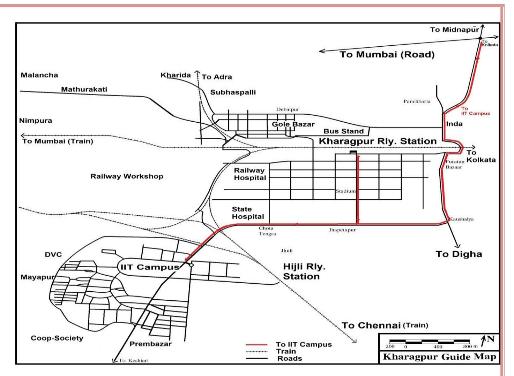
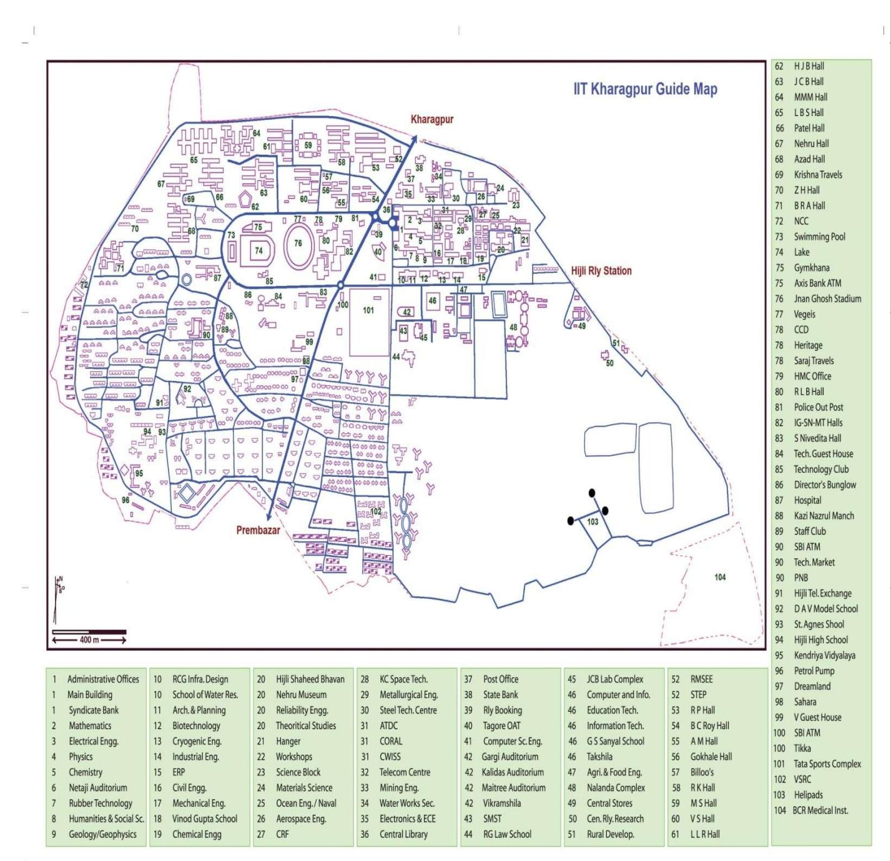
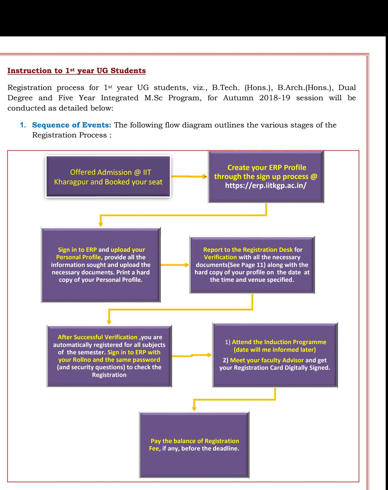
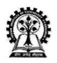
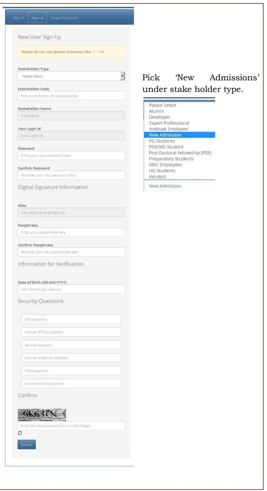
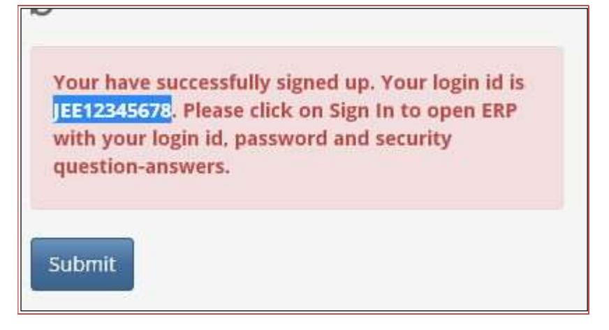
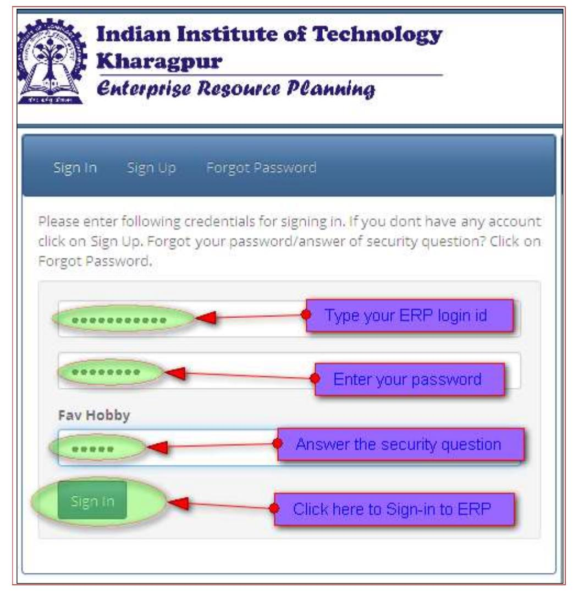

## Instruction to 1st year UG Students

### Dedicated to the service of the Nation

The Indian Institute of Technology Kharagpur (IIT Kharagpur) is a public engineering institution established by the government of India in 1951. It is the first of the IITs to be established, and is recognized as an Institute of National Importance by the Government of India.

### Motto

The motto of IIT Kharagpur is "Yoga Karmashu Kaushalam". This literally translates to "Excellence in action is Yoga", essentially implying that doing your work well is (true) yoga. This can be traced to Sri Krishna's discourse with Arjuna in the Bhagavad Gita. The quote, in the larger context of the Gita, urges man to acquire equanimity because a mind of equanimity allows a man to shed distracting thoughts of the effects of his deeds and concentrate on the task before him. Equanimity is the source of perfection in Karmic endeavors that leads to Salvation.

### Mission

The Institute aligns all its activities to serve national interest and seeks

- To provide broad-based education, helping students hone their professional skills and acquire the best-in-class capabilities in their respective disciplines
- To draw the best expertise in science, technology, management and law so as to equip students with the skills to visualize, synthesize and execute projects in these fields
- To imbibe a spirit of entrepreneurship and innovation in its students
- To undertake sponsored research and provide consultancy services in industrial education and socially relevant areas

### Vision

Our Vision is

- To be a centre of excellence in education and research, producing global leaders in science, technology and management
- To be a hub of knowledge creation that prioritises the frontier areas of national and global importance
- To improve the life of every citizen of the country

### Undergraduate and Postgraduate & doctoral education

IIT Kharagpur offers both undergraduate and postgraduate programmes. They include Bachelor of Technology (BTech. Hons), Bachelor of Architecture (BArch), Dual Degree, 5-year integrated Master of Science, 2-year Master of Science, Master of Technology (MTech), Master of City Planning (MCP), Master of Business Administration (MBA), Master of Human Resource Management (MHRM), Master in Medical Science and Technology (MMST), LL.B in Intellectual Property Law, LLM, Executive MBA and Postgraduate Diploma in Business Analytics. The institute also offers the MS and Doctor of Philosophy degree (PhD) as part of its doctoral education programme.

### How to reach IIT KGP

Kharagpur is known world over for two landmarks. One, the longest railway platform, and the other, the Indian Institute of Technology, more commonly known as IIT. Situated about 120 km west of Kolkata, Kharagpur is well connected to Kolkata by Road and Rail transport. Kharagpur can be reached in about 2 hours by train or 3 hours by car from Howrah railway station of Kolkata. Kharagpur is also connected by direct train services to most major cities of the country. The Institute is about 10 minutes drive (5 km) from the Kharagpur railway station. Private taxi, auto-rickshaw or cycle-rickshaw can be hired to reach the Institute.

### Health & Wellness

IIT Kharagpur keeps the health & wellness need of the campus community as its top priority, and constantly strives to improve and upgrade the existing facilities and the services. Extra Academic Activity (EAA) is an important component of UG curriculum at IIT Kharagpur with NSS, NCC, NSO under its fold.

### Counselling Centre

The holistic well being of our student community, encompassing both physical and mental health, is of the highest priority to the Institute. In pursuance of our commitment towards ensuring that, we have set up the Students' Counselling Centre, to provide any required assistance to students who may be experiencing emotional or psychological conditions that pose a hindrance to their regular activities on campus.

The Counselling Centre offers a broad range of services including psychological assessment, individual therapy, group therapy, and medication and management to promote mental health, life skills, emotional resilience and overall well being of the student community.

Full-time clinical psychologists and a visiting psychiatrist are available for consultation at the Centre. The Centre has also initiated an outreach programme to create a team of sensitized wing representatives from each Hall of Residence who can reach out to students in need.

The Centre addresses problems associated with stress, time management, motivational issues, relationship difficulties, impulse control issues, and learning difficulties. It also helps students experiencing significant depression, anxiety, mood swings, or other thought disorders.

Apart from individual sessions, the Centre plans to conduct group sessions to address life skills such as assertiveness, problem solving, anger management, self awareness, and interpersonal relationships.

The Counselling Centre also functions as a coordinating point for crisis intervention.

### Hospital

Indian Institute of Technology, Kharagpur is committed to provide quality healthcare services to its faculty, employees, and students using modern and cost effective techniques and technologies, and through a dedicated and humane approach. In accordance with the above policy, B C Roy Technology Hospital, owned and managed by Indian Institute of Technology, Kharagpur, provides Primary Health Care comprising of curative, preventive and health promotion services.

At present, B C Roy Technology Hospital is located centrally within the IIT Kharagpur campus. The facility has 32 beds, including a 2 Bedded ICU, Cabins and Isolation Ward. Through its Out Patient Department (OPD), Indoor Wards and Emergency Unit, B C Roy Technology Hospital provides 24x7 uninterrupted health care services to the campus community. On an average approximately 7000 patients attend the OPD at B C Roy Technology Hospital every month. The hospital has a round the clock pharmacy inside it. It is also equipped with a Video-conferencing facility for telemedicine.

Biomedical waste from B C Roy Technology Hospital is regularly and properly disposed of by an arrangement with the services of West Bengal State Government Environment Department

#### Inside Campus

Find the below Campus map. All the important locations like Students Hostels, Departments/Schools/Centres, Guest Houses, Student Activity Centers, Banks & ATMs, Restaurants & Food Centres etc. are indexed in the map.

# Contents

| No. | Content                                                                                                                                                                                                                           | Page No. |
|-----|-----------------------------------------------------------------------------------------------------------------------------------------------------------------------------------------------------------------------------------|----------|
| 1.  | Sequence of Events                                                                                                                                                                                                                | 7        |
| 2.  | On the Day of Reporting and Registration                                                                                                                                                                                          | 8-9      |
| 3.  | Academic or Subject Registration                                                                                                                                                                                                  | 10       |
| 4.  | Documents to be produced and submitted at the time of Reporting to IIT Kharagpur                                                                                                                                               | 11       |
| 5.  | Fee structure and fees to be paid by different category of students admitted through JEE Advanced                                                                                                                              | 12       |
| 6.  |  Tuition fee waiver for GE and OBC students  Family Income Documents to be submitted for Tuition fee waiver and for various income related benefits                                                                 | 13-16    |
| 7.  | Annexure - III (Undertaking to be signed by student and Guardian)                                                                                                                                                              | 17       |
| 8.  | Walk through of the online process from signup to final subject Registration                                                                                                                                                   | 18-28    |
| 9   | Scholarships                                                                                                                                                                                                                      | 29-38    |
| 10. |  Change of Branch (At the end of First Year)  Switch Over to Interdisciplinary Dual Degree  B.Tech.(Hons.) to Dual Degree Switch Over  Options for Dual Degree Specialization  Additional credits | 39       |
| 11  |  Micro-Credits  Minor in a Discipline  Micro – Specialization                                                                                                                                                   | 40       |

### Instruction to 1st year UG Students

Registration process for 1st year UG students, viz., B.Tech. (Hons.), B.Arch.(Hons.), Dual Degree and Five Year Integrated M.Sc Program, for Autumn 2018-19 session will be conducted as detailed below:

1. Sequence of Events: The following flow diagram outlines the various stages of the Registration Process :

Figure-1 Sequence of events for student Registration.

### 2. On the day of Reporting and Registration: 22nd July 2019 (tentative)

- i. All students who are to be admitted to Indian Institute of Technology Kharagpur must bring the original documents mentioned in Page 11 below and produce them at the respective desk during registration and academic verification.
- ii. It is desirable that the following process is completed by the student if possible, prior to reporting to the Institute on date of registration:

Updating Student Profile and uploading the necessary documents on ERP and taking a print out of the student profile. (See Annexure -IV for details)

- iii. Students should report to IIT Kharagpur one day before the Admission Date and occupy the rooms allotted to them in respective Halls of residence.
- iv. On the day of Admission, students should report to Netaji Auditorium and take their seats by 8:30 AM for welcome address and introduction lecture. Parents would be requested to take their seats at Bhatnagar Auditorium (Room No. F-116) & Raman Auditorium (Room No. F-142) during the period.
- v. On completion of the welcome address and introduction, students would be taken for registration.
- vi. Parents would thereafter move to Netaji Auditorium for interaction session with the Deans and Heads of Departments, Wardens and other officials.
- vii. Students who have a print out of the student profile shall be seated at Kalidas Auditorium. They will be directed thereafter to designated rooms for academic verification. They should present the signed student profile, photo copies of all other required documents

The students should retain the original of all the documents with them, in their possession, even after verification is complete should the academic section need to examine them again at a later date.

viii. Students who have not updated their profile, due to time constraints, shall proceed to Computer and Informatics Centre, to update their student profile and take print out.

They shall thereafter, return back to Kalidas Auditorium with a printed and signed copy of the student profile.

The said students will be directed to designated rooms for academic verification. They should present the signed student profile, photo copies of all other required documents

The students should retain the original of all the documents with them, in their possession, even after verification is complete should the academic section need to examine them again at a later date.

After verification by the Academic section is complete, the student's login to ERP will be with the assigned roll number as his/her login id with the same password.(See Online Registration Process on Page 19 for details)

ix. Upon successful verification, the student is automatically registered for all the subjects of the 1st semester. The student must then login to ERP with his/her assigned roll number and print a copy of the Registration Card.

The print out must be signed and handed over to his/her Faculty Advisor for digital authentication.

x. Fee structure of the new admission UG student is as mentioned in Table below. The balance of admission fee shall be payable on or after academic verification with respective timeline as mentioned in details in Page 12.

All the payment has to be done through SBIMOPS on line payment only.

Students/Parents should carefully read the fee payment instruction on the hyper linked page at erp.iitkgp.ac.in before proceeding to pay the balance of admission fee

They should log in to the ERP system using their roll no as id, use their original password and then proceed to pay on line. (See Online Registration Process on Page 19 for details)

xi. The student must abide by the timelines mentioned in below

|        | Event Time line                                                                                                                                                                                          |                                                                                                                                                                           |  |  |
|--------|----------------------------------------------------------------------------------------------------------------------------------------------------------------------------------------------------------|---------------------------------------------------------------------------------------------------------------------------------------------------------------------------|--|--|
| Sl No. | Event                                                                                                                                                                                                    | Date and Time                                                                                                                                                             |  |  |
| 1      | Reporting to Netaji Auditorium IIT Kharagpur for 1st year UG programs, B. Tech, B. Arch., Dual degree and 5 year Integrated M. Sc. through JEE for the welcome address and introductory lecture | 22nd July 2019, 8.30 AM (tentative)                                                                                                                        |  |  |
| 2      | Students move for updating student profile and obtaining printout/academic verification – buses will be available for moving from Netaji Auditorium to Vikramshila Complex.                     | After the welcome address and Introductory Lecture                                                                                                            |  |  |
| 3      | Induction programme for 1st year UG students (compulsory non-credit course)                                                                                                                           | 23rd July 2019 to 28th July 2019 (Tentatively)                                                                                                                         |  |  |
| 4      | Classes begin for 1st year UG programs, B. Tech, B. Arch., Dual degree and 5 year Integrated M. Sc. through JEE                                                                                    | 29th July 2019 (Tentatively)                                                                                                                                              |  |  |
| 5      | Last date for submission of hard copy of subject registration card to Faculty Advisors for 1st year UG programs, B. Tech, B.Arch., Dual degree and 5 year Integrated M. Sc. through JEE         | On or before 30th July 2019                                                                                                                                               |  |  |
| 6      | Payment of balance of admission fee after academic verification on 20th July 2019 (tentative)                                                                                                         | Fee payment link through ERP shall open from 18th July 2019 (tentative)                                                                                 |  |  |
|        |                                                                                                                                                                                                          | However the GE and OB students, who wish to avail of Tuition Fee Waiver, shall upload their family income document in ERP by 31st August 2019. |  |  |
|        |                                                                                                                                                                                                          | Last date for fee payment is 10th September 2019                                                                                                                       |  |  |

### 3. Academic or Subject Registration

- i. Upon successful verification of all documents, the student is automatically registered for all subjects of the 1st semester on ERP.
- ii. The student must print the Registration Card by logging into ERP with his assigned roll number.
- iii. Attendance in the Induction programme (compulsory non-credit course) is mandatory. The time table for Induction programme will be available on ERP.
- iv. The Class Time Table for the student is also being available on ERP.
- v. It is mandatory to print the Registration Card and submit it to the faculty advisor. Faculty advisors will digitally sign the Registration cards only after receiving the hard copy print out from the student.

For any other clarification call the appropriate Academic Section: Assistant Registrar (UG), Ph: 03222282054 Email: arug@adm.iitkgp.ac.in For any online application software related problem please call 03222 281017/18/19

The student can view his/her hall allocation from their profile generated through ERP. For any problem regarding hostel allotment students may send a mail to the Coordinating Warden, Allotment at sahney@vgsom.iitkgp.ac.in.

Students are strongly advised to open internet enabled bank account at any bank on campus. This would help them pay semester fees and other fees on line.

The banks would open counters at both the Halls of Residence on the day of reporting and at registration venue on the day of registration to facilitate the account opening. If the student is a minor, their parents are advised to bring original and copy of Voter ID/Adhaar Card/Passport/ Copy of front page of Bank Passbook with the latest transaction page/Copy of latest Municipal Tax Payment Certificate/Latest Electricity Bill as proof of Residence and proof of Identity so that they can open fully functional internet enabled account at the local as joint account holders with their wards

4. Documents to be produced and submitted at the time of Reporting to IIT Kharagpur

Registration process for 1st year UG students, viz., B.Tech. (Hons.), B.Arch.(Hons.), Dual Degree and Five Year Integrated M.Sc Program, for Autumn 2019-20 will be held on 23th July 2018 (tentative).

All 1st Year UG students who are to be admitted to Indian Institute of Technology, Kharagpur must bring the following documents, with photo copies, as mentioned below and produce them at the respective desk during registration and academic verification :

- 1. Print out of the final course allotment letter from JoSAA 2018
- 2. Original Admit Card of JEE (Advanced) 2018
- 3 Class X (High School) Board Certificate/Any other certificate as proof of dates of birth
- 4. Mark sheet and certificate of passing the qualifying examination
- 5. Copy of Category Certificate (OBC-NCL/SC/ST) and/or EWS certificate if applicable
- 6. Copy of Person with Disabilities (PwD) Certificate if applicable
- 7. Copy of Passport (for Foreign National) or OCI certificate or PIO card holder, if applicable
- 8. Copy of DS Certificate if applicable
- 9. Duly completed Undertaking Form (As in Annexure –III)

### 5. Fee structure and fees to be paid by different category of students admitted through JEE Advanced

| Description                 | Type of Fee                                | Amount in Rupees |
|-----------------------------|--------------------------------------------|------------------|
| Institute                   | Refundable                                 | 1000             |
| Library                     |                                            | 1000             |
| Hostel                      |                                            | 4000             |
| TOTAL of Refundable Fee     |                                            | 6000             |
| Alumni Subscription         |                                            | 2000             |
| Medical Examination         |                                            | 200              |
| Students' Welfare Fund      |                                            | 300              |
| Modernisation Fee           | One time Fee                               | 700              |
| Statutory Fee               |                                            | 1500             |
| Hostel Admission fee        |                                            | 1000             |
| TOTAL of Onetime Fee        |                                            | 5700             |
| Tuition Fee *               |                                            | 100000           |
| Registration                |                                            | 400              |
| Examination                 | Semester Fee                               | 500              |
| Student Amenities           |                                            | 800              |
| Internet Connectivity       |                                            | 600              |
| Gymkhana                    |                                            | 600              |
| Technology Film Society     |                                            | 100              |
| Medical Registration        |                                            | 200              |
| Laboratory                  |                                            | 800              |
| Hostel Seat Rent            |                                            | 750              |
| Electricity & Water Charges |                                            | 1000             |
| Total of Semester Fee       | 105750                                     |                  |
| Mess advance                | Hall Fee to be paid in each Semester | 12000            |
| Hall Establishment Charge   |                                            | 15125            |
| Hostel Overhead Charge      |                                            | 730              |
| Hall Budget                 |                                            | 1000             |
| Total of Hall Fees          |                                            | 28855            |
| STUDENTS' BROTHERHOOD FUND  | Once in a Year                             | 200              |
| INSURANCE PREMIUM           | Once in a Year                             | 2500             |
| GRAND TOTAL                 |                                            | 149005           |

\*Tuition Fee :

| a. Tuition Fee (UR/EWS/OB-NCL income limit >Rs. 5.0 Lakh p.a)                                      | : Rs. 100000.00 |
|----------------------------------------------------------------------------------------------------|-----------------|
| b. Tuition Fee (UR/EWS/OB-NCL income limit <= Rs. 5.0 Lakh p.a)                                    | : Rs. 33335.00  |
| c. Tuition Fee (UR/EWS/OB-NCL income limit <rs.1.0 lakh="" p.a.)<="" td=""><td>: NIL</td></rs.1.0> | : NIL           |
| d. Tuition Fee (SC/ST/PwD)                                                                         | : NIL           |

Tuition Fee Waivers for GE/OB categories as per above table will be applied after verification of Income Documents in support of Guardian's Annual Income. GE and OB students, who wish to apply for Tuition Fee Waiver, shall pay after 31st August 2019.

#### Last date for fee payment is 10th September 2019

It may however be noted that any excess fee payment shall be adjusted in subsequent semesters.

### Fees for Foreign Students:

- 1. Other than SAARC countries : Tuition Fee Rs. 6.0 lakh per annum + other charges as applicable
- 2. SAARC countries : Tuition fee Rs. 2.0 lakh per annum + other charges as applicable

NB: The fee structure shown here is tentative. Candidates are advised to contact and get confirmation at the time of admission.

### 6. Tuition fee waiver for GE and OBC students

As mentioned above interested students of GE/OBC category can avail the waiver of tuition fee by declaring the family annual income through ERP

The family income documents are required to be uploaded in ERP. After the verification, the applicable fee will reflect in the student's ERP login. Students can see the status of the verification of the submitted document through their ERP login.

For the admission year 2019-20 the important dates are as below:

| 1 | Last date for application through ERP and uploading of     | 31st August 2019    |
|---|------------------------------------------------------------|---------------------|
|   | document:                                                  |                     |
| 2 | Verification of family income document by Academic Section | 1st September 2019  |
|   | (UG)                                                       |                     |
| 3 | Last date of Fee payment                                   | 10th September 2019 |

To avail the same in the subsequent academic year's student must declare the annual family income of the respective financial year and up load the document in ERP. The last date of the declaration will be announced every academic year.

### 7. Family Income Documents to be submitted for Tuition fee waiver and for various income related benefits

The link for uploading family income document for the academic session 2019-20 will available in ERP login. All students who are interested to avail tuition fee waiver/ MCM and any other scholarship related to family income should upload their family income documents as per the mentioned guidelines in ERP for verification.

All students who would like to avail tuition fee waiver (except SC/ST/PD) must upload family income document of the Financial Year 2018-19. The deadline for uploading the family income documents is 31st August 2019.

Student must upload a family income document as per Annexure - I along with an affidavit as per Annexure – II.

The Issuing authority of Family Income Document must be a local District Authority like S.D.O./B.D.O./Tahasildar/Mondal Revenue Officer (MRO). All income documents should be issued for the Financial Year 2018-19.

### In all documents the Financial year 2018-19 should be clearly mentioned.

Alternatively, Form-16 / ITR / Annual Pension Certificate of Both Parents can also be uploaded as family income document with INCOME AFFIDAVIT as per Annexure –II .

The tuition fee will be recalculated based on verification of the income document uploaded through student's ERP login. If the fee is paid before the verification of the document, the excess fees will be adjusted for the subsequent semester.

In the event of not verifying the income document the student will be charged full tuition fee.

### Annexure – I

## FAMILY INCOME CERTIFICATE FOR FINANCIAL YEAR-2018-19

|    | This is to certify that Mr./Ms. (Father/Mother/Guardian) ……………….………………………… Father/Mother/ Guardian |                                                                                         |  |  |
|----|----------------------------------------------------------------------------------------------------|-----------------------------------------------------------------------------------------|--|--|
| of |                                                                                                    | (Student name and Roll No.) ……………………………………………… is a resident of Village / Town……………………… |  |  |
|    | ………………………………… P.O. ………………………….……………. P.S. ……………………………………. Mouja/Taluk…………………                       |                                                                                         |  |  |
|    | ………………………………………… District …………………….……………. his/her family annual income from all sources is         |                                                                                         |  |  |
|    | Rs. ……………………. (Rupees……………………………………………………….).                                                      |                                                                                         |  |  |

### Income from :

|    | Relation                | Profession | Amount         |
|----|-------------------------|------------|----------------|
| a) | Father's Income         | : …………………  | : Rs. …………………  |
| b) | Mother's Income         | : …………………  | : Rs. …………………  |
| c) | Guardian's Income       | : …………………  | : Rs. …………………  |
| e) | Other sources : ………………… |            | : Rs. …………………. |
|    |                         |            |                |

Gross Total Income = Rs.

### This Certificate is issued for the financial year 2018-19.

\_\_\_\_\_\_\_\_\_\_\_\_\_\_\_\_\_\_

Date :

………………………………….

Signature with Seal

The Income Certificate should be issued by the local District Authorities like S.D.O./B.D.O./Mondal Revenue Officer (M.R.O.)/TAHASILDER.

### Annexure - II

### FORMAT OF INCOME AFFIDAVIT

|     |                                                                               | (To be submitted on Non-Judicial Stamp paper of Rs.20/- and sworn in before a First Class Magistrate/Notary Public)                                                                                                                                                            |                                              |                |
|-----|-------------------------------------------------------------------------------|-----------------------------------------------------------------------------------------------------------------------------------------------------------------------------------------------------------------------------------------------------------------------------------|----------------------------------------------|----------------|
| I,  | Shri/Smt.                                                                     | _______________________________________________                                                                                                                                                                                                                                   | a                                            | resident of |
|     |                                                                               | ________________________________________________________ solemnly declare that :                                                                                                                                                                                                  |                                              |                |
| 1.  | My                                                                            | son/daughter Shri/Miss                                                                                                                                                                                                                                                         | ____________________________________________ | is             |
|     |                                                                               | currently studying at the Indian Institute of Technology, Kharagpur, in 4-year                                                                                                                                                                                                    |                                              |                |
|     |                                                                               | B.Tech.(Hons.) / 5-Year Dual Degree / 5-Year B.Arch.(H) / 5-Year M.Sc. Courses in the                                                                                                                                                                                             |                                              |                |
|     |                                                                               | Branch of _______________________________________ .                                                                                                                                                                                                                               |                                              |                |
| 2.  |                                                                               | He/She is an applicant for the award of Merit-cum-Means Scholarship / Free Studentship the Academic Year __________________________.                                                                                                                                           |                                              | for            |
| 3.  |                                                                               | I declare that my spouse is employed/not employed and that the Annual Income of my family in the Financial Year ___________________ i.e. during the period from 1st April, ___________ to 31st March, ________________ was as mentioned hereunder (Supported by document) : |                                              |                |
| (A) |                                                                               | From my own profession as indicated :                                                                                                                                                                                                                                             |                                              |                |
|     | i)                                                                            | Income from Business/Medical practice                                                                                                                                                                                                                                             |                                              |                |
|     |                                                                               | Legal Practice/Engineering Consultancy etc.                                                                                                                                                                                                                                       | Rs._________________ p.a.                    |                |
|     | ii)                                                                           | Income from Agriculture                                                                                                                                                                                                                                                           | Rs._________________ p.a.                    |                |
|     | iii)                                                                          | Income from Landed Properties                                                                                                                                                                                                                                                     | Rs._________________ p.a.                    |                |
|     | iv) Income from Investment in Bank/Post Office etc. Rs.______________ p.a. |                                                                                                                                                                                                                                                                                   |                                              |                |
|     | v)                                                                            | Income from Share Certificates/Debentures                                                                                                                                                                                                                                         | Rs._________________ p.a.                    |                |
|     | vi)                                                                           | Income from any other sources(i.e. Retirement Benefits for VRS/VSS etc., if any                                                                                                                                                                                                | Rs._________________ p.a.                    |                |
| (B) |                                                                               | Income of my wife/spouse's (if any)                                                                                                                                                                                                                                               | Rs._________________ p.a.                    |                |

 (if employed, Business/Pensioner then Salary / Income / Pension Certificate as applicable as per wife's / spouse's occupational status, to be enclosed with attested copies of Income Tax Documents, if applicable as stated in the Annexure – II "List of documents to be submitted'

(C) Income in the name of my son /ward (if any).

GROSS TOTAL INCOME (A+B+C) : Rs.\_\_\_\_\_\_\_\_\_\_\_\_\_\_\_\_ p.a.

: 2 :

Further I declare that the information given above is true. I understand that the Meritcum-Means Scholarship/Free Studentship/ if awarded to my son/daughter , is liable to be withheld or discontinued at the discretion of the authorities of the Indian Institute of Technology, Kharagpur, without assigning any reason. If subsequently (after award of MCM Scholarship to my ward) it is found that he/she has been granted any other Scholarship/Stipend /Financial Assistance etc. by any Govt./Non-govt. organisations for the same period, I shall bound to refund the whole amount of Scholarship/Free studentship/ Stipend/ Financial Assistance etc .to the scholarship awarding authority immediately. I shall also be personally held responsible for the refund of the Scholarship/ Free studentship amount (paid to my son/daughter by the Institute) in the event of any information in this declaration and also in the enclosed scholarship application form being proved incorrect later on.

> \_\_\_\_\_\_\_\_\_\_\_\_\_\_\_\_\_\_\_\_\_\_\_\_\_\_\_\_\_\_\_\_\_\_\_\_ (Signature of Father/Mother/Guardian)

Sworn before me this \_\_\_\_\_\_\_\_\_\_\_\_\_ day of \_\_\_\_\_\_\_\_\_ 201\_\_\_\_\_ and signed.

(SEAL)

\_\_\_\_\_\_\_\_\_\_\_\_\_\_\_\_\_\_\_\_\_\_\_\_\_\_\_\_\_\_\_\_\_\_\_\_\_\_\_\_\_\_\_\_\_\_ Signature of First Class Magistrate /Notary Public

Indian Institute of Technology Kharagpur

Undertaking from the Students

I, Mr./Ms....................................................................................................., Roll No.: .......................................

Programmme:......................................... Dept......................................................................... Student

of Indian Institute of Technology Kharagpur do hereby undertake on this day..................................

- 1.I shall abide by the admissible rules and regulations of IIT Kharagpur and follow the code of conduct for students. I acknowledge that the institute has the authority of taking disciplinary action on me for noncompliance of the same.
- 2.That I have read and understood the directives of the Hon'ble Supreme Court of India on anti ragging (available at http://www.iitkgp.ac.in/dosa/)
- 3.That I understand the meaning of Ragging and know that the ragging in any form is a punishable offence and the same is banned by the Court of Law. I understand that, in case I am involved in ragging , the case will be reported to the police and the Law will take its own course and I will be summarily expelled from the institute.
- 4.That I have not been found or charged for my involvement in any kind of ragging in the past. However, I undertake to face disciplinary action / legal proceeding including expulsion from the institute if the above statement is found to be untrue or the facts are concealed, at any stage in future.
- 5.That I shall not resort to ragging in any form at any place and shall abide by the rules/laws prescribed by the Courts, Government of India and the Institute authorities for the purpose from time to time.
- 6.I understand that as per rules and resolution of the Institute, I will not be permitted to possess or use any motorised vehicle inside the Institute campus, unless I am permitted to do so by a written authorisation from the Dean (Students' Affairs).
- 7.I also declare that I am not suffering from any serious/contagious ailment including psychology related symptoms.

Code of Conduct and Discipline:

- 1. Students shall conduct themselves within and outside the precincts of the Institute in a manner befitting the students of an institution of national importance.
- 2. Students shall show due respect to the teachers of the Institute, the Wardens of the Halls of Residence, the Sports Officers of the Gymkhana and the Officers of the National Cadet Corps; proper courtesy and consideration should be extended to the employees of the Institute and of the Halls of Residence. They shall also pay due attention and courtesy to visitors.
- 3. Students are required to develop a friendly relationship with fellow students. In particular, they are expected to show kindness and consideration to the new students admitted to the Institute every year. Law bans ragging in any form to anybody - acts of ragging will be considered as gross indiscipline and will be severely dealt with.
- 4. The following acts of omission and/or commission shall constitute gross violation of the code of conduct and are liable to invoke disciplinary measures:
  - Ragging.
  - Furnishing false statement of any kind in the form of application for admission or for award of scholarship etc.
  - Displaying lack of courtesy and decorum; resorting to indecent behaviour anywhere within or outside the campus.
  - Wilfully damaging or stealthily removing any property/belongings of the Institute, Hall or fellow students.
  - Possession, consumption or distribution of alcoholic drinks or any kind of hallucinogenic drugs.
  - Adoption of unfair means in the examinations.
  - Organizing or participating in any group activity in company with others in or outside the campus without prior permission of the Dean of Students' Affairs.
  - Mutilation or unauthorized possession of library books.
  - Resorting to noisy and unseemly behaviour, disturbing studies of fellow students.
  - Misuse of Internet/e-mail facilities or tempering/hacking with servers anywhere in the Halls of Residence/Departments etc.
  - Not intimating his/her absence to the Warden of the Hall before availing any leave.

### Signature of Student

I hereby fully endorse the undertaking made by my child / ward.

Signature of Mother / Father and or Guardian

Instructions to First Year UG Students, 2019-2020 17 |

Annexure – III

month ............................... year .................................., the following:

### Walk through of the online process from signup to final subject registration.

### A. Creating your ERP login Profile:

| <b>Indian Institute of Technology</b> Kharagpur ABOUT SSL CERTIFICATES <b>Enterprise Resource Planning</b>                 |                                                                                                                 |  |  |
|-------------------------------------------------------------------------------------------------------------------------------------|-----------------------------------------------------------------------------------------------------------------|--|--|
| Forgot Password Sign In Sign Up                                                                                               | <b>Important</b> <b>Quick Links</b> Message                                                               |  |  |
| Please enter following credentials for signing in. If you dont have any account click on Sign Up. Forgot your password/answer of | Parents/Guardians                                                                                               |  |  |
| security question? Click on Forgot Password.                                                                                        | Parents/guardians of UG students can look at the performance of their wards semester wise by using the link: |  |  |
| Stakeholder code/login id Click here to Sign up                                                                                  | https://erp.iitkgp.ernet.in/StudentPerformance/performanceview_guardian.jsp                                     |  |  |
|                                                                                                                                     | Parents/guardians need to fill in the roll no correctly and the                                                 |  |  |
| Password                                                                                                                            | date of birth of the student using the calendar that appears when they click on date of birth field.         |  |  |
| Sign In                                                                                                                             |                                                                                                                 |  |  |
|                                                                                                                                     | <b>Students</b>                                                                                                 |  |  |
|                                                                                                                                     | Important UG Subject Registration : Guideline   Manual                                                          |  |  |
|                                                                                                                                     | • Final Year Application for Degree, Provisional Certificate, Grade Card: UG   PGS&R                         |  |  |
|                                                                                                                                     | . New Admission Instruction for updating student profile                                                        |  |  |
|                                                                                                                                     | and registration <b>Payment</b> Instruction for semester fees payment                                        |  |  |
|                                                                                                                                     | · Click Here to Get First Year Timetable                                                                        |  |  |
|                                                                                                                                     | • Switch Over   Branch Change   QEDM   Minor                                                                    |  |  |

### B. The Sign up Screen appears:

C. Fill the simple form and Submit to create your IIT KGP ERP login id. Please remember the answers to the security Questions as they are needed for sign-in on ERP

| New User Sign Up                                                                                                                                             | Parents/Guardians                                                                                                                              |
|--------------------------------------------------------------------------------------------------------------------------------------------------------------|------------------------------------------------------------------------------------------------------------------------------------------------|
| Please do not use special character like ' / " \ %                                                                                                           | Parents/guardians of UG students can look at the performance of their wards semester wise by using the link:                                |
|                                                                                                                                                              | https://erp.iitkgp.ernet.in/StudentPerformance/performanceview_guardian.jsp Parents/guardians need to fill in the roll no correctly and the |
| <b>Stakeholder Type</b> ۷ New Admission                                                                                                                | date of birth of the student using the calendar that appears when they click on date of birth field.                                        |
|                                                                                                                                                              |                                                                                                                                                |
| <b>Entrance Exam</b> <b>Select New Admission</b>                                                                                                          | Students                                                                                                                                       |
| Preparatory © NEWPREP                                                                                                                                     | . Important UG Subject Registration : Guideline   Manual                                                                                       |
| Undergraduate                                                                                                                                                | . Final Year Application for Degree, Provisional Certificate,                                                                                  |
| DIAM @ PREP @ FX                                                                                                                                             | Grade Card: UG   PGS&R . New Admission Instruction for updating student profile                                                             |
| <b>Select the Entrance Exam</b> Postgraduate ¥                                                                                                         | and registration                                                                                                                               |
| $\odot$ GATE $\odot$ JMET $\odot$ DEF $\odot$ DIST $\odot$ MMST $\odot$ LLB $\circledcirc$ SPON $\circledcirc$ QIP $\circledcirc$ EMBA $\circledcirc$ FEX | . Payment Instruction for semester fees payment                                                                                                |
| Research                                                                                                                                                     | · Click Here to Get First Year Timetable                                                                                                       |
| $@$ MS $@$ PHD $@$ PDF                                                                                                                                       | · Switch Over   Branch Change   QEDM   Minor                                                                                                   |
| Your Reg/Appl No                                                                                                                                             |                                                                                                                                                |
| 12345678                                                                                                                                                     |                                                                                                                                                |
| Type your Advanced JEE Registration Number                                                                                                                   |                                                                                                                                                |
| <b>Stakeholder Name</b>                                                                                                                                      |                                                                                                                                                |
| TEST JEE CANDIDATE                                                                                                                                           |                                                                                                                                                |
| Your Login Id                                                                                                                                                |                                                                                                                                                |
| Your Name and Login Id appear here JEE12345678                                                                                                            |                                                                                                                                                |
|                                                                                                                                                              |                                                                                                                                                |
| Password <b>Choose a Password</b>                                                                                                                      |                                                                                                                                                |
|                                                                                                                                                              |                                                                                                                                                |
| <b>Confirm Password</b>                                                                                                                                      |                                                                                                                                                |
| <b>Confirm the Password</b>                                                                                                                               |                                                                                                                                                |
|                                                                                                                                                              |                                                                                                                                                |
| Digital Signature Information                                                                                                                                |                                                                                                                                                |
|                                                                                                                                                              |                                                                                                                                                |
| Alias                                                                                                                                                        |                                                                                                                                                |
| JEE12345678                                                                                                                                                  |                                                                                                                                                |
| Passphrase                                                                                                                                                   |                                                                                                                                                |
| You can retain the same passphrase or change it $\begin{array}{c} \bullet\bullet\bullet\bullet\bullet\bullet\bullet\bullet\bullet\end{array}$             |                                                                                                                                                |
|                                                                                                                                                              |                                                                                                                                                |
|                                                                                                                                                              |                                                                                                                                                |
|                                                                                                                                                              |                                                                                                                                                |
|                                                                                                                                                              |                                                                                                                                                |
|                                                                                                                                                              |                                                                                                                                                |
|                                                                                                                                                              |                                                                                                                                                |
|                                                                                                                                                              | Enter all the information sought below for verification                                                                                        |
| 01-01-1997                                                                                                                                                   |                                                                                                                                                |
|                                                                                                                                                              |                                                                                                                                                |
|                                                                                                                                                              |                                                                                                                                                |
|                                                                                                                                                              |                                                                                                                                                |
| Your Favorite IIT                                                                                                                                            |                                                                                                                                                |
|                                                                                                                                                              |                                                                                                                                                |
|                                                                                                                                                              |                                                                                                                                                |
| Your First School                                                                                                                                            |                                                                                                                                                |
|                                                                                                                                                              |                                                                                                                                                |
|                                                                                                                                                              |                                                                                                                                                |
|                                                                                                                                                              |                                                                                                                                                |
| Your Favorite teacher                                                                                                                                        |                                                                                                                                                |
| $\cdots$                                                                                                                                                     |                                                                                                                                                |
| Confirm Passphrase Information for Verification Date of birth (DD-MM-YYYY) Security Questions                                                       |                                                                                                                                                |
| Confirm                                                                                                                                                      |                                                                                                                                                |
|                                                                                                                                                              |                                                                                                                                                |
| <b>Enter the Captcha</b> 57920                                                                                                                            |                                                                                                                                                |
|                                                                                                                                                              |                                                                                                                                                |
| 5792P7 C                                                                                                                                                  |                                                                                                                                                |

### D. On successful submission a message containing your login id is displayed.:

### E. You are ready to sign-in into the system with the system generated login-id

### F. The ERP screen opens up, displaying the Academic Module.

| r. The ERF screen opens up, displaying the Academic Module. |        |                   |                              |                                 |              |          |
|-------------------------------------------------------------|--------|-------------------|------------------------------|---------------------------------|--------------|----------|
| ERP System, IITKGP                                          | N Home | Complaints        | <b>Q</b> Retrieve Passphrase | Welcome ANIRBAN PAL JEE12345678 | Switch Login | [→ Logou |
| Academic                                                    |        |                   |                              |                                 | Search Menu  |          |
| Notifications                                               |        |                   |                              |                                 |              |          |
| $\vee$ 0 unread mail(s)                                     |        |                   |                              | the opending job(s)             |              |          |
|                                                             |        |                   |                              |                                 |              |          |
| Messages and Alerts                                         |        |                   |                              |                                 |              |          |
|                                                             |        | Click on Academic |                              |                                 |              |          |

### G. Clicking on Academic Module opens the Admission and the Time Table Menus

| <b>Academic</b>                                           |                                                                     | Search Menu |
|-----------------------------------------------------------|---------------------------------------------------------------------|-------------|
| You are in: Academic Admission                         | Click here to update your profile and upload the required documents |             |
| Update and Print Student Profile (New Admission)          | $\theta$                                                            |             |
| <b>D</b> Time Table                                       |                                                                     |             |
| <b>Academic</b>                                           |                                                                     | Search Menu |
| You are in: Academic                                      |                                                                     |             |
| Admission                                                 | Click here to get the section-wise time-table                       |             |
| Time Table                                                |                                                                     |             |
| Central TimeTable 2016-2017 AUTUMN (Please allow pop-ups) |                                                                     |             |

### H. Click on Update Student Profile. The following form appears. It contains your Rollno, Hall of Residence and Section. Fill in all the details correctly and click update

| <b>Profile Update Section</b> Print Section (Scroll down for print button)                                      |                                                                                                                                                                                                                                                                                                                   |                                              |                                                                            |                                  |                                    |                                  |                                            |                                          |                                       |                       |                                             |                      |  |  |  |
|--------------------------------------------------------------------------------------------------------------------|-------------------------------------------------------------------------------------------------------------------------------------------------------------------------------------------------------------------------------------------------------------------------------------------------------------------|----------------------------------------------|----------------------------------------------------------------------------|----------------------------------|------------------------------------|----------------------------------|--------------------------------------------|------------------------------------------|---------------------------------------|-----------------------|---------------------------------------------|----------------------|--|--|--|
| Tentative Roll No: 15CS10028 TEST JEE CANDIDATE Name                                                      |                                                                                                                                                                                                                                                                                                                   |                                              |                                                                            |                                  |                                    |                                  |                                            | INDIAN INSTITUTE OF TECHNOLOGY KHARAGPUR |                                       |                       |                                             |                      |  |  |  |
| Department                                                                                                         | <b>NOA</b> CS                                                                                                                                                                                                                                                                                                  |                                              |                                                                            | JEE                              |                                    |                                  | <b>Basic Information:</b>                  |                                          |                                       |                       |                                             |                      |  |  |  |
| Hall                                                                                                               | LAL BAHADUR SHASTRI HALL                                                                                                                                                                                                                                                                                          | Section                                      |                                                                            | 4                                |                                    |                                  | Registration JEE12345678                   |                                          |                                       | Application           |                                             |                      |  |  |  |
| *Mobile No                                                                                                         | 9123456789                                                                                                                                                                                                                                                                                                        | ail ID All fields marked *                |                                                                            |                                  | testjee@testjee.com                |                                  | No                                         |                                          |                                       | No.                   | 12345678                                    |                      |  |  |  |
| *Blood Group(Eg: AB+ O-) AB+                                                                                       | are mandatory                                                                                                                                                                                                                                                                                                     |                                              |                                                                            |                                  | 01-01-1997                         |                                  |                                            |                                          |                                       | Name(as per last   | <b>TEST JEE</b>                             |                      |  |  |  |
| Old Rollno/Emp Code/Project Staff Code                                                                          | They must be                                                                                                                                                                                                                                                                                                      | entered. Please enter                        | oice for Institute EMail ID                                                |                                  | topper @iitkgp.ac.in            |                                  | Rollno                                     | 15CS10028                                |                                       | qualifying degree) | CANDIDATE                                   |                      |  |  |  |
| of IITKGP(if any)                                                                                                  |                                                                                                                                                                                                                                                                                                                   | correct information                          |                                                                            | $\mathbf G$                      | <b>Available</b>                   |                                  | Dept                                       | CS.                                      |                                       | DOB(DD-               | $01 - 01 -$                                 |                      |  |  |  |
| *10+2 Marks in %                                                                                                   | 98                                                                                                                                                                                                                                                                                                                |                                              | *Guardian's Name                                                           |                                  | ABCDEF                             |                                  |                                            |                                          |                                       | MM-YYYYY)             | 1997                                        |                      |  |  |  |
| *Parent's Annual Income                                                                                            | 100000                                                                                                                                                                                                                                                                                                            |                                              | *Guardian's Profession                                                     |                                  | TEACHING                           |                                  | Blood Group                             |                                          |                                       | Gender                | M                                           |                      |  |  |  |
| *Parent's Mobile No                                                                                                | 9987654321                                                                                                                                                                                                                                                                                                        |                                              |                                                                            |                                  |                                    |                                  | Are you a                                  |                                          |                                       |                       |                                             |                      |  |  |  |
|                                                                                                                    |                                                                                                                                                                                                                                                                                                                   |                                              | person with N disability                                                |                                  |                                    |                                  |                                            |                                          |                                       |                       |                                             |                      |  |  |  |
| *Guardian's Email Id                                                                                               | xyz@abc.com                                                                                                                                                                                                                                                                                                       |                                              | Type of                                                                    |                                  |                                    | Percentage 0          |                                            |                                          |                                       |                       |                                             |                      |  |  |  |
|                                                                                                                    | disability Category                                                                                                                                                                                                                                                                                            | <b>GE</b>                                    |                                                                            | Nationality INDIAN               |                                    |                                  |                                            |                                          |                                       |                       |                                             |                      |  |  |  |
| UPLOAD SOFT COPY OF MEDICAL FORM                                                                                   | Email                                                                                                                                                                                                                                                                                                             |                                              | testjee@testjee.com Mobile No                                              |                                  |                                    |                                  |                                            |                                          |                                       |                       |                                             |                      |  |  |  |
| *** Note: Please create one soft copy (PDF Document) for uploading all the medical forms                           |                                                                                                                                                                                                                                                                                                                   | Guardian Name                             |                                                                            |                                  | Hall                               | LBS                              |                                            |                                          |                                       |                       |                                             |                      |  |  |  |
| Medical Form                                                                                                       | Choose File medical odf                                                                                                                                                                                                                                                                                           |                                              | The hard copy also to be submitted at time of registration.                |                                  |                                    |                                  |                                            |                                          |                                       | old                   |                                             |                      |  |  |  |
|                                                                                                                    |                                                                                                                                                                                                                                                                                                                   |                                              |                                                                            |                                  |                                    |                                  | Section                                    |                                          |                                       | Rollno/Emp No.     |                                             |                      |  |  |  |
|                                                                                                                    | UPLOAD IMAGE OF PHOTO AND SCANNED SIGNATURE                                                                                                                                                                                                                                                                       |                                              |                                                                            |                                  |                                    |                                  | Medical                                    | Nö                                       |                                       |                       |                                             |                      |  |  |  |
|                                                                                                                    | *** Photo dimension: width x height in pixel (min allowed-130px x 150px, max allowed 175px x 200px) *** Signature dimension: width x height in pixel (min allowed- 100px X 50px, max allowed 300px X 150px). 95 % of the image area should contain the                                                         |                                              |                                                                            |                                  |                                    |                                  | Form                                       |                                          |                                       | Guardian's            |                                             |                      |  |  |  |
| scanned signature                                                                                                  |                                                                                                                                                                                                                                                                                                                   |                                              |                                                                            |                                  |                                    |                                  | 10+2 Marks                                 |                                          |                                       | Name                  |                                             |                      |  |  |  |
|                                                                                                                    | *** Please note that if photo and signature is already available then you can not update these                                                                                                                                                                                                                    |                                              |                                                                            |                                  |                                    |                                  | Parent's Annual                         |                                          |                                       | Guardian's            |                                             |                      |  |  |  |
| Photo                                                                                                              | Choose File No file chosen                                                                                                                                                                                                                                                                                        |                                              | Image of Signature                                                         |                                  | Choose File   No file chosen       |                                  | Income                                     |                                          |                                       | Profession            |                                             |                      |  |  |  |
| *Emergency Contact Information                                                                                     |                                                                                                                                                                                                                                                                                                                   |                                              |                                                                            |                                  |                                    |                                  | Guardian's Email Id                     |                                          |                                       | Hindi Name            |                                             |                      |  |  |  |
| Emer. Cont. No(Guardians)                                                                                          | 9987654321                                                                                                                                                                                                                                                                                                        |                                              | Emer. Cont. Person Name                                                    |                                  | ABCDEF                             |                                  |                                            |                                          | <b>Emergency Contact Information:</b> |                       |                                             |                      |  |  |  |
|                                                                                                                    | FLT NO 201, VIDYA                                                                                                                                                                                                                                                                                                 |                                              |                                                                            |                                  |                                    |                                  | Cont. No                                   |                                          |                                       | Name                  | Relationship                                |                      |  |  |  |
| Emer. Cont. Address                                                                                                | APTS                                                                                                                                                                                                                                                                                                              |                                              | Relationship with The Person                                               |                                  | <b>MOTHER</b>                      |                                  | Emer. Cont. Address                        |                                          |                                       |                       |                                             |                      |  |  |  |
|                                                                                                                    | WEST MAMBALAM                                                                                                                                                                                                                                                                                                     |                                              |                                                                            | Information in the print section |                                    |                                  | <b>Communication Address</b>               |                                          |                                       |                       | <b>Permanent Address</b>                    |                      |  |  |  |
|                                                                                                                    | *Address (Permanent Address Can not be updated twice/if available)                                                                                                                                                                                                                                                |                                              |                                                                            |                                  | is displayed only after updation.  |                                  | Addr                                       |                                          |                                       | Addr                  |                                             |                      |  |  |  |
| <b>Communication Address</b>                                                                                       |                                                                                                                                                                                                                                                                                                                   |                                              | Permanent Address (Same As Communication Address <)                        |                                  |                                    |                                  | Vill/City Police Station                |                                          |                                       | Vill/City             | Police Station                              |                      |  |  |  |
| Addr                                                                                                               | <b>FLT NO 201</b>                                                                                                                                                                                                                                                                                                 | Addr                                         |                                                                            | FLT NO 201                       |                                    |                                  | District                                   |                                          |                                       | District              |                                             |                      |  |  |  |
| Vill/City                                                                                                          | <b>VIDYA APTS</b>                                                                                                                                                                                                                                                                                                 | Vill/City                                    |                                                                            | <b>VIDYA APTS</b>                |                                    |                                  | State                                      |                                          |                                       | State                 |                                             |                      |  |  |  |
| Police Station                                                                                                     | WEST MAMBALAM                                                                                                                                                                                                                                                                                                     | Police Station                               |                                                                            | WEST MAMBALAM                    |                                    |                                  | Pin No                                     |                                          |                                       | Pin No                |                                             |                      |  |  |  |
| District                                                                                                           | T NAGAR                                                                                                                                                                                                                                                                                                           | District                                     | T NAGAR                                                                    |                                  |                                    |                                  |                                            |                                          |                                       |                       | Signature :                                 |                      |  |  |  |
| State                                                                                                              | TAMIL NADU                                                                                                                                                                                                                                                                                                        | State                                        |                                                                            | TAMIL NADU                       |                                    | Please fill these details. It is |                                            |                                          |                                       |                       |                                             | (TEST JEE CANDIDATE) |  |  |  |
| Pin No.                                                                                                            | 600020                                                                                                                                                                                                                                                                                                            | Pin No.                                      | 600020                                                                     |                                  |                                    | essential for allotting EAA      |                                            |                                          |                                       |                       | Date: Fri May 08 16:25:12 IST 2015          |                      |  |  |  |
|                                                                                                                    |                                                                                                                                                                                                                                                                                                                   |                                              | <b>EXTRA ACADEMIC ACTIVITY (EAA)</b>                                       |                                  |                                    |                                  |                                            |                                          |                                       |                       | <b>EXTRA ACADEMIC ACTIVITY (EAA)</b>        |                      |  |  |  |
|                                                                                                                    | The National Sports Organization (NSO) creates an atmosphere of sports consciousness and healthy physical build-up among the educated youth. It is                                                                                                                                                                |                                              |                                                                            |                                  |                                    |                                  |                                            |                                          | 15CS10028                             |                       | Name(as per last                            | TEST JEE             |  |  |  |
|                                                                                                                    | imperative for a student enrolled under N.S.O, to receive relevant training and represent the institute in sporting events. Students are admitted into the N.S.O by virtue of their aptitude and abilities in various events.                                                                                  |                                              |                                                                            |                                  |                                    |                                  | Rollno                                     |                                          |                                       |                       | qualifying degree)                          | CANDIDATE            |  |  |  |
|                                                                                                                    |                                                                                                                                                                                                                                                                                                                   |                                              |                                                                            |                                  |                                    |                                  | Mother tonque:                             |                                          |                                       | any:                  | Chronic disease, if                         |                      |  |  |  |
|                                                                                                                    | The National Cadet Corps (NCC) is a Tri-Services voluntary organisation comprising the Army, Navy and Air Force, engaged in grooming the youth ??? ??? The Leaders of Tomorrow??? ??? into disciplined and patriotic citizens. IIT Kharagpur has I Bengal EME Coy., Army Wing and Tech Air Force Wing.         |                                              |                                                                            |                                  |                                    |                                  |                                            |                                          | Read                                  |                       | : No Prior experience in                    |                      |  |  |  |
|                                                                                                                    | Presently, NCC has approximately 13 lakhs cadets under its fold in India. The Cadets are given basic military training in small arms and parades. The                                                                                                                                                             |                                              |                                                                            |                                  |                                    |                                  | <nowledge of<br="">Bengali :</nowledge>    |                                          | Write                                 | : No                  | social service (self or through family / | No                   |  |  |  |
|                                                                                                                    | cadets have no liability for active military service once they complete their course but are given preference over normal candidates during selections based on the achievements in the corps. The aims of N.C.C. are as per below:                                                                            |                                              |                                                                            |                                  |                                    |                                  |                                            |                                          | Understand: No Friends)               |                       |                                             |                      |  |  |  |
|                                                                                                                    | # To Develop Character, Comradeship, Discipline, Leadership, Secular Outlook, Spirit of Adventure, and Ideals of Selfless Service amongst the Youth of the                                                                                                                                                        |                                              |                                                                            |                                  |                                    |                                  | Height (in cm) Power of lens, if        |                                          |                                       |                       | Weight (in kg) :                            |                      |  |  |  |
| Country.                                                                                                           |                                                                                                                                                                                                                                                                                                                   |                                              |                                                                            |                                  |                                    |                                  | <b>ised</b>                                |                                          |                                       |                       | Impaired hearing:                           | No                   |  |  |  |
| Service of the Nation                                                                                              | # To Create a Human Resource of Organized, Trained and Motivated Youth, To Provide Leadership in all Walks of life and be Always Available for the                                                                                                                                                                |                                              |                                                                            |                                  |                                    |                                  | Impaired motion :                          |                                          | No.                                   |                       | Prior experience in drill / scout :      | No                   |  |  |  |
|                                                                                                                    | # To Provide a Suitable Environment to Motivate the Youth to Take Up a Career in the Armed Forces                                                                                                                                                                                                                 |                                              |                                                                            |                                  |                                    |                                  | Physical deformity                         |                                          |                                       |                       | Prior Experience in                         |                      |  |  |  |
|                                                                                                                    | The National Service Scheme (NSS) aims at creating social awareness among students and providing a sense of fulfilment through service to the needy                                                                                                                                                               |                                              |                                                                            |                                  |                                    |                                  | ike malformation of nand, toe, spine or |                                          | No.                                   |                       | NCC/Scouts and                              | No                   |  |  |  |
|                                                                                                                    | NSS, IIT Kharagpur has 15 units working in 15 underdeveloped regions within 5 K.M. radius of the campus. Besides development of character qualities like leadership, ability to work in a team, communication skill etc., the work gives an opportunity to interact with community leaders and also to ideate, |                                              |                                                                            |                                  |                                    |                                  | flat feet:                                 |                                          |                                       | guides:               |                                             |                      |  |  |  |
| innovate and implement.                                                                                            |                                                                                                                                                                                                                                                                                                                   |                                              |                                                                            |                                  |                                    |                                  | Interested in firing                       |                                          | No                                    |                       | Interested in Adventure Activities       | No                   |  |  |  |
| Mother tongue :                                                                                                    |                                                                                                                                                                                                                                                                                                                   | TAMIL                                        | Chronic disease, if any :                                                  |                                  |                                    | NONE                             | and arms training                          |                                          |                                       |                       |                                             |                      |  |  |  |
|                                                                                                                    |                                                                                                                                                                                                                                                                                                                   | Read $\blacksquare$                       |                                                                            |                                  |                                    |                                  |                                            |                                          | Level re                              |                       | Certificate U                               |                      |  |  |  |
| Knowledge of Bengali:                                                                                              |                                                                                                                                                                                                                                                                                                                   | Write $\mathcal{L} \subseteq \mathcal{L}$ | Prior experience in social service (self or through family / friends) : |                                  |                                    | √                                |                                            |                                          |                                       |                       |                                             |                      |  |  |  |
|                                                                                                                    |                                                                                                                                                                                                                                                                                                                   | Understand: V                                |                                                                            |                                  |                                    |                                  | Aptitude in Cultural activity 1         |                                          |                                       | activity 2            | Aptitude in Cultural                        |                      |  |  |  |
| Height (in cm) :                                                                                                   |                                                                                                                                                                                                                                                                                                                   | 168                                          | Weight (in kg) :                                                           |                                  |                                    | 60                               | Aptitude in Cultural                       |                                          |                                       |                       | Aptitude in Cultural                        |                      |  |  |  |
| Power of lens, if used :                                                                                           |                                                                                                                                                                                                                                                                                                                   |                                              | Impaired hearing:                                                          |                                  |                                    |                                  | activity 3                                 |                                          |                                       | activity 4 :          |                                             |                      |  |  |  |
| Impaired motion:                                                                                                   |                                                                                                                                                                                                                                                                                                                   |                                              | Prior experience in drill / scout :                                        |                                  |                                    | ✔                                |                                            |                                          |                                       |                       | Signature:                                  |                      |  |  |  |
|                                                                                                                    | Physical deformity like malformation of hand, toe, spine                                                                                                                                                                                                                                                          | J.                                           | Prior Experience in NCC/Scouts and guides :                                |                                  |                                    | ⊟                                |                                            |                                          |                                       |                       |                                             | (TEST JEE CANDIDATE) |  |  |  |
| or flat feet: Interested in firing and arms training :                                                          |                                                                                                                                                                                                                                                                                                                   |                                              | Interested in Adventure Activities ;                                       |                                  |                                    |                                  |                                            |                                          |                                       |                       | Date: Fri May 08 16:25:12 IST 2015          |                      |  |  |  |
|                                                                                                                    |                                                                                                                                                                                                                                                                                                                   |                                              |                                                                            |                                  |                                    |                                  | PRINT Profile                              |                                          |                                       |                       |                                             |                      |  |  |  |
| Aptitude in sport1 :-                                                                                              | BADMINTON V                                                                                                                                                                                                                                                                                                       |                                              | Aptitude in sport2 : ATHLETICS                                             |                                  | $\bullet$                          |                                  |                                            |                                          |                                       |                       |                                             |                      |  |  |  |
|                                                                                                                    | Level reached : SCHOOL V Level reached : SCHOOL <b>v</b>                                                                                                                                                                                                                                                 |                                              |                                                                            |                                  |                                    |                                  |                                            |                                          |                                       |                       |                                             |                      |  |  |  |
| Upload scanned copy No Choose File No file chosen Upload scanned copy Choose File No file chosen No |                                                                                                                                                                                                                                                                                                                   |                                              |                                                                            |                                  |                                    |                                  |                                            |                                          |                                       |                       |                                             |                      |  |  |  |
| $\pmb{\mathrm{v}}$ $\pmb{\mathrm{v}}$ Aptitude in sport3 : Select Aptitude in sport4 : Select       |                                                                                                                                                                                                                                                                                                                   |                                              |                                                                            |                                  |                                    |                                  |                                            |                                          |                                       |                       |                                             |                      |  |  |  |
| Level reached :                                                                                                    | $\pmb{\mathrm{v}}$ Select                                                                                                                                                                                                                                                                                      |                                              | Level reached :                                                            | $\pmb{\mathbf{v}}$ Select     |                                    |                                  |                                            |                                          |                                       |                       |                                             |                      |  |  |  |
|                                                                                                                    | Upload scanned copy   Choose File   No file chosen                                                                                                                                                                                                                                                                | l No                                         | Upload scanned copy   Choose File   No file chosen                         |                                  |                                    | No                               |                                            |                                          |                                       |                       |                                             |                      |  |  |  |
| Aptitude in Cultural activity 1 :                                                                                  |                                                                                                                                                                                                                                                                                                                   | SINGING $\pmb{\tau}$                      | Aptitude in Cultural activity 2 :                                          |                                  |                                    | DEBATE $\pmb{\mathsf{v}}$     |                                            |                                          |                                       |                       |                                             |                      |  |  |  |
| Aptitude in Cultural activity 3 :                                                                                  |                                                                                                                                                                                                                                                                                                                   | DANCE $\blacktriangledown$                | Aptitude in Cultural activity 4 :                                          |                                  |                                    | QUIZ $\pmb{\mathsf{v}}$       |                                            |                                          |                                       |                       |                                             |                      |  |  |  |
|                                                                                                                    | Please remember that you have to provide certificates/documents for the level reached against aptitude in sports provided.                                                                                                                                                                                        |                                              |                                                                            |                                  |                                    |                                  |                                            |                                          |                                       |                       |                                             |                      |  |  |  |
|                                                                                                                    |                                                                                                                                                                                                                                                                                                                   |                                              |                                                                            |                                  |                                    |                                  |                                            |                                          |                                       |                       |                                             |                      |  |  |  |
|                                                                                                                    |                                                                                                                                                                                                                                                                                                                   |                                              |                                                                            |                                  | <b>Click to Update the details</b> |                                  |                                            |                                          |                                       |                       |                                             |                      |  |  |  |
|                                                                                                                    |                                                                                                                                                                                                                                                                                                                   |                                              |                                                                            |                                  |                                    |                                  |                                            |                                          |                                       |                       |                                             |                      |  |  |  |

I. On successful updation a 'SUCCESSFULLY UPDATED' message appears on the screen and the print section displays the information you entered. Click on Print Profile to print your profile. You can also save it as a PDF file for your reference

|                                                                                                                                                                                                                                                                                                                   |                              |                            |                  |                      | <b>Profile Update Section</b>                                                                                              |                       |                                                 |                              |                                            |                                      |                                                     |                       | Print Section (Scroll down for print button)   |                      |
|-------------------------------------------------------------------------------------------------------------------------------------------------------------------------------------------------------------------------------------------------------------------------------------------------------------------|------------------------------|----------------------------|------------------|----------------------|----------------------------------------------------------------------------------------------------------------------------|-----------------------|-------------------------------------------------|------------------------------|--------------------------------------------|--------------------------------------|-----------------------------------------------------|-----------------------|------------------------------------------------|----------------------|
| Tentative Roll No:                                                                                                                                                                                                                                                                                                | 15CS10028                    |                            |                  | Name                 |                                                                                                                            |                       | TEST JEE CANDIDATE                              |                              |                                            |                                      |                                                     |                       | INDIAN INSTITUTE OF TECHNOLOGY KHARAGPUR       |                      |
| Department                                                                                                                                                                                                                                                                                                        | <b>CS</b>                    |                            |                  | <b>NOA</b>           |                                                                                                                            |                       | JEE                                             |                              | <b>Basic Information:</b>                  |                                      |                                                     |                       |                                                |                      |
| Hall                                                                                                                                                                                                                                                                                                              | LAL BAHADUR SHASTRI HALL     |                            |                  | Section              |                                                                                                                            |                       |                                                 |                              | Registration JEE12345678                   |                                      |                                                     | Application           |                                                |                      |
| Mobile No                                                                                                                                                                                                                                                                                                         | 9123456789                   |                            |                  | *Email ID            |                                                                                                                            |                       | testjee@testjee.com                             |                              | No.                                        |                                      |                                                     | No.                   | 12345678                                       |                      |
| *Blood Group(Eg: AB+ O-) AB+ Old Rollno/Emp                                                                                                                                                                                                                                                                    |                              |                            |                  | DOB                  |                                                                                                                            |                       | 01-01-1997                                      |                              | Rollno                                     | 15CS10028                            |                                                     | Name(as per last   | TEST JEE                                       |                      |
| Code/Project Staff Code                                                                                                                                                                                                                                                                                           |                              |                            |                  |                      | *Choice for Institute EMail ID                                                                                             |                       | topper @iitkgp.ac.in                         |                              |                                            |                                      |                                                     | qualifying degree) | CANDIDATE                                      |                      |
| of IITKGP(if any) *10+2 Marks in %                                                                                                                                                                                                                                                                             | 98                           |                            |                  |                      | *Guardian's Name                                                                                                           |                       | ABCDEF                                          |                              | Dept                                       | <b>CS</b>                            |                                                     | DOB(DD-               | 01-01-1997                                     |                      |
| *Parent's Annual Income                                                                                                                                                                                                                                                                                           | 100000                       |                            |                  |                      | *Guardian's Profession                                                                                                     |                       | <b>TEACHING</b>                                 |                              | Blood                                      |                                      |                                                     | MM-YYYYY)             |                                                |                      |
| Parent's Mobile No.                                                                                                                                                                                                                                                                                               | 9987654321                   |                            |                  |                      |                                                                                                                            |                       |                                                 |                              | Group                                      | $AB +$                               |                                                     | Gender                |                                                |                      |
|                                                                                                                                                                                                                                                                                                                   |                              |                            |                  |                      | Your Name in Hindi*                                                                                                        |                       |                                                 |                              | Are you a person with N                 |                                      |                                                     |                       |                                                |                      |
| * Guardian's Email Id                                                                                                                                                                                                                                                                                  | xyz@abc.com                  |                            |                  | (Please use)         | http://www.google.com/transliterate/                                                                                       |                       |                                                 |                              | disability                                 |                                      |                                                     |                       |                                                |                      |
|                                                                                                                                                                                                                                                                                                                   |                              |                            |                  |                      | for writing name in hindi transcript)                                                                                      |                       |                                                 |                              | Type of disability                      |                                      |                                                     | Percentage 0          |                                                |                      |
| UPLOAD SOFT COPY OF MEDICAL FORM                                                                                                                                                                                                                                                                                  |                              |                            |                  |                      |                                                                                                                            |                       |                                                 |                              | Category                                   | GE                                   |                                                     | Nationality INDIAN    |                                                |                      |
| *** Note: Please create one soft copy (PDF Document) for uploading all the medical forms                                                                                                                                                                                                                          |                              |                            |                  |                      |                                                                                                                            |                       |                                                 |                              | Email Guardian                          |                                      |                                                     |                       | testjee@testjee.com Mobile No 9123456789       |                      |
| Medical Form                                                                                                                                                                                                                                                                                                      | Choose File No file chosen   |                            |                  |                      | The hard copy also to be submitted at time of registration.                                                                |                       |                                                 |                              | Name                                       | ABCDEF                               |                                                     | Hall                  | LBS                                            |                      |
|                                                                                                                                                                                                                                                                                                                   |                              |                            |                  |                      |                                                                                                                            |                       |                                                 |                              | Section                                    |                                      |                                                     | Old Rollno/Emp     |                                                |                      |
| UPLOAD IMAGE OF PHOTO AND SCANNED SIGNATURE *** Photo dimension: width x height in pixel (min allowed-130px x 150px, max allowed 175px x 200px)                                                                                                                                                                |                              |                            |                  |                      |                                                                                                                            |                       |                                                 |                              |                                            |                                      |                                                     | No                    |                                                |                      |
| *** Signature dimension: width x height in pixel (min allowed- 100px X 50px, max allowed 300px X 150px). 95 % of the image area should contain the                                                                                                                                                                |                              |                            |                  |                      |                                                                                                                            |                       |                                                 |                              | Medical Form                            | Yes                                  |                                                     |                       |                                                |                      |
| scanned signature                                                                                                                                                                                                                                                                                                 |                              |                            |                  |                      |                                                                                                                            |                       |                                                 |                              | 10+2 Marks 98                              |                                      |                                                     | Guardian's Name    | ABCDEF                                         |                      |
| *** Please note that if photo and signature is already available then you can not update these Photo                                                                                                                                                                                                           | Choose File No file chosen   |                            |                  |                      | Image of Signature                                                                                                         |                       | Choose File No file chosen                      |                              | Parent's                                   |                                      |                                                     | Guardian's            |                                                |                      |
|                                                                                                                                                                                                                                                                                                                   |                              |                            |                  |                      |                                                                                                                            |                       |                                                 |                              | Annual Income                           | 100000                               |                                                     | Profession            | <b>TEACHING</b>                                |                      |
| *Emergency Contact Information                                                                                                                                                                                                                                                                                    |                              |                            |                  |                      |                                                                                                                            |                       |                                                 |                              | Guardian's                                 | xyz@abc.com                          |                                                     | Hindi Name टेसट       |                                                |                      |
| Emer. Cont. No(Guardians)                                                                                                                                                                                                                                                                                         |                              | 9987654321                 |                  |                      | Emer. Cont. Person Name                                                                                                    |                       | ABCDEF                                          |                              | Email Id                                   |                                      |                                                     |                       |                                                |                      |
| Emer. Cont. Address                                                                                                                                                                                                                                                                                               |                              | FLT NO 201, VIDYA APTS, |                  |                      | Relationship with The Person                                                                                               |                       | MOTHER                                          |                              | Cont. No                                   |                                      | <b>Emergency Contact Information:</b> 9987654321 |                       | Name ABCDEF Relationship MOTHER                |                      |
|                                                                                                                                                                                                                                                                                                                   |                              | WEST MAMBALAM              |                  |                      |                                                                                                                            |                       |                                                 |                              | Emer. Cont.                                |                                      |                                                     |                       | FLT NO 201, VIDYA APTS, WEST MAMBALAM T NAGAR  |                      |
| *Address (Permanent Address Can not be updated twice/if available)                                                                                                                                                                                                                                                |                              |                            |                  |                      |                                                                                                                            |                       |                                                 |                              | Address                                    |                                      | CHENNAI-600020                                      |                       |                                                |                      |
| <b>Communication Address</b>                                                                                                                                                                                                                                                                                      |                              |                            |                  |                      | Permanent Address (Same As Communication Address $\Box$ )                                                                  |                       |                                                 |                              | <b>Communication Address</b> Addr       |                                      | FLT NO 201                                          | Addr                  | <b>Permanent Address</b> FLT NO 201         |                      |
| Addr                                                                                                                                                                                                                                                                                                              | FLT NO 201                   |                            | Addr             |                      |                                                                                                                            | <b>FLT NO 201</b>     |                                                 |                              | Vill/City                                  |                                      | VIDYA APTS                                          | Vill/City             | VIDYA APTS                                     |                      |
| Vill/City                                                                                                                                                                                                                                                                                                         | <b>VIDYA APTS</b>            |                            | Vill/City        |                      |                                                                                                                            | VIDYA APTS            |                                                 |                              | Police Station                             | T NAGAR                              | <b>WEST MAMBALAM</b>                                | Police Station        |                                                | WEST MAMBALAM        |
| Police Station                                                                                                                                                                                                                                                                                                    | WEST MAMBALAM T NAGAR     |                            | Police Station   |                      |                                                                                                                            | WEST MAMBALAM         |                                                 |                              | District State                          |                                      | TAMIL NADU                                          | District State     | T NAGAR TAMIL NADU                          |                      |
| District                                                                                                                                                                                                                                                                                                          | TAMIL NADU                   |                            | District         |                      |                                                                                                                            | T NAGAR TAMIL NADU |                                                 |                              | Pin No                                     | 600020                               |                                                     | Pin No.               | 600020                                         |                      |
| State Pin No.                                                                                                                                                                                                                                                                                                  | 600020                       |                            | State Pin No. |                      | 600020                                                                                                                     |                       |                                                 |                              |                                            |                                      |                                                     |                       |                                                |                      |
|                                                                                                                                                                                                                                                                                                                   |                              |                            |                  |                      |                                                                                                                            |                       |                                                 |                              |                                            |                                      |                                                     |                       | Signature:                                     | (TEST JEE CANDIDATE) |
|                                                                                                                                                                                                                                                                                                                   |                              |                            |                  |                      | <b>EXTRA ACADEMIC ACTIVITY ( EAA )</b>                                                                                     |                       |                                                 |                              |                                            |                                      |                                                     |                       | Date : Fri May 08 16:40:54 IST 2015            |                      |
| The National Sports Organization (NSO) creates an atmosphere of sports consciousness and healthy physical build-up among the educated youth. It is imperative for a student enrolled under N.S.O, to receive relevant training and represent the institute in sporting events. Students are admitted into the  |                              |                            |                  |                      |                                                                                                                            |                       |                                                 |                              |                                            |                                      |                                                     |                       | <b>EXTRA ACADEMIC ACTIVITY (EAA)</b>           |                      |
| N.S.O by virtue of their aptitude and abilities in various events.                                                                                                                                                                                                                                                |                              |                            |                  |                      |                                                                                                                            |                       |                                                 |                              | Rollno                                     |                                      | 15CS10028                                           |                       | Name(as per last                               | <b>TEST JEE</b>      |
| The National Cadet Corps (NCC) is a Tri-Services voluntary organisation comprising the Army, Navy and Air Force, engaged in grooming the youth ??? ???                                                                                                                                                            |                              |                            |                  |                      |                                                                                                                            |                       |                                                 |                              |                                            |                                      | TAMIL                                               |                       | qualifying degree) Chronic disease, if      | CANDIDATE NONE    |
| The Leaders of Tomorrow??? ??? into disciplined and patriotic citizens. IIT Kharagpur has I Bengal EME Coy., Army Wing and Tech Air Force Wing. Presently, NCC has approximately 13 lakhs cadets under its fold in India. The Cadets are given basic military training in small arms and parades. The          |                              |                            |                  |                      |                                                                                                                            |                       |                                                 |                              | Mother tongue:                             |                                      |                                                     | anv:                  |                                                |                      |
| cadets have no liability for active military service once they complete their course but are given preference over normal candidates during selections based on the achievements in the corps. The aims of N.C.C. are as per below:                                                                            |                              |                            |                  |                      |                                                                                                                            |                       |                                                 |                              | Knowledge of Bengal                        |                                      | Read Write                                       | : No $:$ No        | Prior experience in social service (self or | Yes                  |
|                                                                                                                                                                                                                                                                                                                   |                              |                            |                  |                      |                                                                                                                            |                       |                                                 |                              |                                            |                                      | Understand : Yes friends)                           |                       | through family /                               |                      |
| # To Develop Character, Comradeship, Discipline, Leadership, Secular Outlook, Spirit of Adventure, and Ideals of Selfless Service amongst the Youth of the Country.                                                                                                                                            |                              |                            |                  |                      |                                                                                                                            |                       |                                                 |                              | Height (in cm) :                           |                                      | 168                                                 |                       | Weight (in kg):                                | 60                   |
| # To Create a Human Resource of Organized, Trained and Motivated Youth, To Provide Leadership in all Walks of life and be Always Available for the Service of the Nation.                                                                                                                                      |                              |                            |                  |                      |                                                                                                                            |                       |                                                 |                              | Power of lens, if used                     |                                      | $\mathsf{O}$                                        |                       | Impaired hearing:                              | No                   |
| # To Provide a Suitable Environment to Motivate the Youth to Take Up a Career in the Armed Forces                                                                                                                                                                                                                 |                              |                            |                  |                      |                                                                                                                            |                       |                                                 |                              |                                            | Impaired motion:                     | No.                                                 |                       | Prior experience in drill / scout           | Yes                  |
| The National Service Scheme (NSS) aims at creating social awareness among students and providing a sense of fulfilment through service to the needy.                                                                                                                                                              |                              |                            |                  |                      |                                                                                                                            |                       |                                                 |                              | Physical deformity                         |                                      |                                                     |                       | Prior Experience in                            |                      |
| NSS, IIT Kharagpur has 15 units working in 15 underdeveloped regions within 5 K.M. radius of the campus. Besides development of character qualities like leadership, ability to work in a team, communication skill etc., the work gives an opportunity to interact with community leaders and also to ideate, |                              |                            |                  |                      |                                                                                                                            |                       |                                                 |                              | ike malformation of hand, toe, spine or |                                      | No                                                  |                       | NCC/Scouts and                                 | No                   |
| innovate and implement.                                                                                                                                                                                                                                                                                           |                              |                            |                  |                      |                                                                                                                            |                       |                                                 |                              | flat feet:                                 |                                      |                                                     | guides :              |                                                |                      |
| Mother tongue:                                                                                                                                                                                                                                                                                                    |                              |                            | TAMIL            |                      | Chronic disease, if any :                                                                                                  |                       |                                                 | NONE                         | nterested in firing                        |                                      | No                                                  |                       | Interested in Adventure Activities          | No                   |
|                                                                                                                                                                                                                                                                                                                   |                              |                            | Read             | 中国                   | Prior experience in social service (self or through                                                                        |                       |                                                 |                              | and arms training                          |                                      |                                                     |                       |                                                |                      |
| Knowledge of Bengali:                                                                                                                                                                                                                                                                                             |                              |                            | Write            | $\Box$               | family / friends) :                                                                                                        |                       |                                                 | ✔                            | Aptitude in Sport                          |                                      |                                                     | Level reached         | Certificate Uploaded                           |                      |
|                                                                                                                                                                                                                                                                                                                   |                              |                            | Understand:      |                      |                                                                                                                            |                       |                                                 |                              |                                            | <b>BADMINTON</b> <b>ATHLETICS</b> |                                                     | SCHOOL SCHOOL      |                                                |                      |
| -leight (in cm) :                                                                                                                                                                                                                                                                                                 |                              |                            | 168              |                      | Weight (in kg) :                                                                                                           |                       |                                                 | 60                           |                                            |                                      |                                                     |                       |                                                |                      |
| Power of lens, if used : npaired motion                                                                                                                                                                                                                                                                        |                              |                            |                  |                      | Impaired hearing: Prior experience in drill / scout :                                                                   |                       |                                                 | V                            | Aptitude in Cultural ctivity 1          |                                      | <b>SINGING</b>                                      |                       | Aptitude in Cultural ctivity 2              | DEBATE               |
| Physical deformity like malformation of hand, toe, spine                                                                                                                                                                                                                                                          |                              |                            | W)               |                      |                                                                                                                            |                       |                                                 |                              | Aptitude in Cultural                       |                                      | DANCE                                               |                       | Aptitude in Cultural                           | QUIZ                 |
| or flat feet:                                                                                                                                                                                                                                                                                                     |                              |                            |                  |                      | Prior Experience in NCC/Scouts and guides :                                                                                |                       |                                                 | 8                            | activity 3 :                               |                                      |                                                     |                       | activity 4 :                                   |                      |
| Interested in firing and arms training :                                                                                                                                                                                                                                                                          |                              |                            |                  |                      | Interested in Adventure Activities                                                                                         |                       |                                                 |                              |                                            |                                      |                                                     |                       | Signature:                                     |                      |
| Aptitude in sport1 :                                                                                                                                                                                                                                                                                              | BADMINTON <b>v</b>           |                            |                  |                      | Aptitude in sport2 :                                                                                                       | ATHLETICS             | $\bullet$                                       |                              |                                            |                                      |                                                     |                       |                                                | (TEST JEE CANDIDATE) |
| Level reached :                                                                                                                                                                                                                                                                                                   | SCHOOL <b>v</b>              |                            |                  |                      | Level reached :                                                                                                            | SCHOOL <b>v</b>       |                                                 |                              |                                            |                                      |                                                     |                       | Date: Fri May 08 16:40:54 IST 2015             |                      |
| Upload scanned copy                                                                                                                                                                                                                                                                                               | Choose File No file chosen   |                            |                  | No.                  | Upload scanned copy   Choose File   No file chosen                                                                         |                       |                                                 | No                           | <b>PRINT Profile</b>                       |                                      |                                                     |                       |                                                |                      |
| Aptitude in sport3 :                                                                                                                                                                                                                                                                                              | Select $\pmb{\mathrm{v}}$ |                            |                  |                      | Aptitude in sport4 :                                                                                                       | Select                | $\pmb{\mathrm{v}}$                              |                              |                                            |                                      |                                                     |                       |                                                |                      |
| Level reached :                                                                                                                                                                                                                                                                                                   | $\pmb{\mathrm{v}}$ Select |                            |                  |                      | Level reached :                                                                                                            | Select                | $\pmb{\mathrm{v}}$                              |                              |                                            |                                      |                                                     |                       |                                                |                      |
| Upload scanned copy   Choose File   No file chosen                                                                                                                                                                                                                                                                |                              |                            | No.              |                      | Upload scanned copy   Choose File   No file chosen                                                                         |                       |                                                 | No                           |                                            |                                      | Click here to Print your Profile.                   |                       |                                                |                      |
| 4ptitude in Cultural activity 1:                                                                                                                                                                                                                                                                                  |                              |                            | SINGING          | $\blacktriangledown$ | Aptitude in Cultural activity 2 :                                                                                          |                       |                                                 | DEBATE $\pmb{\mathrm{v}}$ |                                            |                                      | Do not forget to sign before handing it over        |                       |                                                |                      |
| ptitude in Cultural activity 3 :                                                                                                                                                                                                                                                                                  |                              |                            | DANCE            | $\mathbf{v}$         | Aptitude in Cultural activity 4 :                                                                                          |                       |                                                 | QUIZ $\pmb{\mathrm{v}}$   |                                            |                                      | of the Registration Desk                            |                       |                                                |                      |
|                                                                                                                                                                                                                                                                                                                   |                              |                            |                  |                      | Please remember that you have to provide certificates/documents for the level reached against aptitude in sports provided. |                       |                                                 |                              |                                            |                                      |                                                     |                       |                                                |                      |
|                                                                                                                                                                                                                                                                                                                   |                              |                            |                  |                      | SUCCESSFULLY UPDATED.                                                                                                      |                       | <b>Successful Updation Message is displayed</b> |                              |                                            |                                      |                                                     |                       |                                                |                      |
|                                                                                                                                                                                                                                                                                                                   |                              |                            |                  | Update               |                                                                                                                            |                       |                                                 |                              |                                            |                                      |                                                     |                       |                                                |                      |
|                                                                                                                                                                                                                                                                                                                   |                              |                            |                  |                      |                                                                                                                            |                       |                                                 |                              |                                            |                                      |                                                     |                       |                                                |                      |
|                                                                                                                                                                                                                                                                                                                   |                              |                            |                  |                      |                                                                                                                            |                       |                                                 |                              |                                            |                                      |                                                     |                       |                                                |                      |

J. The Printed Profile appears as shown below. Ensure to sign the hard copy before you submit it to the Registration desk.

|                                         |                               | <b>INDIAN INSTITUTE OF TECHNOLOGY KHARAGPUR</b> |                                                                                                |
|-----------------------------------------|-------------------------------|-------------------------------------------------|------------------------------------------------------------------------------------------------|
| <b>Basic Information:</b>               |                               |                                                 |                                                                                                |
| <b>Registration No</b>                  | JFF12345678                   | <b>Application No</b>                           | 12345678                                                                                       |
| Rollno 15CS10028                     |                               | Name(as per last qualifying degree)          | <b>TEST JEE</b> CANDIDATE                                                                   |
| Dept                                    | <b>CS</b>                     | DOB(DD-MM-YYYY)                                 | $01 - 01 - 1997$                                                                               |
| <b>Blood Group</b>                      | AB+                           | Gender                                          | м                                                                                              |
| Are you a person with disability     | м                             |                                                 |                                                                                                |
| <b>Type of disability</b>               |                               | Percentage of disability                        | $^{\circ}$                                                                                     |
| Category                                | Π                            | Nationality                                     | <b>INDIAN</b>                                                                                  |
| Fmail                                   | testjee@testjee.com Mobile No |                                                 | 9123456789                                                                                     |
| <b>Guardian Name</b>                    | <b>ABCDEF</b>                 | Hall                                            | <b>IRS</b>                                                                                     |
| Section                                 | 4                             | Old Rollno/Emp No                               |                                                                                                |
| Medical Form                            | Yes                           |                                                 |                                                                                                |
| $10+2$ Marks                            | 98                            | <b>Guardian's Name</b>                          | <b>ARCDEE</b>                                                                                  |
| Parent's Annual Income 100000           |                               | <b>Guardian's Profession</b>                    | <b>TEACHING</b>                                                                                |
| <b>Guardian's Email Id</b>              | xyz@abc.com                   | Hindi Name                                      | टेसट                                                                                           |
| <b>Emergency Contact Information:</b>   |                               |                                                 |                                                                                                |
| Cont. No. <b>Emer, Cont. Address</b> | 9987654321                    | <b>Name</b> <b>ARCDEE</b>                    | Relationship <b>MOTHER</b> FLT NO 201, VIDYA APTS, WEST MAMBALAM T NAGAR, CHENNAI-600020 |
|                                         |                               |                                                 |                                                                                                |
| <b>Communication Address</b>            |                               | <b>Permanent Address</b>                        |                                                                                                |
| Addr                                    | <b>FLT NO 201</b>             | <b>Addr</b>                                     | <b>FLT NO 201</b>                                                                              |
| <b>Vill/City</b>                        | <b>VIDYA APTS</b>             | <b>Vill/City</b>                                | <b>VIDYA APTS</b>                                                                              |
| <b>Police Station</b> District       | <b>WEST MAMBALAM</b>          | <b>Police Station</b> District               | <b>WEST MAMBALAM</b>                                                                           |
|                                         | <b>T NAGAR</b>                |                                                 | <b>T NAGAR</b>                                                                                 |
| <b>State</b>                            | <b>TAMTI NADU</b>             | State                                           | <b>TAMIL NADU</b>                                                                              |
| Pin No.                                 | 600020                        | Pin No.                                         | 600020                                                                                         |
|                                         |                               |                                                 | Signature:                                                                                     |
|                                         |                               |                                                 | (TEST JEE CANDIDATE) Date: Fri May 08 16:40:54 IST 2015                                     |

### K. Viewing Your Time Table: Clicking on First Year Time Table enables you to view the class time table of your section.

| Name-TEST JEE CANDIDATE                                                                   |                                                                             |                                                              |  |                                                    |                                       |                                           |                 |                               |                                                                                                        |                                          |                 |                                          |
|-------------------------------------------------------------------------------------------|-----------------------------------------------------------------------------|--------------------------------------------------------------|--|----------------------------------------------------|---------------------------------------|-------------------------------------------|-----------------|-------------------------------|--------------------------------------------------------------------------------------------------------|------------------------------------------|-----------------|------------------------------------------|
| Tentative Rollno- 15CS10028 Tentative Section- 4 Tentative Hall- LAL BAHADUR SHASTRI HALL |                                                                             |                                                              |  |                                                    |                                       |                                           |                 |                               |                                                                                                        |                                          |                 |                                          |
| <b>Tentative Time Table</b>                                                               |                                                                             |                                                              |  |                                                    |                                       |                                           |                 |                               |                                                                                                        |                                          |                 |                                          |
| Day Name                                                                                  | 7:30:AM-8:25:AM                                                             | 8:30:AM-9:25:AM                                              |  | 9:30:AM-10:25:AM                                   | 10:30:AM-11:25:AM                     | 11:30:AM-12:25:PM                         | 1:30:PM-2:25:PM |                               | 2:30:PM-3:25:PM                                                                                        |                                          | 3:30:PM-4:25:PM | 4:30:PM-5:25:PM                          |
| Mon                                                                                       |                                                                             |                                                              |  | HS13001 <b>LANGUAGE LAB</b>                     |                                       |                                           |                 | HS13001 F116               | EE11001 F116                                                                                        |                                          |                 | CY11001 F116                          |
| Tue                                                                                       |                                                                             |                                                              |  |                                                    |                                       | <b>Subject Number</b>                     |                 |                               | EE11001 F116                                                                                        | HS13001 F116                          |                 |                                          |
| Wed                                                                                       |                                                                             |                                                              |  |                                                    | ME19001 <b>In Mechanical Dept.</b> | Room Number where the classs is conducted |                 |                               |                                                                                                        | CY11001 NC141, NC442, <b>NC441</b> |                 | MA10001 NC141, NC442, <b>NC441</b> |
| Thur                                                                                      |                                                                             |                                                              |  | CY19001 In Chemistry Dept.                      |                                       |                                           |                 |                               | MA10001 F116                                                                                        |                                          |                 | CY11001 F116                          |
| Fri                                                                                       |                                                                             |                                                              |  |                                                    | EE19001 EE LAB                     |                                           |                 |                               | MA10001 F116                                                                                        |                                          |                 | CY11001 F116                          |
|                                                                                           |                                                                             |                                                              |  |                                                    |                                       | <b>Subject Details</b>                    |                 |                               |                                                                                                        |                                          |                 |                                          |
|                                                                                           | F- rooms are in the Main Building NC.NR-rooms are in the Nalanda Complex |                                                              |  | Subno                                              | Subject Name                          |                                           |                 | Crd                           |                                                                                                        |                                          |                 |                                          |
| Vikramshila Complex)                                                                      |                                                                             | LANGUAGE LAB--Located in Sir JC Bose Laboratory Complex(near |  | INTRODUCTION TO MANUFACTURING PROCESSES ME19001 |                                       |                                           |                 | $0 - 0 - 3$ $\overline{2}$ | Three rooms are assigned for Tutorial classes The class is divided into three groups and each group |                                          |                 |                                          |
|                                                                                           |                                                                             |                                                              |  | HS13001 ENGLISH FOR COMMUNICATION               |                                       |                                           | $3 - 0 - 2$     | $\overline{4}$                | has its tutorial in a separate room.                                                                   |                                          |                 |                                          |
|                                                                                           |                                                                             |                                                              |  | CY19001                                            | CHEMISTRY LAB.                        |                                           | $0 - 0 - 3$     | $\overline{2}$                |                                                                                                        |                                          |                 |                                          |
|                                                                                           |                                                                             |                                                              |  | MA10001                                            | MATHEMATICS-I                         |                                           |                 | $3 - 1 - 0$ $\overline{4}$ |                                                                                                        |                                          |                 |                                          |
|                                                                                           |                                                                             |                                                              |  | EA10001                                            | EXTRA ACADEMIC ACTIVITY-I             |                                           |                 | $0 - 0 - 3$ $\Box$         |                                                                                                        |                                          |                 |                                          |
|                                                                                           |                                                                             |                                                              |  | EE19001                                            | ELECTRICAL TECHNOLOGY LAB.            |                                           |                 | $0 - 0 - 3$ $\overline{2}$ |                                                                                                        |                                          |                 |                                          |
|                                                                                           |                                                                             |                                                              |  | CY11001                                            | CHEMISTRY                             |                                           |                 | $3 - 1 - 0$ $\overline{4}$ |                                                                                                        |                                          |                 |                                          |
|                                                                                           |                                                                             |                                                              |  | EE11001                                            | ELECTRICAL TECHNOLOGY                 |                                           |                 | $3 - 1 - 0$ $-4$           |                                                                                                        |                                          |                 |                                          |
|                                                                                           | GetReport                                                                   |                                                              |  |                                                    |                                       |                                           |                 |                               |                                                                                                        |                                          |                 |                                          |

L. Upon Successful Verification of all your documents, you can sign-in to ERP through your rollno with the same password and security questions as earlier. The screen after successful login appears as follows:

| <b>ERP System, IITKGP</b> <b>谷 Home</b>                                 | Complaints | Q. Retrieve Passphrase | Welcome Aditya Pahuja (15AE10001)                         | Switch Login | <b>E</b> Logout |
|----------------------------------------------------------------------------|------------|------------------------|-----------------------------------------------------------|--------------|-----------------|
| <b>Academic</b> CDC                                                     |            |                        |                                                           | Search Menu  |                 |
| You are in: Academic                                                       |            |                        |                                                           |              |                 |
| Award and Prize (UG)                                                       |            |                        |                                                           |              |                 |
| El Examination TimeTable                                                   |            |                        |                                                           |              |                 |
| Feedback                                                                   |            |                        |                                                           |              |                 |
| <b>口 Fees</b>                                                              |            |                        |                                                           |              |                 |
| Final Graduation Processing                                                |            |                        |                                                           |              |                 |
| <b>B</b> Results Review(UG)                                                |            |                        | These are the main menus. Click on the '+' sign to expand |              |                 |
| G Scholarship (MCM)                                                        |            |                        |                                                           |              |                 |
| <b>B</b> Students                                                          |            |                        |                                                           |              |                 |
| <b>B</b> Subjects                                                          |            |                        |                                                           |              |                 |
| <b>D</b> Time Table                                                        |            |                        |                                                           |              |                 |
| <b>O</b> UG                                                                |            |                        |                                                           |              |                 |
|                                                                            |            |                        |                                                           |              |                 |
| Copyright © ERP System, IIT Kharagpur. Helpline - 032222-81019/81018/81017 |            |                        |                                                           |              |                 |

### M. Click on Students to go to Your Academic Information to view/print your Registration card, Curricula details, Fee payment details, Profile, etc.:

| You are in: Academic                                 |                                                                                                            |                                                                                          |                           |           |  |  |
|------------------------------------------------------|------------------------------------------------------------------------------------------------------------|------------------------------------------------------------------------------------------|---------------------------|-----------|--|--|
| Award and Prize (UG)                                 |                                                                                                            |                                                                                          |                           |           |  |  |
| <b>El</b> Examination TimeTable                      |                                                                                                            |                                                                                          |                           |           |  |  |
| <b>El</b> Feedback                                   |                                                                                                            |                                                                                          |                           |           |  |  |
| <b>口 Fees</b>                                        |                                                                                                            |                                                                                          |                           |           |  |  |
| <b>El Final Graduation Processing</b>                |                                                                                                            |                                                                                          |                           |           |  |  |
| <b>E</b> Results Review(UG)                          | Click here to view /print your Registration card, Curricula details, Fee payment details, Profile, etc. |                                                                                          |                           |           |  |  |
| G Scholarship (MCM)                                  |                                                                                                            |                                                                                          |                           |           |  |  |
| Students                                             |                                                                                                            |                                                                                          |                           |           |  |  |
| Application for Financial Assistance for Conferences | $\bullet$                                                                                                  | Application for permission to attend CONFERENCES/WORKSHOPS/SEMINARS without financial | Micro-Credit Registration | $\bullet$ |  |  |
|                                                      |                                                                                                            | assitance from Institute                                                                 | Your Academic Information | $\bullet$ |  |  |
| <b>B</b> Subjects                                    |                                                                                                            |                                                                                          |                           |           |  |  |
| Time Table                                           |                                                                                                            |                                                                                          |                           |           |  |  |
| <b>Q</b> UG                                          |                                                                                                            |                                                                                          |                           |           |  |  |

### N. Click on Time-table to go to My Time Table(Student) to view your time table

| <b>Academic</b> CDC                                   |                                   |                                        | Search Menu |  |  |  |
|----------------------------------------------------------|-----------------------------------|----------------------------------------|-------------|--|--|--|
| You are in: Academic                                     |                                   |                                        |             |  |  |  |
| Award and Prize (UG)                                     |                                   |                                        |             |  |  |  |
| El Examination TimeTable                                 |                                   |                                        |             |  |  |  |
| <b>El</b> Feedback                                       |                                   |                                        |             |  |  |  |
| <b>目 Fees</b>                                            |                                   |                                        |             |  |  |  |
| <b>D</b> Final Graduation Processing                     |                                   |                                        |             |  |  |  |
| Results Review(UG)                                       |                                   |                                        |             |  |  |  |
| Click here to view your time table. Scholarship (MCM) |                                   |                                        |             |  |  |  |
| <b>El</b> Students                                       |                                   |                                        |             |  |  |  |
| <b>El</b> Subjects                                       |                                   |                                        |             |  |  |  |
| Time Table                                               |                                   |                                        |             |  |  |  |
| My Time Table(Student) $\bullet$                      | Subject List With TimeTable Slots | $\bullet$ Summer Quarter Time Table | $\bullet$   |  |  |  |
| TimeTable(DepartmentWise) $\bullet$                   |                                   |                                        |             |  |  |  |
| <b>O</b> UG                                              |                                   |                                        |             |  |  |  |

### O. Click on My Time Table to view Time Table

| Your TimeTable for AUTUMN 2015-2016 |                 |                                             |                                       |                                              |                   |                 |                        |                        |                                             |
|-------------------------------------|-----------------|---------------------------------------------|---------------------------------------|----------------------------------------------|-------------------|-----------------|------------------------|------------------------|---------------------------------------------|
| Day Name                            | 7:30:AM-8:25:AM | 8:30:AM-9:25:AM                             | 9:30:AM-10:25:AM                      | 10:30:AM-11:25:AM                            | 11:30:AM-12:25:PM | 1:30:PM-2:25:PM | 2:30:PM-3:25:PM        | 3:30:PM-4:25:PM        | 4:30:PM-5:25:PM                             |
| Mon                                 |                 |                                             |                                       | CY19001 In Chemistry Dept.                |                   |                 | EE11001 F142        |                        | CY11001 F142                             |
| Tue                                 |                 | MA10001(T) NC344, NR124, <b>NC343</b> |                                       |                                              |                   |                 | EE11001 F142        |                        | HS13001 F142                             |
| Wed                                 |                 |                                             |                                       | EE19001 <b>EE LAB, F244</b>               |                   |                 |                        |                        | CY11001(T) NC341, NR123, <b>NC342</b> |
| Thur                                |                 |                                             | <b>HS13001</b> <b>LANGUAGE LAB</b> |                                              |                   |                 | <b>MA10002</b> F142 |                        | CY11001 F142                             |
| Fri                                 |                 |                                             |                                       | <b>ME19001</b> <b>In Mechanical Dept.</b> |                   |                 | MA10002 <b>E142</b> | <b>HS13001</b> F142 | CY11001 F142                             |
|                                     |                 |                                             |                                       |                                              |                   |                 |                        |                        |                                             |
|                                     |                 |                                             |                                       |                                              |                   |                 |                        |                        |                                             |
|                                     |                 |                                             |                                       |                                              |                   |                 |                        |                        |                                             |
|                                     |                 |                                             |                                       |                                              |                   |                 |                        |                        |                                             |
|                                     |                 |                                             |                                       |                                              |                   |                 |                        |                        |                                             |

P. Click on View to display your Subject Registration Card and Print it. Sign the Registration Card and Submit the same to your faculty Advisor who will then digitally sign your Registration card on ERP.

|                       |                                                                |                |                                             |                 |                | <b>PRINT</b>                                                                                                                                                                                                                                                                                                                                                                     |  |
|-----------------------|----------------------------------------------------------------|----------------|---------------------------------------------|-----------------|----------------|----------------------------------------------------------------------------------------------------------------------------------------------------------------------------------------------------------------------------------------------------------------------------------------------------------------------------------------------------------------------------------|--|
|                       | <b>INDIAN INSTITUTE OF TECHNOLOGY KHARAGPUR</b>                |                |                                             |                 |                |                                                                                                                                                                                                                                                                                                                                                                                  |  |
|                       |                                                                |                |                                             |                 |                | <b>Provisional Registration Card</b>                                                                                                                                                                                                                                                                                                                                             |  |
|                       |                                                                |                |                                             |                 |                | * NOTE: STRIKE THROUGH indicates de-registered                                                                                                                                                                                                                                                                                                                                   |  |
|                       |                                                                |                |                                             |                 |                | Semester: 1(2015-2016-AUTUMN) Date of Registration: 14-JUL-2015                                                                                                                                                                                                                                                                                                               |  |
|                       |                                                                |                |                                             |                 |                |                                                                                                                                                                                                                                                                                                                                                                                  |  |
| Rollno <b>Name</b> | 15CS10028                                                      |                | Course/Specialisation TEST JEE CANDIDATE |                 |                | COMPUTER SCIENCE AND ENGG (B.Tech 4Y)                                                                                                                                                                                                                                                                                                                                            |  |
|                       |                                                                |                |                                             |                 |                |                                                                                                                                                                                                                                                                                                                                                                                  |  |
|                       |                                                                |                |                                             |                 |                |                                                                                                                                                                                                                                                                                                                                                                                  |  |
|                       |                                                                |                |                                             |                 |                | Details of the subjects for which the student has registered                                                                                                                                                                                                                                                                                                                     |  |
| <b>Subno</b>          | <b>Subject Name</b>                                            | <b>Subject</b> | <b>Subject</b>                              |                 |                | <b>Taken LTP Crd Faculty</b>                                                                                                                                                                                                                                                                                                                                                     |  |
|                       |                                                                | Type           | As                                          |                 |                |                                                                                                                                                                                                                                                                                                                                                                                  |  |
|                       | MA10001 MATHEMATICS-I                                          | <b>Depth</b>   | Normal $\frac{3}{1-0}$                      |                 |                | DEBAPRIYA BISWAS , VINAY KUMAR JAIN , ASISH GANGULY , RUPANWITA GAYEN , G P RAJA SEKHAR, T RAJA SEKHAR, KOELI GHOSHAL, GNANESHWAR NELAKANTI, RAMAKRISHNA <b>NANDURI</b>                                                                                                                                                                                                    |  |
| HS13001               | <b>ENGLISH FOR</b> COMMUNICATION                            | Depth          | Normal $\frac{3}{2}$                        |                 |                | ANJALI ROY, PRIYADARSHI PATNAIK, SEEMA SINGH                                                                                                                                                                                                                                                                                                                                     |  |
| ME19001               | <b>INTRODUCTION</b> TO <b>MANUFACTURING</b> PROCESSES | Depth          | Normal                                      | $^{0-}_{0-3}$ 2 |                | PARTHA SAHA , ASIMAVA ROY CHOWDHURY , VIKRANTH RACHERLA , AJAY MULJIBHAI SIDPARA , JINU PAUL , SUSHANTA KUMAR PANDA , SURJYA KANTA PAL                                                                                                                                                                                                                                        |  |
|                       | CY19001 CHEMISTRY LAB. Depth                                   |                | Normal                                      | $0 - 3$         | $\overline{2}$ | AMITA (PATHAK) MAHANTY , SANJIB KUMAR PATRA , RAJARSHI SAMANTA , GANESAN MANI , KUMAR BIRADHA , AMIT BASAK , SUNEEL KUMAR SRIVASTAVA , NILMONI SARKAR , MANISH BHATTACHARJEE, TARASANKAR PAL, SANJOY BANDYOPADHYAY, MADHAB CHANDRA DAS, DIPAKRANJAN MAL, AHINDRA NAG, MINTU HALDER, RAJAKUMAR ANANTHAKRISHNAN, MODHU SUDAN MAJI , JAYANTA KUMAR RAY , ANOOP AYYAPPAN |  |
|                       | ELECTRICAL EE19001 TECHNOLOGY LAB.                       | Depth          | Normal                                      | $0 - 3$         |                | MURALI MOHAN BOSUKONDA , ANIRBAN MUKHERJEE , SRINIVASU MAKA , SABYASACHI SENGUPTA, SARIT KUMAR DAS, JAYANTA PAL, N K KISHORE, PRABODH BAJPAI, AUROBINDA ROUTRAY, GOSHAIDAS RAY, ALOK KANTI DEB, CHANDAN CHAKRABORTY, ARUN GHOSH                                                                                                                                            |  |
| EE11001               | ELECTRICAL <b>TECHNOLOGY</b>                                | Depth          | Normal.                                     |                 |                | ALOK KANTI DEB , ANIRBAN MUKHERJEE , CHANDAN CHAKRABORTY , SABYASACHI SENGUPTA , JAYANTA PAL, N K KISHORE, PRABODH BAJPAI                                                                                                                                                                                                                                                     |  |
|                       |                                                                | Depth          | Normal                                      |                 |                | SANJIB KUMAR PATRA , C RETNA RAJ , JAYANTA KUMAR RAY , ANOOP AYYAPPAN , DIBAKAR DHARA , SABYASHACHI MISHRA , DIPAKRANJAN MAL , GANESAN MANI , KUMAR BIRADHA                                                                                                                                                                                                                   |  |
| CY11001 CHEMISTRY     |                                                                |                |                                             |                 |                |                                                                                                                                                                                                                                                                                                                                                                                  |  |
|                       | EA10002 EXTRA ACADEMIC                                         | Depth          | Normal                                      | $0 - 3 = 0$     |                |                                                                                                                                                                                                                                                                                                                                                                                  |  |

### 8. Scholarships

| Merit Cum Means     | Students whose parental income is not more than Rs. 6                                                                                                                                                                                                          |
|---------------------|----------------------------------------------------------------------------------------------------------------------------------------------------------------------------------------------------------------------------------------------------------------|
| Scholarship         | lakhs /-per annum are eligible for Merit cum means scholarship. The scholarship includes exemption from payment of Institute tuition fee and 1000 Rs per month for 12 month.                                                                          |
| SC/ST Assistantship | SC/ST students whose parental income is not more than Rs. 50,920/-per annum (as per the guidelines issued by the Government of India) are entitled to get free seat in the hostel, free basic menu and Rs. 250/- per month as pocket allowance. |

### Endowment Scholarship

| 1 | B.P. PODDAR SCHOLARSHIP                                                   | One scholarship of Rs.1,000.00 per month (payable for 10 months in a session) is awarded to the best student of the final year class of B.Tech.(Hons.)/ Dual Degree/ B.Arch.(Hons.) courses taken together securing the highest CGPA at the end of the VI or VIII semester, as the                                                                                                                                                                                                                                                              |
|---|------------------------------------------------------------------------------|----------------------------------------------------------------------------------------------------------------------------------------------------------------------------------------------------------------------------------------------------------------------------------------------------------------------------------------------------------------------------------------------------------------------------------------------------------------------------------------------------------------------------------------------------------------------------|
| 2 | TECHNOLOGY ALUMNI ASSOCIATION (CALCUTTA CHAPTER) SCHOLARSHIP     | case may be. One scholarship of Rs.500.00 per month (payable for 10 months in a session) is awarded to the academically best student of the first year class of all B.Tech.(Hons.)/Dual Degree / B.Arch.(Hons.) / Integrated M.Sc. courses taken together.                                                                                                                                                                                                                                                                                                  |
| 3 | TECHNOLOGY ALUMNI ASSOCIATION (KHARAGPUR CHAPTER) SCHOLARSHIP | One scholarship of Rs.1,000.00 per month (payable for 10 months in a session) is awarded to the academically best student of third year class of all B.Tech.(Hons.)/Dual Degree / B.Arch.(Hons.) / Integrated M.Sc. courses taken together.                                                                                                                                                                                                                                                                                   |
| 4 | PURI MEMORIAL SCHOLARSHIP                                                 | One scholarship of the value of Rs.1,000.00 per month (payable for 10 months in a session) is awarded to a student of first year class of B.Tech.(Hons.)/Dual Degree course in all branches of Engineering for four years, renewable on year to year basis on the condition that the awardee must have passed in all the subjects up to the preceding semester in one attempt and the CGPA score must not be below 6.00. Amongst the applicants, the student whose parent/guardian annual income is the lowest will be awarded the scholarship. |
| 5 | ABS SCHOLARSHIP                                                              | One scholarship of Rs.1,000.00 per month (payable for 10 months in a session) is awarded to the student of the final year class of B.Tech.(Hons.)/Dual Degree course in Ocean Engineering & Naval Architecture, adjudged to have displayed best all-round performance.                                                                                                                                                                                                                                                                                         |

| 6 | KUMUD MONOROMA SCHOLARSHIP                                 | One scholarship of Rs.1,000.00 per month (payable for 10 months in a session) is awarded to the student of third year class of B.Tech.(Hons.)/Dual Degree course in Mechanical Engineering, adjudged to be the best in terms of academic performance.                                                                                                                                                                                                                                                                                                                                                                                                                                                                             |
|---|---------------------------------------------------------------|-----------------------------------------------------------------------------------------------------------------------------------------------------------------------------------------------------------------------------------------------------------------------------------------------------------------------------------------------------------------------------------------------------------------------------------------------------------------------------------------------------------------------------------------------------------------------------------------------------------------------------------------------------------------------------------------------------------------------------------------------|
| 7 | HEM CHANDRA RAUT SCHOLARSHIP                               | One scholarship of the value of Rs.500.00 per month (payable for 10 months in a session) is awarded to a student of final year class of B.Tech.(Hons.)/Dual Degree course in Ocean Engineering & Naval Architecture, who secured the highest CGPA at the end of the preceding VI Semester amongst the other students of his/her batch.                                                                                                                                                                                                                                                                                                                                                                                         |
| 8 | GOUR CHANDRA SAHA MEMORIAL SCHOLARSHIP                  | One scholarship of the value of Rs.1,000.00 per month (payable for a period of all 12 months of a session) is awarded once in every fifth year to a student of first year class of all B.Tech.(Hons.)/Dual Degree course whose parental/guardian's annual income is the lowest. The recipient of the scholarship in the first year will continue to receive the scholarship for the remaining part of his/her studies for the course, provided he/she does not repeat any subject at any level and maintains at least the minimum CGPA of 6.00 every year. Clearing a subject at the supplementary examination/summer quarter will not disqualify the student, in any way from receiving the scholarship. |
|   | Ritesh Ranjan Memorial Scholarship SENATE: 326.H.I.C.12 | Three MCM scholarships of Rs 20,000/- per month payable for 10 months, from July to April, each year for undergraduate students of Mechanical Engineering Department admitted through JEE (Advanced). 2) Merit Criterion: Applicants with highest CGPA up to the previous semester (with minimum CGPA of 8.5) and                                                                                                                                                                                                                                                                                                                                                                                            |
|   |                                                               | fulfilling all other criteria 3) Mean Criterion: Current family income should not exceed INR 15 Lakh per year as assessed by the institute following standard practices. 5) A student, once awarded, will continue to receive the scholarship for 3 years (2nd, 3rd and 4th year of his/her UG studies) as long as he/she satisfies the eligibility and selection criteria.                                                                                                                                                                                                                                                                                                                                                 |

| 9  | MRS. MINOTI BAGCHI SCHOLARSHIP                                                                        | One scholarship of the value of Rs.1,000.00 per month (payable for 10 months in a session) is awarded every fifth year or sixth year, as vacancy occurs depending upon the duration of the course to which the present awardee belongs, to a student who is physically challenged. The first preference for the scholarship would be given to a girl student. Student of B.Tech.(Hons.)/Dual Degree/ B.Arch.(Hons.) / Integrated M.Sc. courses, selected for the scholarship in the first year will continue to receive the scholarship for 10 months every year during the entire duration of the course to which admitted, subject to the condition that she/he does not fail in any subject at any level and maintains at least the minimum CGPA of 6.00 every year. Clearing a subject in a Supplementary Examination/Summer Quarter following the session concerned will not disqualify the student from receiving the scholarship. |
|----|----------------------------------------------------------------------------------------------------------|---------------------------------------------------------------------------------------------------------------------------------------------------------------------------------------------------------------------------------------------------------------------------------------------------------------------------------------------------------------------------------------------------------------------------------------------------------------------------------------------------------------------------------------------------------------------------------------------------------------------------------------------------------------------------------------------------------------------------------------------------------------------------------------------------------------------------------------------------------------------------------------------------------------------------------------------------------------------------------------------------------------------------------------------------------------|
| 10 | GURU KRIPA EDUCATIONAL LOAN SCHOLARSHIP                                                            | Two scholarships of the value of Rs.750.00 per month each (payable for ten months of the session) shall be awarded to two students of the first year class of any of the courses for B.Tech.(Hons.)/Dual Degree, where the annual income of the parent/guardian to whom the scholarship is awarded is the lowest amongst all applicants. The tenure of the scholarships shall be four years, renewable on year-to-year basis on the condition that the awardee will not repeat any subject of any level in a subsequent semester and obtain at the end of any semester, at least the minimum CGPA of 6.00.                                                                                                                                                                                                                                                                                                                                                                                                 |
| 11 | K.K. AGRAWAL MEMORIAL SCHOLARSHIP                                                                  | One scholarship of Rs.400.00 per month (payable for 10 months in a session) is awarded to the academically best student of final year class of B.Tech.(Hons.)/Dual Degree courses in Agricultural and Food Engineering.                                                                                                                                                                                                                                                                                                                                                                                                                                                                                                                                                                                                                                                                                                                                                                                                                              |
| 12 | VINOD GUPTA LEADERSHIP SCHOLARSHIP                                                                 | One scholarship of Rs.400.00 per month (payable for 10 months in a session) is awarded to the student of third year class of B.Tech.(Hons.)/Dual Degree in Agricultural and Food Engineering, who is adjudged to have demonstrated superior leadership qualities in Departments, Halls of Residence and campus activities during his studies in the first and the second year.                                                                                                                                                                                                                                                                                                                                                                                                                                                                                                                                                                                                                             |
| 13 | AMERICAN BUSINESS LIST HUMANITIES SCHOLARSHIP Instructions to First Year UG Students, 2019-2020 | One scholarship of Rs.400.00 per month (payable for 10 months in a session) is awarded to the final year class of B.Tech.(Hons.)/Dual Degree/B.Arch.(Hons.) student who obtains the highest GPA (Grade Point Average) in all Humanities subjects taking the best two, commonly in the curricula of all branches of the B.Tech. (Hons.)/Dual Degree/B.Arch.(Hons.) courses. 31                                                                                                                                                                                                                                                                                                                                                                                                                                                                                                                                                                                                                                                            |

| 14 | INDIAN WOMEN'S ASSOCIATION, BONN SCHOLARSHIP                      | One scholarship of the value of Rs.1,500.00 per month (payable for 10 months in a session) is awarded to a first year undergraduate student of B.Tech. (Hons.)/Dual Degree/B.Arch.(Hons.)/ Integrated M.Sc. courses (admitted through JEE Advanced) on the basis of merit cum-means in consideration of guardian's annual income.                                                                                                                                                                                    |
|----|-------------------------------------------------------------------------|-------------------------------------------------------------------------------------------------------------------------------------------------------------------------------------------------------------------------------------------------------------------------------------------------------------------------------------------------------------------------------------------------------------------------------------------------------------------------------------------------------------------------------------------------------------------------------|
| 15 | DEVI MAHAMAYA MALLICK MEMORIAL SCHOLARSHIP                        | One scholarship of Rs.1,200.00 per month (payable for 10 months in a session) is awarded to a student of the first year class of Integrated M.Sc. courses in Physics/Industrial Chemistry/ Mathematics & Computing/Applied Geology/ Exploration Geophysics (admitted through JEE Advanced), where the eligibility criterion will be the All India Rank secured by the student in the JEE Advanced. In case the topper based on the AIR opts out then the award shall be given to the next eligible student. |
| 16 | DR. ARUNABHA CHATTERJEE MEMORIAL SCHOLARSHIP                   | One scholarship of the value of Rs.4,380.00 per month (payable for 10 months in a session) shall be awarded in the final year class to a student (admitted through JEE Advanced) of 5-year Integrated M.Sc. course in Physics, who secures the highest CGPA at the end of the fourth year (VIII semester) of his/her studies.                                                                                                                                                                                                                                  |
| 17 | HINDUSTAN PETROLEUM CORPORATION (HPCL) START-UP SCHOLARSHIP | Five Scholarships (UR-3, SC-1, ST-1) of the value of Rs.1,000.00 per month each (payable for 10 months in a session) shall be awarded to the students of first year class of B.Tech.(Hons.)/Dual Degree courses in Engineering on the basis of the JEE Advanced Rank or performance at the end of preparatory course of the institute as the case may be, keeping in view the annual income of the parent/guardian.                                                                                                                       |

|        | GORA LAL    |                                                            | Every year one scholarship o the value of Rs.2100.00 per                                                                                                                            |
|--------|-------------|------------------------------------------------------------|-------------------------------------------------------------------------------------------------------------------------------------------------------------------------------------|
| 8 1 | SYNGAL      | month (payable for 10 months in session) shall be awarded. |                                                                                                                                                                                     |
|        | MEMORIAL    |                                                            |                                                                                                                                                                                     |
|        | SCHOLARSHIP | Sl. No.                                                    | Remarks / Criteria                                                                                                                                                                  |
|        |             | st Scholarship 1                                        | Renewal for four years based on 1st Scholarship                                                                                                                                     |
|        |             | nd Scholarship 2                                        | Renewal for four years based on 1st Scholarship                                                                                                                                     |
|        |             | rd Scholarship 3                                        | Renewal for four years based on 1st Scholarship                                                                                                                                     |
|        |             | th Scholarship 4                                        | Best student of first year class of B.Tech.(Hons.) / Dual Degree course in Comp. Sc. and E & ECE Deptt on the basis of the JEE rank (AIR).Renewal for four years              |
|        |             | th Scholarship 5                                        | nd Best student of first year class of B.Tech.(Hons.) / Dual 2 Degree course in Comp. Sc. and E & ECE Deptt on the basis of the JEE rank (AIR).Renewal for four years      |
|        |             | th Scholarship 6                                        | Highest CGPA holder in B. Tech.(H) after 2nd Semester of Comp. Sc. and E & ECE Deptt.                                                                                            |
|        |             | th Scholarship 7                                        | Highest CGPA holder in B. Tech.(H) after 4th Semester of Comp. Sc. and E & ECE Deptt.                                                                                            |
|        |             | th Scholarship 8                                        | Highest CGPA holder after 6th Semester among B. Tech.(H) Degree students of Comp. Sc. and E & ECE Deptt.                                                                      |
|        |             | th Scholarship 9                                        | Highest CGPA holder after 6th Semester among M. Tech. (Dual) Degree students of Comp. Sc. and E & ECE Deptt.                                                                  |
|        |             | 10th                                                       | Highest CGPA holder after 4th Semester among M. Tech.                                                                                                                            |
|        |             | Scholarship                                                | (Dual) Degree students of Comp. Sc. and E & ECE Deptt.                                                                                                                              |
|        |             | 11th                                                       | Highest CGPA holder after 2nd Semester amongst the Dual                                                                                                                             |
|        |             | Scholarship                                                | Degree students of Comp. Sc. and E & ECE Deptt.                                                                                                                                     |
|        |             | 12th                                                       | nd Highest CGPA holder after 2nd Semester amongst the B. 2                                                                                                                       |
|        |             | Scholarship th 13                                    | Tech.(H)/Dual Degree students of CS/ECE/EE/IE. 4th Highest CGPA holder after semester amongst                                                                  |
|        |             | Scholarship                                                | B.Tech(H)/Dual Degree students of CS/ECE/EE/IE.                                                                                                                                     |
|        |             | th 14                                                   | 6th Highest CGPA holder after semester amongst                                                                                                                    |
|        |             | Scholarship                                                | B.Tech(H)/Dual Degree students of CS/ECE/EE/IE.                                                                                                                                     |
|        |             | 15th                                                       | nd Highest CGPA holder after 6th 2 semester amongst                                                                                                                        |
|        |             | Scholarship                                                | B.Tech(H)/Dual Degree students of Comp. Sc. and E & ECE Deptt, Instrumentation Engg. and Electrical Engg.                                                                        |
|        |             | 16th Scholarship                                        | nd Highest CGPA holder after 4th 2 semester amongst B.Tech(H)/Dual Degree students of CS/ECE/EE/IE w.e.f. session 2015-16.                                           |
|        |             | 17th                                                       | rd Highest CGPA holder after 2nd 3 semester amongst                                                                                                                           |
|        |             | Scholarship                                                | B.Tech(H)/Dual Degree students of CS/ECE/EE/IE w.e.f. session 2016-17.                                                                                                           |
|        |             | 18th                                                       | rd Highest CGPA holder after 4th 3 semester amongst                                                                                                                           |
|        |             | Scholarship                                                | B.Tech(H)/Dual Degree students of CS/ECE/EE/IE w.e.f. session 2017-18.                                                                                                           |
|        |             | 19th                                                       | rd Highest CGPA holder after 6th 3 semester amongst                                                                                                                           |
|        |             | Scholarship                                                | B.Tech(H)/Dual Degree students of CS/ECE/EE/IE w.e.f. session 2018-19.                                                                                                           |
|        |             | 20th                                                       | 2nd year student, based on his/her 1st year performance,                                                                                                                            |
|        |             | Scholarship                                                | for 10 months (from July to April) as per the scholarship norms of Late Gora Lal Syngal Memorial Scholarship to a 4- year B.Tech.(Hons.) in any engineering discipline having |
|        |             |                                                            | highest CGPA upto 2nd semester wef 2019-20                                                                                                                                          |

| 19 | PROVA BASU MEMORIAL SCHOLARSHIP             | One scholarship for Rs.12,000.00 per annum shall be awarded to a student of third year class of B.Tech.(Hons.)/Dual Degree in Electrical Engineering/ Instrumentation Engineering/Energy Engineering having CGPA of at least 6.50 at the end of fourth semester preceding. The means will be the primary criterion of selection. The scholarship will be awarded to the eligible applicant whose parental/guardian's income stands lowest up to a maximum of 150% of the existing norm for MCM scholarship.                                                 |
|----|---------------------------------------------------|----------------------------------------------------------------------------------------------------------------------------------------------------------------------------------------------------------------------------------------------------------------------------------------------------------------------------------------------------------------------------------------------------------------------------------------------------------------------------------------------------------------------------------------------------------------------------------------------------------------------------------------------------------------------------------------------------------------|
| 20 | MRINAL CHANDRA BASU MEMORIAL SCHOLARSHIP | One scholarship for Rs.12,000.00 per annum shall be awarded to a student of fourth year class of B.Tech.(Hons.) /Dual Degree in Electrical/ Instrumentation/ Energy Engineering having CGPA of at least 6.50 at the end of sixth semester preceding. The recipient of Prova Basu Memorial scholarship shall automatically get the Mrinal Chandra Basu Memorial scholarship in the fourth year if he/she fulfils the merit criteria. If not, the standing Institute Endowment Scholarship Committee will award the scholarship to another eligible student. The eligibility criteria will be the same as the Prova Basu Memorial scholarship. |
| 21 | M.K. SIRCAR MEMORIAL SCHOLARSHIP            | Two scholarships of Rs.1,000.00 per month (payable for 10 months in a session) shall be awarded to two students of second year class of B.Tech.(Hons.)/Dual Degree/B.Arch.(Hons.)/ Integrated M.Sc. courses in any discipline having a CGPA of at least 6.5 at the end of Second Semester. The means will be the primary criterion of selection. The scholarship shall be awarded to the eligible applicant whose parental/guardians income stands lowest up to a maximum of 150% of the existing norm for MCM Scholarships. A student drawing any other scholarship will not be eligible for the said scholarship.           |

| 22 | ARJUN DAS DATTA MEMORIAL MCM ENDOWMENT SCHOLARSHIP | Five scholarships per year of Rs.2,500/- payable per month for 12 months of the Academic Session be given as per usual norms observing the guidelines enhancing the ceiling of parental income by 25% and above the ceiling prescribed for MCM scholarship of the Institute. The scholarship be payable to the students enrolled in the Undergraduate Courses (admitted through JEE Advanced) for a period of 4/5 years, and the student should not be receiving any other scholarship/ assistantship, from the Institute or other sources. The documents asked for verification of parental income in the usual Institute MCM Scholarships be followed. The guidelines mentioned for the award of endowment scholarship be observed with the condition that the scholarship recipient gives the following declaration. (a) I will stay away from taking or giving bribes in execution of my profession. (b) Wherever I can, I will help persons who deserve and need help. |
|----|----------------------------------------------------------------|--------------------------------------------------------------------------------------------------------------------------------------------------------------------------------------------------------------------------------------------------------------------------------------------------------------------------------------------------------------------------------------------------------------------------------------------------------------------------------------------------------------------------------------------------------------------------------------------------------------------------------------------------------------------------------------------------------------------------------------------------------------------------------------------------------------------------------------------------------------------------------------------------------------------------------------------------------------------------------------------------------------------------------------------------------------------------------------------------|
| 23 | RAJENDRANATH DAS MEMORIAL AWARD                          | The value of each award is Rs.25,000.00. In the commencement year six Engineering & Science students of first year admitted through JEE will be eligible for this award depending on their merit and need. The need will be judged on the basis of parent's annual income, as per the existing Senate norms for endowment scholarships. Merit will be decided by the CGPA obtained at the end of second semester. In case of a tie, priority will be given in the following order: parent's annual income, engineering discipline, person with disability, female student. In the 2nd year, six second year students will receive the                                                                                                                                                                                                                                                                                                                                                                                                      |
|    |                                                                | awards depending on their need and merit which will be decided by the CGPA at the end of fourth semester and parent's annual income. In addition, another six first year student will receive the award raising the number to 12.                                                                                                                                                                                                                                                                                                                                                                                                                                                                                                                                                                                                                                                                                                                                                                                                                                                       |
|    |                                                                | In a similar manner, the awards offered will be 18 in the 3rd year and 24 awards in the 4th year.                                                                                                                                                                                                                                                                                                                                                                                                                                                                                                                                                                                                                                                                                                                                                                                                                                                                                                                                                                                             |
|    |                                                                | Only one student per discipline (to be interpreted as B.Tech.(Hons.) disciplines and Integrated M. Sc. disciplines) per year will be eligible to receive an award in each of the 1st, 2nd , 3rd and 4th year programmes.                                                                                                                                                                                                                                                                                                                                                                                                                                                                                                                                                                                                                                                                                                                                                                                                                                        |

| 24 | DR. J. C. GHOSH MEMORIAL SCHOLARSHIP      | The amount of the Scholarship is Rs.5000.00 per month will be awarded to a girl student who joins IIT Kharagpur with highest AIR in JEE for her entire study period of four/five years depending upon the programme to be effective from the admission year 2007 subject to parental income not exceeding Rs.6.00 lakh per annum (as per the existing norms of endowment scholarship at IIT Kharagpur).                                                                                                                                                                                                                                                                                                                                                                                                                                                                                                                                                                                                            |
|----|-------------------------------------------------|-----------------------------------------------------------------------------------------------------------------------------------------------------------------------------------------------------------------------------------------------------------------------------------------------------------------------------------------------------------------------------------------------------------------------------------------------------------------------------------------------------------------------------------------------------------------------------------------------------------------------------------------------------------------------------------------------------------------------------------------------------------------------------------------------------------------------------------------------------------------------------------------------------------------------------------------------------------------------------------------------------------------------------------------------------------|
| 25 | MADAN SUNDAR SAHU MEMORIAL SCHOLARSHIP | The amount of the scholarship is 2100.00 per month. The scholarship will be given to a 2nd year student of 4 year B.Tech.(Hons.) / Dual Degree course based on CGPA at the end of 2nd semester and subject to his annual family income not exceeding 6.00 Lakh per annum.                                                                                                                                                                                                                                                                                                                                                                                                                                                                                                                                                                                                                                                                                                                                                                     |
| 26 | MINISTRY OF STEEL SCHOLARSHIP             | The amount of the Scholarship is Rs.4,000.00 per month for 20 students for 4 year B. Tech (Hons.) / 5 year Dual Degree course. The Scholarship will be given to 5 students of a batch of 4 year B. Tech (Hons.) / 5 year Dual Degree course in Metallurgical & Materials Engineering for the entire period of 4 years. The assessment will be made on the basis of JEE Rank of the students at the admission to the Institute. Every year it will be renewed based on student's clearing all subjects with a CGPA above 6.0. The Scholarship recipients must give an undertaking to the effect that they will pursue their career in Ferrous Metallurgy and will not change their branch after 1st year. This condition is mandatory for the scholarship.                                                                                                                                                                                                                                                             |
| 27 | SWAPAN GUPTA MEMORIAL SCHOLARSHIP         | The Civil Engineering Department will institute 3 awards, for topper (highest CGPA holder) of the 1st, 2nd and 3rd year undergraduate classes of 4-year B. Tech. (Hons.) and 5-year Dual Degree students. The highest CGPA holder at the end of the 1st year of studies will receive a scholarship of Rs.1000.00 per month for 10 months during the following academic year. Similarly the highest CGPA holder at the end of the 2nd year of studies will receive a scholarship of Rs.1100.00 per month for 10 months during the following academic year and the highest CGPA holder at the end of the 3rd year of studies will receive a scholarship of Rs.1100.00 per month for 10 months during the following academic year. It was stipulated that the awardees should not fail in any subject in a regular semester other than due to medical reasons. 1st year Civil Engineering students who change their branch of studies to another department will not be eligible. |

| 28 | BATCH OF '85 SCHOLARSHIP (2nd year)          | Two Scholarships worth Rs.100,000/- (Rupees one Lac only) each per year will be given to two students of 2nd year of all Undergraduate disciplines (4-year B.Tech (Hons.), 5-year Dual Degree, 5-year Integrated M.Sc and 5-year B.Arch.(Hons.) (who have not failed at any level, maintained at least CGPA of 6.00 every year and do not have any disciplinary punishment) based on the CGPA of 1st year and income of whose parents do not exceed Rs.10 Lacs per annum. SENATE – 324.H.I.C.1 |
|----|----------------------------------------------------|------------------------------------------------------------------------------------------------------------------------------------------------------------------------------------------------------------------------------------------------------------------------------------------------------------------------------------------------------------------------------------------------------------------------------------------------------------------------------------------------------------------------------------------------|
|    | BATCH OF '85 SCHOLARSHIP (3rd year)          | Two Scholarships worth Rs.100,000/- (Rupees one Lac only) each per year will be given to two students of 3rd year of all Undergraduate disciplines (4-year B.Tech (Hons.), 5-year Dual Degree, 5-year Integrated M.Sc. and 5-year B.Arch. (Hons.) (who have not failed at any level, maintained at least CGPA of 6.00 every year and do not have any disciplinary punishment) based on their CGPA of 2nd year and income of whose parents do not exceed Rs.10 Lacs per annum. SENATE – 324.H.I.C.2                  |
| 29 | RAJESHWARI SAHU MEMORIAL SCHOLARSHIP      | Three nos. Scholarship, value of each scholarship is Rs. 1000/- per month for 12 months from the Academic Session 2011-2012 to the B. Tech (Hons.) Students of Second, Third and Fourth years depending on their academic performance based on CGPA clearing of prescribed credit requirement up to the preceding year irrespective of Departments, be approved. Upper limit of parental income up to Rs. 6 lakhs for any endowment scholarship approved.                                            |
| 30 | PARTHA ROY CHOUDHURY MEMORIAL SCHOLARSHIP | One Scholarship, value of Scholarship is Rs.1,000/- per month for 12 months based on highest CGPA of a student admitted through JEE, at the end of 3rd year (6th Semester) amongst 4-year B.Tech.(Hons) and 5-year Dual Degree students in Instrumentation Engineering, effective and payable from 2012-13.                                                                                                                                                                                 |

| 31 | MB SCHOLARSHIP                                                                            | One Scholarship, Value of scholarship is Rs.3,000/- per month for 12 months to be given to the student who is adjudged to be the best all rounder (in semester examinations, activities in the Department, Hall of Residence and participation in Gymkhana games & sports) at the end of 2nd year (4th semester) to all students entering through JEE for B.Tech.(Hons) / B.Arch.(Hons.) courses. The distribution of weightage of different activities for determining the eligibility for the award is as follows : i) Academic Record - 40% ii) Department Activities - 10% iii) Activities in the Halls of Residences - 20% iv) Performance under TSG - 30% |
|----|----------------------------------------------------------------------------------------------|--------------------------------------------------------------------------------------------------------------------------------------------------------------------------------------------------------------------------------------------------------------------------------------------------------------------------------------------------------------------------------------------------------------------------------------------------------------------------------------------------------------------------------------------------------------------------------------------------------------------------------------------------------------------------------------------------------------------------------------------------------------------------------------------------------|
| 32 | SUSHMA MUKHIJA MEMORIAL SCHOLARSHIP                                                 | Rs. 1,00,000/- each scholarship per annum after 6th semester (i.e. 3rd year) for the Department of Aerospace Engineering, Civil Engineering, Chemical Engineering, Electronics and Electrical Communication Engineeing, Electrical Engineering and Mechanical Engineering as per criteria v) Academic Record – 40% vi) Departmental Activities – 20% vii) Activities in Halls of Residence viii) Performance in the Tech. Students Gymkhana and ix) Economic need as per Institute income.                                                                                                                                                                                                                                  |
|    | SHYAMAL GHOSH AND SUNANDA GHOSH ENDOWMENT SCHOLARSHIP SENATE – 319.H.I.C.4 | An amount of Indian Rupees 3000.00 per month (payable for 10 months in a session – July to April) to be awarded to the best student of each year for the class of 1st to 4th year of B.Tech.(Hons.)/Dual Degree courses of Mechanical Engineering Department having his/her annual family income not exceeding 10.00 lakh. For a 1st year student, the scholarship will be awarded based on his/her JEE (Advanced) rank. For 2nd year to 4th year students, the scholarship will be awarded based on CGPA up to the previous semester.                                                                                                                                                                                                           |

### 9. Change of Branch (At the end of First Year)

Change of the branch is a privilege and not a right. Only those students admitted to B.Tech.(Hons.) / Dual Degree / Integrated M.Sc. Programs through JEE(Advanced) are eligible to be considered for a change of branch after the Second (Spring) Semester . Students may enlist up to TEN (10) choices of branch, in order of preference, to which they wish to change over.

Change of branch shall be made strictly on the basis of inter se merit of the applicants. For this purpose the CGPA obtained at the end of the Second (Spring) Semester shall be considered. Ties will be broken by the JEE Advanced rank of the applicants.

- (a) In making the change of branch, those applicants shall be first considered who have secured a rank within top 1% (one percent), rounded to the nearest integer, amongst all the first year students in terms of the CGPA scored at the end of the Second (Spring) Semester. Change of branch requested for by such applicants shall be made without any constraint on the number of seats.
- (b) The remaining applicants may be allowed a change of branch, strictly in order of inter se merit, subject to the limitation that the actual number of students in the Third (Autumn) Semester, in the branch to which the transfer is to be made, does not exceed 110% of the sanctioned yearly intake for that branch.

### 10. Switch Over to Interdisciplinary Dual Degree

Students admitted to the 4-year B. Tech.(Hons.) / 5-year Dual Degree Program through JEE(Advanced) are eligible for Switch Over to the Dual Degree Programs of Engineering Entrepreneurship/Financial Engineering.

Such students must have completed all the prescribed course work for the first two Semesters in first attempt with a minimum CGPA of 6.00.

An option for Interdisciplinary Dual Degree Programs does not prevent a student to opt for Change of Branch. In such case Change of Branch allotted to a student would prevail over the option of Interdisciplinary Dual Degree Program.

### 11. B.Tech.(Hons.) to Dual Degree Switch Over

Third year B.Tech.(Hons.) students will have the option to switch over from 4-year B.Tech.(Hons.) to an existing 5-year Dual Degree course (one-way and not the reverse) in the same department, including a choice of specialization, offered at 2-year M.Tech. level in the Department maintaining proportionate distribution of seats.

The student must have completed all the curricular requirements upto sixth semester and must not have any backlog subjects with a minimum CGPA of 6.00.

### 12. Options for Dual Degree Specialization

Third year Dual Degree students of Agricultural and Food Engineering, Civil Engineering, Electrical Engineering, Electronics & Electrical Communication Engineering and Mechanical Engineering must exercise their choice of particular M.Tech. specialization.

### 13. Additional credits

From the THIRD semester onwards (including 2yr MSc Students, SENATE: 329.H.I.C.5) the curriculum offers scope for a student to opt for Additional subjects apart from the regular curriculum requirement.

#### 14. Micro-Credits

Micro-Credit courses are one credit courses having duration of 3-14 days offered during the semester or during evening or free slots available during weekdays or even weekends that are not declared holidays in some special cases when students are available.

The subject will be counted for total credit requirement for completion of degree in special cases subject to recommendation of the Head and approval of Dean (UGS) with due reasons recorded.

The subject and grade will be mentioned in transcript / grade card and will be used to compute CGPA for additional subjects and will be shown as ACGPA.

#### 15. Minor in a Discipline

A department would offer a MINOR in a discipline in which it offers a major.

The department would enlist a set of subjects from its curriculum and prescribe a requirement for minor taking six subjects or more (18-24 contact-hours plus 3-9 hours of laboratory) from this set. The subjects would be a combination of mostly core and some electives.

Only those students, who have a CGPA of 7.5 or above, without any Backlog, will be permitted to register for a Minor in the beginning of the 5th semester. An SGPA or CGPA in excess of 8.0 has to be maintained in the subsequent semesters without any Backlog in order to keep the Minor registration active. Should both the SGPA and CGPA fall below 8.0 at any point after registering for the minor; the Minor registration will cease to be active.

A student registered for Minor in a discipline must register and pass in all subjects that constitute the requirement for a minor and score a minimum grade point average of 6.00 to be awarded a Minor in that discipline.

A student may cover these six subjects as either a depth subject, elective subject or a breadth subject or as additional credits. However, he/she has to take at least three subjects as additional credits to earn a minor.

### 16. Micro – Specialization

The Institute offers Micro-Specializations to UG students from the Spring Semester of the current Academic Session (2014-2015). The salient features are as follows:

Each Micro-Specialization has a defined structure in terms of three sequential components: Component-I – One Foundation Course (2-4 credits) that constitutes a Mandatory

- Requirement and also a Pre-Requisite for subsequent Components.
- Component-II- One/Two subjects (3-4 credits each) from a Specified list of subjects.
- Component-III- Project/Design/Term Paper (4 credits) OR one subject (4 credits) from a Specified list.

A Student would be required to complete 3-4 subjects (10-14 credits) from the specified list in order to earn a Micro-Specialization.

The subjects can be taken through the Breadth/Open Elective component of the curriculum or as Additional Subjects. If specified in the Micro-Specialization curriculum, the subject can also be taken as Micro-Credit/s.

A student has to register for a Micro-Specialization. The Registration can be done in the beginning of any Semester beyond first year.

In order to register for a Micro-Specialization the student must have completed all curricular requirements upto the previous semester and have a CGPA ≥ 7.0. Thereafter the student must maintain a CGPA or SGPA ≥ 7.5 without any Backlog in the subsequent semesters to keep the Micro-Specialization registration active.

GPA for the subjects contributing to the Micro-Specialization will be separately calculated. A minimum GPA of 6.00 is essential to earn the Micro-Specialization.

A detailed rules and regulation of the Under Graduate Courses is available in the website. For more information, kindly refer the UG Regulation.

Instructions to First Year UG Students, 2019-2020 40 |

P a g e