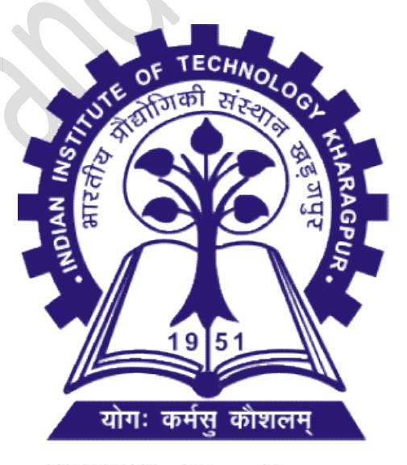
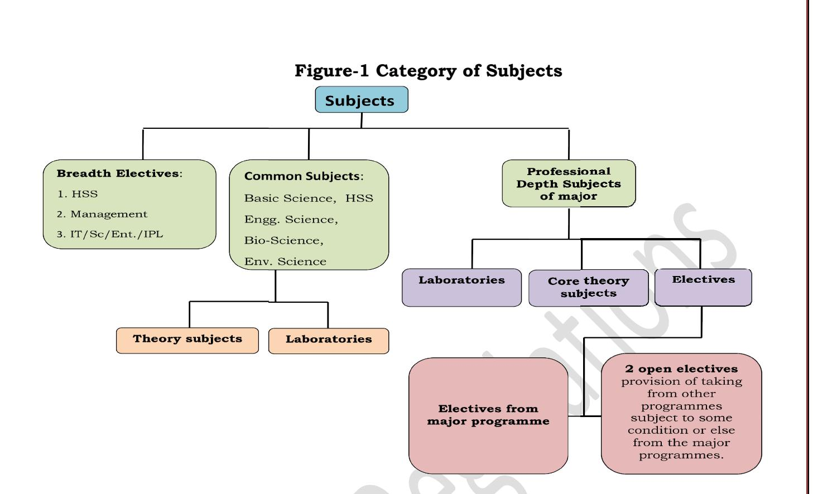
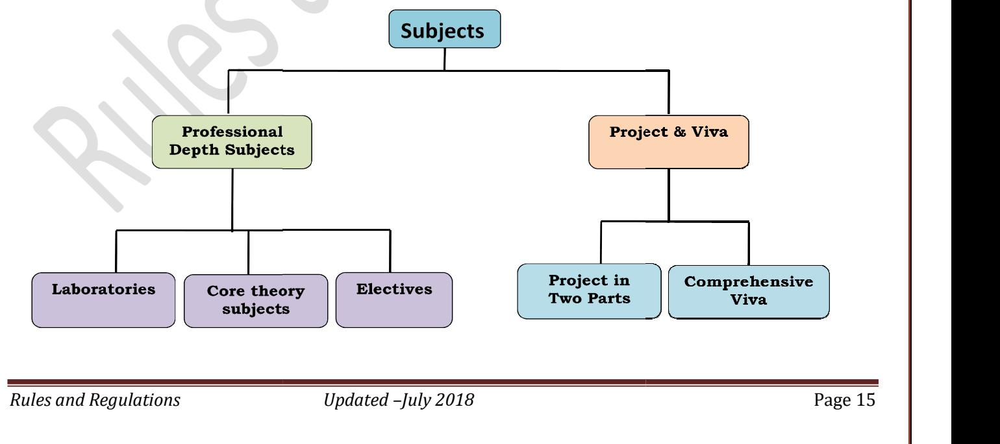

# for

Interdisciplinary Dual Degree, Integrated M. Sc. 2 Year M.Sc. of 6 Year Dual Degree M.Sc. B.Tech. (Hons.), Dual Degree, B. Arch. (Hons.), Integrated Degrees, Joint - M.Sc. - Ph.D - M.Tech. Interdisciplinary Dual Degree, Ph.D. M.Tech.

Indian Institute of Technology Kharagpur Kharagpur



|     | CONTENTS                                               |          |
|-----|--------------------------------------------------------|----------|
|     |                                                        | Page No. |
|     | Preface                                                | 2        |
| 1.  | Academic Administration                                | 3        |
| 2.  | Academic Programs                                      | 3        |
| 3.  | Scope of the Regulations                               | 6        |
| 4.  | Academic Calendar                                      | 7        |
| 5.  | Admission                                              | 7        |
| 6.  | Residence                                              | 8        |
| 7.  | Attendance                                             | 8        |
| 8.  | Conduct and Discipline                                 | 9        |
| 9.  | Change of Branch                                       | 11       |
| 10. | Switch Over to Interdisciplinary Dual Degree Programs  | 13       |
| 11. | Allocation of Verticals for QEDM                       | 13       |
| 12. | B.Tech.(Hons.) to Dual Degree Switch<br>Over           | 13       |
| 13. | Options for Dual Degree Specialization                 | 14       |
| 14. | Course Curricula                                       | 14       |
| 15. | Co-ordinated Courses                                   | 18       |
| 16. | Industrial Training and Field Work                     | 18       |
| 17. | Additional Credits                                     | 19       |
| 18. | Micro-Credits                                          | 20       |
| 19. | Minor in a Discipline                                  | 20       |
| 20. | Micro – Specialization                                 | 21       |
| 21. | Admission to Ph.D.<br>for Joint M.Sc.-Ph.D.<br>Program | 21       |
| 22. | Semester Registration                                  | 22       |
| 23. | De-Registration                                        | 25       |
| 24  | Grading System                                         | 25       |
| 25. | Assessment of Performance                              | 26       |
| 26. | Assessment of Project Work                             | 29       |
| 27. | Examinations                                           | 30       |
| 28. | Supplementary Examination                              | 32       |
| 29. | Summer Quarter                                         | 34       |
| 30  | Grade Submission & Grade Revision                      | 35       |
| 31. | Graduation Requirement                                 | 36       |
| 32. | Promotion and Discontinuation of Study                 | 37       |
| 33  | Withdrawal from the Institute                          | 38       |
| 34. | Striking off the name from Institute Roll List         | 38       |
| 35. | Relaxation                                             | 38       |
| 36  | Medals, Awards and Prizes                              | 39       |
| 37. | Scholarships                                           | 51       |
| 38. | Appendix 1 ---Subjects in Lieu of BTP Projects         | 67       |

# PREFACE

The Indian Institute of Technology at Kharagpur is the first of the sixteen Institutes established in the IIT system. Established in 1951, IIT Kharagpur stands tall for its excellence in Academics and Research with top class faculty. With 19 Academic Departments, 7 Centers & 8 Schools of Excellence, the Institute offers 15 B.Tech.(Hons.) Programs, 38 Dual Degree Programs, 2 Interdisciplinary Dual Degree Programs, 6 Integrated M.Sc. Programs and 5 Two Year M.Sc. degree programs of Joint M.Sc.-Ph.D.

The Undergraduate courses at IIT Kharagpur are known for their academic depth and professional learning flexibility, imbibed with options to earn minor or extra credits. Having an apt mix of basic sciences, engineering sciences, professional core of the major discipline, humanities courses, management subjects, project work, open electives and industrial training, the courses give a professional edge to the students. The system stimulates broad spectrum learning. Extra Academic activity is a non credit component of the curriculum that not only helps the students in character and personality building but also in understanding the needs of the society and contributing in an effective way to meet these social challenges.

IIT Kharagpur follows a credit based semester system. There are two Semesters in an academic year (Autumn: July - November; and Spring: January - April) during which all courses specified for various degree programs are offered. There is one additional term of seven week duration during summer, for the theory subjects of the first year to offer additional training to students who do not clear these subjects. The Institute has recently launched an International Summer /Winter Term Program which is open to all students. The students get an opportunity to seek knowledge and experience from International faculty in various multidisciplinary subjects.

IIT Kharagpur is a very student friendly place and all efforts are made to ensure that the students are provided the best opportunities that are needed to create outstanding pool of human resources to meet the global challenges in all spheres.

The students are required to follow certain procedures and meet specified academic requirements each semester. This booklet gives comprehensive information on the existing Rules and Regulations for B.Tech.(Hons.), Dual Degree and M.Sc. Programs.

We urge the students to make best use of the world class infrastructure and facilities available at IIT Kharagpur and wish all of them all the very best for a successful career.

Dean (UGS)

### 1. Academic Administration

 The Senate is a statutory and supreme body that governs all academic matters of the Institute, and the rulings of Senate Chairman (Director of The Institute) are final in regard to all academic issues. A definite time schedule is set by the Senate for various academic activities, through an Academic Calendar issued in the beginning of each academic year. The Senate continuously assesses the Academic Programs and makes appropriate revisions/ modifications/improvements as and when required through three Institute level Senate subcommittees: The Under-Graduate Program Evaluation Committee (UGPEC) for undergraduate programs, the Post-Graduate Program Evaluation Committee (PGPEC) for post-graduate programs, and the Research Program Evaluation Committee (RPEC) for research programs. Administrative back-up and support for all academic activities is provided by the Academic Section and the ERP system of the Institute. On joining the Institute, students of each discipline are assigned to a Faculty Advisor from their Department. Faculty Advisors assist the students on matters relating to their academic performance and the courses they may take in various semesters.

Dean (Undergraduate Studies) and Dean (Students' Affairs) are the two Chief Academic Authorities for the Undergraduate (UG) Programs. All the UG Academic matters come under the purview of Dean (Undergraduate Studies). Matters pertaining to conduct, discipline and welfare of the students are overseen by the Dean (Students' Affairs).

### 2. Academic Programs

The following Undergraduate Programs are Offered by the Institute:

- (i) 4-year courses in Engineering / Technology leading to the award of B.Tech. (Hons.) Degree. (Table 2.1)
- (ii) 5-year Integrated courses in Engineering / Technology leading to Dual B.Tech. (Hons.) and M.Tech. Degrees. (Table 2.2)
- (iii) 5-year Integrated courses in Engineering / Technology leading to Interdisciplinary Dual B.Tech. (Hons.) and M.Tech. Degrees. (Table 2.3)
- (iv) 5-year course in Architecture leading to the award of B.Arch. (Hons.) degree.
- (v) 5-year Integrated courses in Science subjects leading to the award of both B.Sc. and M.Sc. Degrees. (Table 2.4)
- (vi) 2 Year M.Sc. courses of Joint M.Sc.-Ph.D. Degrees in Science subjects leading to the award of M.Sc. Degrees. (Table 2.5)

#### TABLE – 2.1 4-year courses in Engineering/Technology leading to the award of B.Tech. (Hons.) Degree

| Sl. | Courses                                              |
|-----|------------------------------------------------------|
| 1.  | Aerospace Engineering                                |
| 2.  | Agricultural and Food Engineering                    |
| 3.  | Biotechnology and Biochemical Engineering            |
| 4.  | Chemical Engineering                                 |
| 5.  | Civil Engineering                                    |
| 6.  | Computer Science and Engineering                     |
| 7.  | Electrical Engineering                               |
| 8.  | Electronics and Electrical Communication Engineering |
| 9.  | Instrumentation Engineering                          |
| 10. | Industrial Engineering                               |
| 11. | Manufacturing Science and Engineering                |
| 12. | Mechanical Engineering                               |
| 13. | Mining Engineering                                   |
| 14. | Metallurgical and Materials Engineering              |
| 15. | Ocean Engineering and Naval Architecture             |

#### TABLE – 2.2 5-year Integrated courses in Engineering/Technology leading to Dual B.Tech. (Hons.) and M.Tech. Degrees

| Sl. | Courses                                                                        |
|-----|--------------------------------------------------------------------------------|
| 1.  | B.Tech.(Hons.) & M.Tech. in Aerospace Engineering                              |
| 2.  | B. Tech.(Hons.) in Agricultural and Food Engineering & M. Tech. in Food        |
|     | Process Engineering                                                            |
| 3.  | B. Tech.(Hons.) in Agricultural and Food Engineering & M. Tech. in Land and    |
|     | Water Resources Engineering                                                    |
| 4.  | B. Tech.(Hons.) in Agricultural and Food Engineering & M.Tech. in Farm         |
|     | Machinery and Power                                                            |
| 5.  | B. Tech.(Hons.) in Agricultural and Food Engineering & M.Tech. in              |
|     | Aquacultural Engineering                                                       |
| 6.  | B. Tech.(Hons.) in Agricultural and Food Engineering & M.Tech. in Agricultural |
|     | Systems and Management                                                         |
| 7.  | B. Tech.(Hons.) in Agricultural and Food Engineering & M.Tech. in Agricultural |
|     | Biotechnology                                                                  |
| 8.  | B.Tech. (Hons.) & M.Tech. in Biotechnology and Biochemical Engineering         |
| 9.  | B.Tech. (Hons.) & M.Tech. in Chemical Engineering                              |
| 10. | B.Tech. (Hons.) in Civil Engineering & M.Tech. in Structural Engineering       |
| 11. | B.Tech. (Hons.) in Civil Engineering & M.Tech. in Transportation Engineering   |
| 12. | B.Tech. (Hons.) in Civil Engineering & M.Tech. in Geotechnical Engineering     |
| 13. | B.Tech. (Hons.) in Civil Engineering & M.Tech. in Hydraulic and Water          |
|     | Resources Engineering                                                          |
|     |                                                                                |

| 14. | B.Tech. (Hons.) in Civil Engineering & M.Tech. in Environmental Engineering   |
|-----|-------------------------------------------------------------------------------|
|     | and Management                                                                |
| 15. | B.Tech. (Hons.) & M.Tech. in Computer Science and Engineering                 |
| 16. | B.Tech. (Hons.) in Electrical Engineering & M.Tech. in Control System         |
|     | Engineering                                                                   |
| 17. | B.Tech. (Hons.) in Electrical Engineering & M.Tech. in Machine Drives and     |
|     | Power Electronics                                                             |
| 18. | B.Tech. (Hons.) in Electrical Engineering & M.Tech. in Power and Energy       |
|     | Systems                                                                       |
| 19. | B.Tech. (Hons.) in Electrical Engineering & M.Tech. in Instrumentation and    |
|     | Signal Processing                                                             |
| 20. | B.Tech. (Hons.) in Electronics & Electrical Communication Engineering &       |
|     | M.Tech. in Microelectronics and VLSI Design                                   |
| 21. | B.Tech. (Hons.) in Electronics & Electrical Communication Engineering &       |
|     | M.Tech. in RF and Microwave Engineering                                       |
| 22. | B.Tech. (Hons.) in Electronics & Electrical Communication Engineering &       |
|     | M.Tech. in Telecommunication System Engineering                               |
| 23. | B.Tech. (Hons.) in Electronics & Electrical Communication Engineering &       |
|     | M.Tech. in Visual Information and Embedded Systems                            |
| 24. | B.Tech. (Hons.) in Electronics & Electrical Communication Engineering &       |
|     | M.Tech. in Fibre Optics and Light Wave Engineering                            |
| 25. | B.Tech. (Hons.) in Instrumentation Engineering & M.Tech. in Instrumentation   |
|     | and Signal Processing                                                         |
| 26. | B.Tech. (Hons.) in Instrumentation Engineering & M.Tech. in Control System    |
|     | Engineering                                                                   |
| 27. | B.Tech. (Hons.) in Industrial Engineering & M.Tech. in Industrial Engineering |
|     | and Management                                                                |
| 28. | B.Tech. (Hons.) in Manufacturing Science and Engineering & M.Tech. in         |
|     | Industrial Engineering and Management                                         |
| 29. | B.Tech. (Hons.) in Mechanical Engineering & M.Tech. in Manufacturing Science  |
|     | and Engineering                                                               |
| 30. | B.Tech. (Hons.) in Mechanical Engineering & M.Tech. in Thermal Science and    |
|     | Engineering                                                                   |
| 31. | B.Tech. (Hons.) in Mechanical Engineering & M.Tech. in Mechanical Systems     |
|     | Design                                                                        |
| 32. | B.Tech. (Hons.) & M.Tech. in Mining Engineering                               |
| 33. | B.Tech. (Hons.) in Mining Engineering & M.Tech. in Safety Engineering         |
| 34. | B.Tech. (Hons.) in Metallurgical and Materials Engineering & M.Tech. in       |
|     | Metallurgical Engineering                                                     |
| 35. | B.Tech. (Hons.) & M.Tech. in Ocean Engineering and Naval Architecture.        |
| 36. | B.Tech. (Hons.) in Engineering Product Design and Manufacturing & M.Tech. in  |
|     | Design and Quality Engineering with Mechanical Engineering Vertical           |
|     |                                                                               |

| 37. | B.Tech. (Hons.) in Engineering Product Design and Manufacturing & M.Tech. in |
|-----|------------------------------------------------------------------------------|
|     | Design and Quality Engineering with Industrial Electronics Vertical          |
| 38. | B.Tech. (Hons.) in Chemical Engineering and M.Tech. in Petroleum Engineering |
| 39. | B.Tech. (Hons.) in Mechanical Engineering and M.Tech. in Petroleum           |
|     | Engineering                                                                  |
| 40. | B.Tech. (Hons.) in Mining Engineering and M.Tech. in Petroleum Engineering   |

#### TABLE–2.3 Integrated courses in Engineering/Technology leading to Inter/Trans disciplinary Dual B.Tech. (Hons.) and M.Tech. Degrees

| Sl. | Courses                                                                                       |
|-----|-----------------------------------------------------------------------------------------------|
| 1.  | B.Tech.(Hons.)<br>in<br>any<br>Engineering<br>Discipline<br>and<br>M.Tech.<br>in<br>Financial |
|     | Engineering (5-year)-- Inter-disciplinary                                                     |
| 2.  | B.Tech.(Hons.) in any Engineering Discipline and M.Tech. in Engineering                       |
|     | Entrepreneurship (5-year)-- Inter-disciplinary                                                |
| 3.  | B.Tech.(Hons.) in Mechanical/Chemical/Mining Engineering Discipline and                       |
|     | M.Tech. in Petroleum Engineering (5-year)—Trans-disciplinary                                  |

#### TABLE – 2.4 5-year Integrated courses in Science subjects leading to the award of both B.Sc.(Hons.) and M.Sc. Degrees

| Courses                   |
|---------------------------|
| Chemistry                 |
| Exploration Geophysics    |
| Applied Geology           |
| Economics                 |
| Mathematics and Computing |
| Physics                   |
|                           |

### TABLE – 2.5 2 Year M.Sc. of Joint M.Sc.-Ph.D. Degrees

| Sl. | Courses     |
|-----|-------------|
| 1.  | Chemistry   |
| 2.  | Geophysics  |
| 3.  | Geology     |
| 4.  | Mathematics |
| 5.  | Physics     |
|     |             |

TABLE – 2.6 6-year Integrated courses in Science/Technology leading to Dual M.Sc. and M.Tech. Degrees (Senate Approval, Item 314.H.I.C.6)

| Sl. | Courses                                                              |
|-----|----------------------------------------------------------------------|
| 1.  | M.Sc. in Applied Geology and M.Tech. in Petroleum Engineering        |
| 2.  | M.Sc. in Exploration Geophysics and M.Tech. in Petroleum Engineering |

## 3. Scope of the Regulations

3.1 The provisions of this Regulation is applicable to all Programs and disciplines

listed above and will also be applicable to new Under-Graduate(UG) disciplines that are introduced from time to time .

3.2 The Board of Governors (BOG) may, on the recommendation of the Senate change any or all parts of this Regulation at any time considered appropriate by the Senate.

### 4. Academic Calendar

- 4.1 The academic session is divided into two semesters each of approximately 20 weeks duration: an Autumn Semester (July-November) and a Spring Semester (January-April).
- 4.2 The Senate-approved schedule of academic activities for a session, inclusive of dates for registration, mid-semester and end-semester examinations, intersemester breaks etc., shall be laid down in the Academic Calendar for the session and published on Institute Web Site. The Academic Calendar shall strive to provide for a total of about 90 working days in each semester.

### 5. Admission

- 5.1 Admission to all courses (except the 2 Year M.Sc. of the Joint M.Sc.-Ph.D. programs) will be made in the Autumn Semester of each session, at the First Year level, through a Joint Entrance Examination (JEE Advanced) conducted by one of the IITs every year by rotation under the supervision of a Joint Admission Board, which comprises of representatives from all the IITs.
- 5.3 Admission to 2 Year M.Sc. courses of the Joint M.Sc.-Ph.D. Program will be made in the Autumn Semester of each session, at the First Year level, through a Joint Admission Test (JAM) conducted by one of the IITs every year by rotation under the supervision of a Joint Admission Committee, which comprises of representatives from all the IITs.
- 5.4 In special cases the Institute may admit students to a course on transfer from other IITs. Such admission may be made at any level considered appropriate except at first year level.
- 5.5 Provisions of this Regulation do not prevent the Institute from allowing students enrolled in a university in India or abroad to attend specified subjects in one or more semesters without leading to any degree on certain terms and conditions.
- 5.6 All students admitted to any of the courses including those accepted under Section 5.4 above shall be required to pay at the time of joining and also in subsequent semesters prevalent tuition and other fees as prescribed by the Institute till they are on roll.
- 5.7 The Institute reserves the right to cancel the admission of any student, and ask him/her to discontinue his/her studies at any stage of his/her career on grounds of unsatisfactory academic performance, irregular attendance in classes or indiscipline.
- 5.8 Candidate admitted through JEE Advanced to B.Tech.(Hons.)/Dual Degree/Integrated M.Sc. programs (other than B.Arch.(Hons.) students) will be

eligible for Branch Change and Switch Over to Interdisciplinary Dual Degree Programs, the rules for which are mentioned in the subsequent sections.

# 6. Residence

The Institute is essentially a residential one and unless otherwise exempted/permitted, every student shall be required to reside in, and be a boarder of a Hall of Residence, to which they are assigned. Following are the detailed rules governing residence requirements of students:

- 6.1 The mess of each Hall of Residence shall function as a single integrated unit and shall not, under any circumstances be sub-divided into any kind of groups or sub-groups.
- 6.2 Under special circumstances, the Director/Dean of Students' Affairs may permit a student to reside with his Parent/Guardian in the Institute Campus or within a reasonable distance from the Institute. Such a student shall, however, be attached to a Hall of Residence and will be required to pay seat rent according to rules, and Hall establishment charges fixed by the Hall Management Committee (HMC) and the Warden of the Hall. However, this permission may be withdrawn at the discretion of the Institute, at any time considered appropriate without assigning any reason.
- 6.3 No married accommodation shall be provided to any student of the undergraduate courses.
- 6.4 No student shall come into or give up the assigned accommodation in any Hall of residence without the prior permission of the Chairman, HMC.
- 6.5 A student shall reside in a room allotted to him/her and may shift to any other room only under the direction/permission of the Warden.
- 6.6 Students shall be required to make their rooms available whenever required for inspection, repairs, maintenance or disinfecting and shall vacate the rooms when leaving for the vacations/holidays.
- 6.7 Students shall be responsible for the proper care of the furniture; fan and other fittings in the rooms allotted to them and shall generally assist the Warden in ensuring proper use, care and security of those provided in the Halls for common use of all students.
- 6.8 Students will be responsible for the safe keeping of their own property. In the event of loss of any personal property of a student due to theft, fire or any other cause, the Institute shall accept no responsibility and shall not be liable for payment of any compensation.
- 6.9 Engaging personal attendants, keeping pets and use of appliances like electric heater, refrigerators etc. by a student in the Hall of Residence are prohibited.
- 6.10 All students must abide by the rules and regulations of the Hall of Residence as may be framed from time to time.

# 7. Attendance

7.1 Attendance in all classes (lectures, tutorials, laboratories, workshops, Extra Academic Activity including its related camps and other publicized activities etc.) is compulsory. A student may be debarred from appearing at an examination on

the ground of unsatisfactory attendance.

- 7.2 The teacher concerned may condone absence from classes for a very short period due to unavoidable reasons provided he/she is satisfied with the explanation.
  - 7.2.1 If the period of absence is for a short duration (of not more than two weeks) application for leave shall have to be submitted to the Head of the Department concerned stating fully the reasons for the leave requested for along with supporting document(s). The Head of the Department will grant such leave.
  - 7.2.2 Absence for a period not exceeding two weeks in a semester due to sickness or any other unavoidable reason for which prior application could not be made may be condoned by the Head of the Department provided he is satisfied with the explanation.
- 7.3 If the period of absence is likely to exceed two weeks, a prior application for grant of leave will have to be submitted through the Head of the Department to the Dean (Undergraduate Studies), with the supporting documents. The decision to grant or condone such leave shall be taken by the Dean (Undergraduate Studies) after considering the recommendation of the Head of the Department.
- 7.4 It will be the responsibility of the student to get his absence from classes condoned by the appropriate authority.
- 7.5 Absence from classes without prior permission will be considered as an act of indiscipline. Such cases will be dealt with in accordance with Section 5.7.
- 7.6 A student must intimate his/her absence to the Warden of the Hall in which he/she is residing, before availing of any leave. Failing to do so will be construed as breach of discipline and will be dealt with as per provisions in Section 8.5
- 7.7 Before proceeding on medical leave the B.C.Roy Technology hospital should be informed and before rejoining the institute, the student should obtain a fitness certificate from the B.C.Roy Technology hospital (Senate approval, Item 316.C.I.C.1).
- 7.8 Medical leave of a maximum period of one month during the semester is allowed. Beyond one month the rejoining will be considered on a case to case basis (Senate approval, Item 316.C.I.C.1).

## 8. Conduct and Discipline

- 8.1 Students shall conduct themselves within and outside the precincts of the Institute in a manner befitting the students of an institution of national importance.
- 8.2 Students shall show due respect to the teachers of the Institute, the Wardens of the Halls of Residence, the Sports Officers of the Gymkhana and the Officers of the National Cadet Corps; proper courtesy and consideration should be extended to the employees of the Institute and of the Halls of Residence. They shall also pay due attention and courtesy to visitors.
- 8.3 Students are required to develop a friendly relationship with fellow students. In particular, they are expected to show kindness and consideration to the new students admitted to the Institute every year. Law bans ragging in any form to anybody - acts of ragging will be considered as gross indiscipline and will be

severely dealt with.

8.4 The following acts of omission and/or commission shall constitute gross violation of the code of conduct and are liable to invoke disciplinary measures:

- Ragging.
- Furnishing false statement of any kind in the form of application for admission or for award of scholarship etc.
- Displaying lack of courtesy and decorum; resorting to indecent behavior anywhere within or outside the campus.
- Willfully damaging or stealthily removing any property/belongings of the Institute, Hall or fellow students.
- Possession, consumption or distribution of alcoholic drinks or any kind of hallucinogenic drugs.
- Adoption of unfair means in the examinations.
- Organizing or participating in any group activity in company with others in or outside the campus without prior permission of the Dean of Students' Affairs.
- Mutilation or unauthorized possession of library books.
- Resorting to noisy and unseemly behavior, disturbing studies of fellow students.
- Misuse of Internet/e-mail facilities or tempering/hacking with servers anywhere in the Halls of Residence/Departments etc.
- Not intimating his/her absence to the Warden of the Hall before availing any leave.

Commensurate with the gravity of the offence, the punishment may be reprimand, fine, and expulsion from the Hall, debarment from an examination, rustication for a specified period or even outright expulsion from the Institute.

8.5 For an offence committed (a) in a Hall of Residence, (b) in the Department or a classroom and (c) elsewhere, the Warden, the Head of the Department and the Dean of Students' Affairs, respectively, shall have the authority to reprimand or impose fine or take any other suitable measure.

All cases involving punishment other than reprimand shall be reported to the Chairman of the Standing Institute Disciplinary Committee.

- 8.6 (a) All major acts of indiscipline, which may have serious repercussion on the general body of students, and/or which may warrant a uniform and more formalized nature of investigation, shall be handled by the Standing Institute Disciplinary Committee appointed by Senate. The Standing Disciplinary Committee consists of the following ex-officio and other members:
  - (i) Dean of Students' Affairs Chairman
  - (ii) Chairman, Hall Management Committee Member
  - (iii) Warden of the Hall of Residence of which the student concerned is a boarder -

#### Member

- (iv) One Faculty nominated by the Senate, by rotation for two years Member
- (v) Student Vice-President, Technology Students' Gymkhana Member
- (vi) One of the student representatives in the Senate, to be nominated by the Dean Students' Affairs, for one year – Member
- (vii) The Deputy Registrar (Academic) Member Secretary

In addition, the Chairman may invite any other person(s) to be associated with the proceedings of a particular case, if his/her/their participation is considered necessary in disposing of the matter.

(b) Recommendation of the committee, which will include the suggested punishment in cases of guilt proven, will be forwarded to the Chairman Senate for necessary action.

- 8.7 Cases of adoption of unfair means in an examination shall be dealt with by the Committee on Prevention of Examination Malpractices consisting of the following members:
  - (i) Professor-in-Charge of Examination Chairman
  - (ii) Head of the Department to which the reported student belongs Member
  - (iii) The Invigilator reporting the case- Member
  - (iv) The Invigilator-in-Charge of the Examination Hall concerned- Member
  - (v) The Paper-setter concerned Member
  - (vi) Two members of faculty nominated by the Undergraduate Program & Evaluation Committee for a term of two years - Members
  - (vii) The Assistant Registrar (UGS) Secretary

The Committee shall recommend appropriate measures in each case to the Chairman of the Senate for awarding the punishment

# 9. Change of Branch (At the end of First Year)

9.1 Change of the branch is a privilege and not a right. Only those students admitted to B.Tech.(Hons.) / Dual Degree / Integrated M.Sc. Programs through JEE(Advanced) are eligible to be considered for a change of branch after the Second (Spring) Semester as per the following rules:

To be eligible for consideration for a change of branch the following conditions must be satisfied:

- 9.1.1 He/she must have completed all the credits prescribed in the first two semesters of the course, in his/her first attempt, without having had to pass any course requirement in the re-examination, supplementary examination and/or summer quarter.
- 9.1.2 He/she must have obtained a Cumulative Grade Point Average (CGPA) not lower than 8.5 at the end of the Second (Spring) Semester.
- 9.1.3 Students will NOT be eligible for Branch Change, if EAA has not successfully completed.
- 9.1.4 Only for serious medical cases, for all EAA activities (NCC, NSS and NSO), a certificate is to be obtained from B.C. Roy Technology Hospital for waiver

```
Rules and Regulations Updated –July 2018 Page 11
```

of EAA completion for branch change.( Senate, Item 321.H.I.C.2)

- 9.1.5 He/she must not have been punished for any offence by the Standing Institute Disciplinary Committee or the Committee on Prevention of Examination Malpractices at any time prior to the notification for the change of branch.
- 9.2 Application for a change of branch must be made by intending eligible students when the notification is made during the Spring Semester of the academic year. The students have to accordingly (i) apply online and (ii) submit signed hardcopy to Academic Section by the specified deadline.
  - 9.2.1 Students admitted to 4-Year B.Tech.(Hons.) and 5-Year Integrated M.Sc. programs are eligible for consideration for a change of branch to any Engineering or a Science discipline.
  - 9.2.2 Students admitted to a 5-Year Dual Degree Program are eligible for a change to another 5-Year Dual Degree Program only.
- 9.3 Students may enlist up to TEN (10) choices of branch, in order of preference, to which they wish to change over. It will not be permissible to alter the choices after the application has been submitted.
- 9.4 Change of branch shall be made strictly on the basis of inter se merit of the applicants. For this purpose the CGPA obtained at the end of the Second (Spring) Semester shall be considered. Ties will be broken by the JEE Advanced rank of the applicants.
- 9.5
- (a)In making the change of branch, those applicants shall be first considered who have secured a rank within top 1% (one percent), rounded to the nearest integer, amongst all the first year students in terms of the CGPA scored at the end of the Second (Spring) Semester. Change of branch requested for by such applicants shall be made without any constraint on the number of seats.
- (b) The remaining applicants may be allowed a change of branch, strictly in order of inter se merit, subject to the limitation that the actual number of students in the Third (Autumn) Semester, in the branch to which the transfer is to be made, does not exceed 110% of the sanctioned yearly intake for that branch.

The sanctioned yearly intake of a particular branch shall be the number sanctioned by the Senate as the intake for that branch for the particular year of entry of the applicants. To compute the total number of students in the first year, sum of the sanctioned yearly intake of all the branches will be taken. For the purpose of calculating the actual number of students in a particular branch, the number of students joining the branch is to be considered.

9.6 The academic section will notify the students and display on the notice boards about the changes of the branch at least 7 (seven) days before the assigned date(s) of the registration of the third (Autumn) semester. However, all changes of branch made in accordance with the above rules will be effective from the Third

(Autumn) Semester of the applicants concerned. No changes of branch shall be permitted thereafter.

- 9.7 All changes of branch will be final and binding on the applicants. No student will be permitted, under any circumstances, to refuse the change of branch offered.
- 9.8 Notwithstanding the provisions of foregoing paragraphs, the Senate may under very special circumstances, permit the transfer of a student from one branch to another in deviation of the above mentioned rules. In each such case the special reasons for which the transfer is permitted must be recorded in the Senate resolution. Such transfers, if any, will be over and above the regular transfers, and their number will not be counted in the computation of 'Actual Number of Students' in a given branch.

## 10. Switch Over to Interdisciplinary Dual Degree

Students admitted to the 4-year B. Tech.(Hons.) / 5-year Dual Degree Program through JEE(Advanced) are eligible for Switch Over to the Dual Degree Programs of Engineering Entrepreneurship/Financial Engineering.

- 10.1 Such students must have completed all the prescribed course work for the first two Semesters in first attempt with a minimum CGPA of 6.00.
- 10.2 Application for a Switch Over must be made by intending eligible students when the notification is made during the Spring Semester of the academic year. The students have to accordingly (i) apply online and (ii) submit signed hardcopy to Academic Section by the specified deadline.

An option for Interdisciplinary Dual Degree Programs does not prevent a student to opt for Change of Branch. In such case Change of Branch allotted to a student would prevail over the option of Interdisciplinary Dual Degree Program.

# 11. Allocation of Verticals for QEDM

- 11.1 Students admitted to the Dual Degree Program in Engineering Product Design and Manufacturing must exercise their options for Industrial electronics or Mechanical Engineering verticals at the end of first year. This will be notified in the Spring Semester of each academic year. The students have to accordingly (i) apply online and (ii) submit signed hardcopy to Academic Section by the specified deadline
- 11.2 Vertical assignment will be strictly in accordance with choice and CGPA for GE, OBC, SC and ST categories.

# 12. B.Tech.(Hons.) to Dual Degree Switch Over

- 12.1 Third year B.Tech.(Hons.) students will have the option to switch over from 4 year B.Tech.(Hons.) to an existing 5-year Dual Degree course (one-way and not the reverse) in the same department, including a choice of specialization, offered at 2-year M.Tech. level in the Department maintaining proportionate distribution of seats.
- 12.2 The student must have completed all the curricular requirements upto sixth

semester and must not have any backlog subjects with a minimum CGPA of 6.00.

12.3 The notification for Switch Over will be issued during the Spring Semester of each academic year. The students have to accordingly (i) apply online and (ii) submit signed hardcopy to Academic Section by the specified deadline.

## 13. Options for Dual Degree Specialization

- 13.1 Third year Dual Degree students of Agricultural and Food Engineering, Civil Engineering, Electrical Engineering, Electronics & Electrical Communication Engineering and Mechanical Engineering must exercise their choice of particular M.Tech. specialization.
- 13.2 Such dual degree students will be allowed to choose any post-graduate specialization approved by the department without any constraint. Alternately if a department fixes the number of seats in each post-graduate specialization with the approval of the senate the allotment of the seats will be made on the basis of choice and CGPA at the end of the 3rd year including the Supplementary/ Summer Quarter results as the case may be.
- 13.3 Specialization allotment will be made only for those students who are promoted to the next level.
- 13.4 The notification for choice of specialization will be issued during the Spring Semester of each academic year. The students have to accordingly (i) apply online and (ii) submit signed hardcopy to Academic Section by the specified deadline.

### 14. Course Curricula

#### 14.1 Course Structure

- The general course structure for all Programs (B.Tech.(Hons.) / B.Arch.(Hons.) / 5 year M.Sc./Dual Degree) comprises of the following components:
- Common Curricula for First Year (Except B.Arch. (Hons.)).
- Theory and Laboratory /Design/Sessional subjects with regular class room contact. The various categories as shown in Figure 1.
- Four Non Credit components of Extra Academic Activity (Two in case of B.Arch.(Hons.)) from 1st to 4th semester.
- Industrial Training.
- Comprehensive Viva Voce.
- Project in Two parts for B.Tech.(Hons.)/B.Arch.(Hons.)/5 Year M.Sc. Programs.
- Project in Four Parts, 2 each corresponding to the B.Tech.(Hons.) and M.Tech.
- Field Trips for Mining Engineering, Geology and Exploration Geophysics programs.



- Students of Interdisciplinary and two open electives in place of the corresponding subjects of Engineering or Engineering Entrepreneurship Dual Degree will forgo the three Breadth courses two place Entrepreneurship. Dual Degree will forgo the three Breadth courses and two open electives in place of the corresponding subjects of Financial
- For Dual Degree Students, 2 M.Tech. level core/elective subjects open electives. For Dual Degree Students, 2 M.Tech. level core/elective subjects will replace the
- The curricular components of the structure is shown in the Figure 2. 2 Year M.Sc. of Joint M.Sc shown 2 Year M.Sc. of Joint M.Sc. -Ph.D. Program

#### Figure 2.: Components of the 2 Year M.Sc. of Joint M.Sc M.Sc. of Joint M.Sc.-Ph.D. Program



- The students of Geology and Geophysics have field-trips as a part of their curriculum.
- 14.2 Except Extra Academic Activity each component of the curriculum has credits attached to it.
- 14.3 The detailed Senate approved curricula for various Disciplines along with the syllabus for each subject for all the programs are available on the Institute Website.
- 14.4 The curricula to be followed in the first two semesters by students of B.Tech.(Hons.) /5 year M.Sc./Dual Degree programs shall be common.
- 14.5 Subjects: All subjects prescribed in the curriculum except Extra Academic Activity have credits assigned to them. Subjects are broadly classified into two categories:
  - 14.5.1 Theory, Laboratory, Sessional and Design based courses having a regular class room/laboratory contact. These Subjects have a lecture-tutorialexperiment/design component (L-T-P) to indicate the contact hours per week. Their L-T-P pattern may be (L-T-0,L-0-0,0-0-P and in some cases L-T-P)
  - 14.5.2 Comprehensive Viva Voce, Project, Field Trips and Industrial Training/Office Training which do not have regular class room contact.
- 14.6 Teaching of subjects would be reckoned in terms of credits.
- 14.7 Subject pre-requisite: A subject may have one or more subjects listed as its pre-requisite. A student who has qualified in all the subjects in the pre-requisite would be allowed to register in the subject. The teacher concerned would have the prerogative to waive the prerequisite for a student if he/she is satisfied through a test that the student otherwise have gained sufficient proficiency to take up the subject.
- 14.8 Extra Academic Activity: Every student must register and complete the Extra Academic Activity (EAA) requirements as laid down in the curriculum.
  - EAA is classified into 4 main groups such as National Cadet Corps (NCC) National Service Scheme (NSS), National Sports Organization (NSO) and Health and Fitness (HF).
  - Further NCC is classified into Electrical & Mechanical Engineering (EME) Wing and Air Wing (ARW).
  - NSS classified into 15 units.
  - NSO classified into different sports such as athletics, badminton, basketball, cricket, football, hockey, swimming, tennis, table tennis, volleyball.
  - Health & Fitness classified into 10 units.
  - All the above EAA is being coordinated by Program Coordinator and the individual modules by Program officers.
  - Student exercise their choice of EAA components at the time of admission.
  - Allocation of the EAA component is made centrally based on their choices and availability.
  - EAA being a non credit course, the grade will show as "EAA completed : Yes/No" (From Autumn 2017-18 onwards, Senate, Item 321.H.I.C.2)
  - Clearing EAA is mandatory for the award of the degree.

#### 14.9 Modalities for administering the open elective slots Open elective I

In the slot of open elective I, only the following category of students can opt for a subjects from other departments:

The students must have registered for a minor/ Micro-Specialization and the subject opted from other departments must be one of the subjects of his / her requirement for the minor/ Micro-Specialization.

The students who do not fall in the above category (who have not registered for a minor/ Micro-Specialization) have to opt for subjects only from the list of his / her parent department in this slot.

#### Open elective II

In the slot of open elective II, the following category of students can opt for a subject from other departments:

The students must have a CGPA ≥ 8.0.

The students registered for a minor/Micro-Specialization may utilize this slot in opting for a subject of his / her requirement for the minor, or for a subject from other departments (available in the slot) as he / she desires.

The students having a CGPA <8.0 have to opt for the subjects only from the list of his / her parent department in this slot.

- 14.10 Program Duration: The normal duration of programs leading to the degrees to be awarded under these Regulations are as follows:
  - (i) B.Tech. (Hons.) 4 years
  - (ii) Dual Degree 5 years
  - (iii) Interdisciplinary Dual Degree 5 years
  - (iv) B.Arch. (Hons.) 5 years
  - (v) Integrated M.Sc. 5 years
  - (vi) Dual Degree M.Sc.- M.Tech.-6 years
  - (vii) 2 Year M.Sc. of Joint M.Sc.-Ph.D. Program 2 Years
- 14.11 Maximum Time Limit: The total time to earn the degree( inclusive of the period of Withdrawal, if any) is limited to 8 years, for 4-year B.Tech.(Hons.) and 10 years for 5-year Integrated M.Sc., 5-year B.Arch. (Hons.), and 5-year Dual Degree students, 4-years for the 2 Year M.Sc. of the Joint M.Sc.- Ph.D. Program .
- 14.12 Conferment of Degrees for Dual Degree/5 Year M.Sc. Program/6 Year Dual Degree M.Sc.- M.Tech: On successful completion, a student would be conferred the B.Tech.(Hons.) and the M.Tech. degrees in the case of the Dual Degree; B.Tech. (Hons.) in the parent engineering discipline and M.Tech. in Financial Engineering or Engineering Entrepreneurship for Interdisciplinary Dual Degree Programs or Petroleum Engineering for the Trans-disciplinary Program. Both

B.Sc.(Hons.) and the M.Sc. degrees will be awarded in the case of the Integrated M.Sc. degree together on successful completion of all ten semesters of study. For the 6 Year Dual Degree M.Sc.- M.Tech program- B.Sc.(Hons.), M.Sc. degree in the respective discipline along with an M.Tech. in Petroleum Engineering would be awarded on successful completion of all twelve semesters of study

### 15. Co-ordinated Courses

A Co-ordination Committee would be constituted for each subject taught by more than one teacher of one or more Departments/Centers. Each committee would consist of all the teachers who are involved with the teaching of the subject during the semester. One of its members would be nominated by the Head of that Department, under whose name the subject is being offered, to act as its Chairman.

15.1 Tenure: The semester in which the subject is being offered.

### 15.2 Functions:

- 15.2.1 To lay down the course plan for the subject.
- 15.2.2 To coordinate instructions and progress of teaching in the subject and to ensure that the full syllabus is covered.
- 15.2.3 To review periodically the performance of students who have registered in the subject.
- 15.2.4 To forward the results of the examinations and the final grades obtained by each student taking the subject to the concerned Head of the Department.
- 15.2.5 To moderate the question papers on the subject and ensure that the syllabus is well covered by the question papers.
- 15.3 Frequency of Meetings: Each Co-ordination Committee shall meet at least four times during the semester.

# 16. Industrial Training and Field work

- 16.1 The curricula for all B.Tech.(Hons.) programs would include compulsory industrial training for 8 weeks carrying 2 credits, to be carried out in the summer vacation at end of the sixth semester,
- 16.2 The curricula for all Dual Degree and 5-year M.Sc. programs would include compulsory industrial training for 8 weeks carrying 2 credits, to be carried out in the summer vacation at end of the eighth semester.
- 16.3 The allotment of training programs of all the students by Career Development Centre will be frozen by a suitable and fixed deadline each year. No further change will be entertained under any circumstances.
- 16.4 A student after being selected in an organization by Career Development Centre cannot opt out of his training from that organization under any circumstances.
- 16.5 Any arrangement of training in industry or academia (within or outside the country) has to be routed through Career Development Centre via the Professorin-Charge of training of the respective department.
- 16.6 Evaluation of Summer Training. The performance of the student in the Summer Training will be evaluated based on his submission of a certificate from the organization of his training followed by a combined viva-voce/presentation

and report examination.

- 16.7 The curricula of Mining Engineering would suitably include the additional requirements of industrial training and field work equitably distributed at the third and the fourth year levels.
- 16.8 The curriculum of B.Arch.(Hons.) course shall include a six month field training to be carried out in the eighth semester.
- 16.9 Summer Internship of ongoing 4th year Dual Degree students.

A 4th year Dual Degree student ( students admitted prior to Academic year 2013- 2014) will be allowed to pursue a Summer Internship Program provided the Supervisor of his M.Tech. thesis work certifies that the program is strongly connected to his thesis work. The students undergoing such program will not get the M.Tech. scholarship during their period of internship outside.

 From the session 2016-2017 onwards, the curricula for Dual Degree courses and all 5-year M.Sc. programs would include compulsory industrial training for 8 weeks carrying 2 credits, to be carried out in the summer vacation at end of the eighth semester (in place of sixth semester).

# 17. Additional credits

From the THIRD semester onwards the curriculum offers scope for a student to opt for Additional subjects apart from the regular curriculum requirement under the following conditions:

- 17.1 If a student has a Cumulative Grade Point Average (CGPA) equal to or greater than 7.50 without any backlog, he/she would be allowed to take additional subjects within and/or outside his/her own discipline to earn additional credits of up to 33% of his/her requirement for major. A student would be allowed to register in an additional subject only if he/she satisfies the pre-requisite, there is no clash in the timetable and the class size permits.
- 17.2 Once a student has registered in an additional subject, the grade obtained (including F-grade) in that subject would invariably be recorded in his/her grade card. The credit contribution of these additional subjects to the computation of CGPA, however, would be considered as nil.
- 17.3 The GPA of the additional subjects is separately calculated and indicated in the grade card.
- 17.4 A student can drop an additional subject following the proper procedure before mid-semester examination (Senate Item 320.H.I.C.11); otherwise the subject will remain registered and the subject will be mandatorily reflected on the Grade Card even with F grade.
- 17.5 There is no scope for supplementary examination in an additional subject.
- 17.6 However in the case of failure in the additional subject, the student should repeat the additional subject in the next offered semester. The student is permitted to take alternate additional subject if the subject is not offered in the next semester. These additional subjects will not be counted for minor specialization (Senate Item 320.H.I.C.11).
- 17.7 The students can register for Additional subjects with EAA as backlog (Senate Item 322.H.I.C.6). .

# 18. Micro-Credits

- 18.1 Micro-Credit courses are one credit courses having duration of 3‐14 days offered during the semester or during evening or free slots available during weekdays or even weekends that are not declared holidays in some special cases when students are available.
- 18.2 The subject will be counted for total credit requirement for completion of degree in special cases subject to recommendation of the Head and approval of Dean (UGS) with due reasons recorded.
- 17.8 The subject and grade will be mentioned in transcript / grade card and will be used to compute CGPA for additional subjects and will be shown as ACGPA. Failures will be marked by F grade. There will be no supplementary examination for such subjects. In the case of failure in the micro-credit subject, the student should repeat the micro-credit subject if offered in the next offered semester. The student is permitted to take alternate micro-credit subject if the subject is not offered in the next semester. (Senate Item 321.A.I.C.1).
- 18.3 However, in case the micro-credit is accepted as a subject contributing to the curricular requirement, it will be accounted for in the CGPA calculations.
- 18.4 A student is normally not expected to take more than 2 such courses in a semester. The subject may also be a part of minor and micro‐specialization.
- 18.5 The students can register for Micro-credit subjects with EAA as backlog (Senate Item 322.H.I.C.6). .

# 19. Minor in a Discipline

- 19.1 A department would offer a MINOR in a discipline in which it offers a major.
- 19.2 The department would enlist a set of subjects from its curriculum and prescribe a requirement for minor taking six subjects or more (18-24 contact-hours plus 3-9 hours of laboratory) from this set. The subjects would be a combination of mostly core and some electives.
- 19.3 Students aspiring for a Minor in a discipline must register for the same in the beginning of the 5th semester. Only those students, who have a CGPA of 7.5 or above, without any Backlog, will be permitted to register for a Minor. An SGPA or CGPA in excess of 8.0 has to be maintained in the subsequent semesters without any Backlog in order to keep the Minor registration active. Should both the SGPA and CGPA fall below 8.0 at any point after registering for the minor; the Minor registration will cease to be active.
- 19.4 A student registered for Minor in a discipline must register and pass in all subjects that constitute the requirement for a minor and score a minimum grade point average of 6.00 to be awarded a Minor in that discipline.
- 19.5 A student may cover these six subjects as either a depth subject, elective subject or a breadth subject or as additional credits. However, he/she has to take at least three subjects as additional credits to earn a minor.
- 19.6 Students enrolled in Dual Degree, Integrated M.Sc. and B.Arch. (Hons.) are permitted to pursue minor in other discipline up to their 10th Semester, while

the students of B.Tech.(Hons.) should complete the minor requirements by 8th semester.

19.7 The students can register for Minor with EAA as backlog (Senate Item 322.H.I.C.6). .

# 20. Micro – Specialization

The Institute offers Micro-Specializations to UG students from the Spring Semester of the current Academic Session (2014-2015). The salient features are as follows:

- 20.1 Each Micro-Specialization has a defined structure in terms of three sequential components:
  - 20.1.1 Component-I One Foundation Course (2-4 credits) that constitutes a Mandatory Requirement and also a Pre-Requisite for subsequent Components.
  - 20.1.2 Component-II- One/Two subjects (3-4 credits each) from a Specified list of subjects.
  - 20.1.3 Component-III- Project/Design/Term Paper (4 credits) OR one subject (4 credits) from a Specified list.
- 20.2 A Student would be required to complete 3-4 subjects (10-14 credits) from the specified list in order to earn a Micro-Specialization.
- 20.3 The subjects can be taken through the Breadth/Open Elective component of the curriculum or as Additional Subjects. If specified in the Micro-Specialization curriculum, the subject can also be taken as Micro-Credit/s.
- 20.4 A student has to register for a Micro-Specialization. The Registration can be done in the beginning of any Semester beyond first year.
- 20.5 In order to register for a Micro-Specialization the student must have completed all curricular requirements upto the previous semester and have a CGPA ≥ 7.0. Thereafter the student must maintain a CGPA or SGPA ≥ 7.5 without any Backlog in the subsequent semesters to keep the Micro-Specialization registration active.
- 20.6 GPA for the subjects contributing to the Micro-Specialization will be separately calculated. A minimum GPA of 6.00 is essential to earn the Micro-Specialization.
- 20.7 The students can register for Micro-Specialization subjects with EAA as backlog (Senate Item 322.H.I.C.6).

# 21. Admission to Ph.D. for Joint M.Sc. - Ph.D. Program

Students admitted to the 2 year M.Sc. of the Joint M.Sc.-Ph.D. program can either leave with the M.Sc. degree after the fourth semester or join the Ph.D. program if he/she satisfies the following rules:

- 21.1 The student must have secured a minimum CGPA of 8 at the end of the fourth semester. The students must express, in writing, his (or her) willingness to continue with Ph.D.
- 21.2 Successful Joint M.SC.-Ph.D. student will be awarded two degrees (M.Sc. and

Ph.D.) simultaneously. Hence a student shifting to the Ph.D. program will not be listed as a recipient M.Sc. degree in the following convocation. However, each such student will be the given final grade card of the 4-semester M.Sc. degree. If, after joining, a student exits the Ph.D. program, then the degree of M.Sc. will be awarded in the next convocation. In that case the student will be given provisional certificate at the time of discontinuing the program and the student will be admitted to the Degree in the next convocation.

- 21.3 All regulations for the Ph.D. program with regard to admission, enrollment, comprehensive examination, registration, and award of degree, etc. are applicable to these students.
- 21.4 Joint M.Sc.-Ph.D. student admitted to the Ph.D. program will be treated as Institute Research student and will receive assistantship as per the MHRD norms prevailing at the time admission to the Ph.D. program.
- 21.5 A scholarship of Rs.5,000/- (Rs.Five thousand only) per month for the first two years of M.Sc. program will be paid to the students who join the Ph.D. program. The final amount will be released after the Ph.D. registration.

### 22. Semester Registration

- 22.1 From the second semester onwards only those students will be permitted to register who have:
  - 22.1.1 Cleared all Institute and Hall dues of the previous semesters,
  - 22.1.2 Paid all required prescribed fees for the current semester, and
  - 22.1.3 Not been debarred from registering for a specified period on disciplinary or any other ground.
- 22.2 Eligible Students will be presented with a broad time window, as specified in the Academic Calendar to Pay the Semester Registration Fee and finalize his/her subject Registration by suitable choice of Electives/Additional or Backlog subjects for each Semester.
- 22.3 It is mandatory for the student to be present in the Institute and report to their faculty advisors on or before the day from which the classes commence (as notified in the Academic Calendar).
- 22.4 Registration by the student and digital approval of registration by Faculty Adviser should be completed within the specified date as per Academic Calendar. (Senate Item 320.H.I.C.15)
- 22.5 No late registration is allowed. However, late registration is permitted only if a student has taken permission a priori or has medical reason/calamity in the family or any exceptional/ emergency circumstances. (Senate Item 320.H.I.C.15)

#### 22.6 Guidelines for registration of UG students (except fresh 1st year)

- 22.6.1 A Student who has cleared all curricular requirements up-to the previous semester will register for all subjects of the current semester in accordance with the curriculum.
- 22.6.2 All backlog subjects of the corresponding semester have to be registered first.
- 22.6.3 Students having only one backlog subject in a semester may register for the prescribed credit of the semester in addition to the backlog subject.
- 22.6.4 For students having more than one backlog subject in a semester the

```
Rules and Regulations Updated –July 2018 Page 22
```

registered credit in the semester inclusive of backlog subjects must not exceed 28.

- 22.6.5 For students repeating a year, the registered credit in a semester must not exceed 20 (Senate item 320.H.I.C.10) in consultation with Faculty Adviser and Head of the Department. However, on the recommendation of the Department and approval of the Dean (UGS), a student may be allowed to take maximum 23 credits. He/She may register for subjects of P grade along with backlog subjects, with total registered credit not exceeding the limit of 20/23 as the case may be.
- 22.6.6 The credits of Industrial Training, field Trips (GG and MI students), comprehensive viva voce and EAA should be excluded while calculating the 28 or 16 credit limits per semester for backlog/year repeating students.
- 22.6.7 In registration for a subject, prerequisite must be taken care of. Students may be allowed to take Departmental elective subjects instead of professional breadth electives.
- 22.6.8 Registration in the subjects of same slots will not be allowed.
- 22.6.9 Subject to availability, a student, irrespective of his/her level or discipline of study may be allowed to take a subject including an M.Tech. subject as an Elective, Breadth or Additional Subject Students who have a Backlog in a Breadth or an Elective may register in another Breadth or Elective. The Elective must be in the same group of Electives offered in the Semester concerned.
- 22.6.10 Final year students may be allowed to take prescribed credit and, in addition, maximum two backlog subjects in a semester provided he has a CGPA of 6.00 and above so that he/she can clear all requirements of the degree if otherwise there is no time clash.
- 22.6.11 Academically Weak Students:

Such students will be divided into two categories based on their Notional CGPA (calculated on the basis on Total Credit Taken)

A. A student having CGPA < 6.0

 B. A student who has more than two backlogs/unregistered subjects (regardless of CGPA).

The faculty advisors will set up a meeting date every month and it will be mandatory on the part of the students to attend these meetings. During the meeting the problems of student will be discussed and measures to improve their Academic Performance suggested. A report of these meetings must be recorded on ERP for each student.

The Academic Registration on ERP for all weak students shall be done through faculty advisor only.

### 22.6.12 Restriction limits on Registration for Academically Weak Students

Students will be divided into two categories based on their Notional CGPA (calculated on the basis on Total Credit Taken)

- Category 1: Students with CGPA >=6.0
- Category 2: Students with CGPA < 6.0

Registration limits will depend on the students' category and the following limits will be imposed based on the number of subjects:

- Category 1: No restriction on the number of subjects. The student, however, must register for the Backlog/Unregistered subjects first. A student may register for a maximum of 24 credits. In case of final year, where the normal credit loading itself is around 24 credits due to the Project component, a student may be allowed two backlogs over and above the prescribed credit limit of the semester.
- Category 2: The registered credit in a semester must not exceed 21 in consultation with Faculty Adviser and Head of the Department. However, on the recommendation of the Department and approval of the Dean (UGS), a student may be allowed to take maximum 23 credits. He/She may register for subjects of P grade along with backlog subjects, with total registered credit not exceeding the limit of 21/23 as the case may be.

The student must register for the Backlog/Unregistered subjects first. Students, in this category, will be allowed to register only for one Project at a time. The credit limit is inclusive of improvement subjects.

22.6.13 Special Case of Architecture (B.Arch.(Hons.) Program)

Students having backlogs in 6th semester shall not be prevented from being promoted to 5th year (due to their off‐campus one‐semester internship in 8th semester). The students, however, must register for the 6th semester backlog subjects first in their 10th semester. The 'restriction limits for registration', specified above, shall be applicable for such students also.

- 22.5 Students who have cleared all the curricular requirements upto the previous semester and obtained CGPA lower than 6.00 may be allowed, on the recommendation of the Head of the Department and the approval of the Dean (Undergraduate Studies), to re-register in one or more subjects in which he/she received 'P' grade(s), so as to improve his/her CGPA to 6.00 or above, provided that the subject(s) is/are otherwise being offered in that semester and there is no clash in the time table. The grade will be revised and recorded only if there is an improvement.
- 22.6 A student who has been debarred from appearing at an examination either (i) as per recommendation of the subject teacher for unsatisfactory attendance or (ii) by the Institute as a measure of disciplinary action or (iii) for adopting malpractice at an examination, and consequently awarded a grade 'X', may reregister for the subject(s) after the term of the debarment expires, provided that other provisions of this regulations do not prevent him.
- 22.7 With the concurrence of the Faculty Adviser a student may be allowed to change his/her registration of subjects within one week from the day of registration.
- 22.8 If eligible a student may be allowed to register in additional subjects, with the concurrence of the Faculty Adviser, within one week from the day of registration.

### 22.9 Interdisciplinary Dual Degree in Financial Engineering

Students who are facing time table clash with a Departmental Subject for taking Economics (HS20001) in Autumn Semester may register for the same in Spring Semester of 2nd year Dual Degree program.

### 23. De-registration

- 23.1 The student can be de-registered in a subject of a semester by the concerned teacher on the ground of poor attendance.
- 23.2 If a student does not have a minimum of 80% attendance in a subject, he/she can be de-registered from the subject at the discretion of the subject teacher.
- 23.3 Only one-time de-registration is permissible and no revocation of the deregistered subject is admissible, expect on genuine medical grounds.
- 23.4 Email Warning should be given to the students by the subject teacher prior to de-registration.
- 23.5 The de-registration process shall commence after the Mid-semester Examination. However, in case of projects (BTP and MTP for Dual Degree), comprehensive viva voce and Summer Training/Internship, there is no scope for de-registration by the concerned teachers.
- 23.6 The de-registration will stop two weeks before the commencement of the End Semester Examination (Senate Item 316.H.I.C.6).

### 24. Grading System

24.1 As a measure of students' performance a 7-scale grading system using the following letter grades and corresponding grade points per credit, as shown in Table 24.1 will be followed:

| Performance | Letter Grade | Grade point<br>Per Credit |
|-------------|--------------|---------------------------|
| Excellent   | EX           | 10                        |
| Very good   | A            | 9                         |
| Good        | B            | 8                         |
| Fair        | C            | 7                         |
| Average     | D            | 6                         |
| Pass        | P            | 5                         |
| Fail        | F            | 0                         |

Table 24.1

In addition, there shall be one grading symbol X used to indicate that the student is Deregistered/Debarred in that particular subject.

A Semester Grade Point Average (SGPA) will be computed for each semester. The SGPA will be calculated as follows:

$$
SGPA = \frac{\sum_{i=1}^{n} c_i g_i}{\sum_{i=1}^{n} c_i}
$$

where 'n' is the number of subjects registered and cleared for the semester, ' <sup>i</sup> c '

is the number of Credits allotted to a particular subject, and ' <sup>i</sup> g ' is the gradepoints carried by the letter corresponding to the grade awarded to the student for the subject. SGPA will be rounded off to the second place of decimal and recorded as such. The SGPA would indicate the performance of the student in the semester to which it refers.

24.2 Starting from the second semester at the end of each semester S, a Cumulative Grade Point Average (CGPA) will be computed for every student as follows:

$$
CGPA = \frac{\sum_{i=1}^{m} c_i g_i}{\sum_{i=1}^{m} c_i}
$$

Where 'm' is the total number of subjects the student has registered and cleared from the first semester onwards up to and including the semester S,' <sup>i</sup> c ' is the number of Credits allotted to a particular subject ' <sup>i</sup> s ' and ' <sup>i</sup> g ' is the grade-point carried by the letter corresponding to the grade awarded to the student for the subject ' <sup>i</sup> s '. CGPA will be rounded off to the second place of decimal and recorded as such.

The CGPA would indicate the cumulative performance of the student from the first semester up to the end of the semester to which it refers.

The CGPA, SGPA and the grades obtained in all the subjects in a semester will be communicated to every student at the end of every semester.

For determining the inter se merit ranking of a group of students, only the rounded off values of the CGPAs will be used.

- From the batch of 2014-2015 onwards the calculation of SGPA and CGPA will be based on all the subjects registered.
- 24.3 When a student gets the grade 'F' in any subject during a semester, the SGPA and the CGPA from that semester onwards will be tentatively calculated, taking only 'zero point' for each such 'F' grade. After the 'F' grade(s) has/have been substituted by better grades during a subsequent semester, the SGPA and the CGPA of all the semesters, starting from the earliest semester in which the 'F' grade has been updated, will be recomputed and recorded to take this change of grade into account.
- 24.4 Conversion of CGPA into percentage Marks: In case of a specific query by students/employers regarding conversion of CGPA into percentage marks, the following formula will be adopted for notional conversion of CGPA into percentage marks. Formula : % Marks = CGPA\*10

### 25. Assessment of Performance

There will be continuous assessment of a student's performance throughout the semester and grades will be awarded by the subject teacher/co-ordination committee formed for this purpose.

| Rules and Regulations | Updated –July 2018 | Page 26 |
|-----------------------|--------------------|---------|
|                       |                    |         |

- 25.1 In general there shall be no rigid marks-to-grade linkage. Difficulty levels of the examinations, tests, assignments, viva-voce and other factors that contribute to the final marks are to be considered by the teacher/co-ordination committee of a subject while converting marks into letter grades.
- 25.2 (a) The grades F and EX are to be considered as bench mark grades.
  - (b) The range of cut-off marks below which a student would be assigned an 'F' grade is 30-35 for the theory component and 35-40 for the laboratory component, the exact cut-off marks is to be decided by the teacher/coordination committee.
  - (c) The exceptionally brilliant performance is to be assigned an 'EX' grade. Even the best student of any class needs to be good enough to be awarded the 'EX' grade.
  - (d)For subjects which have a laboratory component (P-component) along with the theory, to secure any grade higher than 'F' a student has to achieve individually more than the cut-off marks in both the theory component and the laboratory component. Separate marks, each out of 100 (hundred), in the theory component (L- & T- components) and the laboratory component are to be ascertained first. A composite mark for the subject out of 100 is then to be computed by taking appropriate contribution of theory component and the laboratory component as shown in Table 25.1:

| L-T-P | Credit | Theory (L-T component) | Laboratory (P-component) |
|-------|--------|------------------------|--------------------------|
| 4-0-6 | 8      | 50                     | 50                       |
| 3-0-6 | 7      | 40                     | 60                       |
| 4-0-3 | 6      | 70                     | 30                       |
| 3-1-3 | 6      | 70                     | 30                       |
| 1-0-8 | 6      | 20                     | 80                       |
| 3-1-2 | 5      | 80                     | 20                       |
| 3-0-3 | 5      | 60                     | 40                       |
| 3-0-2 | 4      | 75                     | 25                       |
| 2-0-3 | 4      | 50                     | 50                       |
| 1-0-5 | 4      | 25                     | 75                       |
| 2-0-2 | 3      | 70                     | 30                       |
| 1-0-3 | 3      | 30                     | 70                       |
| 1-0-2 | 2      | 50                     | 50                       |

Table : 25.1

 Once the numeric mark is obtained, the same is to be converted to letter grade following the guidelines given in Table : 25.2.

| Table :<br>25.2 |       |  |  |
|-----------------|-------|--|--|
| Marks Range (m) | Grade |  |  |
| m >= 90         | EX    |  |  |
| 80 <= m < 90    | A     |  |  |
| 70 <= m < 80    | B     |  |  |
| 60 <= m < 70    | C     |  |  |
| 50 <= m < 60    | D     |  |  |
| 40 <= m < 50    | P     |  |  |
| m < 40          | F     |  |  |

25.3 Large Class Assessment: In the case of a relatively large class and/or classes

where the performance level depicts more or less a normal distribution:

- (a) The average performance (around mean value of marks) is to be assigned 'C' grade. However, if by teacher's/co-ordination committee's perception the general level of the class is considered to be appreciably high, the average performance may be assigned 'B' grade.
- (b) All other marks to grade conversion are to be done relatively with respect to the average performance in between (but excluding) the F and EX grades, which have already been assigned, by choosing appropriate boundary marks between grades.
- (c) Normally, in a reasonably large class of students distribution of grades is expected to be as follows:

|         | Table : 25.3 |
|---------|--------------|
| Grade   | Distribution |
| EX      | <= 10%       |
| A       | 10 – 20 %    |
| B, C, D | 20 – 35 %    |
| P       | 10 – 25 %    |
| F       | < = 5 %      |

- 25.3.1 In the case where a student appears in the supplementary examination or attends summer quarter, the conversion from marks to grade would be done applying the same norm as was framed for the original class.
- 25.3.2 For classes where excessive bunching occurs resulting in almost all the marks tending to cluster into same category, conversion from marks to grade may be done using the Table 23.2, where 'm' stands for the marks obtained. However, the teacher may, on his/her perception of the difficulty level of assessment process undertaken, alter the boundary (cut-off) marks by +/- 5 marks.
- 25.3.3 For subject in which the theory component is greater than 1 (one), the subcomponents and the respective weights assigned to these are given below.

| Table : 25.4             |        |  |
|--------------------------|--------|--|
| Subcomponent             | Weight |  |
| Teacher's Assessment     | 20%    |  |
| Mid-Semester Examination | 30%    |  |
| End-Semester Examination | 50%    |  |

- 25.3.4 For assigning marks in Teacher's Assessment (T.A.) performance in home assignments, class-tests, tutorials, viva-voce, attendance etc., are to be considered. At least two class tests are to be conducted for a subject. The weights of different sub-components of T.A. are to be announced by the teacher at the beginning of the Semester.
- 25.3.5 For subjects in which the theory component is 1 (one), there would be no Mid-Semester or End-Semester Examinations. The marks of the

theory component would be decided by performance in class-tests, home assignments, tutorials (if any), viva-voce, attendance etc. At least two class tests are to be conducted for the theory component of such a subject. The weights of different subcomponents are to be announced by the teacher at the beginning of the Semester.

- 25.3.6 For assigning marks in the laboratory component (P-component) the relevant sub-components that are to be considered are day-to-day work, regularity, tests (at least two must be conducted), assignments, vivavoce etc. Percentage weights of the different sub-components in deciding the final marks are to be announced at the beginning of the Semester.
- 25.4 The eight-week industrial training undergone by the students in the summer vacation after the sixth semester would be assessed within five weeks after the commencement of the seventh semester. The students are required to submit a written report on the training received and give a seminar, on the basis of which a grade would be awarded. The students are also required to submit to the Head of the Department a completion certificate in the prescribed form from the competent authority of the organization where the training was received, without which he/she would not be assessed.

### 26. Assessment of Project Work

26.1 Performance in the various activities involved in the project would be assessed individually at the end of each semester in which it is being carried out as per the curriculum. The student is required to submit a written report at the end of the semester. The Head of the Department would appoint a project evaluation board for the purpose of assessment. The project evaluation board of the tenth semester for Dual Degree/Integrated M.Sc. program would include an external expert to be appointed by the Dean (Postgraduate Studies) /Dean (Undergraduate Studies), from a panel recommended by the Head of the respective Department. The different components of evaluation and the weights assigned to these components are depicted below:

| Table : 26.1 |
|--------------|
|--------------|

| Subcomponent                                        | Weight |
|-----------------------------------------------------|--------|
| Supervisor's assessment                             | 40%    |
| Project Report/Thesis (to be assessed by the board) | 20%    |
| Evaluation Board's assessment                       | 40%    |

The student is required to give a seminar on the project work done. The evaluation board would conduct the viva-voce. Dates for conducting the seminar and the viva-voce, to be held within ten days after the end-semester examination, would be announced in the academic calendar.

26.2 The grades for projects of 7th, 8th semesters for B.Tech. and 9th, 10th semesters for Dual Degree/Integrated M.Sc. have to be submitted within the respective deadline of grade submission as per Academic Calendar. If a student cannot complete the project for any reason, by deadline, he/she will get an 'F' grade. The

| Rules and Regulations | Updated –July 2018 | Page 29 |
|-----------------------|--------------------|---------|
|-----------------------|--------------------|---------|

extension of project in a semester can be made with the prior approval by Dean UGS of the application made by the student through his/her Project Supervisor and Departmental Head.

The deadline for submission of the grades for the extension availed in projects allotted in Autumn Semester (7th and 9th Semesters) will be three days before the registration of the next Spring Semester, while the deadline for submission of the grades for the extension availed in the projects allotted in the Spring Semester (8th and 10th Semesters) will be June 30 of the concurrent year. In case of project extension, a student will be awarded one grade less than that actually obtained by him/her.

If a student cannot clear the project for the 7th semester, he/she can register the same along with 8th semester project. In such case, he/she will get one grade less than that actually obtained in the evaluation of project part I (7th semester component). The same policy will hold good for 9th and 10th semester projects for Dual Degree, 5-year Integrated M.Sc. students. A Dual Degree student can register for 9th semester project even if he/she cannot clear the 8th semester project.

Under no circumstances a student will be allowed to register for more than two projects in a semester.

26.3 The Head of the Department would constitute the Viva-Voce Board(s) for conducting the comprehensive viva-voce examination as per the requirement of the curriculum. The Board would decide the relative weights of the different aspects of the viva-voce and decide the grades to be awarded to the students. The dates of the viva-voce, to be conducted within ten days after the previous end-semester examination, would be announced in the academic calendar.

### 27. Examinations

- 27.1 Mid-Semester and the End-Semester Examinations in respect of the theory component of the subjects are conducted on the dates specified as per academic calendar.
- 27.2 Examination for some subjects are held centrally while for the others it held in the departments.

27.2.1 A student will be issued an Admit Card for appearing in an examination, only if he/she has:

- 27.2.1.1 Paid all Institute and Hall dues of the semester.
- 27.2.1.2 Not been debarred from appearing in the examination as a result of disciplinary proceedings.
- 27.2.2 A student may be debarred from appearing at the Mid-Semester or End-Semester Examination on the report of a teacher/ chairman, coordination committee, if his/her:
  - 27.2.2.1 Attendance at lecture/tutorial/laboratory classes has not been satisfactory during the period, and/or,
  - 27.2.2.2 Performance in the assignment works during the semester has not been satisfactory.

27.3 Attendance in class tests and mid-semester examination:

27.3.1 Class tests, mid-semester examinations, assignments, tutorials, vivavoce, laboratory assignments, etc., are the constituent components of continuous assessment process, and a student must fulfill all these requirements as prescribed by the teacher/co-ordination committee of the subject. If due to any compelling reason (such as his/her illness, calamity in the family, etc.) a student fails to meet any of the requirements within/on the scheduled date and time, the teacher/coordination committee in consultation with the concerned Head of the Department may take such steps (including conduction of compensatory tests/examinations) as are deemed fit.

27.3.3 Attendance in end-semester examination:

27.3.2

- 27.3.3.1 Appearing in the end-semester examination in the theory component of a subject is compulsory for a student. If a student fails to appear in the end-semester examination he/she will be assigned an 'F' grade in the subject and will not be permitted to register in the summer quarter or appear at the supplementary examination for the subject as stipulated.
- 27.3.3.2 However, if a student misses the end-semester examination due to a compelling reason like serious illness of himself/herself or a calamity in the family, he/she may appeal to the Dean, Students' Affair, through his/her Head of the Department for permitting himself/herself to register in the summer quarter or appear at the supplementary examination(s), as the case may apply. A subcommittee of the Undergraduate Program & Evaluation Committee (UGPEC) consisting of the following members may, after examining the documents and being convinced about the merit of the case, recommend permitting him/her to register in the summer quarter and/or appearing in the supplementary examination(s) with full credit condoning his/her absence:
  - The Dean of Students' Affairs Chairman
  - The Dean of Undergraduate Studies.
  - The Head of B. C. Roy Technology Hospital
  - One Medical Officer of the B. C. Roy Technology Hospital (preferably the In-Charge of the indoor patients during the concerned period)
  - The Deputy Registrar (Academic) Secretary
- 27.4 Students will be permitted to appear in the examinations in only those subjects for which they have registered at the beginning of the semester and have not been debarred.
- 27.5 The final grades awarded to the students in a subject must be submitted by the teacher/chairman, co-ordination committee, within seven days from the date of holding the examination to the concerned Head of the Department for onward transmission to the Assistant Registrar (UGS).
- 27.6 The evaluation of performance in the Extra Academic Activities (EAA) will be done by the respective program officers.

- 27.7 For the benefit of and as a process of learning by the students, the scripts after correction of all class tests, mid-semester examinations, assignments etc., would be shown to the students within 20 (twenty) days from the last date of tests/ mid-semester examination. The display of performance records/showing evaluated answer scripts of the end-semester examination of a subject has to be made within a maximum period of 9 (nine) days from the last date of the semester examination specified in the Academic Calendar.
- 27.8 With a view to assist the students, who failed in one or more subjects in the autumn and/or spring semester in a year, a Summer Quarter will be conducted during the immediately following summer vacation for making up their deficiency and improve the performance.

The regulations for running the Summer Quarter are given in Section - 29.

27.9 In order to provide an additional opportunity to the students who failed (obtained 'F' grade) in one or more subjects, due to not being able to score higher than the cut-off marks in the theory components, in either the autumn and/or the spring semester in a year, Supplementary Examinations equivalent to the end-semester examination arranged centrally by the Academic Section, will be conducted in the month of July (before commencement of the next session) every year. Regulations relating to the Supplementary Examination are given in Section-28.

### 28. Supplementary Examination

- 28.1 A student will be eligible to appear in the supplementary examination in a subject if he/she actually appeared at the last end-semester examination in that subject and obtained the grade 'F'.
- 28.2 However if a student has been absent in the End Semester examination (a) due to medical reasons, that are duly certified by B C Roy Technology Hospital or (b) due to a calamity in the family his/her case will be considered for supplementary with full credit. In such cases the student must apply in writing to the Dean (Undergraduate Studies) through the Head of the Department.
- 28.3 All medical cases will be put up for consideration to the medical board. Only upon certification by the medical board the student will be granted full credit.
- 28.4 A student will not be allowed to appear in more than 5 (five) subjects in the supplementary examinations and Summer Quarter put together.
- 28.5 Intending students must submit their application, countersigned by the teacher(s) of the subject(s) or the Head of the Department concerned, along with the necessary fees to the Academic Section by the date as announced by a notification.
- 28.6 The supplementary examinations shall be held on such dates as laid down in the Academic Calendar for the year or as notified separately.
- 28.7 The grade in the subject scored by the student appearing in the supplementary examination will be recomputed by substituting the marks of the end-semester in the total marks scored by that scored in the supplementary examination. Unless granted full credit by virtue of Section 28.2 a student is entitled only to one grade lower than the actual grade thus scored, except that the performance grade 'P' remains unaltered, as elucidated in the table below :

Table : 28.1

| Grade Obtained | Grade to be Awarded |
|----------------|---------------------|
| F              | F                   |
| P              | P                   |
| D              | P                   |
| C              | D                   |
| B              | C                   |
| A              | B                   |
| EX             | A                   |

- 28.8 The final grades awarded to the students must be sent to the Academic section on or date specified in the academic calendar.
- 28.9 With effect from the academic year 2016-2017, only the students of first year and final year will be eligible to appear in the supplementary examination in a subject if he/she actually appeared and obtained Grade 'F'. However, if a student has been absent in the End Semester examination (a) due to medical reason, duly certified by B.C. Roy Technology Hospital or (b) due to a calamity in the family, he/she will be considered for the supplementary examination with full credit. In such cases, the student must apply in writing with relevant documents to the Dean (Undergraduate Studies) through the Head of the Department before a given deadline.
- 28.10 With effect from the academic year 2016-17, a student other than first year and final year who has been absent in the End Semester examination (a) due to medical reasons, duly certified by B C Roy Technology Hospital or (b) due to a calamity in the family will be eligible for re-examination to make up the end semester examination with full credit. In such cases, the student must apply in writing with relevant documents to the Dean (Undergraduate Studies) through the Head of the Department before a given deadline.
- 28.11 For all other cases (other than those described in the above sub-sections 28.9 & 28.10) the supplementary examination will no longer be available to students.
- 28.12 Students intending to appear for the Supplementary Examination must apply online through ERP. The requirement of the concerned teacher/HOD giving approval on ERP or on hard copy is done away with (Senate approval, Item 316.H.I.C.6). After the student registers online , academic section/ERP may send a note to the faculty member concerned with a request to set the supplementary examination paper.
- 28.13 A consolidated department wise list shall be prepared by the Academic Section from ERP and communicated to the department. The department shall be responsible for conducting re-examination and/or supplementary examination at the departmental level. However, the central time table will be drawn by the institute for this purpose. Moreover, supplementary/ summer quarter examination for first year students shall be conducted centrally.

### 29. Summer Quarter

#### 29.1 Introduction

- 29.1.1 To enable the undergraduate students to make up deficiencies a Summer Quarter will be organized every year during the summer vacation. Summer Quarter shall, however, be offered only in the theory components of the subjects.
- 29.1.2 The students of 4-year B.Tech. (Hons.), 5-year B.Arch. (Hons.) and 5 year Integrated M.Sc. courses are eligible to register for the Summer Quarter, if any is offered. Students of 5-year Dual Degree program are eligible to register for only those subjects, which are listed in the curriculum up to their eighth semester of study, if any is offered.

#### 29.2 Duration

- 29.2.1 The duration of the Summer Quarter shall be seven weeks from around the middle of May till around the end of June. The exact dates for holding the Summer Quarter for a particular session shall be decided by the Senate every year while finalizing the Academic Calendar.
- 29.2.2 The attendance requirement for the Summer Quarter shall be the same as for a regular semester. A student who does not satisfy the norms will not be allowed to appear at the examination.

#### 29.3 Eligibility

- 29.3.1 Only those students will be permitted to register themselves for a subject offered in the Summer Quarter who has cleared all Institute and Hall dues till date and have paid the necessary fees and Mess Advances for the Summer Quarter for which they are registering.
- 29.3.2 A student will be eligible to register in a subject if he/she actually appeared at the last end-semester examination in that subject and obtained the grade 'F'.
- 29.3.3 A student, who could not appear at the end semester examination due to self-illness or calamity in the family, will also be eligible to register for the subjects concerned in the Summer Quarter as per Section 28.2.
- 29.3.4 No Supplementary Examination shall be held in a subject that is being offered in the Summer Quarter of the session unless extraordinary circumstances justify it.
- 29.3.5 Graduating Students who have obtained CGPA lower than 6.00 may be allowed, on the recommendation of the Head of the Department and the approval of the Dean (Undergraduate Studies), to re-register in one or more subjects in which he/she received 'P' grade(s) in the Summer Quarter, so as to improve his/her CGPA to 6.00 or above. The grade will be revised and recorded only if there is an improvement.

#### 29.4 Registration

- 29.4.1 All students intending to join a Summer Quarter must register themselves for the subjects concerned on the day fixed for the purpose. No late registration shall be permitted on any ground.
- 29.4.2 A prevalent Summer Quarter registration fee, as decided by the Institute from time to time shall have to be paid along with the application in a prescribed form.

- 29.4.3 The weekly lectures and tutorials of a subject taught in the Summer Quarter shall be twice the corresponding loading it carries during the normal semester. The credits allotted to it shall, however, remains same.
- 29.4.4 A student shall not be allowed to register for more than two subjects during a Summer Quarter.
- 29.4.5 Summer Quarter in a subject shall be offered only if at least 5 students register for that subject.

#### 29.5 Assessment

The teacher offering a particular subject during the Summer Quarter shall

- 29.5.1 Take care of all aspects of the theory component of the subject, viz., lectures, tutorials, assignments etc.
- 29.5.2 Conduct all class tests, mid-semester examination, end-semester examination, viva-voce etc. The end-semester examinations may, however be centrally arranged.
- 29.5.3 Compute the grade as per rules laid down in Section 25. The contribution of the laboratory component, if there is any in the subject, ascertained in the original semester has to be used for computing the numeric marks out of 100.

The grades awarded to the registered students must be sent to the Academic Section on or date specified in the academic calendar.

### 30. Grade Submission & Grade Revision

#### 30.1 Grade Submission

- 30.1.1 The grade submission has to be made within a maximum period of 10 (ten) days from the last date of the semester examination specified in the Academic Calendar. Beyond that date, permission has to be taken from the competent authority for the grade submission and accordingly the Academic Section will allow for late submission of the grade.
- 30.1.2 The grade submissions will be made online. A print out of the submitted grade has to be taken and signed by the teacher concerned. The signed copy of the grade must be submitted to the academic section within due date. Apart from the online grade submissions, the details of the Mid Semester, End Semester and TA marks have to be entered online for those students who have obtained an 'F' grade. The Institute will notify online the failure list to the concerned student (s) once signed hard copy of the failure with all these details are received by the Academic Section through the HOD by the concerned teacher(s) and approved by the UGPEC of the institute.
- 30.1.3 The display of performance records/showing evaluated answer scripts of the end-semester examination of a subject has to be made within a maximum period of 9 (nine) days from the last date of the semester examination specified in the Academic Calendar. The midsemester answer scripts, however, must be shown within 20 (twenty) days from the last date of the mid-semester examination.

#### 30.2 Grade Revision

A letter grade once awarded shall not be changed unless the request made upon detection of genuine error of omission and/or commission by the concerned teachers/coordinators with all relevant records and justification and recommended by the departmental UG committee and Head of the Department and approved by the Chairman, Senate/Dean, UGS within due date as provided in sub-section 30.1.1.

- 30.2.1 For the subjects of 1st, 3rd, 4th, 5th, 6th, 7th, 8th (dual degree students) and 9th semesters, the change of grade has to be made within a maximum period of 7 (seven) days from the assigned date(s) of the registration of the next semester.
- 30.2.2 (i) For the subjects of 2nd semester, no change will be permitted in the grade submitted. (ii) For the subjects of re-examination, supplementary examination and

summer quarter of both 1st and 2nd semesters, the change of grade has to be made within a maximum period of 3 (three) days after the UGPEC meeting considering re-examination, summer quarter and supplementary examination results.

30.2.3 For the subjects of 8th semester (for 4 year B.Tech.(Hons.) students) and 10th semester, the change of grade has to be made within a maximum period of 3 (three) days after the Senate meeting considering the results. No change will be permitted for re-examination, summer quarter and supplementary examination grades. However, in an extraordinary circumstances, the grade change will be allowed only after approval of the Chairman, Senate within a maximum period of 1 (one) day after the UGPEC meeting considering the re-examination, summer quarter and supplementary results.

### 31. Graduation Requirement

- 31.1 In order to qualify for a B.Tech.(Hons.), B.Arch.(Hons.), Integrated M.Sc. or a Dual Degree of the Institute covered under this Regulations a student must:
  - 31.1.1 Complete all the credit requirements for the degree as laid down in the prescribed curriculum of the discipline.
  - 31.1.2 Obtain a CGPA of 6.00 or higher at the end of the semester in which he/she completes all the requirements for the degree.
  - 31.1.3 Have cleared all dues to the Institute, the Hall of Residence, the Library and the Department. A Dual Degree student would be awarded both the B.Tech. (Hons.) and the M.Tech. Degree (or MBA, as applicable) simultaneously only at the end of successful completion of the prescribed curriculum requirements of all the ten semesters.
- 31.2 The minimum total credit requirements that has to be satisfactorily completed for the award of a degree is depicted below:

### Table : 30.1

| Degree Type                           | Minimum Credits |
|---------------------------------------|-----------------|
| B.Tech.(Hons.)                        | 173             |
| Dual Degree                           | 216             |
| Integrated M.Sc.                      | 212             |
| B.Arch.(Hons.)                        | 233             |
| 2 Year M.Sc. of the Joint M.Sc. Ph.D. | 90              |

- 31.3 Normally a student should complete all the requirements consecutively in eight semesters for B.Tech.(Hons.) degree and in ten semesters for B.Arch (Hons.)/5- Year Integrated M.Sc./Dual Degree. However, academically deficient students can complete their requirements within the maximum time limits specified in Section – 14.11.
- 31.4 A student, whose academic records at the end of any semester clearly indicate that he/she will not be able to qualify for the degree for which he/she had been admitted within the limits of time specified in Section – 14.11 above, shall have to discontinue studies and leave the Institute when asked to do so.

## 32. Promotion to next year and discontinuation of study

- 32.1 A student has to clear 2/3rd of the registered credits in 1st year (after supplementary/Summer Quarter examinations) to enable him/her to register for the 2nd year, failing which a student repeats the 1st year by registering for the subjects with grades F. The student may also register for some subjects with grade P to improve CGPA.
- 32.2 If after repeating the 1st year, the student fails to clear the required credits (after the supplementary/Summer Quarter examinations), the student shall be asked to leave the Institute.
- 32.3 At the end of 2nd year, a student will have to clear all the 1st year subjects and in addition 2/3rd of the credits of the 2nd year level registered subjects, failing which the student repeats the 2nd year by registering for the subjects with grade F. The student may also register for some subjects with grade P to improve upon his CGPA.
- 32.4 The same rule as in Section- 32.3 applies for promotion from 2nd year onwards.
- 32.5 EAA shall be de‐linked from the year repeating policy. The students, however, must complete the EAA components before graduation. EAA shall be, however, treated on par with any other subject as far as Registration (and continuation) of Minor/Micro ‐ specialization/ Registration of Additional Subjects are concerned. However Students will eligible for Merit-cum-Means (MCM) and other Institute Scholarships even if EAA is not completed (Approved in 321 Senate, Item 321.H.I.C.2).
- 32.6 As per the current promotion policy, the student has to repeat a complete Academic Year even if he is eligible for promotion at the end of Autumn Semester by clearing the constraining subject. Thus, if the student has cleared the constraining subject/subjects in the Autumn Semester,

he/she must be treated as promoted and should be allowed to register for all the eligible academic components of the next year in the Spring Semester. However, if there are other Backlog subjects of the Spring Semester then the student must first register for these.

- 32.7 The candidate earns the degree on completing the prescribed course work and clearing the minimum required credits with a minimum CGPA of 6.00.
- 32.8 The total time (including the period of withdrawal, if any) to earn the degree is limited to 8 years, for 4-year B.Tech.(Hons.) students and 10 years for 5-year Integrated M.Sc., 5-year B.Arch. (Hons.), and 5-year Dual Degree students, 4 years for 2 Year M.Sc. students of the Joint M.Sc.- Ph.D. Program (vide Section – 14.11).

## 33. Withdrawal from the Institute

- 33.1 A student who has been admitted to a undergraduate degree program of the Institute may be permitted to withdraw temporarily for a period of one semester or more from the Institute on grounds of prolonged illness or acute problem in the family which compelled him/her to stay at home, provided:
  - 33.1.1 He/she applies to the Institute within 15 days of the commencement of the semester or from the date he/she last attended his/her classes whichever is later, stating fully the reasons for such withdrawal together with supporting documents and endorsement of the father/guardian.
  - 33.1.2 The Institute is satisfied that, inclusive of the period of withdrawal, the student is likely to complete his requirements for the degree within the time limits to be specified in Section – 14.11. There are no outstanding dues or demands from him/her by the Institute/Hall/Department/ Library/Gymkhana/NCC.
- 33.2 A student who has been granted temporary withdrawal from the Institute under the provisions of Section – 33.1 will be required to pay the tuition fee and other essential fees/charges for the intervening period till such time as his/her name is borne on the Roll List.
- 33.3 A student will be granted only one such temporary withdrawal during his/her tenure as a student of the Institute.
- 33.4 A student who has been granted a temporary withdrawal on medical grounds will be allowed to rejoin and resume his/her studies only after being declared medically fit by the B C Roy Technology Hospital.

### 34. Striking-off the name from the Institute Roll List

If a student does not register for 3 (three) consecutive semesters, without the approval of the competent authority his/her name will be struck off from the Institute Roll List.

### 35. Relaxation

The Senate may, under exceptional circumstances, consider any case of a student having a minor deficiency in respect of any of the requirements stated in these Regulations and relax the relevant provision of these Regulations based on

the merit of the case. The grounds on which such relaxation is granted shall invariably be recorded and cannot be cited as precedence.

# 36. Medals, Awards and Prizes

- 36.1 Institute: List of medals and prizes that the Institute awards from its own fund are given below:
  - 36.1.1 Eligibility Criteria for all Institute Medals, Awards and Prize:
    - A student is eligible for the award of any medals or prize if:
    - 36.1.1.1 He/she has passed in all the prescribed subjects including additional subjects (Senate Item322.C.I.C.2) and cleared all other requirements, if any, obtaining a CGPA not lower than 8.35 in the semester after which the Medal or Prize is to be awarded.
    - 36.1.1.2 He/she has not failed in any subject at any stage during his/her academic career till the time of the award.
    - 36.1.1.3 No disciplinary action has been taken against him/her for any offence at any time prior to the award.
    - 36.1.1.4 He/she has not been punished under examination malpractice and involved in violation of code of conduct at any stage of the course in the Institute / Hall of Residence / Department / Gymkhana etc.
  - 36.1.2 The medals and prizes awarded by the Institute are listed below. Specific rules that govern these awards have been mentioned against each. In the event of a tie between two or more students, the award will be given to all the students who are tied at the highest CGPA. In case of prize , it would be awarded jointly, the value of prize shall be equally shared amongst the awardees and the award certificate would mention 'jointly awarded'(Senate Item322.C.I.C.2).

### 36.1.2.1 INSTITUTE GOLD AND SILVER MEDALS Table : 36.1

| 1 | PRESIDENT OF | This gold medal is awarded to the outgoing B.Tech.(Hons.) /           |  |
|---|--------------|-----------------------------------------------------------------------|--|
|   | INDIA GOLD   | B.Arch.(Hons.)<br>student<br>who<br>is<br>adjudged<br>to<br>be<br>the |  |
|   | MEDAL        | academically best, securing the highest CGPA at the end of            |  |
|   |              | the eighth semester for B.Tech.(Hons.) or the tenth semester          |  |
|   |              | for B.Arch.(Hons.) degree among the graduating students of            |  |
|   |              | all B.Tech.(Hons.) and B.Arch.(Hons.) courses.                        |  |

| 2 | DR. BIDHAN<br>CHANDRA ROY<br>MEMORIAL GOLD<br>MEDAL | This gold medal is awarded to the outgoing B.Tech.(Hons.) /<br>B.Arch.(Hons.) student who is adjudged to be the best all<br>rounder<br>(in<br>semester<br>examinations,<br>activities<br>in<br>the<br>Department, Hall of Residence and participation in Gymkhana<br>games & sports) at the end of the eighth semester for<br>B.Tech.(Hons.) or the tenth semester for B.Arch.(Hons.) degree<br>from among the graduating students of all the B.Tech.(Hons.)<br>and B.Arch.(Hons.) courses. The distribution of weightage of<br>different activities for determining the eligibility for the award<br>is as follows : |
|---|-----------------------------------------------------|-----------------------------------------------------------------------------------------------------------------------------------------------------------------------------------------------------------------------------------------------------------------------------------------------------------------------------------------------------------------------------------------------------------------------------------------------------------------------------------------------------------------------------------------------------------------------------------------------------------------------|
|   |                                                     | <br>Academic record: 40%<br><br>Departmental activities: 10%<br><br>Activities in the Halls of Residences : 20%<br><br>Performance under Technology Students' Gymkhana : 30%                                                                                                                                                                                                                                                                                                                                                                                                                                      |
| 3 | PRIME MINISTER<br>OF INDIA GOLD<br>MEDAL            | This Gold medal is awarded to the outgoing student being<br>adjudged to be the academically best, securing the highest<br>CGPA at the end of the 10th Semester among the graduating<br>students of all Dual Degree and 5-year Integrated M. Sc.<br>courses<br>(admitted<br>through<br>JEE<br>Advanced)<br>on<br>the<br>same<br>criterion as is being awarded in the case of existing President<br>of India gold medal                                                                                                                                                                                                 |
| 4 | DR. JNAN<br>CHANDRA GHOSH<br>MEMORIAL GOLD<br>MEDAL | This Gold medal is awarded to the outgoing student of Dual<br>Degree<br>and<br>5-year<br>Integrated<br>M.<br>Sc.<br>courses<br>(admitted<br>through JEE Advanced) who is being adjudged to be the best<br>in all round performance, on the same criterion as is being<br>followed in respect of Dr. Bidhan Chandra Roy Memorial gold<br>medal. The distribution of weightage of different activities for<br>determining the eligibility for the award is as follows                                                                                                                                                   |
|   |                                                     | <br>Academic record: 40%<br><br>Departmental activities: 10%<br><br>Activities in the Halls of Residences : 20%<br><br>Performance under Technology Students' Gymkhana : 30%                                                                                                                                                                                                                                                                                                                                                                                                                                      |
| 5 | PROF. J. C. BOSE<br>MEMORIAL GOLD<br>MEDAL          | This Gold medal is awarded to the student being adjudged to<br>be the academically best, securing the highest CGPA at the<br>end of the 4th Semester, among the graduating students of all<br>2-Year M. Sc. course in the Science Departments, on the<br>same criterion as is being followed in respect of existing<br>President of India gold medal.                                                                                                                                                                                                                                                                 |

| 6 | INSTITUTE<br>SILVER MEDALS | The silver medal is awarded to the student who secures the<br>highest CGPA at the end of 8th /10th Semester, as the case<br>may<br>be,<br>for<br>B.Tech.(Hons.),<br>Dual<br>Degree(one<br>medal<br>for<br>departments having multiple specializations), B.Arch.(Hons.)<br>and Integrated M.Sc. degrees among the graduating students<br>of each of the B.Tech.(Hons.), Dual Degree ,B. Arch.(Hons.)<br>and Integrated M.Sc. courses. |
|---|----------------------------|--------------------------------------------------------------------------------------------------------------------------------------------------------------------------------------------------------------------------------------------------------------------------------------------------------------------------------------------------------------------------------------------------------------------------------------|
|   |                            | Students of each 2-Year M.Sc. courses, getting highest CGPA<br>at the end of 4th Semester will also be awarded silver medal as<br>is being awarded in the case of existing 5-year Integrated<br>M.Sc. courses.                                                                                                                                                                                                                       |

#### 36.1.2.2 INSTITUTE PROFICIENCY PRIZES

The Institute will award one prize of Rs. 1,000.00, to be called as 'Proficiency in Project Work Prize', for the best Project work in each of the Undergraduate courses, including the Integrated M. Sc. and 2-Year M. Sc. course among all Science Departments.

The project works to be considered for these awards are classified and listed below:

- Eighth semester B.Tech.(Hons.).
- Final year project of the Dual Degree.
- Final year B.Arch.(Hons.) projects.
- Final year projects of Integrated M.Sc. degree in all disciplines.
- Final year projects of 2-Year M.Sc. degree in all disciplines.
- 36.2 Endowment: List of medals and prizes that are awarded through endowment fund and the rules that govern such awards are stated in Section below: The Institute awards endowment medals, award and prizes to the students on the basis of merit or means as specified in each case separately. The following rules govern the conditions for such awards.
  - 36.2.1 All Endowment Scholarships will be awarded from the income of endowments received by the Institute from Industries, Institutions, R&D Organizations, Alumni and other individuals for this purpose.

The Institute may decide to discontinue the award of any endowment medal, prize or merit certificate at any moment of time, if it so desires and feels fit. The same be communicate in writing, citing the reasons to the donor/society granting such funds or endowments.

### 36.2.2 General Rules:

36.2.2.1 A student who has passed all prescribed subjects and cleared all other requirements, up to the semester as stated and obtained a CGPA not lower than 8.35 in the semester after which the scholarship, medal or prize is intended to be awarded as specified in the conditions and guidelines, will be eligible for receiving the award, prize or medal. The minimum CGPA requirement of 8.35 shall not, however be applicable to the

endowment awards and prizes which are awarded on the basis of means or for being physically challenged or awarded for excellence in specified areas like debate, games & sports etc. In such cases the students who have secured CGPA not below 6.00 obtaining at least the pass grade in all the subjects of the approved curricula up to the semester concerned would be eligible for the award.

- 36.2.2.2 Unless otherwise specified for a particular award, the following categories of students will not be eligible for the award of any merit prize or medals:
  - 36.2.2.2.1 Those who have failed in any subject at any stage during their academic career in the Institute.
  - 36.2.2.2.2 Those against whom any disciplinary action has been taken for offence committed at any time in the Institute/Hall prior to the award.

#### 36.2.2.3 Selection

- 36.2.2.3.1 The names of the awardees will be finalized within and before the commencement of the next academic session.
- 36.2.2.3.2 The conferment of award, medals, prizes & merit certificate shall be made during the Annual Convocation of the Institute, following the announcement of the results on which the prize is based.
- 36.2.2.4 In the event of a tie between two or more students, the prize , would be awarded jointly, the value of prize shall be equally shared amongst the awardees and the award certificate would mention 'jointly awarded'(Senate Item322.C.I.C.2).
- 36.2.2.5 An awardee of a medal, award or prize under these rules is expected to maintain, besides satisfactory academic progress, regularly in attendance and good conduct, behaviour and discipline in the Department and in the Institute/Halls of Residence. In the event of an awardee being found to be involved in any act of misconduct, misbehavior, indiscipline or adopting unfair means at an examination, the award or prize is liable to be cancelled with immediate effect, before its disbursement.

#### 36.2.3 GOLD MEDALS

### Table : 36.2

| 1 | ANUKUL CHANDRA  | The gold medal is awarded to the B.Tech.(Hons.) student                           |  |
|---|-----------------|-----------------------------------------------------------------------------------|--|
|   | SARKAR MEMORIAL | in<br>Civil<br>Engineering<br>who<br>is<br>adjudged<br>to<br>be<br>the            |  |
|   | GOLD MEDAL      | academically best securing the highest CGPA at the end<br>of the eighth semester. |  |

| 2<br>PROF. R.G.<br>CHATTERJEE<br>MEMORIAL GOLD<br>MEDAL | The gold medal is awarded to the outgoing M.Sc. student<br>in<br>Physics<br>securing<br>highest<br>point<br>in<br>the<br>following<br>components with weightage mentioned against each.<br>Head, Department of Physics, shall recommend the<br>name of the recipient after assessment : |
|---------------------------------------------------------|-----------------------------------------------------------------------------------------------------------------------------------------------------------------------------------------------------------------------------------------------------------------------------------------|
|                                                         | <br>CGPA as at the end of X Semester : 60%<br><br>Performance in prescribed laboratory subjects : 30%<br><br>Project work of the Final Year :<br>10%                                                                                                                                 |

#### 36.2.4 AWARDS AND PRIZES

#### Table : 36.3

| 1 | SARAT MEMORIAL<br>PRIZE                | The prize of the value of Rs.500.00 is awarded to the<br>woman student who secures the highest CGPA at the<br>end of the VIII or X Semester as the case may be, among<br>the<br>women<br>students<br>graduating<br>from<br>all<br>the<br>B.Tech.(Hons.) / B.Arch.(Hons.) courses.                                                  |
|---|----------------------------------------|------------------------------------------------------------------------------------------------------------------------------------------------------------------------------------------------------------------------------------------------------------------------------------------------------------------------------------|
| 2 | SUHASINI DEVI<br>MEMORIAL PRIZE        | The prize of the value of Rs.500.00 is awarded to the<br>woman student who is adjudged to be the best all<br>rounder among the women students at the end of the<br>VIII Semester or X Semester as the case may be, among<br>the<br>women<br>students<br>graduating<br>from<br>all<br>the<br>B.Tech.(Hons.)/B.Arch.(Hons.) courses. |
| 3 | P.K.BHATTACHARYA<br>MEMORIAL PRIZE     | The prize of the value of Rs.500.00 is awarded to the<br>student whose performance is adjudged to be the best<br>among the graduating students of the 5-year Integrated<br>M.Sc. course in Geology & Geophysics                                                                                                                    |
| 4 | SACHINANDAN<br>BASAK MEMORIAL<br>PRIZE | The prize of the value of Rs.500.00 is awarded to the<br>best NSS Volunteer of the year selected from amongst<br>the<br>students<br>of<br>the<br>B.Tech.(Hons.)/<br>B.Arch.(Hons.)<br>/Integrated M.Sc. courses.                                                                                                                   |
| 5 | AMLAN SEN<br>MEMORIAL PRIZE            | The prize of the value of Rs.1,000.00 is awarded to the<br>student of the B.Tech.(Hons.) course in Mechanical<br>Engineering whose sessional work up to the end of VIII<br>semester is found to be the best among others.                                                                                                          |

| 6  | SWAPAN KUMAR<br>SAHA MEMORIAL<br>PRIZE  | The prize of the value of Rs.1,000.00 is awarded to the<br>best student of B.Tech.(Hons.) course in Electronics and<br>Electrical Communication Engineering on the basis of<br>CGPA at the end of VIII Semester.                                                                                                                                            |
|----|-----------------------------------------|-------------------------------------------------------------------------------------------------------------------------------------------------------------------------------------------------------------------------------------------------------------------------------------------------------------------------------------------------------------|
| 7  | MEDURY<br>BHANUMURTHY<br>MEMORIAL PRIZE | One cash prize of the value of Rs.350.00 is awarded at<br>the end of VIII Semester to the student of one of the<br>B.Tech.(Hons.) courses who is adjudged to be the best in<br>extra-curricular activities.                                                                                                                                                 |
| 8  | H.N. BOSE<br>MEMORIAL PRIZE             | One cash prize of Rs.3,000.00 is awarded to the student<br>securing the highest CGPA at the end of the X semester<br>among the students graduating in the year with M.Sc.<br>degree in Physics.                                                                                                                                                             |
| 9  | SHARMILA BOSE<br>MEMORIAL PRIZE         | One cash prize of Rs.3,000.00 is awarded to the woman<br>student who has obtained the highest CGPA at the end<br>of<br>the<br>X<br>semester<br>among<br>the<br>women<br>students<br>graduating in the year with M.Sc. degree in Applied<br>Geology, Exploration Geophysics, Chemistry, Physics<br>and Mathematics.                                          |
| 10 | BIGYAN SINHA<br>MEMORIAL PRIZE          | One cash prize of Rs.1,000.00 is awarded to the student<br>who obtains the second highest CGPA at the end of the<br>VIII Semester of the year among all students graduating<br>with B.Tech.(Hons.) degree in all courses of Engineering.                                                                                                                    |
| 11 | USHA MARTIN<br>AWARD                    | The award carrying a cash prize of Rs.1,000.00 is<br>awarded to a B.Tech.(Hons.) student of Metallurgical &<br>Materials Engineering whose VIII Semester project work<br>is adjudged by the department to be the best.                                                                                                                                      |
| 12 | SYSTEMS SOCIETY<br>AWARD                | The award carries a cash prize of Rs.1,000.00 to be given<br>to a student of the Department of Electrical Engineering<br>whose VIII Semester project work on Systems is found to<br>be the best among the work in the same area done by<br>the students of B.Tech.(Hons.) in Electrical Engineering,<br>Energy Engineering and Instrumentation Engineering. |
| 13 | PROF. K.L. CHOPRA                       | The award provides for a cash prize of Rs.1,000.00 for a                                                                                                                                                                                                                                                                                                    |

|    | AWARD                                 | student who does the best demonstrable Project work in<br>the final year class among all students graduating in the<br>year with M.Sc. degree of all science courses.                                                                                                                                                                  |
|----|---------------------------------------|----------------------------------------------------------------------------------------------------------------------------------------------------------------------------------------------------------------------------------------------------------------------------------------------------------------------------------------|
| 14 | CHARUBALA DEVI<br>MEMORIAL PRIZE      | The cash prize of Rs.1,000.00 is awarded to a student of<br>the final year class of all B.Tech.(Hons.)/Dual Degree<br>courses who secures the highest CGPA at the end of the<br>sixth semester of the third year.                                                                                                                      |
| 15 | GOURI BASAK<br>DESIGN AWARD           | The award will carry a cash prize of Rs.1,000.00 for the<br>best<br>project<br>on<br>design<br>done<br>by<br>a<br>student<br>of<br>B.Arch.(Hons.) course in the pre-final year class.                                                                                                                                                  |
| 16 | PRABODH CHANDRA<br>SANYAL AWARD       | The award carrying a cash prize of Rs.1,000.00 is given<br>to<br>a<br>student<br>graduating<br>with<br>M.Sc.<br>degree<br>in<br>Mathematics whose final year project is adjudged by the<br>Department to be the best among the project work done<br>by all the students of the batch.                                                  |
| 17 | B. L. NAGPAL<br>MEMORIAL PRIZE        | One cash prize of Rs.2,000.00 is awarded to the student<br>of the final year class of B.Tech.(Hons.)/Dual Degree<br>course in Civil Engineering who among the other student<br>of the class, secured the highest CGPA at the end of the<br>preceding sixth semester.                                                                   |
| 18 | UMESH KUMAR<br>BHATIA SPORTS<br>PRIZE | One cash prize of Rs.1,000.00 is awarded to a student of<br>fourth year class of any of the B.Tech.(Hons.)/Dual<br>Degree/B.Arch.(Hons.)<br>and<br>M.Sc.<br>courses<br>who<br>is<br>adjudged to have performed best in sports activities in<br>the immediately preceding session.                                                      |
| 19 | PRADIP KUMAR<br>CHAKRABORTY<br>AWARD  | The award carrying a cash prize of Rs.1,000.00 is given<br>to<br>a<br>student<br>of<br>the<br>final<br>year<br>class<br>of<br>the<br>B.Tech.(Hons.)/Dual Degree course in Metallurgical &<br>Materials Engineering who at the end of the preceding<br>sixth semester obtained the highest CGPA among all the<br>students of the class. |
|    | PROF. G. B. MITRA                     | The award carrying a cash prize of Rs.1,000.00 will be                                                                                                                                                                                                                                                                                 |
|    | Rules and Regulations                 | Updated –July 2018<br>Page 45                                                                                                                                                                                                                                                                                                          |

| 20 | AWARD                              | awarded to the graduating student from among the 5-<br>year Integrated M.Sc. course, admitted through JEE<br>Advanced, securing highest CGPA at the end of tenth<br>semester.                                                                                                                                                                                        |
|----|------------------------------------|----------------------------------------------------------------------------------------------------------------------------------------------------------------------------------------------------------------------------------------------------------------------------------------------------------------------------------------------------------------------|
| 21 | PROF. J.C. GHOSH<br>MEMORIAL PRIZE | One cash prize of Rs.2,000.00 is awarded to the student<br>securing the highest CGPA, in the class at the end of<br>sixth<br>semester,<br>to<br>each<br>of<br>the<br>B.Tech.(Hons.)/Dual<br>Degree /B.Arch.(Hons.) and M.Sc. courses in their final<br>year.                                                                                                         |
| 22 | BHARTIYA CUTLER<br>HAMMER PRIZE    | One cash prize of Rs.3,000.00 is awarded to the final<br>year B.Tech.(Hons.)/Dual Degree student in Electrical<br>Engineering securing highest CGPA at the end of sixth<br>semester.                                                                                                                                                                                 |
| 23 | MANSARA PRIZE                      | One cash prize of Rs.1,000.00 is awarded to the final<br>year B.Arch.(Hons.) student securing highest CGPA at<br>the end of eighth semester.                                                                                                                                                                                                                         |
| 24 | R.M. LALWANI PRIZE                 | One cash prize of Rs.1,000.00 is awarded to a final year<br>student of B.Tech.(Hons.)/Dual Degree/B.Arch.(Hons.) /<br>Integrated<br>M.Sc.<br>courses<br>taken<br>together,<br>securing<br>highest CGPA at the end of sixth or eighth semester, as<br>the case may be.                                                                                                |
| 25 | H.P. BHADURY<br>MEMORIAL PRIZE     | One cash prize of Rs.1,500.00 is awarded to a student of<br>final year B.Tech.(Hons.)/Dual Degree in Mechanical<br>Engineering securing highest CGPA at the end of sixth<br>semester.                                                                                                                                                                                |
| 26 | JOHN VON NEUMAN<br>AWARD           | The award carries a cash prize of Rs.2,500.00 to be<br>awarded<br>to<br>the<br>student<br>from<br>amongst<br>third<br>year<br>B.Tech.(Hons.)/Dual<br>Degree<br>students<br>of<br>Electrical<br>Engineering,<br>Computer<br>Science<br>&<br>Engineering,<br>Electronics and Electrical Communication Engineering,<br>securing highest CGPA at the end of VI semester. |
| 27 | PROF. S.K. NANDI<br>MEMORIAL PRIZE | One cash prize of Rs.500.00 is awarded to a student of<br>final<br>year<br>B.Tech.(Hons.)/Dual<br>Degree<br>course<br>in<br>Chemical Engineering securing highest CGPA at the end<br>of VI Semester.                                                                                                                                                                 |

| 28 | INTERNATIONAL<br>SYMPOSIUM<br>(MICROWAVE &<br>COMMUNICATION)<br>1981 PRIZE | One cash prize of Rs.3,000.00 is awarded to a student of<br>final year B.Tech.(Hons.)/Dual Degree in Electronics and<br>Electrical Communication Engineering securing highest<br>CGPA at the end of VI semester.                                                            |
|----|----------------------------------------------------------------------------|-----------------------------------------------------------------------------------------------------------------------------------------------------------------------------------------------------------------------------------------------------------------------------|
| 29 | CLASS OF 1970<br>ALUMNI (US)<br>ASSOCIATION PRIZE                          | One cash prize of Rs.2,500.00 is awarded to a student<br>from amongst third year B.Tech.(Hons.)/ Dual Degree<br>/B.Arch.(Hons.) courses securing highest CGPA at the<br>end of IV semester.                                                                                 |
| 30 | TECHNOLOGY<br>ALUMNI<br>ASSOCIATION<br>(DELHI CHAPTER)<br>AWARD            | One cash prize of Rs.1,500.00 is awarded to second year<br>student from amongst all B.Tech.(Hons.)/Dual Degree<br>course securing highest CGPA at the end of II semester.                                                                                                   |
| 31 | IIT KHARAGPUR<br>ALUMNI<br>(CALIFORNIA<br>CHAPTER) AWARD                   | One cash prize of Rs.3,000.00 is awarded to a third year<br>student<br>from<br>amongst<br>B.Tech.(Hons.)/<br>Dual<br>Degree<br>/B.Arch.(Hons.) courses securing highest CGPA at the<br>end of IV semester.                                                                  |
| 32 | RAM GOPAL KABRE<br>MEMORIAL PRIZE                                          | One cash prize of Rs.1,000.00 is awarded to a student of<br>fourth year class of the 5-year B.Arch.(Hons.) course<br>whose performance in the subject "Computer Aided<br>Design in Architecture" is adjudged to be the best.                                                |
| 33 | S.P. SENGUPTA<br>MEMORIAL PRIZE                                            | One cash prize of Rs.2,500.00 is awarded to a student of<br>final year B.Tech.(Hons.) course whose project work on<br>Computational Fluid Mechanics/Heat Transfer using<br>CAD/CAM is adjudged the best amongst all successful<br>students                                  |
| 34 | K. RAMA RAO<br>ENDOWMENT PRIZE                                             | One cash Prize of Rs.2,500.00 is awarded to a student of<br>final<br>year<br>B.Tech.(Hons.)<br>in<br>Agriculture<br>and<br>Food<br>Engineering securing highest CGPA at the end of VI<br>semester, with minimum eligible CGPA being 8.00.                                   |
| 35 | SMT. AVA SANYAL<br>MEMORIAL PRIZE                                          | One cash Prize of Rs.2,500.00 is awarded to a student of<br>fourth<br>year<br>of<br>B.Tech.(Hons.)/Dual<br>Degree<br>in<br>Metallurgical<br>and<br>Materials<br>Engineering<br>securing<br>highest CGPA at the end of VI semester, with minimum<br>eligible CGPA being 8.00 |

| 36 | PROF. B.N. AVASTHI<br>MEMORIAL AWARD<br>FOR SPORTS | Two cash awards of Rs. 2,500.00 each, open to all<br>students of B.Tech.(Hons.)/Dual Degree/ B.Arch.(Hons.)<br>/Integrated M.Sc. courses is awarded every year to one<br>male and one female student, adjudged to be the best<br>sports person based on criteria in terms of Inter-IIT/Hall<br>of<br>Residence<br>sports<br>representation,<br>achievements<br>in<br>games<br>&<br>sports,<br>qualities<br>of<br>leadership,<br>excellence,<br>discipline and sportsmanship. Winning the award in an<br>academic<br>year<br>will<br>not<br>disqualify<br>a<br>student<br>from<br>consideration for the award in future. |
|----|----------------------------------------------------|-------------------------------------------------------------------------------------------------------------------------------------------------------------------------------------------------------------------------------------------------------------------------------------------------------------------------------------------------------------------------------------------------------------------------------------------------------------------------------------------------------------------------------------------------------------------------------------------------------------------------|
| 37 | PROF. SUNIL KANTI<br>SEN MEMORIAL<br>PRIZE         | One cash prize of Rs. 4,000.00 is awarded every year to<br>a student of first Year class of B. Tech. (Hons.)/ Dual<br>Degree/B.<br>Arch.<br>(Hons.)/Integrated<br>M.Sc.<br>courses<br>(admitted through JEE Advanced) securing the highest<br>marks<br>in<br>the<br>subject<br>'English<br>for<br>Communication',<br>certified by the subject teacher(s) and the Head of the<br>Department of Humanities and Social Sciences.                                                                                                                                                                                           |
| 38 | PROF. SUDHIR<br>RANJAN SENGUPTA<br>MEMORIAL PRIZE  | One cash prize of Rs. 2,000.00 is awarded every year to<br>a<br>student<br>undergoing<br>B.Tech.(Hons.)<br>/Dual<br>Degree<br>course in Civil Engineering securing the highest CGPA at<br>the end of 8th semester.                                                                                                                                                                                                                                                                                                                                                                                                      |
| 39 | KESHAB K. PARHI<br>ENDOWMENT PRIZE                 | One cash prize of Rs. 15,000.00 is awarded every year to<br>a<br>student<br>who<br>does<br>the<br>best<br>application<br>oriented/demonstrable project/thesis in the 5th year<br>among the students undergoing Dual Degree course in<br>Computer<br>Science,<br>Electrical<br>Engineering<br>and<br>Electronics<br>&<br>Electrical<br>Communication<br>Engineering<br>Departments.                                                                                                                                                                                                                                      |
| 40 | A. A. HAKIM<br>MEMORIAL<br>ENDOWMENT PRIZE         | One cash prize of Rs. 2,500.00 is awarded every year to<br>a<br>Dual<br>Degree<br>student<br>of<br>Agricultural<br>and<br>Food<br>Engineering,<br>specializing<br>in<br>Water<br>Resources<br>Development and Management, securing highest CGPA<br>at the end of 5th year, subject to the condition that the<br>awardee has completed all requirements in first attempt<br>as per existing norms.                                                                                                                                                                                                                       |

| 41 | EXECLUS PROJECT<br>AWARDS                           | M/s. Execlus will give three best project awards each<br>year to final year B.Tech. (Hons.) Chemical Engineering<br>Students for their design projects, related to design of<br>equipments, process development studies and/or in any<br>field involving frontier areas of Chemical Engineering<br>who have obtained Ex/A Grade in the Semester Project<br>and have demonstrated quality to work either as an<br>individual or working as a member of the team.                                                                                                                                                                                                                                                                                                     |
|----|-----------------------------------------------------|---------------------------------------------------------------------------------------------------------------------------------------------------------------------------------------------------------------------------------------------------------------------------------------------------------------------------------------------------------------------------------------------------------------------------------------------------------------------------------------------------------------------------------------------------------------------------------------------------------------------------------------------------------------------------------------------------------------------------------------------------------------------|
| 42 | SIKHARINI NAG<br>MEMORIAL AWARD                     | Two cash prizes of Rs. 20,000/- each in the memory of<br>Late Sikharini Nag, wife of Late Prof. P. K.Nag along with<br>the citation will be awarded to a 4-year B. Tech.(Hons.)<br>and 5-year Dual Degree student of the Department of<br>Mechanical Engineering on completion of their degree<br>requirements as per the following guidelines:<br>A student who secures the highest GPA in the following<br>subjects:<br>(i)Fluid<br>Mechanics<br>(ii)<br>Thermodynamics<br>(iii)<br>Heat<br>Transfer<br>(iv) Applied Thermofluids – I<br>(v) Applied<br>Thermofluids – II<br>(vi) Thermofluids Lab. – I<br>(vii)<br>Thermofluids Lab. – II<br>For the breaking ties, overall CGPA at the end of 4 years<br>of study would be considered. This award would be open |
|    |                                                     | to<br>B.Tech.(Hons.)<br>and<br>Dual<br>Degree<br>students.<br>Dual<br>Degree students would be considered after completion of<br>5 years of student. In case of change in curriculum the<br>subjects will be updated/replaced.                                                                                                                                                                                                                                                                                                                                                                                                                                                                                                                                      |
| 43 | SIKHARINI NAG<br>MEMORIAL AWARD<br>FOR GIRL STUDENT | A cash prize of Rs. 20,000 along with a certificate be<br>given amongst the best girl student for scoring the<br>highest CGPA clearing all prescribed requirement of<br>curriculum and having no backlog of all Engineering<br>Branches at the end of 3rd Year or sixth semester.                                                                                                                                                                                                                                                                                                                                                                                                                                                                                   |
| 44 | PROF. J. P. GHOSH<br>MEMORIAL AWARD                 | A cash prize of Rs. 10,000/- to be given to the students<br>of<br>4-year<br>B.Tech.<br>(Hons.)<br>and<br>5-year<br>Dual<br>Degree<br>programs of the Department of Ocean Engineering and<br>Naval Architecture scoring the highest grade in the<br>subject "Resistance and Propulsion" without any backlog<br>in other subjects, and one who obtains the highest<br>CGPA at the end of sixth semester.                                                                                                                                                                                                                                                                                                                                                              |

| 45 | NILANJAN GANGULY<br>MEMORIAL AWARD<br>FOR E & ECE<br>DEPARTMENT | A cash prize of Rs. 10,000/- to be given to the students<br>of B.Tech. thesis at the end of 4th year B.Tech. (Hons.) /<br>5-year Dual Degree programme in the Electronics &<br>Electrical Communication Engineering Departments.                   |
|----|-----------------------------------------------------------------|----------------------------------------------------------------------------------------------------------------------------------------------------------------------------------------------------------------------------------------------------|
| 46 | NILANJAN GANGULY<br>MEMORIAL AWARD<br>FOR PHYSICS<br>DEPARTMENT | A cash prize of Rs. 10,000/- to be given to the students<br>of Integrated M.Sc course in Physics Securing highest<br>CGPA at the end of the 10th Semester.                                                                                         |
| 47 | KEDAR NATH SINGH<br>MEMORIAL PRIZE                              | A cash prize of Rs. 6,400/- to be given to the best<br>outgoing Integrated M.Sc student of the Department of<br>Physics & Meteorology scoring the highest CGPA at the<br>end of the 10th Semester.                                                 |
| 48 | DWARKA NATH<br>SINGH MEMORIAL<br>PRIZE                          | A cash prize of Rs. 6,400/- to be given to the best<br>outgoing Dual Degree student of the Department of<br>Mechanical Engineering Scoring the highest CGPA at the<br>end of the 10th Semester among all the degree students<br>of the Department. |
| 49 | JUGAL KISHORE<br>SINGH MEMORIAL<br>PRIZE                        | A cash prize of Rs. 6,400/- to be given to the best<br>outgoing<br>B.Tech.<br>(Hons.)<br>student<br>of<br>Mechanical<br>Engineering Department scoring the highest CGPA at<br>the end of the 8th Semester.                                         |
| 50 | RAMNEEK SODHI<br>MEMORIAL AWARD                                 | A Cash Prize of Rs. 10,000/- is awarded to the highest<br>CGPA scorer at the end of 8th semester including Dual<br>Degree<br>students<br>of<br>Metallurgical<br>&<br>Materials<br>Engineering Department.                                          |
| 51 | RAJENDER KUMAR<br>KHANNA MEMORIAL<br>AWARD                      | A Cash Prize of Rs. 25,000/- is awarded to the best<br>outgoing student of Electrical Engineering Department<br>securing highest CGPA at the end of 8th semester.                                                                                  |
| 52 | SUSHIL KUMAR<br>CHOWDHURY<br>MEMORIAL AWARD                     | A Cash Prize of Rs. 7,000/- is awarded to a student of<br>the<br>Department<br>of<br>Aerospace<br>Engineering<br>securing<br>highest CGPA at the end of the 8th semester among the<br>students of B.Tech. (Hons.).                                 |
| 53 | ASHIM RANJAN<br>GUHA<br>MEMORIAL<br>AWARD                       | A Cash Prize of Rs. 7,000/- is awarded to a student of<br>the Department of Agricultural & Food Engineering<br>securing highest CGPA at the end of the 8th semester<br>among the students of B.Tech. (Hons.).                                      |

| 54 | T K T SRIKRISHNAN<br>ENDOWMENT PRIZE                   | A Cash Prize of Rs. 20,000/- is awarded to a student<br>from 4 year B.Tech. (Hons.) and 5 year M.Tech. Dual<br>Degree of the Department of Mechanical Engineering to<br>have done the best B.Tech. project.                                                                                             |
|----|--------------------------------------------------------|---------------------------------------------------------------------------------------------------------------------------------------------------------------------------------------------------------------------------------------------------------------------------------------------------------|
| 55 | PROF. D.V.S. MURTY<br>MERIT AWARD                      | A Cash Prize of Rs. 10,000/- is awarded to a student of<br>Instrumentation<br>Engineering<br>in<br>the<br>Department<br>of<br>Electrical Engineering<br>securing highest CGPA at the end<br>of the 8th semester among the students of B.Tech.<br>(Hons.).                                               |
| 56 | PROF. SOMNATH<br>SENGUPTA<br>MEMORIAL AWARD            | A cash prize of Rs. 10,000/- in the memory of Late Prof.<br>Somnath Sengupta, to be awarded to B.Tech students of<br>ECE having a mix of academic and research potential at<br>the end of 4 years. A minimum CGPA of 9.00 is the<br>threshold for consideration. (Senate Approval, Item<br>316.H.I.C.7) |
| 57 | KIRTTAN B. BEHERA<br>BEST ALL-ROUNDER<br>STUDENT AWARD | 4 Awards carrying a value of Rs.30,000/- per annum<br>with one award each from 2nd, 3rd, 4th and 5th year levels<br>based on a criteria similar to that of BC Roy Memorial<br>Gold Medal. (Senate Approval, Item 316.H.I.C.9)                                                                           |

### 37. Scholarships

#### Institute Scholarship/ Assistantship

#### 37.1 MERIT-CUM-MEANS SCHOLARSHIP / FREESHIP

These scholarships are awarded from the Institute funds. The Institute shall award scholarships on the basis of merit-cum-means to all eligible students of the 4-year B.Tech.(Hons.), 5-year Dual degree, 5-year B.Arch.(Hons.) and 5-year Integrated M.Sc. courses, in accordance with the following rules :

- 37.1.1 All students admitted to any of the 4-year B.Tech.(Hons.), 5-year Dual Degree, 5-year B.Arch.(Hons.) and 5-year Integrated M.Sc. courses, except the students belonging to SC and ST (who are eligible for Post-Matric Scholarship of their respective State Governments), and the students admitted through DASA channel, who fulfill the conditions hereinafter appearing shall be eligible for the award of the Merit-Cum-Means (MCM) scholarship.
- 37.1.2 These scholarships will be awarded to not more than 25% of the students admitted each year to the Undergraduate and Dual Degree courses.
- 37.1.3 The value of these scholarships shall be as determined by the Board of Governors from time to time.
- 37.1.4 All MCM scholarship holders will be entitled to exemption from payment of Institute tuition fee. They shall, however be required to pay all other prescribed fees.
- 37.1.5 (a) The MCM scholarships will be payable for all 12 months of the academic session, from the month of July of one year to the month of

| Rules and Regulations | Updated –July 2018 | Page 51 |
|-----------------------|--------------------|---------|
|-----------------------|--------------------|---------|

June of the following year.

 (b) Scholarships for the month of July shall be paid in full regardless of the date in July when the Institute reopens after the Summer Vacation, provided the student joins the Institute on the prescribed date of registration. Otherwise, the scholarship for the month of July shall be paid on a pro-rata basis.

- 37.1.6 No student will be permitted to enjoy more than one scholarship during the same period. In the event of an awardee becoming eligible for another scholarship from any other source, he will have the option to accept either of the two. In such a case he/she is required to communicate in writing his/her choice to the Dean Undergraduate Studies.
- 37.1.7 The initial award of the scholarship and its annual renewal through proper application shall be governed by the following conditions :
  - 37.1.7.1 The student satisfies the merit criterion laid down for the award of these scholarships.
  - 37.1.7.2 The parent/guardian of the student satisfies the means criterion laid down for the award of the scholarship.
  - 37.1.7.3 No disciplinary action has been taken or pending against him/her during the preceding year.
  - 37.1.7.4 He/She has not been punished under examination malpractice and involved in violation of code of conduct at any period of time in the Institute/Hall of Residence/Department/Gymkhana etc.
- 37.1.8 The merit criterion for the award of the scholarship shall be as follows:
  - 37.1.8.1 For fresh entrants, the student should have obtained at least 60% marks in aggregate or a grade corresponding to 60% marks in the qualifying examination for JEE Advanced.
  - 37.1.8.2 For subsequent renewals, the student's performance in the two consecutive semesters of the preceding session, i.e GPA , as updated after the supplementary/summer quarter examination, must not be lower than 7.00. Students will eligible for Meritcum-Means (MCM) and other Institute Scholarships even if EAA is not completed (Senate – 322.H.I.C.5).
- 37.1.9 The upper limit of annual income as laid down by the Government of India from time to time shall be applicable as the means criterion for the award of the scholarships. The income during the financial year completed before the session commences shall be taken into consideration for this purpose.
- 37.1.10 An employer's certificate/copy of the income tax return/income affidavit for the financial year preceding the grant or renewal of the award, as the case may be, shall have to be submitted by the parent/guardian of the student along with the application for the scholarship.
- 37.1.11 In the event of a tie among two or more applicants for the award of the last available scholarship, every student involved in the tie will be awarded the scholarship even if the total number of scholarships exceeds the 25% limit.
- 37.1.12 The scholarship holder must (a) obey all the regulations laid down in the

regarding attendance (b) appear in all the semester examinations except for illness or calamity in the family (to be supported by documents). In case of any breach the scholarship would be terminated.

- 37.1.13 Outstanding Institute and Hall dues, if any, may be deducted at the source and the balance, if any, would be paid to the scholar.
- 37.1.14 Those students who satisfy the specified means criterion but are unable to satisfy the specified merit criterion may be granted exemption from the payment of tuition fees. The number of such tuition-free students shall be restricted to 10% of the students admitted each year.
- 37.1.15 In the event it is detected at any period of time that a student has availed the MCM scholarship by furnishing false documents or suppressed any material information leading to the grant of scholarship, the scholarship will be stopped immediately and inquiry will be conducted to verify the facts. The Standing Disciplinary Committee may in such cases submit its recommendation for the approval of the Chairman, Senate.

#### 37.2 ASSISTANTSHIP TO DUAL DEGREE STUDENTS CRITERION AND GUIDELINES

- 37.2.1 Students selected on the basis of All India Joint Entrance Examination for the Dual Degree program or registered in the Dual Degree program in the 2nd year, as a result of change of branch would be considered eligible for the assistantship in the 5th Year (9th and 10th semester) of the Dual Degree program.
- 37.2.2 The student must get CGPA of 8.0 at the end of 8th semester for availing the assistantship.
- 37.2.3 The students must have cleared all the subjects with minimum "P" Grade till the preceding semester (8th semester) and should not have any backlog(s). The assistantship for students with backlog subjects will be withheld and may be subsequently released only after clearance of backlog subject(s) with a minimum CGPA of 8.00 on approval of UGPEC.
- 37.2.4 The admissible amount of assistantship as decided by the MHRD / Institute Authorities will be paid for a maximum period of 12 months, w.e.f., the date of registration in the 9th Semester, as per Academic Calendar.
- 37.2.5 The fees to be paid by the Dual Degree students will be the same as applicable to the regular 2-Year M.Tech. Students irrespective of their receiving any assistantship/scholarship. The tuition fee and fee-waiver will be governed as per terms and conditions enforced by the MHRD from time to time.
- 37.2.6 The Dual Degree students receiving assistantship will not be entitled for any vacation during semesters, summer or winter. A pro-rata deduction of scholarship will be made for leave availed beyond the admissible entitlement, applicable under Postgraduate Regulations.
- 37.2.7 The general rules and regulations applicable for 2-Year M.Tech. Postgraduate students will also be applicable to students pursuing Dual Degree Program.
- 37.2.8 Dual Degree students in the 5th Year (9th and 10th semester) will not be eligible for any other Undergraduate Scholarship(s)/Assistantship,

including MCM Scholarship and Financial Assistance.

- 37.2.9 The students will be entitled to avail only one Scholarship/Assistantship, at a time from the Institute or from any other sources.
- 37.2.10 Students in their own interest be encouraged to appear and qualify in the GATE examination conducted by the MHRD, to be considered for the assistantship, in view of the guidelines issued from time-to-time.
- 37.3 SCHOLARSHIP / ASSISTANTSHIP TO 2 YEAR M. SC. OF JOINT M.SC.- PH.D. The following financial assistance will be available to students enrolled to 2 year M.Sc. Degree of the Joint M.Sc. - Ph.D. Program.
  - 37.3.1 Merit- cum-Means Scholarship of Rs. 1,000/- per month up to 25% of students.
  - 37.3.2 SC/ST students whose parental income is not more than Rs. 50,920/ per annum (as per the guidelines issued by the Government of India) are entitled to get free seat in the hostel, free basic menu and Rs. 250/- per month as pocket allowance.
  - 37.3.3 All admitted students will be given waiver of tuition fee.
  - 37.3.4 Students not covered under Section 37.3.1 and Section -37.3.2 will be paid scholarship of Rs. 1,000/- per month for the first 4 semesters provided they give an undertaking to continue with the Ph.D. program.
  - 37.3.5 A student enrolled for Ph.D. Degree will get a fellowship of Rs. 12,000/ per month for the first two years of his Ph.D. program and Rs. 14,000/ per month for next two years, provided he/she has a CGPA of 8.0 or more at the end of 4th semester, otherwise he/she has to qualify in GATE/NET/NBHM. The fellowship rates may be revised by the Institute from time to time.

### 37.4 ENDOWMENT SCHOLARSHIP

These scholarships are awarded through endowment fund and the rules that govern such awards are stated below:

The term best student used in the following paragraphs means the student who besides fulfilling other general conditions has secured the highest CGPA in the immediately preceding semester amongst all the students of the same batch.

| 1 | B.P. PODDAR | One scholarship of Rs.1,000.00 per month (payable for             |
|---|-------------|-------------------------------------------------------------------|
|   | SCHOLARSHIP | 10 months in a session) is awarded to the best student            |
|   |             | of the final year class of B.Tech.(Hons.)/ Dual Degree/           |
|   |             | B.Arch.(Hons.)<br>courses<br>taken<br>together<br>securing<br>the |
|   |             | highest CGPA at the end of the VI or VIII semester, as            |
|   |             | the case may be.                                                  |

#### Table : 37.1

| 2 | TECHNOLOGY<br>ALUMNI<br>ASSOCIATION<br>(CALCUTTA CHAPTER)<br>SCHOLARSHIP     | One scholarship of Rs.500.00 per month (payable for 10<br>months in a session) is awarded to the academically<br>best<br>student<br>of<br>the<br>first<br>year<br>class<br>of<br>all<br>B.Tech.(Hons.)/Dual<br>Degree<br>/<br>B.Arch.(Hons.)<br>/<br>Integrated M.Sc. courses taken together.                                                                                                                                                                                                                                                                                                |
|---|------------------------------------------------------------------------------|----------------------------------------------------------------------------------------------------------------------------------------------------------------------------------------------------------------------------------------------------------------------------------------------------------------------------------------------------------------------------------------------------------------------------------------------------------------------------------------------------------------------------------------------------------------------------------------------|
| 3 | TECHNOLOGY<br>ALUMNI<br>ASSOCIATION<br>(KHARAGPUR<br>CHAPTER)<br>SCHOLARSHIP | One scholarship of Rs.1,000.00 per month (payable for<br>10 months in a session) is awarded to the academically<br>best<br>student<br>of<br>third<br>year<br>class<br>of<br>all<br>B.Tech.(Hons.)/Dual<br>Degree<br>/<br>B.Arch.(Hons.)<br>/<br>Integrated M.Sc. courses taken together.                                                                                                                                                                                                                                                                                                     |
| 4 | PURI MEMORIAL<br>SCHOLARSHIP                                                 | One scholarship of the value of Rs.1,000.00 per month<br>(payable for 10 months in a session) is awarded to a<br>student<br>of<br>first<br>year<br>class<br>of<br>B.Tech.(Hons.)/Dual<br>Degree course in all branches of Engineering for four<br>years, renewable on year to year basis on the condition<br>that the awardee must have passed in all the subjects<br>up to the preceding semester in one attempt and the<br>CGPA score must not be below 6.00. Amongst the<br>applicants, the student whose parent/guardian annual<br>income is the lowest will be awarded the scholarship. |
| 5 | ABS SCHOLARSHIP                                                              | One scholarship of Rs.1,000.00 per month (payable for<br>10 months in a session) is awarded to the student of the<br>final year class of B.Tech.(Hons.)/Dual Degree course in<br>Ocean Engineering & Naval Architecture, adjudged to<br>have displayed best all-round performance.                                                                                                                                                                                                                                                                                                           |
| 6 | KUMUD MONOROMA<br>SCHOLARSHIP                                                | One scholarship of Rs.1,000.00 per month (payable for<br>10 months in a session) is awarded to the student of<br>third year class of B.Tech.(Hons.)/Dual Degree course<br>in Mechanical Engineering, adjudged to be the best in<br>terms of academic performance.                                                                                                                                                                                                                                                                                                                            |
| 7 | HEM CHANDRA RAUT<br>SCHOLARSHIP                                              | One scholarship of the value of Rs.500.00 per month<br>(payable for 10 months in a session) is awarded to a<br>student<br>of<br>final<br>year<br>class<br>of<br>B.Tech.(Hons.)/Dual                                                                                                                                                                                                                                                                                                                                                                                                          |

|   |                                              | Degree<br>course<br>in<br>Ocean<br>Engineering<br>&<br>Naval<br>Architecture, who secured the highest CGPA at the end<br>of<br>the<br>preceding<br>VI<br>Semester<br>amongst<br>the<br>other<br>students of his/her batch.                                                                                                                                                                                                                                                                                                                                                                                                                                                                                                                                                                                                                                                                                                                                                                                                                                          |
|---|----------------------------------------------|---------------------------------------------------------------------------------------------------------------------------------------------------------------------------------------------------------------------------------------------------------------------------------------------------------------------------------------------------------------------------------------------------------------------------------------------------------------------------------------------------------------------------------------------------------------------------------------------------------------------------------------------------------------------------------------------------------------------------------------------------------------------------------------------------------------------------------------------------------------------------------------------------------------------------------------------------------------------------------------------------------------------------------------------------------------------|
| 8 | GOUR CHANDRA<br>SAHA MEMORIAL<br>SCHOLARSHIP | One scholarship of the value of Rs.1,000.00 per month<br>(payable for a period of all 12 months of a session) is<br>awarded once in every fifth year to a student of first<br>year class of all B.Tech.(Hons.)/Dual Degree course<br>whose parental/guardian's annual income is the lowest.<br>The recipient of the scholarship in the first year will<br>continue to receive the scholarship for the remaining<br>part of his/her studies for the course, provided he/she<br>does not repeat any subject at any level and maintains<br>at least the minimum CGPA of 6.00 every year. Clearing<br>a subject at the supplementary examination/summer<br>quarter will not disqualify the student, in any way from<br>receiving the scholarship.                                                                                                                                                                                                                                                                                                                       |
| 9 | MRS. MINOTI BAGCHI<br>SCHOLARSHIP            | One scholarship of the value of Rs.1,000.00 per month<br>(payable for 10 months in a session) is awarded every<br>fifth year or sixth year, as vacancy occurs depending<br>upon the duration of the course to which the present<br>awardee<br>belongs,<br>to<br>a<br>student<br>who<br>is<br>physically<br>challenged. The first preference for the scholarship<br>would<br>be<br>given<br>to<br>a<br>girl<br>student.<br>Student<br>of<br>B.Tech.(Hons.)/Dual<br>Degree/<br>B.Arch.(Hons.)<br>/<br>Integrated M.Sc. courses, selected for the scholarship in<br>the first year will continue to receive the scholarship for<br>10 months every year during the entire duration of the<br>course to which admitted, subject to the condition that<br>she/he does not fail in any subject at any level and<br>maintains at least the minimum CGPA of 6.00 every<br>year.<br>Clearing<br>a<br>subject<br>in<br>a<br>Supplementary<br>Examination/Summer Quarter following the session<br>concerned will not disqualify the student from receiving<br>the scholarship. |

| 10 | GURU KRIPA<br>EDUCATIONAL LOAN<br>SCHOLARSHIP       | Two scholarships of the value of Rs.750.00 per month<br>each (payable for ten months of the session) shall be<br>awarded to two students of the first year class of any of<br>the courses for B.Tech.(Hons.)/Dual Degree, where the<br>annual income of the parent/guardian to whom the<br>scholarship<br>is<br>awarded<br>is<br>the<br>lowest<br>amongst<br>all<br>applicants. The tenure of the scholarships shall be four<br>years, renewable on year-to-year basis on the condition<br>that the awardee will not repeat any subject of any level<br>in a subsequent semester and obtain at the end of any<br>semester, at least the minimum CGPA of 6.00. |
|----|-----------------------------------------------------|---------------------------------------------------------------------------------------------------------------------------------------------------------------------------------------------------------------------------------------------------------------------------------------------------------------------------------------------------------------------------------------------------------------------------------------------------------------------------------------------------------------------------------------------------------------------------------------------------------------------------------------------------------------|
| 11 | K.K. AGRAWAL<br>MEMORIAL<br>SCHOLARSHIP             | One scholarship of Rs.400.00 per month (payable for 10<br>months in a session) is awarded to the academically<br>best student of final year class of B.Tech.(Hons.)/Dual<br>Degree courses in Agricultural and Food Engineering.                                                                                                                                                                                                                                                                                                                                                                                                                              |
| 12 | VINOD GUPTA<br>LEADERSHIP<br>SCHOLARSHIP            | One scholarship of Rs.400.00 per month (payable for 10<br>months in a session) is awarded to the student of third<br>year class of B.Tech.(Hons.)/Dual Degree in Agricultural<br>and<br>Food<br>Engineering,<br>who<br>is<br>adjudged<br>to<br>have<br>demonstrated<br>superior<br>leadership<br>qualities<br>in<br>Departments, Halls of Residence and campus activities<br>during his studies in the first and the second year.                                                                                                                                                                                                                             |
| 13 | AMERICAN BUSINESS<br>LIST HUMANITIES<br>SCHOLARSHIP | One scholarship of Rs.400.00 per month (payable for 10<br>months in a session) is awarded to the final year class<br>of B.Tech.(Hons.)/Dual Degree/B.Arch.(Hons.) student<br>who obtains the highest GPA (Grade Point Average) in<br>all Humanities subjects taking the best two, commonly<br>in<br>the<br>curricula<br>of<br>all<br>branches<br>of<br>the<br>B.Tech.<br>(Hons.)/Dual Degree/B.Arch.(Hons.) courses.                                                                                                                                                                                                                                          |
| 14 | INDIAN WOMEN'S<br>ASSOCIATION, BONN<br>SCHOLARSHIP  | One scholarship of the value of Rs.1,500.00 per month<br>(payable for 10 months in a session) is awarded to a<br>first<br>year<br>undergraduate<br>student<br>of<br>B.Tech.<br>(Hons.)/Dual Degree/B.Arch.(Hons.)/ Integrated M.Sc.<br>courses (admitted through JEE Advanced) on the basis<br>of<br>merit-cum-means<br>in<br>consideration<br>of<br>guardian's<br>annual income.                                                                                                                                                                                                                                                                             |

| 15 | DEVI MAHAMAYA<br>MALLICK MEMORIAL<br>SCHOLARSHIP                        | One scholarship of Rs.1,200.00 per month (payable for<br>10 months in a session) is awarded to a student of the<br>first<br>year<br>class<br>of<br>Integrated<br>M.Sc.<br>courses<br>in<br>Physics/Industrial<br>Chemistry/<br>Mathematics<br>&<br>Computing/Applied Geology/ Exploration Geophysics<br>(admitted through JEE Advanced), where the eligibility<br>criterion will be the All India Rank secured by the<br>student in the JEE Advanced. In case the topper based<br>on the AIR opts out then the award shall be given to the<br>next eligible student. |
|----|-------------------------------------------------------------------------|----------------------------------------------------------------------------------------------------------------------------------------------------------------------------------------------------------------------------------------------------------------------------------------------------------------------------------------------------------------------------------------------------------------------------------------------------------------------------------------------------------------------------------------------------------------------|
| 16 | DR. ARUNABHA<br>CHATTERJEE<br>MEMORIAL<br>SCHOLARSHIP                   | One scholarship of the value of Rs.4,380.00 per month<br>(payable for 10 months in a session) shall be awarded in<br>the final year class to a student (admitted through JEE<br>Advanced) of 5-year Integrated M.Sc. course in Physics,<br>who secures the highest CGPA at the end of the fourth<br>year (VIII semester) of his/her studies.                                                                                                                                                                                                                         |
| 17 | HINDUSTAN<br>PETROLEUM<br>CORPORATION (HPCL)<br>START-UP<br>SCHOLARSHIP | Five Scholarships (UR-3, SC-1, ST-1) of the value of<br>Rs.1,000.00 per month each (payable for 10 months in<br>a session) shall be awarded to the students of first year<br>class<br>of<br>B.Tech.(Hons.)/Dual<br>Degree<br>courses<br>in<br>Engineering on the basis of the JEE Advanced Rank or<br>performance at the end of preparatory course of the<br>institute as the case may be, keeping in view the annual<br>income of the parent/guardian.                                                                                                              |

| 8<br>1 | GORA LAL SYNGAL<br>MEMORIAL<br>SCHOLARSHIP        | Every year one scholarship o the value of Rs.2100.00<br>per month (payable for 10 months in session) shall be<br>awarded to the best student of first year class of<br>B.Tech.(Hons.)<br>/<br>Dual<br>Degree<br>course<br>in<br>Computer<br>Science<br>&<br>Engineering<br>or<br>Electronics<br>&<br>Electrical<br>Communication Engineering on the basis of the JEE<br>rank (AIR). The tenure of the scholarship shall be for<br>four years, renewable on year-to-year basis subject to<br>the condition that the awardee must have passed in all<br>the subjects up to the preceding semester in one<br>attempt and his/her CGPA must not be below 6.00. In<br>case of the student securing highest JEE rank opting<br>out or debarred due to any reason, the eligible student<br>securing the next highest rank will be awarded the<br>scholarship as recommended by the standing Institute<br>Endowment Scholarship Committee.<br>One addition scholarship introduced for a 1st<br>year |
|--------|---------------------------------------------------|---------------------------------------------------------------------------------------------------------------------------------------------------------------------------------------------------------------------------------------------------------------------------------------------------------------------------------------------------------------------------------------------------------------------------------------------------------------------------------------------------------------------------------------------------------------------------------------------------------------------------------------------------------------------------------------------------------------------------------------------------------------------------------------------------------------------------------------------------------------------------------------------------------------------------------------------------------------------------------------------|
|        |                                                   | student of the value of Rs. 2100.00 per month, payable<br>for 10 months in a session (July to April) based on<br>his/her JEE rank, in the 1st year only as per the<br>scholarship norms of Late Gora Lal Syngal Memorial<br>Scholarship (fifth).                                                                                                                                                                                                                                                                                                                                                                                                                                                                                                                                                                                                                                                                                                                                            |
|        | GORA LAL SYNGAL<br>MEMORIAL<br>SCHOLARSHIP Contd. | Another scholarship will be given to a 3rd year student,<br>based on his/her 2nd year performance, for 10 months<br>(from July to April) @ Rs.2,100.00 per month as per the<br>scholarships norms of Late Goral Lal Syngal Memorial<br>Scholarship, where the awardee must have passed in all<br>subjects of second year in one attempt and his/her<br>CGPA must not be below 6.00 (seventh).                                                                                                                                                                                                                                                                                                                                                                                                                                                                                                                                                                                               |
|        |                                                   | Another scholarship effective from 2007-2008 will be<br>given to a 4th year student, based on his/her 3rd year<br>performance, for 10 months (from July to April) @<br>Rs.2,100.00 per month as per the scholarships norms<br>of Late Goral Lal Syngal Memorial Scholarship to a 4<br>year<br>B.Tech.(Hons.)<br>in<br>Electronics<br>and<br>Electrical<br>Communication Engineering /Computer Science abd<br>Engineering having highest CGPA upto 6th semester                                                                                                                                                                                                                                                                                                                                                                                                                                                                                                                              |

|                                                   | (eighth).                                                                                                                                                                                                                                                                                                                                                                                                                                                                     |
|---------------------------------------------------|-------------------------------------------------------------------------------------------------------------------------------------------------------------------------------------------------------------------------------------------------------------------------------------------------------------------------------------------------------------------------------------------------------------------------------------------------------------------------------|
| GORA LAL SYNGAL<br>MEMORIAL<br>SCHOLARSHIP contd. | Another scholarship effective from 2007-2008 will be<br>given to a 4th year student, based on his/her 3rd<br>year<br>performance, for 10 months (from July to April) @<br>Rs.2,100.00 per month as per the scholarships norms<br>of Late Goral Lal Syngal Memorial Scholarship to a 5<br>year<br>Dual<br>Degree<br>in<br>Electronics<br>and<br>Electrical<br>Communication Engineering /Computer Science abd<br>Engineering having highest CGPA upto 6th semester<br>(ninth). |
|                                                   | Another scholarship effective from 2007-2008 will be<br>given to a 3rd year student, based on his/her 2nd<br>year<br>performance, for 10 months (from July to April) @<br>Rs.2,100.00 per month as per the scholarships norms<br>of Late Goral Lal Syngal Memorial Scholarship to a 5<br>year<br>Dual<br>Degree<br>in<br>Electronics<br>and<br>Electrical<br>Communication Engineering /Computer Science abd<br>Engineering having highest CGPA upto 4th semester<br>(tenth). |
|                                                   | Another Scholarship for an amount of Rs. 2300/- per<br>month for a period of 10 months be awarded to the<br>highest CGPA holder after 2nd Semester amongst the<br>Dual<br>Degree<br>students<br>of<br>Computer<br>Science<br>and<br>Engineering<br>and<br>Electronics<br>and<br>Electrical<br>Communication Engineering Department (eleventh).                                                                                                                                |
|                                                   | Another scholarship for an amount of Rs. 2300/- per<br>month for a period of 10 months be awarded to the 2nd<br>highest CGPA holder after 2nd semester amongst the 4<br>year<br>B.Tech.(Hons.)<br>and<br>the<br>5<br>year<br>Dual<br>Degree<br>students<br>of<br>Computer<br>Science<br>&<br>Engineering,<br>Electronics and Electrical Communication Engineering<br>Instrumentation Engineering and Electrical Engineering<br>Department (twelveth).                         |
|                                                   | Another Scholarship for a value of Rs.2300/- per month<br>for a period of ten months to the highest CGPA holder<br>after 4th semester amongst B.Tech.(Hons.)/Dual Degree<br>students of Computer Science and Engineering, E &                                                                                                                                                                                                                                                 |

|    |                                       | ECE,<br>Instrumentation<br>Engineering<br>and<br>Electrical<br>Engineering Departments (thirteenth).                                                                                                                                                                                                                                                                                                                                                                                                                                                                 |
|----|---------------------------------------|----------------------------------------------------------------------------------------------------------------------------------------------------------------------------------------------------------------------------------------------------------------------------------------------------------------------------------------------------------------------------------------------------------------------------------------------------------------------------------------------------------------------------------------------------------------------|
|    |                                       | Another Scholarship for an amount of Rs.2300/- per<br>month for 10 months the highest CGPA holder after 6th<br>semester<br>amongst<br>B.Tech.(Hons.)<br>/<br>Dual<br>Degree<br>students of Computer Science and Engineering, E &<br>ECE,<br>Instrumentation<br>Engineering<br>and<br>Electrical<br>Engineering<br>Departments (fourteenth).                                                                                                                                                                                                                          |
|    |                                       | Another Scholarship @ Rs.2500/- p.m. for 10 to be<br>awarded to the second highest CGPA holder clearing all<br>prescribed requirements of curriculum and having on<br>backlog<br>after<br>6th<br>semester<br>amongst<br>the<br>4-year<br>B.Tech.(Hons.) and 5-year Dual Degree students of<br>Computer Science and Engineering /Electronics and<br>Electrical<br>Communication<br>Engineeing<br>/<br>Instrumentation<br>Engg.<br>/Electrical<br>Engineering<br>(fifteenth).                                                                                          |
|    |                                       | Another Scholarship at the rate of Rs.2500/- per month<br>for 10 months to the Second highest CGPA holder after<br>fourth semester B.Tech.(Hons.)/Dual Degree students<br>of Computer Science and Engineering /Electronics and<br>Electrical<br>Communication<br>Engineeing<br>/<br>Instrumentation<br>Engg.<br>/Electrical<br>Engineering<br>(sixteenth).                                                                                                                                                                                                           |
| 19 | PROVA BASU<br>MEMORIAL<br>SCHOLARSHIP | One scholarship for Rs.12,000.00 per annum shall be<br>awarded<br>to<br>a<br>student<br>of<br>third<br>year<br>class<br>of<br>B.Tech.(Hons.)/Dual Degree in Electrical Engineering/<br>Instrumentation<br>Engineering/Energy<br>Engineering<br>having CGPA of at least 6.50 at the end of fourth<br>semester preceding. The means will be the primary<br>criterion of selection. The scholarship will be awarded to<br>the eligible applicant whose parental/guardian's income<br>stands lowest up to a maximum of 150% of the existing<br>norm for MCM scholarship. |

| 20 | MRINAL CHANDRA<br>BASU MEMORIAL<br>SCHOLARSHIP | One scholarship for Rs.12,000.00 per annum shall be<br>awarded<br>to<br>a<br>student<br>of<br>fourth<br>year<br>class<br>of<br>B.Tech.(Hons.)<br>/Dual<br>Degree<br>in<br>Electrical/<br>Instrumentation/ Energy Engineering having CGPA of<br>at least 6.50 at the end of sixth semester preceding. The<br>recipient of Prova Basu Memorial scholarship shall<br>automatically get the Mrinal Chandra Basu Memorial<br>scholarship in the fourth year if he/she fulfils the merit<br>criteria.<br>If<br>not,<br>the<br>standing<br>Institute<br>Endowment<br>Scholarship Committee will award the scholarship to<br>another eligible student. The eligibility criteria will be<br>the same as the Prova Basu Memorial scholarship. |
|----|------------------------------------------------|-------------------------------------------------------------------------------------------------------------------------------------------------------------------------------------------------------------------------------------------------------------------------------------------------------------------------------------------------------------------------------------------------------------------------------------------------------------------------------------------------------------------------------------------------------------------------------------------------------------------------------------------------------------------------------------------------------------------------------------|
| 21 | M.K. SIRCAR<br>MEMORIAL<br>SCHOLARSHIP         | Two scholarships of Rs.1,000.00 per month (payable for<br>10 months in a session) shall be awarded to two<br>students of second year class of B.Tech.(Hons.)/Dual<br>Degree/B.Arch.(Hons.)/ Integrated M.Sc. courses in any<br>discipline having a CGPA of at least 6.5 at the end of<br>Second<br>Semester.<br>The<br>means<br>will<br>be<br>the<br>primary<br>criterion of selection. The scholarship shall be awarded<br>to<br>the<br>eligible<br>applicant<br>whose<br>parental/guardians<br>income stands lowest up to a maximum of 150% of the<br>existing norm for MCM Scholarships. A student drawing<br>any other scholarship will not be eligible for the said<br>scholarship.                                            |

| 22 | ARJUN DAS DATTA<br>MEMORIAL MCM<br>ENDOWMENT<br>SCHOLARSHIP | Five scholarships per year of Rs.2,500/- payable per<br>month for 12 months of the Academic Session be given<br>as per usual norms observing the guidelines enhancing<br>the ceiling of parental income by 25% and above the<br>ceiling prescribed for MCM scholarship of the Institute.<br>The scholarship be payable to the students enrolled in<br>the Undergraduate Courses (admitted<br>through JEE<br>Advanced) for a period of 4/5 years, and the student<br>should<br>not<br>be<br>receiving<br>any<br>other<br>scholarship/<br>assistantship, from the Institute or other sources. The<br>documents asked for verification of parental income in<br>the usual Institute MCM Scholarships be followed. The<br>guidelines mentioned<br>for the award of endowment<br>scholarship be observed with the condition that the<br>scholarship recipient gives the following declaration.<br>(a) I will stay away from taking or giving bribes in |
|----|-------------------------------------------------------------|---------------------------------------------------------------------------------------------------------------------------------------------------------------------------------------------------------------------------------------------------------------------------------------------------------------------------------------------------------------------------------------------------------------------------------------------------------------------------------------------------------------------------------------------------------------------------------------------------------------------------------------------------------------------------------------------------------------------------------------------------------------------------------------------------------------------------------------------------------------------------------------------------------------------------------------------------|
|    |                                                             | execution of my profession.<br>(b) Wherever I can, I will help persons who deserve and                                                                                                                                                                                                                                                                                                                                                                                                                                                                                                                                                                                                                                                                                                                                                                                                                                                            |
|    |                                                             | need help.                                                                                                                                                                                                                                                                                                                                                                                                                                                                                                                                                                                                                                                                                                                                                                                                                                                                                                                                        |
| 23 | RAJENDRANATH DAS<br>MEMORIAL AWARD                          | The<br>value<br>of<br>each<br>award<br>is<br>Rs.25,000.00.<br>In<br>the<br>commencement<br>year<br>six<br>Engineering<br>&<br>Science<br>students of first year admitted through JEE will be<br>eligible for this award depending on their merit and<br>need. The need will be judged on the basis of parent's<br>annual income, as per the existing Senate norms for<br>endowment scholarships. Merit will be decided by the<br>CGPA obtained at the end of second semester. In case of<br>a tie, priority will be given in the following order:<br>parent's annual income, engineering discipline, person<br>with disability, female student.<br>In the 2nd year, six second year students will receive the                                                                                                                                                                                                                                     |
|    |                                                             | awards depending on their need and merit which will be<br>decided by the CGPA at the end of fourth semester and<br>parent's annual income. In addition, another six first<br>year student will receive the award raising the number<br>to 12.<br>In a similar manner, the awards offered will be 18 in the<br>3rd year and 24 awards in the 4th year.                                                                                                                                                                                                                                                                                                                                                                                                                                                                                                                                                                                             |
|    |                                                             | Only one student per discipline (to be interpreted as                                                                                                                                                                                                                                                                                                                                                                                                                                                                                                                                                                                                                                                                                                                                                                                                                                                                                             |
|    | Rules and Regulations                                       | Updated –July 2018<br>Page 63                                                                                                                                                                                                                                                                                                                                                                                                                                                                                                                                                                                                                                                                                                                                                                                                                                                                                                                     |

|    |                                              | B.Tech.(Hons.)<br>disciplines<br>and<br>Integrated<br>M.<br>Sc.<br>disciplines) per year will be eligible to receive an award<br>in each of the 1st, 2nd , 3rd and 4th year programmes.<br>The amount<br>of the Scholarship is<br>Rs.5000.00 per                                                                                                                                                                                                                                                                                                                                                                                                                                                                                                                                                                                                 |
|----|----------------------------------------------|--------------------------------------------------------------------------------------------------------------------------------------------------------------------------------------------------------------------------------------------------------------------------------------------------------------------------------------------------------------------------------------------------------------------------------------------------------------------------------------------------------------------------------------------------------------------------------------------------------------------------------------------------------------------------------------------------------------------------------------------------------------------------------------------------------------------------------------------------|
| 24 | DR. J. C. GHOSH<br>MEMORIAL<br>SCHOLARSHIP   | month will be awarded to a girl student who joins IIT<br>Kharagpur with highest AIR in JEE for her entire study<br>period<br>of<br>four/five<br>years<br>depending<br>upon<br>the<br>programme to be effective from the admission year 2007<br>subject to parental income not exceeding Rs.2.5 lakh<br>per annum (as per the existing norms of endowment<br>scholarship at IIT Kharagpur).                                                                                                                                                                                                                                                                                                                                                                                                                                                       |
| 25 | MADAN SUNDAR<br>SAHU MEMORIAL<br>SCHOLARSHIP | The amount of the scholarship is 2100.00 per month.<br>The scholarship will be given to a 2nd year student of 4<br>year B.Tech.(Hons.) / Dual Degree course based on<br>CGPA at the end of 2nd semester and subject to his<br>annual family income not exceeding 2.5 lakh.                                                                                                                                                                                                                                                                                                                                                                                                                                                                                                                                                                       |
| 26 | MINISTRY OF STEEL<br>SCHOLARSHIP             | The amount of the Scholarship is Rs.4,000.00 per<br>month for 20 students for 4 year B. Tech (Hons.) / 5<br>year Dual Degree course. The Scholarship will be given<br>to 5 students of a batch of 4 year B. Tech (Hons.) / 5<br>year Dual Degree course in Metallurgical & Materials<br>Engineering<br>for<br>the<br>entire<br>period<br>of<br>4<br>years.<br>The<br>assessment will be made on the basis of JEE Rank of<br>the students at the admission to the Institute. Every<br>year it will be renewed based on student's clearing all<br>subjects with a CGPA above 6.0. The Scholarship<br>recipients must give an undertaking to the effect that<br>they will pursue their career in Ferrous Metallurgy and<br>will<br>not<br>change<br>their<br>branch<br>after<br>1st<br>year.<br>This<br>condition is mandatory for the scholarship. |
| 27 | SWAPAN GUPTA<br>MEMORIAL<br>SCHOLARSHIP      | The<br>Civil<br>Engineering<br>Department<br>will<br>institute<br>3<br>awards, for topper (highest CGPA holder) of the 1st, 2nd<br>and 3rd year undergraduate classes of 4-year B. Tech.<br>(Hons.) and 5-year Dual Degree students. The highest<br>CGPA holder at the end of the 1st year of studies will<br>receive a scholarship of Rs.1000.00 per month for 10<br>months during the following academic year. Similarly                                                                                                                                                                                                                                                                                                                                                                                                                       |

|    |                                                    | the highest CGPA holder at the end of the 2nd year of<br>studies will receive a scholarship of Rs.1100.00 per<br>month for 10 months during the following academic<br>year and the highest CGPA holder at the end of the 3rd<br>year of studies will receive a scholarship of Rs.1100.00<br>per month for 10 months during the following academic<br>year. It was stipulated that the awardees should not fail<br>in any subject in a regular semester other than due to<br>medical reasons. 1st year Civil Engineering students<br>who<br>change<br>their<br>branch<br>of<br>studies<br>to<br>another<br>department will not be eligible. |
|----|----------------------------------------------------|--------------------------------------------------------------------------------------------------------------------------------------------------------------------------------------------------------------------------------------------------------------------------------------------------------------------------------------------------------------------------------------------------------------------------------------------------------------------------------------------------------------------------------------------------------------------------------------------------------------------------------------------|
| 28 | BATCH OF '85<br>SCHOLARSHIP                        | Two Scholarships each of worth Rs.50,000/-<br>will be<br>given to two students of 2nd year (admitted in 2008-<br>2009) of all Undergraduate disciplines (4-year B. Tech<br>(Hons.), 5-year Dual Degree, 5-year Integrated M. Sc.<br>And 5-year B.Arch. (Hons.)) based on their GPA of 1st<br>year and the means criterion as per institute rule.                                                                                                                                                                                                                                                                                           |
| 29 | RAJESHWARI SAHU<br>MEMORIAL<br>SCHOLARSHIP         | Three nos. Scholarship, value of each scholarship is Rs.<br>1000/- per month for 12 months from the Academic<br>Session 2011-2012 to the B. Tech (Hons.)<br>Students of<br>Second, Third and Fourth years depending on their<br>academic performance based on CGPA<br>clearing of<br>prescribed credit requirement up to the preceding year<br>irrespective of Departments, be approved. Upper limit of<br>parental income up to Rs. 6 lakhs for any endowment<br>scholarship approved.                                                                                                                                                    |
| 30 | PARTHA ROY<br>CHOUDHURY<br>MEMORIAL<br>SCHOLARSHIP | One Scholarship, value of Scholarship is Rs.1,000/- per<br>month for 12 months based on highest CGPA of a<br>student admitted through JEE, at the end of 3rd year<br>(6th Semester) amongst 4-year B.Tech.(Hons) and 5-year<br>Dual Degree students in Instrumentation Engineering,<br>effective and payable from 2012-13.                                                                                                                                                                                                                                                                                                                 |
| 31 | MB SCHOLARSHIP                                     | One Scholarship, Value of scholarship is Rs.3,000/- per<br>month for 12 months to be given to the student who is<br>adjudged<br>to<br>be<br>the<br>best<br>all<br>rounder<br>(in<br>semester                                                                                                                                                                                                                                                                                                                                                                                                                                               |

|    |                                           | examinations, activities in the Department, Hall of<br>Residence and participation in Gymkhana games &<br>sports) at the end of 2nd year (4th semester) to all<br>students entering through JEE for B.Tech.(Hons) /<br>B.Arch.(Hons.) courses. The distribution of weightage of<br>different activities for determining the eligibility for the<br>award is as follows :<br>i) Academic Record<br>-<br>40%<br>ii) Department Activities<br>-<br>10%<br>iii) Activities in the Halls of Residences<br>-<br>20%<br>iv) Performance under TSG<br>-<br>30% |
|----|-------------------------------------------|--------------------------------------------------------------------------------------------------------------------------------------------------------------------------------------------------------------------------------------------------------------------------------------------------------------------------------------------------------------------------------------------------------------------------------------------------------------------------------------------------------------------------------------------------------|
|    |                                           |                                                                                                                                                                                                                                                                                                                                                                                                                                                                                                                                                        |
|    |                                           |                                                                                                                                                                                                                                                                                                                                                                                                                                                                                                                                                        |
| 32 | SUSHMA MUKHIJA<br>MEMORIAL<br>SCHOLARSHIP | Rs. 1,00,000/- each<br>scholarship per annum after 6th<br>semester (i.e. 3rd year) for the Department of Aerospace<br>Engineering, Civil Engineering, Chemical Engineering,<br>Electronics and Electrical Communication Engineering,<br>Electrical Engineering and Mechanical Engineering as<br>per criteria                                                                                                                                                                                                                                           |
|    |                                           | i)<br>Academic Record – 40%                                                                                                                                                                                                                                                                                                                                                                                                                                                                                                                            |
|    |                                           | ii)<br>Departmental Activities – 20%                                                                                                                                                                                                                                                                                                                                                                                                                                                                                                                   |
|    |                                           | iii)<br>Activities in Halls of Residence                                                                                                                                                                                                                                                                                                                                                                                                                                                                                                               |
|    |                                           | iv)<br>Performance in the Tech. Students Gymkhana<br>and                                                                                                                                                                                                                                                                                                                                                                                                                                                                                               |

### APPENDIX -1

#### Ref: Senate 323, Item H.I.C.1 Subject: Registration of Subjects in Lieu of BTP 1 & 2

The following has been resolved by the Senate and will be applicable to students admitted in the year 2015 and beyond from the Autumn 2017-2018 session.

- The B.Tech. project will be optional.
- A student who does not opt for BTP, must take subjects of equivalent credit in both Autumn and Spring semesters.
- A student who wants to opt for B.Tech. project, must register for BTP-I in Autumn semester.
- After Autumn semester, the student has two options: i) The student can continue with BTP-II as an extension of BTP-I in the Spring semester, or, ii) The student can take subjects of equivalent credit in the Spring Semester in lieu of BTP-II
- BTP-I will be of 3 credits and BTP-II will be of 6 credits.
- A student can also register for B.Tech. projects in other departments (with necessary approval of the Head of the Department in which he/she is originally enrolled, and the Head of the department in which he/she wants to pursue B.Tech. Project), in that case, the project will be evaluated by the department where the student is pursuing the project, in both the semesters.